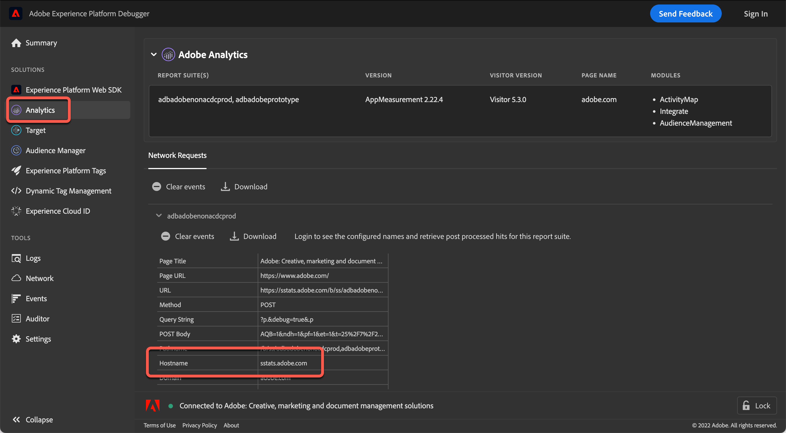

# 使用[!DNL Analytics]跟踪服务器

如果您使用的是较低版本的at.js，则必须为[!DNL Adobe Target] (A4T)使用[!DNL Adobe Analytics]的活动指定[!DNL Analytics]跟踪服务器。

>[!NOTE]
>
>如果您使用 at.js 版本 0.9.1（或更高版本），则在活动创建期间无需指定跟踪服务器。 at.js 库自动将跟踪服务器值发送到 [!DNL Target]。 在活动创建期间，您可以将“[!UICONTROL 目标和设置]”页面上的“[!UICONTROL 跟踪服务器]”字段留空。
>
>[!DNL Target]团队同时支持at.js 1.*x*&#x200B;和at.js 2.*x*。 升级到at.js任一主要版本的最新更新，以确保您运行的是受支持的版本。 有关更多信息，请参阅 [at.js 版本详细信息](https://experienceleague.adobe.com/docs/target-dev/developer/client-side/at-js-implementation/target-atjs-versions.html){target=_blank}。

为了确保来自[!DNL Target]的数据进入[!DNL Analytics]中的正确位置，A4T要求在所有从[!DNL Target]调用Modstats时发送[!DNL Analytics]跟踪服务器。 对于使用多个跟踪服务器的实施，请使用[!DNL Adobe Experience Platform Debugger]或浏览器的开发人员工具来确定活动的正确跟踪服务器。

## 使用[!DNL Adobe Experience Platform Debugger]获取[!DNL Analytics]跟踪服务器

调试器应在交付活动的页面上查看，以确保您选择正确的跟踪服务器。 您还可以为每个帐户指定一个默认的跟踪服务器。 要指定或修改默认的跟踪服务器，请联系客户关怀团队。

1. 从要创建活动的页面中，打开[!DNL Adobe Experience Platform Debugger]。

   如果尚未安装调试器，请参阅[Adobe Experience Platform Debugger概述](https://experienceleague.adobe.com/docs/platform-learn/data-collection/debugger/overview.html)。

1. 在左侧导航菜单中单击&#x200B;**[!UICONTROL Analytics]**。

   

   在调试器的[!UICONTROL 主机名]部分找到[!DNL Analytics]跟踪服务器。

   * **第一方跟踪服务器**：如果请求的主机名与您所在的域匹配，则它是第一方跟踪服务器。 例如，如果您在`adobe.com`上，则`adobe.com`是第一方跟踪服务器。
   * **第三方跟踪服务器**：第三方跟踪服务器通常为`[company].sc.omtrdc.net`，其中公司是您公司的名称，但始终以`sc.omtrdc.net`结尾。
   * **CNAME实施**： `sstats.adobe.com`是https （安全）请求的CNAME第一方跟踪服务器示例。 `stats.adobe.com`是http（非安全）页面的CNAME第一方请求示例。

1. 复制该字段的全部内容。

1. 在活动的&#x200B;**[!UICONTROL 目标和设置]**&#x200B;屏幕的&#x200B;**[!UICONTROL 报表设置]**&#x200B;部分中，将跟踪服务器信息粘贴到&#x200B;**[!UICONTROL 跟踪服务器]**&#x200B;字段中。

   >[!NOTE]
   >
   >选择[!UICONTROL Analytics作为您的活动的报表Source]，以使[!UICONTROL 跟踪服务器]字段可用。

## 使用浏览器的开发人员工具获取[!DNL Analytics]跟踪服务器

应在交付活动的页面上查看开发人员工具，以确保您选择正确的跟踪服务器。 您还可以为每个帐户指定一个默认的跟踪服务器。 要指定或修改默认的跟踪服务器，请联系客户关怀团队。

1. 从您创建活动的页面上，打开浏览器的开发人员工具（在Google Chrome中，单击右上角的三个垂直省略号> “更多工具” > “开发人员工具”）。

   

1. 单击&#x200B;**[!UICONTROL 网络]**&#x200B;选项卡。

1. 筛选`/ss,`以显示[!DNL Analytics]请求。

   使用/ss search的

   跟踪服务器是请求的主机名。

   * **第一方跟踪服务器**：如果请求的主机名与您所在的域匹配，则它是第一方跟踪服务器。 例如，如果您在`adobe.com`上，则`adobe.com`是第一方跟踪服务器。
   * **第三方跟踪服务器**：第三方跟踪服务器通常为`[company].sc.omtrdc.net`，其中公司是您公司的名称，但始终以`sc.omtrdc.net`结尾。
   * **CNAME实施**： `sstats.adobe.com`是https （安全）请求的CNAME第一方跟踪服务器示例。 `stats.adobe.com`是http（非安全）页面的CNAME第一方请求示例。

1. 复制该字段的全部内容。

1. 在活动的&#x200B;**[!UICONTROL 目标和设置]**&#x200B;屏幕的&#x200B;**[!UICONTROL 报表设置]**&#x200B;部分中，将跟踪服务器信息粘贴到&#x200B;**[!UICONTROL 跟踪服务器]**&#x200B;字段中。

   >[!NOTE]
   >
   >选择[!UICONTROL Analytics作为您的活动的报表Source]，以使[!UICONTROL 跟踪服务器]字段可用。
