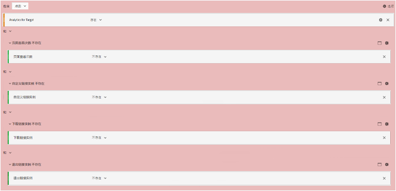

# 在 A4T 中将夸大的访问数和访客数降至最低

帮助您在使用 [!DNL Adobe Analytics] 作为 [!DNL Adobe Target] (A4T) 的报表源时将夸大访问数和访客数产生的影响降至最低的信息。

>[!IMPORTANT]
>2016 年 11 月 14 日，Adobe Analytics 针对那些使用 A4T（适用于 Target 的 Analytics 报表）的客户，更改了某些数据的处理方式。这些更改使 Adobe Target 数据更好地与 Adobe Analytics 的数据模型保持一致，并已为所有使用 A4T 的客户推出。这些更改具体解决了某些客户发现的在运行 Target 活动时访客数量夸大的问题。
>
>此更改不可追溯。如果历史报表显示数量被夸大，并且要从报表中排除这些数量，则可创建虚拟报表包，如下方所述。
>
>此外，还更新了若干 JavaScript 库以帮助将夸大的数量降至最低。Adobe 推荐升级到以下库版本（或更高版本）：
>
>* Experience Cloud 访客 ID 服务：visitorAPI.js 版本 2.3.0 或更高版本。
>* Adobe Analytics：appMeasurement.js 版本 2.1.
>* Adobe Target：at.js 版本 0.9.6 或更高版本（如果将重定向产品建议与 A4T 配合使用，则不包括版本 1.1.0）。

## 更改了哪些内容？ {#section_9CCF45F5D66D48EBA88F3A178B27D986}

使用 [!DNL Adobe Analytics] 衡量 [!DNL Target] 活动（称为 A4T）时，[!DNL Analytics] 收集当页面上没有 [!DNL Target] 活动时即不可用的额外数据。[!DNL Target] 活动在页面的顶部触发调用，但 [!DNL Analytics] 通常在页面的底部触发其数据收集调用。在迄今为止的 A4T 实施中，只要有活跃的 [!DNL Target] 活动，Adobe 即包括这些额外数据。以后 Adobe 仅在 [!DNL Target] 和 [!DNL Analytics] 标记同时触发时包括这些额外数据。

## Adobe 为什么作出此更改？ {#section_92380A4BD69E4B8886692DD27540C92A}

Adobe 以自身的数据准确性和高质量为荣。当 [!DNL Target] 标记触发，但 [!DNL Analytics] 标记未触发时，Analytics 记录“部分数据”（有时称为“未拼合的点击”）。如果没有 [!DNL Target] 活动，则 [!DNL Analytics] 将不捕获这些未拼合的点击。虽然在 [!DNL Analytics] 报表中包括这部分数据可提供额外的信息，但这样还将与没有 [!DNL Target] 活动运行的时期的历史数据产生不一致。这种情况可能会导致 [!DNL Analytics] 用户在分析一段时间的趋势时出现问题。为了确保在 [!DNL Analytics] 中的数据一致性，Adobe 排除了所有部分数据。

## 产生部分数据的原因是什么？ {#section_C9C906BEAA7D44DAB9D3C03932A2FEB8}

Adobe 有一些客户遇到了 [!DNL Analytics] 中的部分数据比例较高的情况。部分数据比例较高可能是实施有误所致，但也存在合乎情理的原因。

对于产生部分数据已确定的原因包括以下各项：

* **未对齐报表包 ID（实施）：**&#x200B;在活动设置期间指定的报表包与交付测试的页面上的报表包不匹配。数据在 [!DNL Analytics] 服务器上无法达到协调一致，因此看上去像是部分数据。
* **页面加载缓慢：**&#x200B;在页面顶部进行 [!DNL Target] 调用，而一般在页面底部进行 [!DNL Analytics] 调用。如果页面加载缓慢，则访客在 [!DNL Target] 调用触发之后、但 [!DNL Analytics] 调用触发之前离开页面的可能性就会提高。在连接速度一般较慢的移动网站上，页面加载缓慢特别容易产生问题。
* **页面错误：**&#x200B;如果存在 JavaScript 错误或其他未触发每个接触点的场景（Experience Cloud ID 服务、Target 和 Analytics），则产生部分数据。
* **[!DNL Target] 活动中的重定向产品建议：**&#x200B;对于使用 A4T 的活动中的重定向产品建议，您的实施必须满足某些最低要求。此外，您还必须了解一些重要信息。有关更多信息，请参阅[重定向产品建议 - A4T 常见问题解答](/help/main/c-integrating-target-with-mac/a4t/r-a4t-faq/a4t-faq-redirect-offers.md#section_FA9384C2AA9D41EDBCE263FFFD1D9B58)。
* **旧版库：**&#x200B;在过去的一年中，Adobe 对 JavaScript 库（[!DNL appMeasurement.js]、`at.js` 和 `visitorAPI.js`）作出了若干改进以确保尽可能高效地发送数据。要详细了解实施要求，请参阅[在实施之前](/help/main/c-integrating-target-with-mac/a4t/before-implement.md#concept_046BC89C03044417A30B63CE34C22543)。

## 减少部分数据的最佳实践是什么？ {#section_065C38501527451C8058278054A1818D}

请查看以下步骤以减少所收集的部分数据：

| 步骤 | 任务 |
| --- | --- |
|  | 确保在 [!DNL Target] 中选择的报表包与活动所在的页面上的报表包相同。 |
|  | 确保 visitorAPI.js、appMeasurement.js 和 at.js 库的版本与 A4T 兼容。要了解有关实施要求的更多信息，请参阅[在实施之前](/help/main/c-integrating-target-with-mac/a4t/before-implement.md)。 |
|  | 确保在所有离开页面的 [!DNL Target] 和 [!DNL Analytics] 调用上设置了相同的 SDID。 使用网络分析器或调试工具确保 [!DNL Target] 调用上的 `mboxMCSDID` 参数与 [!DNL Analytics] 调用中的 SDID 参数相同。 |
|  | 确认实施库在您的网站上以正确的顺序加载。有关详细信息，请参阅[Analytics for Target实施](/help/main/c-integrating-target-with-mac/a4t/a4timplementation.md)。 |

## 怎样才能了解我有多少部分数据？ {#section_89B663E2824A4805AB934153508A0F4B}

尽管此信息不能直接在 [!DNL Analytics] 中获得，但您可以联系 Adobe 客户关怀团队以索取一份局部数据报表。本报表旨在为调试提供帮助。

## 怎样才能查看不含部分数据的历史趋势？ {#section_4C9DED560FAD4428B362DDA2064897C3}

此处理更改仅影响发布日期（2016 年 11 月 14 日）之后的数据。如果要调整历史指标以使其匹配，则 Adobe 建议创建区段以排除部分数据。

以下与此更改相关的信息包含相关说明，可帮助您定义区段并将其应用于虚拟报表包，使该区段始终适用于您的 [!DNL Analytics] 查看次数。

在大多数情况下，每个网页上的 [!DNL Target] 点击量会与 [!DNL Analytics] 点击量拼合。如果 [!DNL Target] 和 [!DNL Analytics] 调用以及同一页面上 [!DNL Analytics] 调用中的 [!DNL Experience Cloud ID] (MCID) 均存在一致的 SDID，则会进行拼合。[!DNL Target] 一般也有 MCID，但如果在返回访客 ID 之前发生对 [!DNL Target] 的调用，则由于 SDID，仍将拼合该点击。此外，用户必须在页面上停留足以在触发 [!DNL Target] 调用后继续触发 [!DNL Analytics] 调用的时间长度。这是理想场景。

**部分数据点击：**&#x200B;用户有时在页面上停留的时间长度不足以发送 [!DNL Analytics] 调用，但 [!DNL Target] 具有适当的 MCID。此场景导致部分数据点击（点击但未查看 [!DNL Analytics] 页面）。如果这些用户返回您的网站并查看包含 [!DNL Analytics] 代码的页面，则正确地将其视为回访访客。如果该页面上只有 [!DNL Analytics] 代码，则将已错失这些点击。某些客户不想要这些点击的数据，因为他们夸大某些指标（访问次数）并缩减其他指标（每次访问的页面查看次数、每次访问停留的时间等等）。您还将看到不含任何页面查看次数的访问次数。但是，仍有正当理由保留这些数据。

为了最大限度减少局部数据点击量，您可以加快页面加载速度，更新到最新版本的库，或者创建一个[虚拟报表包](https://experienceleague.adobe.com/docs/analytics/components/virtual-report-suites/vrs-workflow/vrs-create.html?lang=zh-Hans)以排除这些点击量。有关分步说明，请参阅《Analytics 组件指南》**&#x200B;中的[创建虚拟报表套件](https://experienceleague.adobe.com/docs/analytics/components/virtual-report-suites/vrs-workflow/vrs-create.html?lang=zh-Hans)。

下图显示了该虚拟报表包的区段定义：

创建虚拟报表包时，请为区段定义指定以下配置（如上图所示）：

* **显示点击：**
* Analytics for Target：存在
* 与
* 页面查看次数：不存在
* 与
* 自定义链接实例：不存在
* 与
* 下载链接实例：不存在
* 与
* 退出链接实例：不存在

**孤立点击：**&#x200B;在少数情况下，用户不会在页面上停留足够长的时间来进行 Analytics 调用，并且 Target 未获得适当的 MCID。Adobe 将这些点击定义为“孤立”点击。这些点击代表旧访客较少，且它们不合理地夸大了访问次数和访客数量。

为了最大限度地减少这些“孤立”点击，您可以创建一个排除这些点击的[虚拟报表包](https://experienceleague.adobe.com/docs/analytics/components/virtual-report-suites/vrs-workflow/vrs-create.html?lang=zh-Hans)，如上所述。

## 这对我的 [!DNL Target] 报表有什么影响？ {#section_AAD354C722BE46D4875507F0FCBA5E36}

进行此更改后，您可能会看到实时测试的新访客数量和访问量减少，这是因为 [!DNL Adobe] 不处理传入的部分数据。其他 [!DNL Analytics] 指标的转化和点击将不发生变化。
