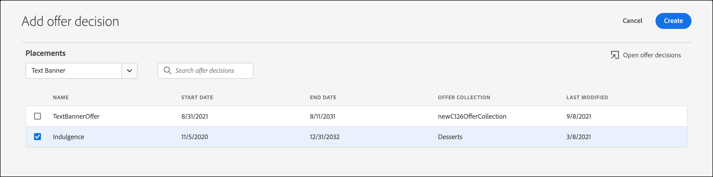

# 使用选件决策

使用 [!DNL Adobe Target] 替换为 [!DNL Adobe Journey Optimizer] 优惠决策，以确定下次如何为网页版和移动版访问者提供最佳优惠。

添加在中创建的优惠决策 [!DNL Adobe Journey Optimizer] 到 [!DNL Target] 活动（手动） [!UICONTROL A/B测试] 或 [!UICONTROL 体验定位])使用 [!UICONTROL 可视化体验编辑器] (VEC)或 [!UICONTROL 基于表单的编辑器] 用于在由提供支持的入站渠道上测试个性化优惠并将其提供给访客 [!DNL Target].

有关详情，请参阅 [!DNL Adobe Journey Optimizer] 和优惠决策，请参阅 *[!DNL Journey Optimizer]* 文档：

* [开始使用 Journey Optimizer](https://experienceleague.adobe.com/docs/journey-optimizer/using/get-started/get-started.html)

* [关于决策管理](https://experienceleague.adobe.com/docs/journey-optimizer/using/offer-decisioniong/get-started/starting-offer-decisioning.html)

## 先决条件

要在中使用优惠决策，请执行以下操作 [!DNL Target]，您需要以下各项：

* [!DNL Adobe Target Standard] 或 [!DNL Adobe Target Premium] 使用实施 [Adobe Experience Platform Web SDK](https://developer.adobe.com/target/implement/client-side/aep-web-sdk/){target=_blank}.

   实施时该功能不可用 [!DNL Target] 使用at.js或其他 [!DNL Target] SDK。

* [!DNL Adobe Journey Optimizer Ultimate] (AJO +Offer decisioning)或 [!DNL Adobe Experience Platform] 和 [!UICONTROL offer decisioning] 应用程序服务加载项。

## 示例用例

以下示例介绍了如何使用 [!DNL Target]/[!DNL Adobe Journey Optimizer] 集成以使用优惠决策 [!DNL Target] 活动：

### 体育促销

作为体育联盟的营销人员，您希望对主页（桌面版和移动设备网站上）上的内容进行个性化。 您要基于多个维度对内容进行个性化，并提供选件以购买相关的特许经营商品。 您感兴趣的是：

* 访客最喜爱的团队
* 最近的运动员/播放器活动（例如，团队移动、合同更新或受伤）

例如，您希望为以下每个地区提供个性化体验：多特蒙德、法兰克福和博胡姆，以及这些团队的隐性粉丝和显性粉丝。 作为量度，您希望查看商品网站的访问次数和点击次数。

您希望设计 [!UICONTROL A/B测试] 默认体验和个性化体验（包括优惠决策以及针对每个地区和团队的优惠）之间的活动（50/50拆分）。 您希望使用此活动来确定个性化体验与控制体验的转化和提升。

### 游戏流媒体平台

作为游戏组织的营销人员，您希望为来自德国、法国、墨西哥和巴西等不同地理位置的桌面和移动设备用户提供游戏流平台的个性化优惠。 当访客从其中一个地理位置访问桌面或移动设备网站时，您希望以本地语言为游戏流提供选件，并以相应的本地货币价格提供该选件。

In [!DNL Adobe Journey Optimizer]，您可以为每个目标地理位置创建个性化主页主页选件，以及带有默认主页主页主页的备用选件。 然后，您可以创建包含这些优惠及其资格规则的优惠决策。 然后，在 [!DNL Target]，您可以创建 [!DNL Experience Targeting] (XT)活动，并将优惠决策插入到桌面或移动设备网站中，以便为访客提供个性化体验。

## 创建使用优惠决策的体验：

1. 编辑或创建手动操作时 [!UICONTROL A/B测试] 或 [!UICONTROL 体验定位] (XT)中的活动 [!UICONTROL 可视化体验编辑器] (VEC)，单击页面元素以显示 [选项菜单](/help/main/c-experiences/c-visual-experience-composer/viztarget-options.md).

   

   >[!NOTE]
   >
   >您还可以创建使用下列项的体验 [!UICONTROL 优惠决策] 在 [[!UICONTROL 基于表单的体验编辑器]](/help/main/c-experiences/form-experience-composer.md).

1. 单击 **[!UICONTROL 此项前插入]**， **[!UICONTROL 此项后插入]**，或 **[!UICONTROL 替换内容]**，然后单击 **[!UICONTROL 优惠决策]**.

   此 [!UICONTROL 优惠决策] 选项在编辑或创建时可用 [手动 [!UICONTROL A/B测试]](/help/main/c-activities/t-test-ab/test-ab.md#types) 或 [[!UICONTROL 体验定位]](/help/main/c-activities/t-experience-target/experience-target.md) (XT)仅限活动。 此选项不适用于其他活动类型。 菜单中的可用选项因所选元素而异。

   

1. 在 **[!UICONTROL 添加优惠决策]** 对话框中，选择所需的沙盒和放置。

   A [沙盒](https://experienceleague.adobe.com/docs/experience-platform/sandbox/ui/overview.html){target=_blank} in the [!DNL Adobe Experience Platform] lets you partition your instance into virtual environments. For example, you might have a production environment and a staging environment. A [placement](https://experienceleague.adobe.com/docs/journey-optimizer/using/offer-decisioniong/create-components/creating-placements.html){target=_blank} 在 [!DNL Adobe Journey Optimizer] 有助于确保正确的选件内容显示在正确的位置。

   

1. 选择所需的优惠决策，然后单击 **[!UICONTROL 创建]**.

   

   您的网站显示在VEC中，您可以在其中查看新创建的优惠决策 [!UICONTROL 修改] 窗格中左边的URL。 您可以将鼠标悬停在修改上，然后单击 [!UICONTROL 预览] 图标以检查优惠决策。

   

   通过单击选件底部的相应图标，可以检查选件中包含的各种选件。 [!UICONTROL 优惠预览] 对话框（包括后备优惠）。 后备优惠是当访客不符合集合中任何个性化优惠资格时显示的默认优惠。

   

1. 通过完成以下步骤完成活动的创建： [!UICONTROL 定位] 和 [!UICONTROL 目标和设置] 三步引导式工作流的步骤。

   >[!IMPORTANT]
   >
   >为确保 [!DNL Target] 活动是个性化的，请确保当前活动的开始/结束日期与中优惠决策的开始/结束日期一致 [!DNL Adobe Journey Optimizer]. 如果 [!DNL Target] 开始/结束日期在优惠决策的开始/结束日期范围（默认值）之外 [!DNL Target] 向访客显示内容。

   

## 注释和限制

在处理优惠决策时，请考虑以下信息：

* offer decisioning集成适用于 [!DNL Target] 实施基于 [Adobe Experience Platform Web SDK](https://developer.adobe.com/target/implement/client-side/aep-web-sdk/){target=_blank}. 实施时此功能不可用 [!DNL Target] 使用at.js或其他 [!DNL Target] SDK。

* Target/Adobe Journey Optimizer集成支持 [手动 [!UICONTROL A/B测试]](/help/main/c-activities/t-test-ab/test-ab.md#types) 和 [[!UICONTROL 体验定位]](/help/main/c-activities/t-experience-target/experience-target.md) (XT)仅限活动。 此功能不适用于其他活动类型。

* 具有text/html内容类型的选件不支持deliveryURL内容交付。 只有客户端负责显式获取和撰写内容时，基于表单的体验编辑器才支持deliveryURL。

* [!DNL Target] 报表不提供优惠决策级别的报表。

* 可视化 [QA链接](/help/main/c-activities/c-activity-qa/activity-qa.md) 对象 [!DNL Target] 包含优惠决策的体验会影响中设置的频率上限 [!DNL Adobe Journey Optimizer] 为那些报价决策服务。
