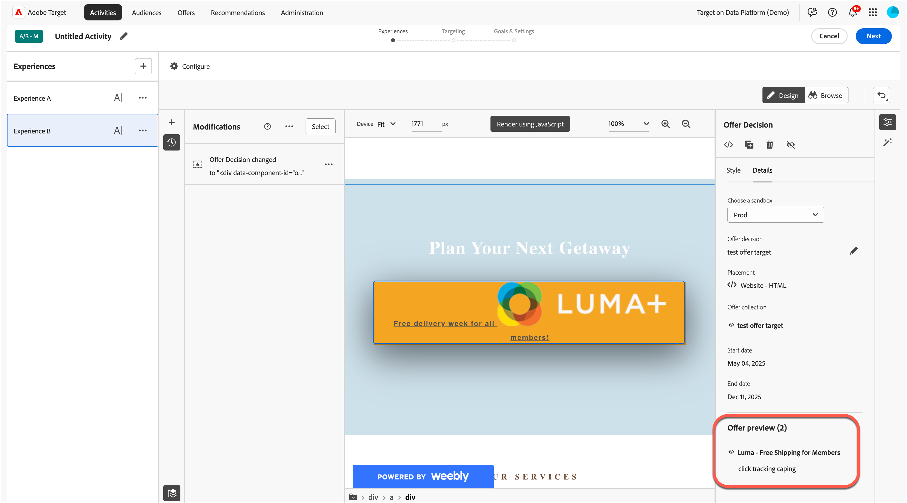

# 使用产品建议决策

将[!DNL Adobe Target]与[!DNL Adobe Journey Optimizer]优惠决策结合使用，以确定下次如何为网页版和移动版访问者提供最佳优惠。

使用[!DNL Adobe Journey Optimizer] (VEC)或[!DNL Target]将在[!UICONTROL A/B Test]中创建的优惠决策添加到[!UICONTROL Experience Targeting]活动（手动[!UICONTROL Visual Experience Composer]或[!UICONTROL Form-Based Composer]），以在由[!DNL Target]提供支持的入站渠道上测试并提供个性化优惠给访客。

有关[!DNL Adobe Journey Optimizer]和优惠决策的详细信息，请参阅&#x200B;*[!DNL Journey Optimizer]*&#x200B;文档中的以下主题：

* [开始使用Journey Optimizer](https://experienceleague.adobe.com/docs/journey-optimizer/using/get-started/get-started.html?lang=zh-Hans)

* [关于决策管理](https://experienceleague.adobe.com/docs/journey-optimizer/using/offer-decisioning/get-started-decision/starting-offer-decisioning.html?lang=zh-Hans)

## 先决条件

要在[!DNL Target]中使用优惠决策，您需要以下各项：

* 使用[!DNL Adobe Target Standard]Adobe Experience Platform Web SDK[!DNL Adobe Target Premium]实现的[或](https://experienceleague.adobe.com/docs/target-dev/developer/client-side/aep-web-sdk.html){target=_blank}。

  在使用at.js或其他[!DNL Target] SDK实施[!DNL Target]时，该功能不可用。

* [!DNL Adobe Journey Optimizer Ultimate] (AJO + Offer Decisioning)或[!DNL Adobe Experience Platform]以及[!UICONTROL Offer Decisioning]应用程序服务加载项。

## 示例用例

以下示例是有关如何使用[!DNL Target]/[!DNL Adobe Journey Optimizer]集成在[!DNL Target]活动中使用优惠决策的用例：

### 体育促销

作为体育联盟的营销人员，您希望对主页（桌面和移动设备网站上）上的内容进行个性化。 您要基于多维度个性化内容，并提供选件以购买相关的加盟商品。 您感兴趣的是：

* 访客最喜爱的团队
* 最近的运动员/玩家活动（例如，团队移动、合同更新或受伤）

例如，您希望为以下每个地区提供个性化体验：多特蒙德、法兰克福和博胡姆，以及这些团队的隐式和显式粉丝的用户。 作为量度，您需要查看商品网站的访问次数和点击次数。

您想要在默认体验和个性化体验（包括优惠决策，其中包含针对每个地区和团队的优惠）之间设计[!UICONTROL A/B Test]活动（50/50拆分）。 要使用此活动来确定个性化体验与控制体验的转化和提升。

### 游戏流平台

作为游戏组织的营销人员，您希望为来自德国、法国、墨西哥和巴西等不同地区的桌面和移动设备用户提供针对游戏流平台的个性化优惠。 当访客从其中一个地区访问桌面或移动设备网站时，您希望以本地语言为游戏流提供优惠，并以相应的当地货币价格提供该优惠。

在[!DNL Adobe Journey Optimizer]中，您可以为每个目标地理位置创建个性化主页主页主页优惠，以及带有默认主页主页主页的备用优惠。 然后，您可以创建包含这些优惠及其资格规则的优惠决策。 然后，在[!DNL Target]中，您可以创建[!DNL Experience Targeting] (XT)活动，并将该优惠决策插入到桌面或移动设备网站中，以便为访客提供个性化体验。

## 创建使用优惠决策的体验：

1. 在[!UICONTROL A/B Test] (VEC)中编辑或创建手动[!UICONTROL Experience Targeting]或[!UICONTROL Visual Experience Composer] (XT)活动时，单击页面元素以显示[选项菜单](/help/main/c-experiences/c-visual-experience-composer/viztarget-options.md)。

   可视化体验编辑器中的

   >[!NOTE]
   >
   >您还可以在[!UICONTROL Offer Decisions]中创建使用[[!UICONTROL Form-Based Experience Composer]](/help/main/c-experiences/form-experience-composer.md)的体验。

1. 单击&#x200B;**[!UICONTROL Replace Content]**，然后单击&#x200B;**[!UICONTROL Offer Decision]**。

   [!UICONTROL Offer Decision]选项仅在编辑或创建[手动[!UICONTROL A/B Test]](/help/main/c-activities/t-test-ab/test-ab.md#types)或[[!UICONTROL Experience Targeting]](/help/main/c-activities/t-experience-target/experience-target.md) (XT)活动时可用。 此选项不适用于其他活动类型。 菜单中的可用选项因所选元素而异。

   可视化体验编辑器中的

1. 在VEC右侧的&#x200B;**[!UICONTROL Add Offer Decision]**&#x200B;边栏中，选择所需的沙盒，然后单击选择优惠决策位置。

   [中的](https://experienceleague.adobe.com/docs/experience-platform/sandbox/ui/overview.html?lang=zh-Hans){target=_blank}沙盒[!DNL Adobe Experience Platform]允许您将实例分区到虚拟环境中。 例如，您可能有一个生产环境和一个暂存环境。 [中的](https://experienceleague.adobe.com/docs/journey-optimizer/using/offer-decisioning/create-components/creating-placements.html?lang=zh-Hans){target=_blank}版面[!DNL Adobe Journey Optimizer]有助于确保在正确的位置显示正确的选件内容。

   

1. 选择所需的优惠版面和优惠决策，然后单击&#x200B;**[!UICONTROL Add]**。

   

   您的网站显示在VEC中，您可以在其中的[!UICONTROL Modifications]边栏中看到新创建的优惠决策。 您可以单击[!UICONTROL Offer Preview]边栏底部[!UICONTROL Offer Decision]下的优惠以查看优惠决策。

   <!--You can examine the various offers contained in the offer by clicking the appropriate icon at the bottom of the [!UICONTROL Offer Preview] dialog box, including the fallback offer. A fallback offer is the default offer displayed when a visitor is not eligible for any of the personalized offers in the collection.-->

   

1. 完成三步引导式工作流的[!UICONTROL Targeting]和[!UICONTROL Goals & Settings]步骤以完成创建活动。

   >[!IMPORTANT]
   >
   >要确保[!DNL Target]活动个性化，请确保当前活动的开始/结束日期与[!DNL Adobe Journey Optimizer]中优惠决策的开始/结束日期一致。 如果[!DNL Target]开始/结束日期在优惠决策的开始/结束日期范围之外，则会向访客显示默认[!DNL Target]内容。

## 注释和限制

处理优惠决策时，请考虑以下信息：

* offer decisioning集成适用于基于[!DNL Target]Adobe Experience Platform Web SDK[的](https://experienceleague.adobe.com/docs/target-dev/developer/client-side/aep-web-sdk.html){target=_blank}实施。 在使用at.js或其他[!DNL Target] SDK实施[!DNL Target]时，此功能不可用。

* [!DNL Target]/[!DNL Adobe Journey Optimizer]集成仅支持[手动[!UICONTROL A/B Test]](/help/main/c-activities/t-test-ab/test-ab.md#types)和[[!UICONTROL Experience Targeting]](/help/main/c-activities/t-experience-target/experience-target.md) (XT)活动。 此功能不适用于其他活动类型。

* 如果您在活动中使用优惠决策，则无法使用[[!UICONTROL Analytics as the reporting source]](/help/main/c-integrating-target-with-mac/a4t/a4t.md) (A4T)。 如果在活动中使用优惠决策，请在活动设置期间选择[!DNL Target]作为[!UICONTROL Goals and Settings]页面中的报表源。

* 包含文本/html内容类型的选件不支持deliveryURL内容交付。 只有客户端负责显式获取和撰写内容时，才通过[基于表单的体验编辑器](/help/main/c-experiences/form-experience-composer.md)支持deliveryURL。

* [!DNL Target]报告不提供优惠决策级别的报告。

* 将包含优惠决策的[体验的](/help/main/c-activities/c-activity-qa/activity-qa.md)QA链接[!DNL Target]可视化，将影响这些优惠决策在[!DNL Adobe Journey Optimizer]中设置的频率上限。
