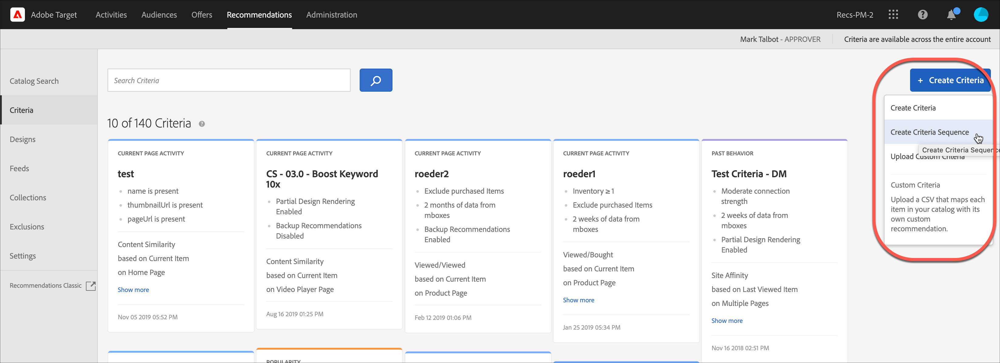

# 创建标准序列

可使用最多包含五个标准的序列来加强对“[!UICONTROL 推荐]”活动中显示的项目的控制。您还可以限制返回的项目数量（有时称为“插槽级别控制”）。

>[!NOTE]
>
>标准序列不能用于 [!UICONTROL  2016 年 10 月版发行之前创建的]推荐[!DNL Target Premium]活动。

要创建标准序列，您必须先创建要包含到序列中的标准。请参阅[创建标准](/help/main/c-recommendations/c-algorithms/create-new-algorithm.md)，以了解更多信息。

在单个标准无法返回足够多的结果，从而无法填充设计的情况下，通过使用标准序列，您可以提供更多具有针对性的推荐，而不是使用更为宽泛的备用推荐。通常，标准序列会从返回较少结果的更具体定位继续到通常返回较多结果的更常规定位。

您的标准序列可能会因页面类型而异，如以下示例所示：

| 页面类型 | 可能的顺序 |
| --- | --- |
| 产品页面 | <ol><li>基于当前项目，来自同一品牌</li><li>基于当前项目，来自所有品牌</li><li>基于内容相似性</li><li>基于最畅销商品</li><li>基于整个网站中查看次数最多的项目</li></ol> |
| 主页 | <ol><li>基于访客上次购买的项目 </li><li>基于访客最喜爱的项目</li><li>基于访客最喜爱的类别</li><li>基于最畅销商品</li><li>基于整个网站中查看次数最多的项目</li></ol> |

## 创建标准序列

您可以通过 [!UICONTROL 创建标准序列] 屏幕。

可通过多种方式来访问“[!UICONTROL 创建标准序列]”屏幕。某些屏幕选项会根据您访问该屏幕的方式而有所不同。

* 在&#x200B;**[!UICONTROL 推荐]** > **[!UICONTROL 标准]**&#x200B;库屏幕上，单击&#x200B;**[!UICONTROL 创建标准]** > **[!UICONTROL 创建标准序列]**。您在此处创建的标准会自动设置为可用于所有“[!UICONTROL 推荐]”活动。
* 创建 [!UICONTROL Recommendations] 活动时，在选择标准屏幕中，单击 **[!UICONTROL 新建]** > **[!UICONTROL 创建标准序列]**. 您将可以选择保存新建的标准序列，以供在其他“[!UICONTROL 推荐]”活动中使用。
* 编辑 [!UICONTROL Recommendations] 活动，单击 [!UICONTROL Recommendations位置] 框中，选择 **[!UICONTROL 更改标准]**. 在“[!UICONTROL 选择标准]”屏幕上，单击&#x200B;**[!UICONTROL 新建]** > **[!UICONTROL 创建标准序列]**。您将可以选择保存新建的标准，以供在其他“[!UICONTROL 推荐]”活动中使用。

以下步骤假定您访问 [!UICONTROL 创建标准序列] 使用第一种方法进行筛选：the **[!UICONTROL Recommendations]** > **[!UICONTROL 标准]** 库屏幕。

1. 单击 **[!UICONTROL Recommendations]** > **[!UICONTROL 标准]**.

1. 单击 **[!UICONTROL 创建标准]** > **[!UICONTROL 创建标准序列]**.

   

1. 在 [基本信息](/help/main/c-recommendations/c-algorithms/create-new-algorithm.md#info) 中。

1. 在 **[!UICONTROL 标准序列]** ，单击 **[!UICONTROL 添加标准]**.

   顺序定义设计的填充顺序。 如果标准1没有足够的推荐来填充您的设计，则其余的版块将填充标准2，依此类推。

   

1. 在 [!UICONTROL 选择标准] ，然后单击 **[!UICONTROL 添加]**.

   您可以使用搜索框和过滤器下拉列表来查找所需的标准。

   

1. （可选）将 **[!UICONTROL 限制返回的项目数]** 切换到“开”位置，然后指定项目数（在1到50之间）。

   

   帮助您了解 [!UICONTROL 限制返回的项目数] 选项（有时称为“插槽级别控制”），请考虑以下用例：

   * **用例1**:您希望在单个推荐栏中混合使用各种不同的项目。 例如，您希望显示外套（夹克）和上衣（衬衫、T恤）的混合体。 要实现此目的，请对活动使用收藏集，该收藏集包含在设计的任何版块中所需的所有潜在产品类型。 然后，使用静态筛选器设置您的第一个标准，该筛选器将标准限制为仅包含外套，并使用静态筛选器设置第二个标准，该筛选器将标准限制为仅包含顶部。 最后，将两个标准添加到标准序列，并将第一个标准限制为2个版块。

      推荐托盘可能在您的网站上如下所示：

      

   * **用例2**:您希望同时使用替代项目和补充项目。 设置一个标准以使用已查看/已查看的算法，并使用动态筛选器将推荐的项目限制为当前项目的类别。 设置第二个标准以使用已查看/已购买的算法，并使用动态过滤器，该过滤器仅包含与当前项目类别不匹配的推荐项目。 最后，将两个标准添加到序列中，并将第一个标准限制为2个版块。

1. 继续向序列添加其他标准。 您最多可以在一个序列中添加五个标准。

1. 启用 [备份内容选项](/help/main/c-recommendations/c-algorithms/create-new-algorithm.md#content).

1. 单击&#x200B;**[!UICONTROL 保存]**。

   标准序列随即会显示在“标准”列表中。

   有关推荐逻辑选项的更多信息，请参阅[标准](/help/main/c-recommendations/c-algorithms/algorithms.md)。

## 培训视频：在“推荐”中创建标准 (12:33) 

本视频包含以下信息：

* 创建标准
* 创建标准序列
* 上传自定义标准

>[!VIDEO](https://video.tv.adobe.com/v/27694?quality=12)
