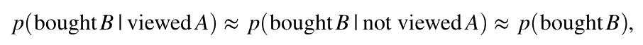

# Target 的推荐算法背后的科学原理

对中使用的算法的深入描述 [!DNL Adobe Target Recommendations]包括模型训练的逻辑和数学细节以及模型服务的过程。

模型训练是生成推荐的过程。 [!DNL Adobe Target] 学习算法。 模型服务方式 [!DNL Target] 向网站访客提供推荐（也称为内容交付）。

[!DNL Target] 中包含以下各种类型的算法 [!DNL Recommendations]：

* **基于项目的算法**：包括遵循“查看/购买此项目的用户也查看/购买了这些项目”逻辑的算法。 这些算法被分组到伞形术语“项目 — 项目协同筛选”下，以及 [!UICONTROL 具有相似属性的项目] 算法。

* **基于用户的算法**：包括 [!UICONTROL 最近查看的项目] 和 [!UICONTROL 为您推荐] 算法。

* **基于热门程度的算法**：包含返回网站中查看次数最多或购买次数最多的项目，或按类别或项目属性查看次数最多或购买次数最多的项目的算法。

* **基于购物车的算法**：包含基于多项目的推荐，其逻辑为“已查看/购买这些项目的人，也已查看/购买这些项目”。

* **自定义标准**：包括基于上传到的自定义文件的推荐 [!DNL Target].

>[!NOTE]
>
>有关每种算法类型和各个算法的更多常规信息，请参阅 [使推荐基于推荐键](/help/main/c-recommendations/c-algorithms/base-the-recommendation-on-a-recommendation-key.md).

上面列出的许多算法都基于存在一个或多个键值。 这些键用于在内容交付时（提出推荐时）检索类似项目。 客户指定的键可以包括某位访客正在查看的当前项目、上次查看或购买的项目、最常查看的项目、当前类别或该访客最喜爱的类别。 其他算法（如基于购物车或基于用户的推荐）则使用隐式键（客户无法配置）。 有关更多信息，请参阅 *推荐键*，在 [使推荐基于推荐键](/help/main/c-recommendations/c-algorithms/base-the-recommendation-on-a-recommendation-key.md#keys). 但请注意，这些键仅在模型服务时（内容交付）相关。 这些键不会影响“离线”或模型训练时间逻辑。

以下部分以与上述算法类型略有不同的方式分组算法。 下面的分组是基于模型训练逻辑的相似性。

## 项目 — 项目协同筛选

算法包括：

* [!UICONTROL 查看了这个项目，也查看了那个项目的人]
* [!UICONTROL 查看了这个项目，但购买了那个项目的人]
* [!UICONTROL 购买了这个项目，也购买了那个项目的人]

Item-Item协同过滤推荐算法基于这样一个思想，即应该使用许多用户的行为模式（因此是协作的）为给定项目提供有用的推荐（例如，筛选可能推荐项目的目录）。 虽然有许多不同的算法属于的通用框架， [协同过滤](https://en.wikipedia.org/wiki/Collaborative_filtering)，这些算法通常使用行为数据源作为输入。 在 [!DNL Target Recommendations]，这些输入是用户独特的项目查看和购买。

对于“已查看/购买此项目的用户也已查看/购买这些项目”算法，目标是计算所有项目对之间的相似度(A，B)。 对于给定的项目A，排名最前的推荐按照其相似度s(A，B)排序。

此类相似性的一个示例是项目之间的共存：购买两个项目的用户数量的简单计数。 虽然这种量度是直观的，但因为偏向于推荐热门项目，所以这种量度是天真的。 例如，如果在食品零售商大多数人都购买面包，则面包与所有物品的高共现率，但它不一定是很好的推荐。 [!DNL Target] 而是使用一种更复杂的相似性量度，称为对数似然比(LLR)。 当两个项目A和B同时发生的概率与它们不同时发生的概率差别很大时，该数量就很大。 具体来说，请考虑 [!UICONTROL 查看了这个项目，但购买了那个项目的人] 算法。 当购买B的概率为100时，LLR相似度较大 *非* 与是否有人查看了A无关。

例如，如果

则项目B不应与项目A一起推荐。提供了此对数似然比相似度计算的完整详细信息 [此PDF中](/help/main/c-recommendations/c-algorithms/assets/log-likelihood-ratios-recommendation-algorithms.pdf).

实际算法实现的逻辑流程如下图所示：

这些步骤的详情如下：

* **输入数据**：行为数据，采用以下形式收集： [实施Target](https://experienceleague.adobe.com/docs/target-dev/developer/recommendations.html){target=_blank} or from [Adobe Analytics](/help/main/c-recommendations/c-algorithms/use-adobe-analytics-with-recommendations.md){target=_blank}.

* **模型训练**：

   * **数据清理和取样**：对于具有N天回顾的算法，将首先过滤行为数据以仅包含这N天的数据。 然后，应用收集规则和全局排除以删除任何不应推荐的项目。 最后，任何与1,000多个项目进行交互的访客都会将其使用数据采样到仅1,000个项目。
   * **项目相似度计算**：这是核心计算步骤：计算所有候选项目对之间的对数似然比相似度，并根据此相似度得分对项目对进行排名。
   * **脱机筛选**：最后，应用任何其他适用的动态过滤器（例如，动态类别排除）。 执行此步骤后，预先计算的推荐将缓存在全局中以可供服务。

* **模型服务**：Recommendations内容交付自 [!DNL Target]的 [全球“边缘”网络](/help/main/c-intro/how-target-works.md#concept_0AE2ED8E9DE64288A8B30FCBF1040934). 向mbox请求时 [!DNL Target] 并且确定“推荐”内容应交付到页面，请求适当的 [项目键](/help/main/c-recommendations/c-algorithms/base-the-recommendation-on-a-recommendation-key.md#keys) for the recommendations算法或者从请求中解析，或者从用户配置文件中查找，然后用于检索在之前步骤中计算的推荐。 此时，应在相应的之前应用更多的动态过滤器 [设计](/help/main/c-recommendations/c-design-overview/create-design.md) 已呈现。

## 内容相似度

包含的算法：

* [!UICONTROL 具有相似属性的项目]

在该类算法中，如果两个项目的名称和文本描述在语义上相似，则认为两个项目相关。 与大多数必须使用行为数据源的推荐算法不同，内容相似度算法使用产品目录中的元数据来推导项目之间的相似度。 [!DNL Target] 因此，能够在所谓的“冷启动”场景中推动推荐，在这种场景中，未收集到任何行为数据(例如，在 [!DNL Target] 活动)。

虽然模型在以下方面提供了服务和内容交付： [!DNL Target]内容相似度算法与其他基于项目的算法相同，模型训练步骤存在很大差异，涉及一系列自然语言处理和预处理步骤，如下图所示。 相似度计算的核心是利用修改后的tf-idf向量余弦相似度来表示目录中的每个项目。

这些步骤的详情如下：

* **输入数据**：如前所述，该算法完全基于目录数据(摄取到 [!DNL Target] 通过 [目录信息源、实体API或来自页面上的更新](https://experienceleague.adobe.com/docs/target-dev/developer/recommendations.html){target=_blank}.

* **模型训练**：

   * **属性提取**：在应用常规静态过滤器、目录规则和全局排除项后，该算法会从实体架构中提取相关文本字段。 [!DNL Target] 自动使用实体属性中的名称、消息和类别字段，并尝试从自定义提取任何字符串字段 [实体属性](/help/main/c-recommendations/c-products/entity-attributes.md). 通过确保该字段的大部分值不可作为数字、日期或布尔值分析，可完成此过程。
   * **词干和停用词删除**：为了实现更准确的文本相似度匹配，请谨慎地删除不会显着改变项目含义的非常常见的“停止”词（例如，“was”、“is”、“and”等）。 同样，词干是指将具有不同后缀的单词缩减到其根单词的过程，根单词具有相同的含义（例如，“connect”、“connecting”和“connection”都具有相同的根单词：“connect”）。 [!DNL Target] 使用Snowball词干器。 [!DNL Target] 首先执行自动语言检测，并且最多可以删除50种语言和18种语言的词根。
   * **n元组创建**：在执行上述步骤后，每个单词都将被视为令牌。 将令牌的连续序列组合成单个令牌的过程称为n-gram创建。 [!DNL Target]的算法最多可考虑2克。
   * **tf-idf计算**：下一步涉及创建tf-idf向量，以反映令牌在项描述中的相对重要性。 对于项目i中的每个令牌/术语t，使用的目录D |D| 项，首先计算项频率TF(t，i)（项出现在项i中的次数）以及文档频率DF(t，D)。 实质上，存在令牌的项目数。 则tf-idf度量为

     

     [!DNL Target] 使用Apache Spark的 *tf-idf* 功能化实现，它会将每个令牌哈希为一个包含218个令牌的空间。 在此步骤中，还通过根据 [标准](/help/main/c-recommendations/c-algorithms/create-new-algorithm.md#similarity).

   * **项目相似度计算**&#x200B;最后的项目相似度计算采用近似余弦相似度计算。 对于两项， *A* 和 *B*，使用向量tA和tB，余弦相似度定义为：

     

     为了避免计算所有N x N项之间相似性的巨大复杂性， *tf-idf* 矢量被截断为仅包含其最大的500个条目，然后使用此截断的矢量表示计算条目之间的余弦相似度。 与其他近似最近邻(ANN)算法相比，该算法对稀疏向量相似度计算具有更好的鲁棒性。

   * **模型服务**：此流程与上一部分中所述的项目项协同筛选技术相同。

## 多键建议

算法包括：

* 基于购物车的推荐
* [!UICONTROL 为您推荐]

最近对 [!DNL Target] 推荐算法套件包括 [!UICONTROL 为您推荐] 以及一系列基于购物车的推荐算法。 这两种算法都使用协同过滤技术来形成基于项目的个人推荐。 然后，在服务时间，用户的浏览历史记录中有多个项目(对于 [!UICONTROL 为您推荐])，或者用户的当前购物车（适用于基于购物车的推荐）用于检索这些基于项目的推荐，然后合并它们以形成推荐的最终列表。 请注意，存在多种风格的个性化推荐算法。 多键算法的选择意味着，当访客有任何浏览历史记录后，即可立即使用推荐，并且推荐可以更新以响应最新的访客行为。

这些算法基于在基于项目的推荐部分中描述的基本协同过滤技术构建，并且还结合超参数调整来确定项目之间的最佳相似度量度。 该算法对每个用户的行为数据执行时间顺序分割，并在试图预测用户稍后查看或购买的项目时训练关于较早数据的推荐模型。 产生最优值的相似性量度 [平均平均精度](然后选择https://en.wikipedia.org/wiki/Evaluation_measures_(information_retrieval)。

模型训练和评分步骤的逻辑如下图所示：

这些步骤的详情如下：

* **输入数据**：这与item-item协同筛选(CF)方法相同。 [!UICONTROL 都为您推荐] 和基于购物车的算法使用行为数据，其形式为在您收到 [实施Target](https://experienceleague.adobe.com/docs/target-dev/developer/recommendations.html){target=_blank} or from [Adobe Analytics](/help/main/c-recommendations/c-algorithms/use-adobe-analytics-with-recommendations.md){target=_blank}.

* **模型训练**：

   * **数据清理和取样**：这再次与协作过滤方法相同，协作过滤方法应用回顾窗口将行为数据过滤到合适的日期范围，然后应用目录规则和全局排除项。 与超过1,000个项目交互的访客仅考虑其最近的1,000个使用情况。
   * **训练测试拆分**：按时间顺序对每个用户的使用情况进行拆分，将其前80%的使用情况分配给训练数据，其余20%分配给测试数据。
   * **项目相似度模型训练**：核心项目相似度计算有所不同 [!UICONTROL 为您推荐] 和基于Cart的算法。 对象 [!UICONTROL 为您推荐]，项目矢量具有维度NUsers，其中每个条目表示该项目用户的隐式评级之和 — 为购买项目赋予该项目视图的2倍的权重。 对于基于购物车的推荐，项目矢量具有二进制条目；如果只考虑会话内行为，则每个会话都有一个新条目。 否则，每个访客在此项目矢量中都有一个条目。

  训练步骤计算几种类型的向量相似度：LLR相似度([此处讨论](/help/main/c-recommendations/c-algorithms/assets/log-likelihood-ratios-recommendation-algorithms.pdf))、余弦相似度（以前定义）和规范化L2相似度(定义为：

  

   * **项目相似度模型评估**：模型评估通过采用上一步中生成的建议并对测试数据集进行预测来完成。 通过按时间顺序排序测试数据集中的每个用户的项目使用情况，然后为排序的项目子集提出100个推荐，以尝试预测随后的查看和购买，来模拟在线评分阶段。 信息检索量度， [平均平均精度](https://en.wikipedia.org/wiki/Evaluation_measures_(information_retrieval))用于评估这些建议的质量。 此量度会考虑推荐的顺序，并有利于在推荐列表中排名较高的相关项目，这是排名系统的重要属性。
   * **模型选择**：在离线评估后，选择具有最高平均平均精度的模型，并为其计算所有单个项目推荐。
   * **脱机筛选**：模型训练的最后一步是应用任何适用的动态过滤器。 执行此步骤后，预先计算的推荐将缓存在全局中以可供服务。

* **模型服务**：与以前的算法不同，以前的算法为提供推荐需要指定单个检索键，然后应用业务规则， [!UICONTROL 为您推荐] 而基于Cart的算法则采用更复杂的运行时过程。

   * **多密钥检索和合并**：对于基于购物车的推荐，购物车中传递的多达十个项目会被视为检索键，并且来自每个项目的推荐会均等加权。 对象 [!UICONTROL 为您推荐]，最多五个唯一查看的项目和最近五个唯一购买的项目会被视为检索键，其中来自购买项目的推荐权重是来自查看项目的推荐的两倍。 在合并推荐时，如果一个项目出现在多个推荐的单个列表中，则会添加其加权相似度分数。 此阶段的最终推荐列表是随后合并的重新加权推荐列表，按降序排列。
   * **正在筛选**：接下来，应用筛选规则（如删除以前查看和/或购买的项目）以及其他动态业务规则。

下图说明了这些流程，其中访客查看了项目A并购买了项目B。系统会使用每个项目标签下显示的离线相似度得分来检索各个推荐。 检索后，将推荐与加权相似度得分相加。 最后，在客户已指定必须过滤掉以前查看过的和购买过的项目的场景中，过滤步骤将从推荐列表中删除项目A和B。

## 基于热门程度

算法包括：

* [!UICONTROL 全网站查看的次数最多]
* [!UICONTROL 同类中查看次数最多]
* [!UICONTROL 按项目属性查看的次数最多]
* [!UICONTROL 全网站最畅销商品]
* [!UICONTROL 按类别划分的畅销商品排名]
* [!UICONTROL 按项目属性排名的最畅销商品]

[!DNL Target] 为网站中查看次数最多的项目以及最畅销的项目，或按项目属性或类别划分的项目提供了基于人气的算法。 基于热门程度的算法根据在给定时间范围内查看或购买该项目的会话数对项目进行排名。

所有这些算法都整合了聚合的行为数据，即以每小时和每日分辨率记录查看并购买项目的会话总数。 然后，各个算法会找到客户配置的回顾时间范围内查看次数最多或购买次数最多的项目。

各个算法的细微差别如下：

* [!UICONTROL 全网站查看的次数最多] 和 [!UICONTROL 全网站最畅销商品] 按查看或购买这些项目的会话的总数对项目进行排名。 输出是推荐项目的单个（无键）列表。
* 按类别/项目属性显示的“查看次数最多”/“最畅销商品”是一些推荐，其中项目按查看或购买这些项目的会话的聚合计数排序，但按项目类别或特定项目属性分组。 输出是推荐项目的列表，由类别值或项目属性值键控。

## 最近查看的项目

“最近查看的”推荐算法允许对推荐进行会话内个性化。 此算法不需要离线“模型训练”。 相反， [!DNL Target] 使用唯一 [访客资料](/help/main/c-target/c-visitor-profile/visitor-profile.md) 用于维护在给定会话中查看过的项目的运行列表，并可在“推荐”活动中显示这些项目。 这样可实时更新推荐和下一页面个性化。

## 自定义标准

自定义标准允许客户 [将自己的推荐上传至 [!DNL Target]](/help/main/c-recommendations/c-algorithms/recommendations-csv.md)，提供了重要的灵活性，并允许“自带模型”功能。 自定义标准取代了的“离线培训”部分 [!UICONTROL 基于项目] 推荐，但在在线内容交付阶段其行为与基于项目的推荐算法类似，即，使用单个键来检索推荐，然后应用业务规则/过滤器。
