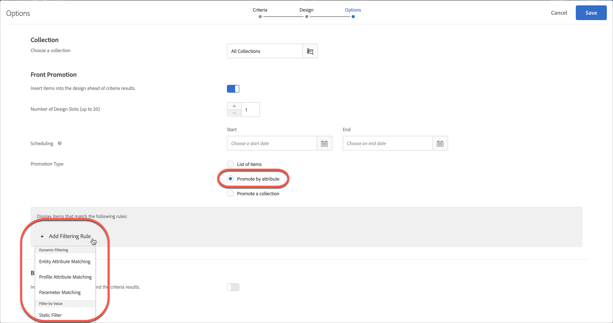
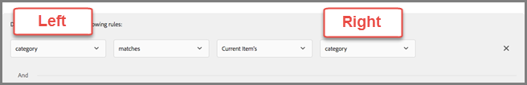

# 使用动态和静态包含规则

有关在中为标准和促销活动创建包含规则的信息 [!DNL Adobe Target] 和添加动态或静态筛选规则，以便为推荐获得更好的结果。

如用例和示例所述，针对标准和促销活动创建和使用包含规则的过程类似。本节将介绍标准和促销活动以及包含规则的使用。

## 将筛选规则添加到标准 {#section_CD0D74B8D3BE4A75A78C36CF24A8C57F}

[创建标准](/help/main/c-recommendations/c-algorithms/create-new-algorithm.md#task_8A9CB465F28D44899F69F38AD27352FE)时，单击&#x200B;**[!UICONTROL 包含规则]**&#x200B;下的&#x200B;**[!UICONTROL 添加筛选规则]**。

可用选项取决于所选垂直行业和推荐键。

## 将筛选规则添加到促销活动 {#section_D59AFB62E2EE423086281CF5D18B1076}

[创建促销活动](/help/main/c-recommendations/t-create-recs-activity/adding-promotions.md#task_CC5BD28C364742218C1ACAF0D45E0E14)时，选择&#x200B;**[!UICONTROL 按属性促销]**，然后单击&#x200B;**[!UICONTROL 添加筛选规则]**。

## 筛选类型 {#section_0125F1ED10A84C0EB45325122460EBCD}

以下部分列出了筛选选项的类型 [!UICONTROL 动态筛选] 和 [!UICONTROL 按值筛选] 对于标准和促销：

### 动态筛选

动态包含规则比静态包含规则更强大，并且产生更好的结果和参与。 请考虑以下事项：

* 动态包含规则通过匹配用户配置文件参数或mbox调用中的属性来交付推荐。

   例如，您可以创建“最受欢迎的标准”推荐。 从返回的推荐集中可以（实时）根据用户访问显示推荐的页面时传递的属性过滤掉任何推荐。

* 使用静态规则限制推荐中包含的项目（而不是使用收藏集）。

* 您可以根据需要创建任意数量的动态包含规则。 包含规则使用“与”运算符进行结合。所有规则都必须得到满足，才能在推荐中包含某个项目。

以下选项可用于动态筛选：

| 动态筛选选项 | 详细信息 |
| --- | --- |
| [实体属性匹配](/help/main/c-recommendations/c-algorithms/entity-attribute-matching.md) | 通过比较一组潜在的推荐项目与用户已交互的特定项目，动态筛选。 使用 [!UICONTROL 实体属性匹配] ，例如访客最喜爱的品牌。 |
| [配置文件属性匹配](/help/main/c-recommendations/c-algorithms/profile-attribute-matching.md) | 通过比较项目（实体）与用户配置文件中的值来进行动态筛选。 使用 [!UICONTROL 配置文件属性匹配] 当您想要显示与访客配置文件中存储的某个值（例如大小或最喜爱的品牌）匹配的推荐时。 |
| [参数匹配](/help/main/c-recommendations/c-algorithms/parameter-matching.md) | 通过比较项目（实体）与请求中的值（API或mbox）来进行动态筛选。 使用 [!UICONTROL 参数匹配] 推荐与页面参数或访客参数（如设备维度或地理位置）匹配的内容。 |

### 按值筛选

以下选项可用于按值筛选：

| 按值过滤选项 | 详细信息 |
| --- | --- |
| [静态筛选](/help/main/c-recommendations/c-algorithms/static-value.md) | 手动输入一个或多个要过滤的静态值。 |

## 可用的运算符 {#operators}

动态标准和促销活动比静态标准和促销活动强大得多，并可产生更好的结果和参与。

以下示例概述了如何在营销工作中使用动态促销和排除项：

| 运算符 | 示例 |
| --- | --- |
| 等于 （适用于实体属性匹配、配置文件属性匹配、参数匹配和静态筛选。） | 在动态促销活动中使用“等于”运算符时，如果访客正在查看网站上的项目（例如产品、文章或电影），您可以向其促销以下分类的其他项目：<ul><li>相同品牌</li><li>同一类别</li><li>同类AND来自自家品牌</li><li>同一商店</li></ul> |
| 不等于 （适用于实体属性匹配、配置文件属性匹配、参数匹配和静态筛选。） | 在动态促销活动中使用“不等于”运算符时，如果访客正在查看网站上的项目（例如产品、文章或电影），您可以向其促销以下分类的其他项目：<ul><li>另一部电视剧</li><li>另一种类型</li><li>其他产品系列</li><li>其他样式ID</li></ul> |
| 不包含子字符串 （适用于实体属性匹配、配置文件属性匹配、参数匹配和静态筛选。） | 使用“不包含子字符串”运算符时，如果访客正在查看网站上的项目（例如产品），您可以促销满足以下条件的其他项目：<ul><li>标题不包含脏字</li></ul> |
| 开头为 （适用于实体属性匹配、配置文件属性匹配、参数匹配和静态筛选。） | 使用“开头为”运算符，当访客查看网站上的项目（例如产品）时，您可以促销满足以下条件的其他项目：<ul><li>产品名称以iPhone开头</li></ul> |
| 结束于 （适用于实体属性匹配、配置文件属性匹配、参数匹配和静态筛选。） | 使用“结束于”运算符，当访客查看网站上的项目（例如产品）时，您可以促销满足以下条件的其他项目：<ul><li>内容以EN结尾，EN表示英语</li></ul> |
| 大于或等于 （适用于实体属性匹配、配置文件属性匹配、参数匹配和静态筛选。） | 使用“大于或等于”运算符，当访客查看网站上的项目（例如产品）时，您可以促销满足以下条件的其他项目：<ul><li>成本相同或更高</li></ul> |
| 小于或等于 （适用于实体属性匹配、配置文件属性匹配、参数匹配和静态筛选。） | 使用“小于或等于”运算符，当访客查看网站上的项目（例如产品）时，您可以促销满足以下条件的其他项目：<ul><li>成本相同或较低</li><li>排除价格较低的项目</li></ul> |
| 介于 （适用于实体属性匹配、配置文件属性匹配和参数匹配。） | 在动态促销活动中使用“介于”运算符时，如果访客正在查看网站上的项目（例如产品、文章或电影），您可以向其促销以下其他项目：<ul><li>更贵</li><li>更便宜</li><li>成本加减30%</li><li>同一季的后几集</li><li>系列中以前的书籍</li></ul> |
| 包含在列表中 （适用于配置文件属性匹配和参数匹配。） | 在配置文件属性匹配中使用“包含在列表中”运算符，当访客查看网站上的项目时（例如产品、文章或电影），您可以促销以下其他项目：<ul><li>在访客的地理位置中可用</li></ul>**示例**：您只想推荐访客所在地理区域内可用的项目。 您的筛选规则可能如下所示： `availableGeographies list contains an item in user.currentGeography` **注释**：使用此运算符时，中应有列表 [右侧](#caveats) 规则的。 |
| 不包含在列表中 （适用于配置文件属性匹配和参数匹配。） | 在配置文件属性匹配中使用“不包含在列表中”运算符时，如果访客正在查看网站上的项目（例如产品、文章或电影），您可以排除以下其他项目：<ul><li>在访客查看过的最后10个项目的列表中</li></ul></ul>**示例**：您不希望提升访客最近查看过并且不感兴趣的项目。 您的筛选规则可能如下所示： `id is not contained in list user.lastViewedItems` **注释**：使用此运算符时，中应有列表 [右侧](#caveats) 规则的。 |
| 列表中包含项目 （适用于实体属性匹配、配置文件属性匹配和参数匹配。） | 在配置文件属性匹配中使用“list contains an item in”运算符，当访客查看网站上的项目时（例如体育赛事或音乐会），您可以推广以下其他项目：<ul><li>与访客最喜爱的团队之一关联</li></ul>**示例**：您要推荐与访客最喜爱的团队之一关联的游戏。 您的筛选规则可能如下所示： ` teamsPlaying list contains an item in user.favoriteTeams` **注释**：使用此运算符时，中应有列表 [双面](#caveats) 规则的。 |
| 列表中不包含项目 （适用于实体属性匹配、配置文件属性匹配和参数匹配。） | 在参数属性匹配中使用“list does not contain an item in”运算符时，如果访客正在查看网站上的项目（例如产品、文章或电影），您可以排除以下其他项目：<ul><li>包含在禁止类型列表中</li></ul>**示例**：您要排除的成年访客可用的商品，例如烟草和酒精。 您的筛选规则可能如下所示： `itemType is not contained in list mbox.prohibitedTypes` **注释**：使用此运算符时，中应有列表 [双面](#caveats) 规则的。 |
| 列表中包含所有项目 （适用于实体属性匹配、配置文件属性匹配和参数匹配。） | 在配置文件属性匹配中使用“list contains all items in”（列表包含所有项目）运算符，当访客查看网站上的项目时（例如工作张贴或方法），您可以推广满足以下条件的其他项目：<ul><li>包括一组技能</li><li>包含一组必需成分</li></ul>**示例1**：假设访客拥有一组技能(Java、C++和HTML)。 目录中的项目是具有所需技能(Java和HTML)的作业。 在向访客推荐作业之前，您需要确保访客的配置文件包含所有必需的技能。 您的筛选规则可能如下所示： `profile.jobSeekerSkills contains all items in entity.requiredSkills` **示例2**：假设用户具有食品柜成分的列表。 这道菜有一份所需配料的清单。 在向访客推荐配方之前，您需要确保访客的配置文件包含所有必需的成分。 您的筛选规则可能如下所示： `profile.ingredientsInPantry contains all items in recipe.ingredientsRequired` **注释**：使用此运算符时，中应有列表 [双面](#caveats) 规则的。 |
| 列表中不包含所有项目 （适用于实体属性匹配、配置文件属性匹配和参数匹配。） | 在实体属性匹配中使用“list does not contain all items in”运算符，当访客查看网站上的项目时（例如体育赛事或音乐会），您可以推广满足以下条件的其他项目：<ul><li>不包括团队集</li></ul>**示例**：假设体育赛事包括两支球队。 访客的配置文件指示该访客不想查看这些团队的游戏。 您希望确保在这些团队正在比赛时不推荐游戏。 您的筛选规则可能如下所示： `profile.leastfavoriteTeams does not contain all items in entity.teamsPlaying` **注释**：使用此运算符时，中应有列表 [双面](#caveats) 规则的。 |

## 按实体属性匹配、配置文件属性匹配和参数匹配进行筛选时处理空值 {#section_7D30E04116DB47BEA6FF840A3424A4C8}

在过滤时，您可以选择多个选项来处理空值 [!UICONTROL 实体属性匹配]， [!UICONTROL 配置文件属性匹配]、和 [!UICONTROL 参数匹配] 退出条件和促销活动。

以前，如果值为空，则不会返回任何结果。如果标准包含空值，则“如果 *x* 为空”下拉列表允许您选择适当的操作，如下图所示：

要选择所需的操作，请将鼠标悬停在齿轮图标上()，然后选择所需的操作：

| 操作 | 适用选项 | 详细信息 |
|--- |--- |--- |
| [!UICONTROL 忽略此筛选规则] | [!UICONTROL 配置文件属性匹配] 和 [!UICONTROL 参数匹配] | 该操作是以下项的默认操作 [!UICONTROL 配置文件属性匹配] 和 [!UICONTROL 参数匹配]. 该选项指定忽略该规则。例如，如果有三个筛选规则，第三个规则不传递任何值，则您只需忽略具有空值的第三个规则，而不是不返回任何结果。 |
| [!UICONTROL 不显示此标准的任何结果] （仅限标准） | [!UICONTROL 实体属性匹配]， [!UICONTROL 配置文件属性匹配]、和 [!UICONTROL 参数匹配] | 该操作是以下项的默认操作 [!UICONTROL 实体属性匹配]. 此操作是 [!DNL Target] 在添加此选项之前处理了空值：不显示此标准的结果。 |
| [!UICONTROL 不提升任何项目 （仅限促销活动）] | [!UICONTROL 实体属性匹配]， [!UICONTROL 配置文件属性匹配]、和 [!UICONTROL 参数匹配] | 该操作是以下项的默认操作 [!UICONTROL 实体属性匹配]. 此操作是 [!DNL Target] 在添加此选项之前处理了空值：不显示此标准的结果。 |
| [!UICONTROL 使用静态值] | [!UICONTROL 实体属性匹配]， [!UICONTROL 配置文件属性匹配]、和 [!UICONTROL 参数匹配] | 如果值为空，您可以选择使用静态值。 |

## 注意事项 {#caveats}

>[!IMPORTANT]
>
>在运行时，不同的数据类型属性可能在动态标准或促销活动中与“等于”和“不等于”运算符不兼容。使用 [!UICONTROL 值]， [!UICONTROL 边距]， [!UICONTROL 库存]、和 [!UICONTROL 环境] 如果左侧具有预定义的属性或自定义属性，则右侧的值会很明智。

下表显示了有效规则和在运行时可能不兼容的规则：

| 兼容规则 | 潜在不兼容的规则 |
|--- |--- |
| value - 介于 - 当前项目的 90% 至 110% - salesValue | salesValue - 介于 - 当前项目的 90% 至 110% - value |
| value - 介于 - 当前项目的 90% 至 110% - value | clearancePrice - 介于 - 当前项目的 90% 至 110% - margin |
| margin - 介于 - 当前项目的 90% 至 110% - margin | storeInventory - 等于 - 当前项目的 - inventory |
| inventory - 等于 - 当前项目的 - inventory |  |
