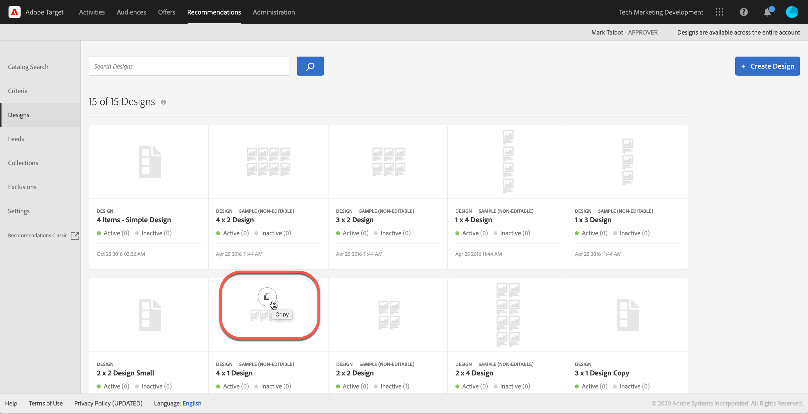

#  创建设计

设计可定义推荐在页面上的显示方式。

您可以使用默认设计或通过创建自定义设计来创建[!UICONTROL 推荐]设计。的 **[!UICONTROL Recommendations >设计]** 屏幕会显示默认设计卡片以及在您的帐户中创建的任何设计。

处理设计时，请牢记以下信息：

* 您可以使用默认设计创建推荐设计，也可以创建自定义设计。
* 您无法编辑或删除默认设计。
* 您可以编辑、复制或删除自定义设计。
* 要创建基于默认设计的设计，必须先复制该设计，然后编辑该副本。

此插图显示了默认的1 x 4设计：


此插图展示了一个自定义设计：


在活动创建过程中，您可以从可视化体验编辑器(VEC)中创建设计，也可以从活动创建之外的设计库创建设计。 以下部分假定您从库创建设计，但步骤类似。

## 创建设计

您可以基于默认设计创建设计，也可以创建自定义设计。

### 根据默认设计创建设计

1. 单击 **[!UICONTROL Recommendations]** > **[!UICONTROL 设计]** 以显示 [!UICONTROL 设计] 库。

   

1. 将鼠标悬停在要创建的设计的卡片上，然后单击 **[!UICONTROL 复制]** 图标。

   

   的 [!UICONTROL 创建设计] 对话框。

   

1. 在 **[!UICONTROL 信息]** 面板，添加 **[!UICONTROL 内容名称]** 和要在设计卡片上显示的可选预览图像。

   使用默认设计时， **[!UICONTROL 内容名称]** 字段。 您可以编辑该名称。您还可以选择要在设计卡片上显示的图像。

1. （视情况而定）编辑设计 **[!UICONTROL 代码]**，视需要。

   推荐设计使用的是开源 Velocity 设计语言。有关Velocity的信息可在 [https://velocity.apache.org](https://velocity.apache.org) 和 [使用Velocity自定义设计](/help/main/c-recommendations/c-design-overview/customizing-a-template.md).

   设计可以是 HTML 形式，也可以是非 HTML 形式。默认情况下，HTML 设计将使用`<div>`标记封装，以便允许在 Web 环境中进行点击跟踪。非 HTML 设计适用于无法进行点击跟踪的非 Web 环境。滑动 [!UICONTROL HTML设计] 切换到“关闭”位置以使用非HTML代码。

   >[!NOTE]
   >
   >设计中可引用（无论是硬编码还是通过循环引用）的最大实体数为99。

1. 单击&#x200B;**[!UICONTROL 保存]**。

### 创建自定义设计

1. 单击 **[!UICONTROL Recommendations]** > **[!UICONTROL 设计]** 以显示 [!UICONTROL 设计] 库。

1. 单击 **[!UICONTROL 创建设计]**.

   如果要将新自定义设计基于现有设计，请将鼠标悬停在所需设计上，然后单击 [!UICONTROL 复制] 图标。 然后，您可以编辑副本以创建新的自定义设计。

1. 添加 **[!UICONTROL 内容名称]** 和可选预览图像。

1. （视情况而定）编辑设计 **[!UICONTROL 代码]**，视需要。

   有关更多信息，请参阅上面步骤4中的信息。

1. 单击&#x200B;**[!UICONTROL 保存]**。

## 编辑、复制或删除设计

请记住，您无法编辑或复制默认设计；您只能复制默认设计。

将鼠标悬停在 [!UICONTROL 设计] 库中，然后单击相应的图标：编辑、复制或删除。


您可以复制现有设计以创建可随后修改的重复设计。 这样，您就可以更轻松地创建类似的设计。

请注意，设计在整个帐户中均可用。 在删除设计之前，请确保考虑这一点。 无法恢复已删除的设计。

## JSON 示例 {#section_75BFB2537CFF4FBD9B560F59EB32C8DD}

以下示例显示如何在通过基于表单的编辑器配置活动时返回JSON响应。

1. 在设计库或基于表单的工作流中创建设计。 如果您尝试在可视化体验编辑器(VEC)工作流中执行此操作，则无法创建HTML设计以外的任何内容，该设计封装在 `<div>` 中，用于执行点击跟踪。

1. 确保已关闭“HTML 设计”选项：

   

1. 以下代码是可粘贴到设计中的示例：

   ```javascript
       #* 
       * "Return a simple list of recommended entity ids"   
       *#
   
       {   
         "notes":{   
         "purpose": "Return a simple list of recommended entity ids",   
         "use-case": "Use this approach if you prefer to do a real-time lookup of entity attribute details (such as inventory, price, rating) from another system (such as a CMS, PIM or ecommerce platform)",   
         "version": "01"   
         },   
         "recommendedItems": {   
           "key": "$key.id",   
           "slot-01": "$entity1.id",   
           "slot-02": "$entity2.id",   
           "slot-03": "$entity3.id",   
           "slot-04": "$entity4.id",   
           "slot-05": "$entity5.id",   
           "slot-06": "$entity6.id",   
           "slot-07": "$entity7.id",   
           "slot-08": "$entity8.id",   
           "slot-09": "$entity9.id",   
           "slot-10": "$entity10.id"   
         }   
       }  
   ```

1. 设置基于表单的 [!DNL Recommendations] 活动。

   1. 导航到 **[!UICONTROL 活动]** 页面。
   1. 单击&#x200B;**[!UICONTROL 创建活动]** > **[!UICONTROL 推荐]**。
   1. 在 **[!UICONTROL 选择体验编辑器]**，选择 **[!UICONTROL 表单]**，然后单击 **[!UICONTROL 下一个]**.
   1. 在“位置”下方，输入文本：“Sample_Recs_Response”
   1. 在&#x200B;**[!UICONTROL 默认内容]**&#x200B;下方，单击向下箭头，然后单击&#x200B;**[!UICONTROL 添加推荐]**。
   1. 选择一种页面类型。这决定了对接下来要显示的屏幕的初步筛选。
   1. 选择一个标准卡片，然后单击&#x200B;**[!UICONTROL 下一步]**。
   1. 选择在上一步中创建的设计，然后单击 **[!UICONTROL 下一个]**.
   1. 完成设置过程。
   1. 单击&#x200B;**[!UICONTROL 不活跃]**&#x200B;旁边的向右箭头，然后选择&#x200B;**[!UICONTROL 激活]**。

1. 设置活动并将其激活后，您可以设置示例请求，以获取简洁的 JSON 响应。

   从保存活动开始， [!DNL Target] 将需要构建一个模型以支持所选标准配置。 此过程可能会花费一些时间，具体时间取决于众多因素。构建模型后，便会显示结果。

   例如：

   ```
   https://[YOUR_CLIENT_CODE].tt.omtrdc.net/m2/YOUR_CLIENT_CODE/ubox/raw?mbox=[YOUR_MBOX_NAME]&mboxContentType=text/html&mboxXDomain=disabled&entity.id=[ENTITY_ID]&mboxHost=rawbox_sample&at_property=[AT_PROPERTY_TOKEN]&mboxNoRedirect=true&mboxPC=1234-4321&mboxSession=9876-7000
   ```

   其中

   | 参数 | 值 |
   |--- |--- |
   | `[YOUR_CLIENT_CODE]` | Target客户端代码(位于/help/target/products.html#recsSettings > Recommendations API令牌>客户端代码中)。 |
   | `[YOUR_MBOX_NAME]` | 您在基于表单的Recommendations的“位置”部分中选择的名称，在此例中为Sample_Recs_Response。 |
   | `[ENTITY_ID` | 您目录中的项目的 `entity.id`。 |
   | `[AT_PROPERTY_TOKEN]` | （可选）如果您在活动设置过程中选择了某个属性（“企业权限”的一部分），则需添加此参数。 |

在运行算法并获取结果后，您的响应应当类似于以下示例：

{width="575px"}

## 其他JSON对象提示和技巧 {#section_C305673C68944749969DB239E3221DC2}

您还可以使用以下语法设置设计，以便仅发送回以逗号分隔的项目简单列表：

```
entity1.id, $entity2.id, $entity3.id, $entity4.id, $entity5.id, 
```

或者，您也可以在响应中发送更多信息。下面是一个更为复杂的代码文件示例，此代码不仅仅返回了实体 ID 及其关联的版块（顺序），还返回了更多其他内容。此设计示例还返回了活动详细信息、Target配置文件详细信息（如果适用），以及其他 `entity.attributes` 与返回的项目关联。

```javascript
    {   
     "adobeRecommendations": {   
      "notes": {   
       "purpose": "Return a list of entity ids with their associated entity.attributes",   
       "use-case": "Use this approach to avoid looking up attribute details after receiving a response from Target",   
       "version": "01"   
      },   
      "recommendedItems": {   
       "slot-01": "$entity1.id",   
       "slot-02": "$entity2.id",   
       "slot-03": "$entity3.id",   
       "slot-04": "$entity4.id",   
       "slot-05": "$entity5.id",   
       "slot-06": "$entity6.id",   
       "slot-07": "$entity7.id",   
       "slot-08": "$entity8.id",   
       "slot-09": "$entity9.id",   
       "slot-10": "$entity10.id"   
      },   
      "activityDetails": {   
       "mbox.name": "email-mbox",   
       "campaign.name": "\${campaign.name}",   
       "campaign.id": "\${campaign.id}",   
       "campaign.recipe.name": "\${campaign.recipe.name}",   
       "campaign.recipe.id": "\${campaign.recipe.id}",   
       "offer.name": "\${offer.name}",   
       "offer.id": "\${offer.id}",   
       "criteria.title": "$criteria.title",   
       "algorithm.name": "$algorithm.name",   
       "algorithm.dayCount": "$algorithm.dayCount"   
      },   
      "visitorProfile": {   
       "profile.favorite-category": "\${profile.favorite-category}",   
       "profile.test": "\${profile.test}",   
       "user.endpoint.lastPurchasedEntity": "\${user.endpoint.lastPurchasedEntity}",   
       "user.endpoint.lastViewedEntity": "\${user.endpoint.lastViewedEntity}",   
       "user.endpoint.mostViewedEntity": "\${user.endpoint.mostViewedEntity}",   
       "user.endpoint.categoryAffinity": "\${user.endpoint.categoryAffinity}",   
       "profile.geolocation.city": "\${profile.geolocation.city}",   
       "profile.geolocation.dma": "\${profile.geolocation.dma}",   
       "profile.geolocation.state": "\${profile.geolocation.state}",   
       "profile.geolocation.country": "\${profile.geolocation.country}",   
       "profile.sessionCount": "\${profile.sessionCount}",   
       "profile.averageDaysBetweenVisits": "\${profile.averageDaysBetweenVisits}",   
       "profile.browserTime": "\${profile.browserTime}",   
       "user.activeActivities": "\${user.activeActivities}",   
       "user.pcId": "\${user.pcId}",   
       "user.isFirstSession": "\${user.isFirstSession}",   
       "user.isNewSession": "\${user.isNewSession}",   
       "user.header": "\${user.header}",   
       "user.parameter": "\${user.parameter}"   
      },   
      "recKey": {   
       "recKeyDetails": {   
        "id": "$key.id",   
        "name": "$key.name",   
        "category": "$key.category",   
        "pageUrl": "$key.pageUrl",   
        "thumbnailUrl": "$key.thumbnailUrl"   
       }   
      },   
      "recDetailedResults": {   
       "recEntity1Details": {   
        "id": "$entity1.id",   
        "name": "$entity1.name",   
        "category": "$entity1.category",   
        "pageUrl": "$entity1.pageUrl",   
        "thumbnailUrl": "$entity1.thumbnailUrl"   
       },   
       "recEntity2Details": {   
        "id": "$entity2.id",   
        "name": "$entity2.name",   
        "category": "$entity2.category",   
        "pageUrl": "$entity2.pageUrl",   
        "thumbnailUrl": "$entity2.thumbnailUrl"   
       },   
       "recEntity3Details": {   
        "id": "$entity3.id",   
        "name": "$entity3.name",   
        "category": "$entity3.category",   
        "pageUrl": "$entity3.pageUrl",   
        "thumbnailUrl": "$entity3.thumbnailUrl"   
       },   
       "recEntity4Details": {   
        "id": "$entity4.id",   
        "name": "$entity4.name",   
        "category": "$entity4.category",   
        "pageUrl": "$entity4.pageUrl",   
        "thumbnailUrl": "$entity4.thumbnailUrl"   
       },   
       "recEntity5Details": {   
        "id": "$entity5.id",   
        "name": "$entity5.name",   
        "category": "$entity5.category",   
        "pageUrl": "$entity5.pageUrl",   
        "thumbnailUrl": "$entity5.thumbnailUrl"   
       },   
       "recEntity6Details": {   
        "id": "$entity6.id",   
        "name": "$entity6.name",   
        "category": "$entity6.category",   
        "pageUrl": "$entity6.pageUrl",   
        "thumbnailUrl": "$entity6.thumbnailUrl"   
       },   
       "recEntity7Details": {   
        "id": "$entity7.id",   
        "name": "$entity7.name",   
        "category": "$entity7.category",   
        "pageUrl": "$entity7.pageUrl",   
        "thumbnailUrl": "$entity7.thumbnailUrl"   
       },   
       "recEntity8Details": {   
        "id": "$entity8.id",   
        "name": "$entity8.name",   
        "category": "$entity8.category",   
        "pageUrl": "$entity8.pageUrl",   
        "thumbnailUrl": "$entity8.thumbnailUrl"   
       },   
       "recEntity9Details": {   
        "id": "$entity9.id",   
        "name": "$entity9.name",   
        "category": "$entity9.category",   
        "pageUrl": "$entity9.pageUrl",   
        "thumbnailUrl": "$entity9.thumbnailUrl"   
       },   
       "recEntity10Details": {   
        "id": "$entity10.id",   
        "name": "$entity10.name",   
        "category": "$entity10.category",   
        "pageUrl": "$entity10.pageUrl",   
        "thumbnailUrl": "$entity10.thumbnailUrl"   
       }   
      }   
     }   
    }  
```

## 培训视频：在Recommendations中创建自定义设计(3:20) 

本视频包含以下信息：

* 创建自定义设计
* 了解如何在设计中引用显示变量

>[!VIDEO](https://video.tv.adobe.com/v/27687)
