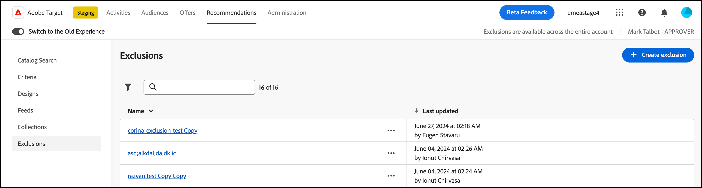

# 排除项

在中创建排除项 [!DNL Adobe Target Recommendations] 防止向访客推荐产品或内容。 排除项是不向访客推荐的产品或内容的子集。

排除项可在整个帐户中使用。 与收藏集不同，收藏集可在创建体验时为每个体验指定特定的收藏集 [!UICONTROL Recommendations] 活动，排除项适用于帐户中的所有活动。 在活动创建期间没有用于分配排除组的选项。

您可以使用排除项的一些次数示例包括：

* 已停产的产品。
* 秋冬目录现在是唯一应该在线显示的目录。 Summer目录中的任何项目不再可供购买。
* 可能不适宜在大多数页面或屏幕上推荐的项目（成人产品、NC-17电影等）。
* 元数据字段不完整的产品（缺少缩略图、价格或其他重要元数据）。
* 绝不应该推荐的产品(可能系统中存在某个项目的SKU，但它不是可购买的项目。 或者可能是QA团队模拟购买而不实际订购某些东西的虚假SKU，等等)。

>[!IMPORTANT]
>
>排除规则将全局应用于所有 [环境](/help/main/administrating-target/environments.md).
>
>静态和动态排除规则是可帮助您完成营销工作的强大功能。有关详细信息、示例和用例情景，请参阅[使用动态和静态包含规则](/help/main/c-recommendations/c-algorithms/use-dynamic-and-static-inclusion-rules.md#concept_4CB5C0FA705D4E449BD0B37B3D987F9F)。

## 创建排除项

1. 单击 **[!UICONTROL Recommendations]** > **[!UICONTROL Exclusions]** 以显示现有排除项的列表。

   

   上为每个排除项报告的“项目数”。 [!UICONTROL Exclusions] list view是配置的默认Recommendations中与该排除项规则相匹配的产品数 [主机组](/help/main/administrating-target/hosts.md) （环境）。 请参阅 [计划和实施 [!DNL Recommendations]](https://experienceleague.adobe.com/en/docs/target-dev/developer/recommendations){target=_blank} 在 *Adobe Target开发人员指南* 有关如何更改默认主机组的信息。

1. （视情况而定）单击 [!UICONTROL Filter] 图标，然后选择所需的 [环境](/help/main/administrating-target/environments.md) 从 **[!UICONTROL Environment]** 创建（或更新）排除项时显示的下拉列表，以预览该环境中排除项的内容。 默认情况下，会显示默认主机组的结果。

   

1. 单击 **[!UICONTROL Create Exclusion]**。

   

1. 键入排除项 **[!UICONTROL Name]** 并输入可选说明。

1. 使用规则生成器创建排除项。

   在“规则”列表中选择一个参数，选择一个运算符，然后输入一个或多个值以标识产品。使用逗号分隔多个值。

1. 单击 **[!UICONTROL Create]**。

<!-- ## Create an exclusion using Advanced Search

You can also create exclusions using [!UICONTROL Advanced Search] on the [Catalog Search](/help/main/c-recommendations/c-products/catalog-search.md#save-as) page ( [!UICONTROL Recommendations] > [!UICONTROL Catalog Search] > [!UICONTROL Advanced Search]). 

After creating a search using "id > contains," for example, you can then click [!UICONTROL Save As] > [!UICONTROL Exclusion].

>[!IMPORTANT]
>
>The [!UICONTROL Advanced Search] functionality is case-insensitive; however, products returned at the time of delivery are based on case-sensitive search. This mismatch might lead to confusion. Ensure that you consider case-sensitivity when you create exclusions based on results using the Advanced Search functionality. For example, if you perform a search for "Holiday," that initial search lists results containing "Holiday" and "holiday." If you then create an exclusion with the intent to exclude products containing "holiday," only products containing "holiday" are excluded. Products containing "Holiday" are not excluded. -->

## 编辑、复制或删除排除项

单击 **省略号** 图标，然后单击相应的图标：编辑、复制或删除。

您可以复制现有排除项以创建重复排除项，然后对其进行修改。 利用此选项，您可以用更少的工作量创建类似的排除项。

请注意，排除项可在整个帐户中使用。 确保在删除排除项之前考虑此注意事项。 无法恢复已删除的排除项。

## 培训视频：在Recommendations中创建收藏集和排除项(7:05) 

本视频包含以下信息：

* 创建收藏集
* 创建排除项

>[!VIDEO](https://video.tv.adobe.com/v/27689)