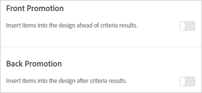

# 添加促销活动

添加促销项目并控制它们在[!DNL Adobe Target Recommendations]设计中的放置位置。 您可以添加静态和动态促销活动。

>[!IMPORTANT]
>
>静态和动态排除规则是可帮助您完成营销工作的强大功能。有关详细信息、示例和用例情景，请参阅[使用动态和静态包含规则](/help/main/c-recommendations/c-algorithms/use-dynamic-and-static-inclusion-rules.md#concept_4CB5C0FA705D4E449BD0B37B3D987F9F)。

创建 [!DNL Recommendations] 活动时，您可以选择将促销项目包含在您的 [!DNL Recommendations] 设计中。促销活动使用设计中的可用版块，且优先于标准结果和备用推荐。例如，如果您的设计中有六个版块，而您将其中两个用于促销活动，则其余四个可用于基于标准推荐的项目。

系统将根据按标准为您的活动推荐的项目删除重复的促销活动，以便给定的项目不会在同一个推荐栏中出现两次。

您可以促销特定项目、动态促销项目、基于属性促销项目或促销收藏集。

[!DNL Target] UI中的[!UICONTROL Front Promotion]和[!UICONTROL Back Promotion]选项

>[!NOTE]
>
>使用促销活动会更改 CSV 结构和输出。这些更改可能会对任何涉及 CSV 的外部流程（如电子邮件）造成影响。

1. 在&#x200B;**[!UICONTROL Options]**&#x200B;页面上，单击&#x200B;**[!UICONTROL Front Promotion]**&#x200B;或&#x200B;**[!UICONTROL Back Promotion]**&#x200B;切换。

   下图显示处于“开”位置的[!UICONTROL Front Promotion]切换开关。

   

   您可以将促销活动插入到标准结果之前“及”之后。**

1. 设置要用于促销项目的设计版块数量。

   您最多可以使用 20 个版块，具体取决于您的 [!DNL Recommendations] 设计。对于基于您的标准返回的推荐，您所使用的各个版块会变得均不可用。

1. 为促销项目设置开始日期和结束日期。

   如果不设置开始日期，促销活动将立即开始。如果不设置结束日期，促销活动将无限期地运行。

1. 选择&#x200B;**[!UICONTROL Promotion Type]**。

   * 选择&#x200B;**[!UICONTROL List of items]**&#x200B;并输入要促销的特定项目的`entity.id`值（以逗号分隔）。

   * 选择&#x200B;**[!UICONTROL Promote by attribute]**&#x200B;并添加规则以定义要提升的项目的属性。

     如果选择[!UICONTROL Promote by Attribute]，则可以创建动态匹配。 有关详细信息，请参阅[使用动态和静态包含规则](/help/main/c-recommendations/c-algorithms/use-dynamic-and-static-inclusion-rules.md#concept_4CB5C0FA705D4E449BD0B37B3D987F9F)。

   * 选择&#x200B;**[!UICONTROL Promote a collection]**&#x200B;并选择要促销的项目集合。

     您可以创建新的收藏集，以将其用于促销活动。有关详细信息，请参阅[创建收藏集](/help/main/c-recommendations/c-products/collections.md#task_1256DFF6842141FCAADD9E1428EF7F08)。

   如果您选择&#x200B;**[!UICONTROL List of Items]**&#x200B;作为&#x200B;**[!UICONTROL Promotion Type]**，则可以根据需要选中&#x200B;**[!UICONTROL Randomize Item Order]**&#x200B;复选框。

   [!UICONTROL List of Items]的默认排序顺序基于您在[!DNL Target] UI或API中输入的顺序。 如果列表中包含的项目数量多于您为促销活动设置的版块数量，则[!UICONTROL Randomize Item Order]选项会随机排列您的设计中显示的促销项目。 选择此选项导致[!DNL Target]从每次点击时设置的整个促销活动中，随机选择在模板中为促销活动启用的项目。

   如果实体没有`entity.value`属性（例如，您没有销售产品），则可以将数值传递到`entity.value`属性，如发布日期。 在这种情况下，可根据最新发布日期以降序提升已提升的项目。 `entity.value`属性为double类型；它不接受字符串。

   如果您选择了&#x200B;**[!UICONTROL Promote by Attribute]**&#x200B;或&#x200B;**[!UICONTROL Promote a Collection]**&#x200B;选项，则随机排列顺序的选项不适用。

   使用[!UICONTROL Promote by Attribute]或[!UICONTROL Promote a Collection]选项提升特定项时，项的默认显示顺序基于`entity.value`属性，按降序数字顺序排列。

   下表说明了这些选项之间的差异：

   | 促销活动类型 | 默认排序 | 备份排序 | 动态筛选选项 |
   | --- | --- | --- | --- |
   | [!UICONTROL List of Items] | 在Target UI/API中输入的订单 | 随机（通过UI/API选择时） | 否 |
   | [!UICONTROL Promote by Attribute] | `entity.value` （降序） | 无随机化 | 是 |
   | [!UICONTROL Promote a Collection] | `entity.value` （降序） | 无随机化 | 否 |

1. 单击 **[!UICONTROL Save]**。

促销活动会应用到活动中的所有体验。
