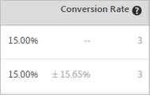

# 转化率

每个体验均会报告转化率、提升度、置信度和置信区间。

下图显示了一个标有[!UICONTROL Conversion Rate]、[!UICONTROL Lift]和[!UICONTROL Confidence]标题的示例活动的图表标题。

>[!NOTE]
>
>在所有的数据中，如果传递 `orderID`，则会忽略重复订单。审计报表列出了被忽略的重复订单。

## 转化率 {#section_07A36846C4E84D0881906809B9CE5A74}

显示转化率中值、置信区间以及转化次数。

例如，请查看以下“转化率”报表列：

第一行是控制体验。该行显示的转化率为 15%，转化次数为 3。第二行（体验 B）显示的转化率为 15%，置信区间为 ±15.65%，转化次数为 3。

>[!NOTE]
>
>当前仅计算二进制量度的置信区间。

## 提升度 {#section_0F409572C720433D9378092ABC999982}

将每个体验的转化率与控制体验的转化率进行比较。

提升度 =（体验转化率 - 控制转化率）/控制转化率。

如果控制体验为 0，则不存在提升百分比。

## 零售数据 {#section_30A674731BA6440E9BB93C421BE990EE}

如果您插入下订单(`orderConfirmPage`) mbox并将它选作转化mbox，则会在每个体验中显示AOV、RPV和销售数据。

## 置信水平和置信区间 {#concept_0D0002A1EBDF420E9C50E2A46F36629B}

对于每个体验，将显示置信度和置信区间。

您可以为 for Target (A4T) 执行离线计算，但需要在 [!DNL Analytics]Analytics 中完成数据导出步骤。有关更多信息，请参阅下面的“为 Analytics for Target (A4T) 执行离线计算”。

### 置信度 {#section_26FE5E44BDD5478792A65FCFD83DCCDC}

如果空假设为真（实质上，如果该体验或选件与控制体验/选件之间的转化率没有差异），则显示的体验或选件的置信度是指获得比实际观察到的结果更少极端的概率（以百分比表示）。 就p值而言，显示的置信度为1 - p值。 更简单地说，较高的置信度表明数据与控制选件/体验具有相等转化率的假设不太一致。

置信度如果大于或等于 99.995%，则向上舍入为 100.00%。

在做出任何业务决策之前，请尝试等待一段时间，直到样本量足够大，并且一个或多个体验的四个置信度条块在一段连续的时间内保持一致，从而确保结果稳定。

### 置信区间 {#section_F582738DFE1648C78B93D81EBC6CACF7}

>[!NOTE]
>
>当前仅计算二进制量度的置信区间。

*置信区间*&#x200B;是一个估计范围，在此范围内可以在给定的置信度级别找到量度的真实值。 Target始终显示95%的置信度间隔。 在“转化率”列中，置信区间显示为浅灰色 +/- 百分比值。在以下示例中，体验 B 的提升度所具有的置信区间为 +/- 15.65%。

**示例：**&#x200B;某个体验的观察RPV为$10，其95% **置信区间**&#x200B;为$5到$15。 我们不知道的是，其真正的RPV为12美元。 然后，如果我们多次运行此测试，则我们计算的置信区间的95%时间将包含RPV的&#x200B;_true_&#x200B;值$12。

**置信区间的影响因素有哪些？**&#x200B;公式遵循计算置信区间的标准统计方法。

* **样本量：**&#x200B;随着样本的增加，区间将缩小。推荐采用较大样本，因为这意味着您的报表更加接近成功量度的真实值。
* **标准偏差减小：**&#x200B;结果越相似（如 AOV 越相似或者每天转化的次数或访客数越相似），标准偏差越小。

## 置信度计算及其离线执行方法 {#section_86F7C231943043A5B8B6BFE67B706E3B}

[下载的 CSV 报表](/help/main/c-reports/downloading-data-in-csv-file.md#concept_3F276FF2BBB2499388F97451D6DE2E75)仅包含原始数据，而不包含计算量度，如 A/B 测试中使用的每位访客带来的收入、提升度或置信度。

要计算这些计算量度，请下载Target的[完整置信度计算器](/help/main/assets/complete_confidence_calculator.xlsx) Excel文件以输入活动的值，或查看A/Bn测试中的[统计计算](/help/main/c-reports/statistical-methodology/statistical-calculations.md)。

>[!NOTE]
>
>此计算器适用于基于 Target 的报表，而不适用于 A4T 报表。

## 为Analytics for Adobe Target (A4T)执行离线计算 {#section_B34BD016C8274C97AC9564F426B9607E}

您可以为 A4T 执行离线计算，但需要在 [!DNL Analytics] 中完成数据导出步骤。

对于A4T，我们对连续变量（而不是二进制量度）使用[Welch的t检验](https://en.wikipedia.org/wiki/Welch%27s_t-test){target=_blank}计算。 在 Analytics 中，会始终跟踪访客，并计入所执行的每项操作。因此，如果访客进行了多次购买或多次访问了某个成功量度，则会计入这些额外的点击。这会使量度变为连续变量。要执行韦尔奇的t检验计算，需要“平方和”来计算方差，方差用作t统计量的分母。 [A/Bn测试中的统计计算](/help/main/c-reports/statistical-methodology/statistical-calculations.md)说明了使用的数学公式的详细信息。 可从[!DNL Analytics]检索平方和。 要获取平方和数据，您需要导出样本时间段内要优化的量度在访客级别对应的数值。

例如，如果您正在针对每位访客的页面查看次数进行优化，则可以导出一个样本，其中包含指定时间段内（可能几天）每位访客的页面查看总次数（只需要几千个数据点）。 之后，您可以对每个值求平方，然后将总数相加（此处的运算顺序至关重要）。此“平方和”值随后可用在完整置信度计算器中。应在该电子表格的“收入”部分中使用这些值。

**使用 [!DNL Analytics] 数据导出功能执行此操作：**

1. 登录到 [!DNL Adobe Analytics]。
1. 单击&#x200B;**[!UICONTROL Tools]** > **[!UICONTROL Data Warehouse]**。
1. 在&#x200B;**[!UICONTROL Data Warehouse Request]**&#x200B;选项卡上，填写字段。

   有关各个字段的更多信息，请参阅 [Data Warehouse](https://experienceleague.adobe.com/docs/analytics/export/data-warehouse/data-warehouse.html) 中的“Data Warehouse 请求描述”。

   | 字段 | 说明 |
   |--- |--- |
   | 请求名称 | 指定请求的名称。 |
   | 报告日期 | 指定时间段和时间粒度。 对于首次请求，最好选择不超过 1 小时或 1 天的数据。请求的时间段越长，Data Warehouse 文件处理的时间也就会越长，因此第一次最好请求较短时间段内的数据，以确保文件返回预期的结果。之后，转到“请求管理器”，复制您的请求，然后在第二次请求中请求更多的数据。此外，如果您将粒度切换为“无”以外的任何粒度，则文件大小将急剧增加。  |
   | 可用区段 | 根据需要应用区段。 |
   | 划分 | 选择所需的维度：“标准”维度是现成的(OOTB)，而“自定义”维度包含eVar和prop。 如果需要访客ID级别信息，建议您使用“访客ID”，而不是“Experience Cloud访客ID”。<ul><li>访客 ID 是 Analytics 使用的最终 ID。访客 ID 将为 AID（如果客户是旧客户）或 MID（如果客户是新客户，或者清除了自 MC 访客 ID 服务启动以来的 Cookie）。</li><li>仅当客户是新客户，或者清除了自 MC 访客 ID 服务启动以来的 Cookie 时，才会为客户设置 Experience Cloud 访客 ID。</li></ul> |
   | 量度 | 选择所需的量度。“标准”量度为开箱即用量度，而“自定义”量度包含自定义事件。 |
   | 报表预览 | 在计划报表之前查看您的设置。  |
   | 计划提交 | 输入要向其传递文件的电子邮件地址，命名文件，然后选择[!UICONTROL Send Immediately]。 注意：可在[!UICONTROL Advanced Delivery Options] 下通过FTP提交文件。 |

1. 单击 **[!UICONTROL Request this Report]**。

   根据请求的数据数量，文件提交最多可能需要 72 小时。您可以随时通过单击[!UICONTROL Tools] > [!UICONTROL Data Warehouse] > [!UICONTROL Request Manager]来查看请求进度。

   如果您希望重新请求您过去请求的数据，则可以根据需要从[!UICONTROL Request Manager]中复制旧请求。

有关 [!DNL Data Warehouse] 的更多信息，请访问 [!DNL Analytics] 帮助文档中的以下链接：

* [创建Data Warehouse请求](https://experienceleague.adobe.com/docs/analytics/export/data-warehouse/t-dw-create-request.html)
* [Data Warehouse最佳实践](https://experienceleague.adobe.com/docs/analytics/export/data-warehouse/data-warehouse-bp.html)

## 计数方法 {#concept_EC19BC897D66411BABAF2FA27BCE89AA}

您可以选择按不同的计数方法查看报表，以便了解在活动的生命周期或在单个会话期间，活动对您的用户产生了何种影响。

以下活动类型支持计数方法：

* A/B 测试

  自动定位 A/B 活动是一个特例，它仅支持默认的“访问”计数方法。

* 体验定位 (XT)
* 多变量测试 (MVT)

  在 MVT 元素贡献报表中，Target 对于收入量度类型不支持活动展示次数。

* 推荐

自动个性化 (AP) 活动当前仅支持默认的计数方法（即“访问次数”）。

您可以按以下计数方法查看报表：

* **访客：**&#x200B;活动生命周期内活动中的独特参加者。

  在以下情况下，可以将一个人计为新参加者：此人从新的计算机或新的浏览器访问网站；此人删除了 Cookie；或此人在转化后使用相同的 Cookie 再次返回到活动。由访客的 mbox Cookie 中的 PCID 对参加者进行标识。如果 PCID 发生更改，则此人会被计为新访客。

* **访问：**&#x200B;独特参加者在持续 30 分钟的单次浏览器会话期间对体验进行的访问。

  如果实现了转化，或者访客在离开至少 30 分钟后再次回到网站，则该访客的回访会被计为新访问。由访客的 mbox Cookie 中的 `sessionID` 对访问进行标识。`sessionID` 发生更改时，该访问将被视为新访问。

* **展示/页面查看：**&#x200B;每次访客加载活动的任何页面时均进行一次计数。

  单次访问可能包含多次展示，例如您的主页在一次访问期间可能会展示多次。

>[!NOTE]
>
>通常情况下，计数取决于 Cookie 和会话活动。但是，如果您达到了活动的最终转化点，然后又重新进入活动，则您会被视为新参加者，而您对活动的访问也会被视为新访问。即使用户的 PCID 和 `sessionID` 值不变，也是如此。

## 为什么[!DNL Target]建议使用Welch的t检验？ {#t-test}

A/B测试是比较控制变量（也称为体验）中某个业务量度的平均值与一个或多个替代体验中该同一量度的平均值的实验。

[!DNL Target]建议使用[Welch的t检验](https://en.wikipedia.org/wiki/Welch%27s_t-test)，因为与z检验等替代测试相比，这些测试所需的假设更少，并且是适当的统计测试，可用于对控制体验和替代体验之间的业务量度进行成对比较（量化）。

### 详细内容

在运行A/B在线测试时，每个用户/访客都会随机分配到单个变体。 随后，我们测量每个变体中的访客所关注的业务量度（例如，转化、订单、收入等）。 我们使用的统计测试然后检验关于对照和给定替代变体的平均业务量度（例如，转化率、每用户订单数、每用户收入等）相等的假设。

尽管业务量度本身可能会根据某种任意分布进行分布，但此量度的平均值（在每个变量内）的分布应通过[中心极限定理](https://en.wikipedia.org/wiki/Central_limit_theorem)收敛于正态分布。 请注意，尽管无法保证均值采样分布收敛到正常值的速度，但通常情况下，会根据在线测试中的访客规模达到此条件。

考虑到均值的这种正态性，可以表示要使用的测试统计量遵循t分布，因为它是正态分布值（业务量度的均值差）与基于来自数据的估计（均值差的标准误差）的缩放项的比率。 **t检验**&#x200B;是适当的假设检验，因为测试统计量遵循t分布。

### 为什么不使用其他测试

**z测试**&#x200B;在技术上是不合适的，因为在典型的A/B测试方案中，测试统计量的分母不是由已知方差派生的，而是必须根据数据估算的。 然而，当样本量足够大时，z检验和t检验是相同的。

未使用&#x200B;**卡方检验**，因为这些检验适合确定两个变体之间是否存在定性关系（即null假设变体之间没有差异）。 T测试更适用于&#x200B;_定量_&#x200B;比较量度的情况。

**Mann-Whitney U检验**&#x200B;是非参数检验，当平均业务量度（针对每个变量）的采样分布不是正态分布时，该检验是合适的。 然而，如前所述，考虑到在线测试中涉及的交通量大小，通常应用中心极限定理，因此t测试可以安全应用。

当测试具有两个以上的体验（“A/Bn测试”）时，可以应用更复杂的方法，如&#x200B;**ANOVA**（将t测试推广到两个以上的变体）。 但是，ANOVA回答了“是否所有变体具有相同的均值”的问题，而在典型的A/Bn测试中，我们更感兴趣的是&#x200B;_哪个特定变体_&#x200B;最好。 因此，在[!DNL Target]中，我们应用常规t检验来将每个变体与对照进行比较，并进行Bonferroni校正以考虑多次比较。