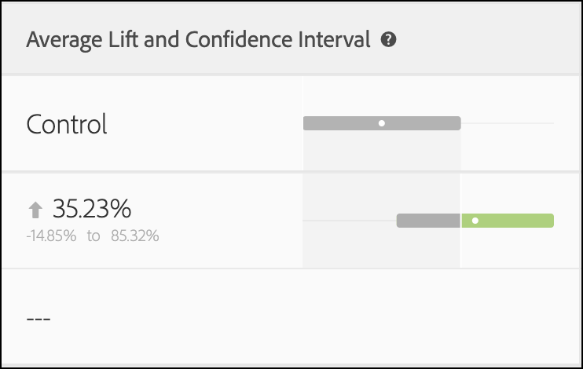

# A/Bn测试中的统计计算

本文记录了[!DNL Adobe Target]中手动A/Bn测试中使用的详细统计计算。 已提供[!UICONTROL Conversion Rate]、[!UICONTROL Confidence Interval of Conversion Rate]、[!UICONTROL Lift]、[!UICONTROL Confidence Interval for Lift]和[!UICONTROL Confidence]的定义。

>[!NOTE]
>
>本文中的信息取代了用于A/B测试的&#x200B;*Adobe Target计算* pdf文件，以前可在此站点上下载。

![显示A/B测试活动的[!UICONTROL Conversion Rate]、[!UICONTROL Average Lift and Confidence Interval]和[!UICONTROL Confidence]的目标报告。](/help/main/c-reports/statistical-methodology/img/target_report.png)

## 平均性能

下节将说明上图中使用的计算。

### 转化率和每位访客带来的收入(RPV)促销活动

下图显示了[!UICONTROL Conversion Rate]报表中的[!UICONTROL Confidence Interval of Conversion Rate]、[!UICONTROL Conversions]和[!DNL Target]的数量。 例如，第一行显示对于体验A：[!UICONTROL Conversion Rate]为25.81%，[!UICONTROL Confidence Interval]为±7.7%，记录了32次转化。 考虑到有124位访客查看了此体验，则相当于32/124 = 25.81%。

<p style="text-align:center;"></p>

实验中每个体验&#x200B;**ν**&#x200B;的转化率或&#x200B;*平均值<sub>，</sub>*&#x200B;μ&#x200B;*ν*&#x200B;定义为量度总和与分配给该量度的单位数的比率&#x200B;*N<sub>ν</sub>*：

<p style="text-align:center;"></p>

这里，

* *Y<sub>iν</sub>*&#x200B;是分配给给定体验&#x200B;*ν*&#x200B;的每个单位&#x200B;*i*&#x200B;的度量值。

* 单位&#x200B;*i*&#x200B;的总和取决于计数方法的选择。

   * 如果将&#x200B;*[!UICONTROL Visitors]*&#x200B;用作计数方法，则每个单位都是一个独特访客，该访客被定义为活动生命周期中的独特参与者。
   * 如果将&#x200B;*[!UICONTROL Visits]*&#x200B;用作计数方法，则每个单位都是唯一访问，它在[!DNL Target]会话（具有唯一的`sessionId`）期间定义为体验中的唯一参与者。 当`sessionId`发生更改或访客完成转化步骤时，即会计为新访问。
   * 如果将&#x200B;*[!UICONTROL Activity Impressions]*&#x200B;用作计数方法，则每个单位都是每次访客加载活动的任何页面时定义的唯一展示。

## [!UICONTROL Confidence Interval of Mean]/[!UICONTROL Conversion Rate]

转换率的置信区间被直观地定义为与基础数据一致的可能转换率的范围。

运行实验时，给定体验的转化率是“真”转化率的&#x200B;*估计*。 为了量化此估计中的不确定性，[!DNL Target]使用置信区间。 [!DNL Target]始终报告95%的置信区间，这意味着最终，95%的置信区间计算中包含体验的真实转化率。

当前领先或入选的体验旁边也会报告“置信度”数字。 此数字仅会在领导体验的[!UICONTROL Confidence]达到至少60%时报告。 如果活动中存在两个体验，则此数字表示该体验表现优于其他体验的置信水平。 如果活动中存在两个以上的体验，则该数字表示体验表现优于定义的“控制”体验的置信水平。 如果“控制”体验获胜，则不会报告“置信度”数字。

转化率&#x200B;*μ<sub>ν</sub>*&#x200B;的95%置信区间定义为值的范围：

<p style="text-align:center;"></p>

其中平均值的标准误差定义为

<p style="text-align:center;"></p>

当使用样本标准差的无偏估计时：

<p style="text-align:center;"></p>

如果促销活动是转化率促销活动（即，转化量度是二进制的），则标准错误将减少为：

<p style="text-align:center;"></p>

## 提升度

下图显示了[!UICONTROL Lift]报表中的[!UICONTROL Confidence Interval of Lift]和[!DNL Target]。 数字表示提升度范围的平均值，箭头反映提升度是正还是负。 箭头以灰色显示，直到置信度超过95%。 置信度超过阈值后，箭头会根据提升度为正值或负值显示为绿色或红色。

<p style="text-align:center;"></p>

体验&#x200B;*ν*&#x200B;和控制体验&#x200B;*ν<sub>0</sub>*&#x200B;之间的提升是转化率的相对“增量”，其定义为

<p style="text-align:center;"></p>

倘个别兑换率定义见上文。 更简单地说，

```
Lift(Experience N) = (Performance_Experience_N - Performance_Control)/ Performance_Control
```

如果控制体验&#x200B;*ν<sub>0</sub>*&#x200B;的转化率为0，则没有提升。

## [!DNL Confidence Interval of Lift]

[!UICONTROL Average Lift and Confidence Interval]列中的箱形图表示平均值和95% [!UICONTROL Confidence Interval of Lift]。 当给定非控制体验的置信区间与控制体验的置信区间存在任何重叠时，箱形图呈灰色。 当给定体验的置信区间范围高于或低于控制体验的置信区间时，箱形图呈绿色或红色。

体验&#x200B;*ν*&#x200B;与控制体验&#x200B;*ν<sub>0</sub>*&#x200B;之间提升度的标准误差定义为：

<p style="text-align:center;"></p>

那么提升度的95%置信区间为：

<p style="text-align:center;"></p>

此计算使用“Delta”方法，并在本文档[中详细介绍了](/help/main/assets/confidence_interval_lift.pdf)

## [!UICONTROL Confidence]

最后一列显示[!DNL Target]报表中的置信度。 在空假设为真的情况下，体验的置信度是获得极端结果的概率（用百分比表示），就像观察到的结果一样。 就p值而言，显示的置信度为&#x200B;*1 - p值*。 直觉上，较高的置信度意味着控制体验和非控制体验具有相等转化率的可能性较小。

在[!DNL Target]中，在测试体验和控制体验之间执行双尾&#x200B;**Welch的t检验**，以测试测试和控制体验的方法是否相同。 由于在运行试验之前，我们通常不知道两组样本的大小和差异是否相同，并且[!DNL Target]还允许您向每个体验发送不相等的流量百分比，因此我们不假设每个体验的差异是相等的。 因此，韦尔奇的t检验被选作学生的t检验。

为进行Welch的t检验，首先计算t统计量和自由度，然后进行双尾t检验以生成p值。 最后，根据p值计算置信度。

将&#x200B;*t*&#x200B;统计量定义为任意两个独立随机变量&#x200B;*ν*&#x200B;和&#x200B;*ν<sub>0</sub>*&#x200B;的均数除以差值的标准误差：

<p style="text-align:center;"></p>

其中&#x200B;*μ<sub>v</sub>*&#x200B;和&#x200B;*μ<sub>v0</sub>*&#x200B;分别为&#x200B;*ν*&#x200B;和&#x200B;*ν<sub>0</sub>*&#x200B;的均值，并给出&#x200B;*μ<sub>v</sub>*&#x200B;和&#x200B;*μ<sub>v0</sub>*&#x200B;之间差值的标准误差：

<p style="text-align:center;"></p>

其中&#x200B;*σ<sup>2</sup><sub>v</sub>*&#x200B;和&#x200B;*σ<sup>2</sup><sub>v<sub>0</sub></sub>*&#x200B;是两个体验&#x200B;*ν*&#x200B;和&#x200B;*ν<sub>0</sub>*&#x200B;的变差，*N<sub>v</sub>*&#x200B;和&#x200B;*N<sub>v<sub>0</sub></sub>*&#x200B;分别是&#x200B;*ν*&#x200B;和&#x200B;*ν<sub>0</sub>*&#x200B;的样本大小。

对于Welch的t检验，自由度计算如下：

<p style="text-align:center;"></p>

*ν*&#x200B;和&#x200B;*ν<sub>0</sub>*&#x200B;的自由度定义为：

<p style="text-align:center;"></p>

<p style="text-align:center;"></p>

然后，可以从&#x200B;*t* — 分布尾部的区域计算p值：

<p style="text-align:center;"></p>

最后，[!DNL Target]中报告的置信度定义为：

<p style="text-align:center;"></p>

## 脱机执行计算

[下载的 CSV 报表](/help/main/c-reports/c-report-settings/downloading-data-in-csv-file.md)仅包含原始数据，而不包含计算量度，如 A/B 测试中使用的每位访客带来的收入、提升度或置信度。

要计算这些统计量，请下载[!DNL Target] [完整置信度计算器](/help/main/assets/complete_confidence_calculator.xlsx) Excel文件以输入活动的值。
