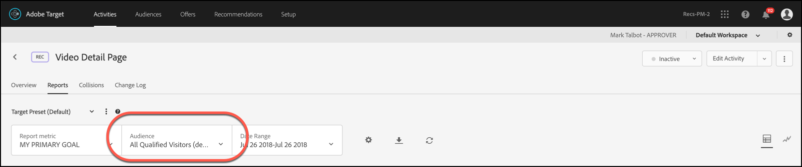

# 将报表受众应用于成功量度

选择一个可让用户符合[!DNL Adobe Target]中报表受众条件的成功量度。

对于所有活动，您都可以通过“[!UICONTROL 应用位置]”下拉列表将受众应用于成功量度，以便查看达到成功量度后的报表数量以及后续操作的报表数量。

例如，假设您为所有从您的主页进入并到达转化页面的访客创建了一个活动，但是您还希望进一步了解在转化之前向购物车中添加的商品金额高于 $50 的访客。

[!UICONTROL Applied At]下拉列表可能提供三个类别：

* 活动的任何访客
* 仅限在活动中达到特定步骤的访客
* 仅限达到转化的访客

换言之，您可以指定访客必须到达活动登入页面上的 mbox，访客必须到达定义活动中间某个点处的 mbox，或访客必须到达活动结束时的转化 mbox。

>[!NOTE]
>
>[成功量度](/help/main/c-activities/r-success-metrics/success-metrics.md#reference_D011575C85DA48E989A244593D9B9924)只有在为活动配置后才可用。 如果您尚未定义成功量度，则只能从下拉列表中看到两个选项：[!UICONTROL 促销活动条目]和[!UICONTROL 转化]。

## 注意事项

将报表受众应用于成功量度时，请考虑以下信息：

* 只有从应用受众的量度开始的成功量度才会显示按受众分段的报表数据
* 受众所应用量度之前的成功量度不会按受众分段，而是显示所有访客数据
* 将根据量度在活动定义中的顺序来考虑这些量度，其中[!UICONTROL 主要目标]是最后一个目标。

## 在报表中查看分段

要在报表中查看分段，请从活动报表的[!UICONTROL 受众]下拉列表中选择所需的受众。

## 示例

考虑一个具有成功量度1、成功量度2、成功量度3和主要目标的活动。

假设您在“登入”时设置了报表Audience1，在成功量度2时设置了报表Audience2。 受众将按以下方式筛选报表数据：

|  | 访客 | 成功量度1 | 成功量度2 | 成功量度3 | 主要目标 |
| --- | --- | --- | --- | --- | --- |
| Audience1 | 已应用 | 已应用 | 已应用 | 已应用 | 已应用 |
| Audience2 | 未应用 | 未应用 | 已应用 | 已应用 | 已应用 |
