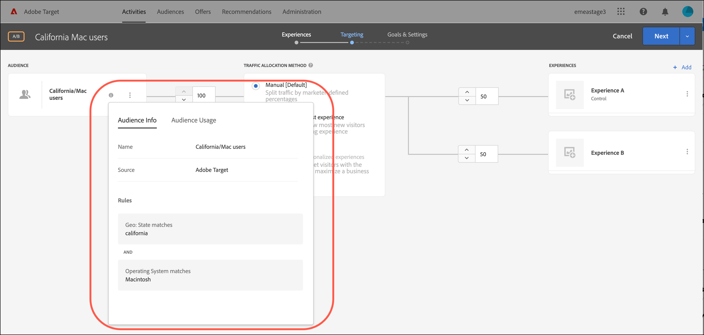

# 创建受众

[!DNL Adobe Target]中的受众可决定哪些人可以看到目标活动中的内容和体验。

不论在何处，只要可以使用定位，便会用到受众。定位活动时，您具有以下选项：

* 从[!UICONTROL Audiences]列表中选择可重复使用的受众
* [创建特定于活动的受众](/help/main/c-target/creating-activity-only-audience.md)并定位它
* [合并多个受众](/help/main/c-target/combining-multiple-audiences.md#concept_A7386F1EA4394BD2AB72399C225981E5)以创建临时受众

您还可以在[!DNL Target]和其他[!DNL Adobe Experience Cloud]应用程序中将[!DNL Adobe Analytics]收集的受众数据用于实时定位和个性化。 请参阅&#x200B;*Experience Cloud中央界面组件*&#x200B;指南中的[Experience Cloud受众](https://experienceleague.adobe.com/docs/core-services/interface/audiences/audience-library.html?lang=zh-Hans&?lang=zh-Hans)。

[!DNL Target]中有两种类型的受众：

* **定位受众：**&#x200B;用于向不同类型的访客交付不同的内容。
* **报表受众：**&#x200B;用于确定不同类型的访客如何响应相同的内容，以便您分析测试结果。

  在 [!DNL Target] 中，仅当使用 [!DNL Target] 作为报表源时，才能配置报表受众。如果您使用[Adobe Analytics作为报表源](/help/main/c-integrating-target-with-mac/a4t/a4t.md) (A4T)，则必须在[!DNL Analytics]中配置报表受众。

## 使用[!UICONTROL Audiences]列表 {#use-list}

要访问[!UICONTROL Audiences]列表，请单击顶部菜单栏中的&#x200B;**[!UICONTROL Audiences]**：

![[!UICONTROL Audiences]列表](assets/audiences_list.png)

[!UICONTROL Audiences]列表包含您可以在活动中使用的受众。 使用[!UICONTROL Audiences]列表创建、编辑、复制、复制或合并受众。 此列表还会显示创建受众的源位置：

* [!DNL Adobe Target]
* [!DNL Adobe Target Classic]
* [!DNL Experience Cloud]
* [!DNL Adobe Experience Platform]

  >[!NOTE]
  >
  >[!DNL Adobe Experience Platform]源可用于使用[Adobe Experience Platform Web SDK](https://experienceleague.adobe.com/docs/target-dev/developer/client-side/aep-web-sdk.html?lang=zh-Hans){target=_blank}的所有[!DNL Target]客户。 [!DNL Adobe Experience Platform]中可用的受众可以按原样使用，也可以将[与现有受众结合使用](/help/main/c-target/combining-multiple-audiences.md)。
  >
  >用户在[!DNL Target]中必须具有[!UICONTROL Approver]或更高状态才能在AEP/RTCDP ([!DNL Real-time Customer Data Platform])中配置[!DNL Target] [!UICONTROL Destinations]卡。
  >
  >有关详细信息，请参阅[使用来自Adobe Experience Platform的受众](#aep)。

无法重命名预定义的受众，如“[!UICONTROL New Visitors]”和“[!UICONTROL Returning Visitors]”。

当使用最初在[!DNL Experience Cloud]或[!DNL Adobe Experience Platform]中创建的受众时，如果您在[!DNL Target]活动中引用了后来在[!DNL Experience Cloud]或[!DNL Adobe Experience Platform]中被删除的受众，则[!DNL Target]会提醒您。

* 如果在[!DNL Experience Cloud]或[!DNL Adobe Experience Platform]中删除了受众，则[!UICONTROL Audience]列表和受众选取器中都会显示一个警告图标。 [!DNL Target] UI中的工具提示还指示受众已在[!DNL Experience Cloud]或[!DNL Adobe Experience Platform]中删除。
* 如果您尝试将多个受众与已删除的受众合并，或者您想保存引用了已删除受众的活动，则会显示一条警告消息。

您还可以定位自定义配置文件参数和 `user.` 参数。创建受众时，将要用于定位活动的属性拖入受众生成器窗口。 如果未显示所需的属性，则该属性尚未被mbox触发。 [!UICONTROL Custom Parameters]下拉列表中提供了其他自定义mbox参数。

使用[!UICONTROL Filters]按钮按源[!DNL Adobe Target]、[!DNL Adobe Target Classic]、[!DNL Experience Cloud]和[!DNL Adobe Experience Platform]筛选[!UICONTROL Audiences]列表。

[!UICONTROL Audiences]列表中的

使用[!UICONTROL Search audiences]框搜索您的[!UICONTROL Audiences]列表。 您可以搜索受众名称的任意部分，或将特定字符串用引号引住。

您可以按受众名称或上次修改日期对[!UICONTROL Audiences]列表进行排序。 要按名称或上次修改日期进行排序，请单击列标头，然后选择受众显示的顺序（升序或降序）。

## 查看受众定义 {#section_11B9C4A777E14D36BA1E925021945780}

您可以在[!DNL Target] UI中各个位置的弹出卡片中查看受众定义详细信息，而无需打开受众。 此功能适用于在[!DNL Target Standard/Premium]中创建的受众以及从[!DNL Target Classic]导入或通过API创建的受众。

例如，通过单击所需受众的[!UICONTROL View Details]图标，访问以下受众定义卡片：

通过单击活动[!UICONTROL Overview]页面上的[!UICONTROL View Details]图标，可访问以下受众定义卡片：

受众定义卡片可显示受众的类型、源和属性。 单击&#x200B;**[!UICONTROL View full details]**&#x200B;查看引用该受众的其他活动（如果适用）。 如果您正在从活动的[!UICONTROL Overview]页面查看受众定义卡片，请单击&#x200B;**[!UICONTROL Audience Usage]**。

受众使用情况信息可帮助您在编辑受众时避免意外影响其他活动。 信息包括[!UICONTROL Live Activities]、[!UICONTROL Inactive Activities]、[!UICONTROL Archived Activities]和[!UICONTROL Syncing Activities]。 此功能适用于所有受众（库受众和[仅限该活动的受众](/help/main/c-target/creating-activity-only-audience.md#concept_A6BADCF530ED4AE1852E677FEBE68483)）。

如果某个受众是[与其他受众组合](/help/main/c-target/combining-multiple-audiences.md)，并且该组合受众用于创建活动，则两个受众的使用信息都列出了该新创建的活动。

<!--The following audience definition card is for an audience imported from the Adobe Experience Cloud. In this instance, the audience was imported from Adobe Audience Manager (AAM).

The following details are available for these imported audience types:

| Audience Type | Details |
|--- |--- |
|Mobile audience|Marketing Name, Vendor, and Model. The `matches | does not match` operator displays instead of `equals | does not equal` .|
|Visitor-behavior audience|**user.categoryAffinity:** `categoryAffinity` with `FAVORITE` parameter.  **Monitoring:** Monitoring service equals true. **No Monitoring Service:** Monitoring service equals false. |
|Audiences using the NOT operator|**Single Rule:** Target displays the audience in the format `[All Visitor AND [NOT [rule]`. Single NOT rule displays with AND with `AllVisitor` audience. |

Keep the following points in mind as you work with imported audiences:

* Expression target audiences are no longer supported in Target Standard/Premium. 
* Target Standard/Premium does not support some deprecated audiences or has improved operators for ease of use. Because of this, the definition of an imported audience, although working as per definition, does not mean that same is now available for creation in the Standard/Premium interface. For example, Social Audiences are visible with their rules but Target Standard/Premium does not allow social audiences to be created.-->

## 使用来自 [!DNL Adobe Experience Platform] 的受众 {#aep}

使用[!DNL Adobe Experience Platform]中创建的受众可提供更丰富的客户数据，从而带来更强大的个性化功能。

有关详细信息，请参阅[使用来自 [!DNL Adobe Experience Platform]](/help/main/c-integrating-target-with-mac/integrating-with-rtcdp.md#aep)的受众。

## 培训视频：使用受众

以下视频包含有关使用受众的信息。

* 解释术语“受众”
* 介绍使用受众进行优化的两种方式
* 在“受众”列表中查找受众
* 将活动定位到受众
* 在活动中使用受众进行被动报告

>[!VIDEO](https://video.tv.adobe.com/v/30336?captions=chi_hans)
