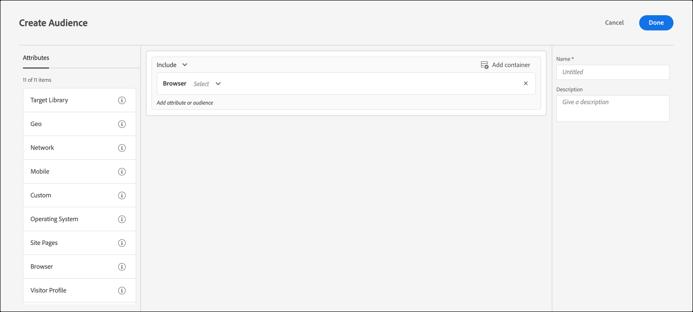

# 浏览器

您可以定位使用特定浏览器或特定浏览器选项访问您的页面的用户。

可以定位以下浏览器：

* Chrome
* Firefox
* Safari
* Internet Explorer
* Microsoft Edge
* Opera
* iPad
* iPhone

>[!IMPORTANT]
>
>从2024年4月30日开始，iPad和iPhone将从以下可用中删除： [!UICONTROL 浏览器] 为受众创建类别时，键入/下拉列表。 有关解决方法设置，请参阅 [从“浏览器”受众属性弃用iPad和iPhone （2024年4月30日）](#deprecation) 下。

定位浏览器的方式有两种：

* **预先构建的受众：**&#x200B;如果您希望仅定位使用特定浏览器访问您的网站的访客，请使用预先构建的受众。例如，如果您提供的产品是 Chrome 扩展，您将仅定位 Chrome 用户。

   1. 设置活动时，从下拉列表中选择浏览器。

      此选项可将活动仅定位到使用指定浏览器的访客。

      

* **自定义的浏览器受众规则：** 通过自定义受众，您可以定位多个浏览器，或者为特定浏览器、浏览器版本或浏览器语言设置规则或排除项。 根据浏览器属性定位活动时，此功能可提供极大的灵活性。

   1. 在 [!DNL Target] 界面，单击 **[!UICONTROL 受众]** > **[!UICONTROL 创建受众]**.
   1. 命名受众并添加可选描述。
   1. 拖放 **[!UICONTROL 浏览器]** 放入受众生成器中。

      

   1. 单击&#x200B;**[!UICONTROL 选择]**，然后选择以下选项之一：

      * **类型：**&#x200B;定位或排除特定浏览器。请参阅[类型](/help/main/c-target/c-audiences/c-target-rules/browser.md#section_6ADC758F23F145B3A310151546D83D56)。
      * **语言：** 定位或排除设置为使用特定语言的特定浏览器。 请参阅[语言](/help/main/c-target/c-audiences/c-target-rules/browser.md#section_7520D1AA464A45A6843EABE2D2B431A1)。
      * **版本：**&#x200B;定位或排除特定浏览器版本。请参阅[版本](/help/main/c-target/c-audiences/c-target-rules/browser.md#section_37CC8CE45DA04E8682AE6388321BA6EF)。

   1. （可选）为受众设置其他规则。
   1. 单击&#x200B;**[!UICONTROL 完成]**。

  以下示例显示了一个受众，其中包含版本91或92上的Microsoft Edge用户：

  

## 浏览器选项 {#concept_221D8EEF53CC45AEACEB17CF336A3658}

根据浏览器的类型、语言或版本，定位或排除活动参加者。

### 类型 {#section_6ADC758F23F145B3A310151546D83D56}

定位或排除特定浏览器。

选择&#x200B;**[!UICONTROL 类型]**，然后选择“等于”或“不等于”。

* “等于”：定位选定的浏览器。
* “不等于”：排除选定的浏览器。

选择一种或多种浏览器。多个选项之间使用 OR 进行连接。

### 语言 {#section_7520D1AA464A45A6843EABE2D2B431A1}

定位或排除设置为使用特定语言的特定浏览器。

例如，如果某个选件只有英语版，则您可以定位将语言设置为英语的浏览器。或者，如果您的页面未启用双字节，则您可以排除设置为使用东亚语言的浏览器。

在语言比位置更为重要的情况下，包含或排除浏览器语言与根据地域进行定位相比，前者可以实现更准确的访客定位。例如，如果您提供的是一篇英语文章，您既可以定位讲英语的国家/地区，也可以定位设置为英语的浏览器。不过，使用后者，您还可以将这篇文章提供给来自主要语言并不是英语的国家/地区、但却会讲英语的用户。

选择&#x200B;**[!UICONTROL 语言]**，然后选择“等于”或“不等于”。

* “等于”：定位选定的浏览器语言。
* “不等于”：排除选定的浏览器语言。

选择一种或多种浏览器语言。多个选项之间使用 OR 进行连接。

可以定位或排除以下浏览器语言：

* 英语
* 法语
* 德语
* 日语
* 韩语
* 葡萄牙语
* 俄语
* 西班牙语
* 繁体中文

### 版本 {#section_37CC8CE45DA04E8682AE6388321BA6EF}

定位或排除特定浏览器版本。

例如，如果您的页面无法在 Internet Explorer 11 或更低版本中正常显示，则您可以创建排除这些版本的受众。在这种情况下，您需要先设置“浏览器类型等于 Internet Explorer”的规则，然后再添加“版本低于或等于 11”的规则。

选择&#x200B;**[!UICONTROL 版本]**，然后选择运算符：

* 等于
* 不等于
* 高于
* 高于或等于
* 低于
* 低于或等于

键入版本号。 在文本字段中只能输入主要版本。指定的版本包括该版本的任何次要版本。例如，如果您指定版本10，则还包括版本10.1上的访客。

多个选项之间使用 OR 进行连接。

## 培训视频：创建受众 

以下视频包含有关使用受众类别的信息。

* 创建受众
* 定义受众类别

>[!VIDEO](https://video.tv.adobe.com/v/17392)

## 从浏览器受众属性中弃用 iPad 和 iPhone（2024 年 4 月 30 日） {#deprecation}

[!DNL Adobe Target] 允许您 [定位多个类别属性中的任意一个](/help/main/c-target/c-audiences/c-target-rules/target-rules.md)，包括在访问您的页面时使用特定浏览器或浏览器选项的用户。

从2024年4月30日开始，iPad和iPhone将从以下可用中删除： [!UICONTROL 浏览器] 为受众创建类别时，键入/下拉列表。

如果您有受众使用[!UICONTROL 浏览器]属性将 iPad 或 iPhone 作为目标，则您必须在 2024 年 4 月 30 日之前更改这些设置以确保这些受众继续发挥预期的作用。

以后可以使用以下设置：

* **对于浏览器匹配项[!DNL Apple]**： [!UICONTROL 移动设备] > [!UICONTROL 设备供应商] [!UICONTROL 匹配] [!DNL Apple]

  

* **对于浏览器匹配平板电脑**： [!UICONTROL 移动设备] > [!UICONTROL 是平板电脑] > [!UICONTROL true]

  

* **对于浏览器匹配iPad**： [!UICONTROL 移动设备] > [!UICONTROL 设备营销名称] [!UICONTROL 匹配] [!DNL iPad] 包含And容器 [!UICONTROL 移动设备] > [!UICONTROL 是平板电脑] 是 [!DNL true]

  

* **对于浏览器匹配iPhone**： [!UICONTROL 移动设备] > [!UICONTROL 设备营销名称] [!UICONTROL 匹配] [!DNL iPhone] 包含And容器 [!UICONTROL 移动设备] > [!UICONTROL 是手机] 是 [!DNL true]

  

还可以使用许多其他可能的设置，例如，当条件被否定时。 否定条件的示例可能如下所示：

* **For浏览器与iPhone不匹配**： [!UICONTROL 移动设备] > [!UICONTROL 设备供应商] [!UICONTROL 不匹配] [!UICONTROL Apple] 包含Or容器 [!UICONTROL 移动设备] > [!UICONTROL 是手机] 是 [!UICONTROL false]

  

* **For浏览器与iPad不匹配**： [!UICONTROL 移动设备] > [!UICONTROL 设备供应商] [!UICONTROL 不匹配] [!UICONTROL Apple] 包含Or容器 [!UICONTROL 移动设备] > [!UICONTROL 是平板电脑] 是 [!UICONTROL false].

  

如果您使用 `user.browserType` 在JavaScript区段中，更改应包括以下内容：

>[!NOTE]
>
>以下添加预计于2024年1月24日发布。 这些添加使以下更改成为可能：
>
>* `profile.mobile.isTablet`
>
>* `profile.mobile.isMobilePhone`

* **BrowserType是iPhone**：

  替换：

  `user.browserType=="iphone"`

  替换为：

  `profile.mobile.deviceVendor == "Apple" && profile.mobile.isMobilePhone`

* **BrowserType不是iPhone**：

  替换：

  `user.browserType!="iphone"`

  替换为：

  `profile.mobile.deviceVendor != "Apple" || !profile.mobile.isMobilePhone`

* **BrowserType是iPad**：

  替换：

  `user.browserType=="ipad"`

  替换为：

  `profile.mobile.deviceVendor == "Apple" && profile.mobile.isTablet`

* **BrowserType不是iPad**：

  替换：

  `user.browserType!="ipad"`

  替换为：

  `profile.mobile.deviceVendor != "Apple" || !profile.mobile.isTablet`