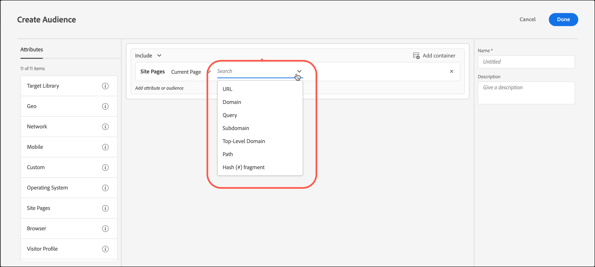

# 网站页面

您可以通过以下方式定位访客： [!DNL Adobe Target] 访问您网站上的特定页面的用户。

1. 在 [!DNL Target] 界面中，单击&#x200B;**[!UICONTROL 受众]** > **[!UICONTROL 创建受众]**。
1. 为受众命名并添加可选描述。
1. 拖放 **[!UICONTROL 网页]** 放入受众生成器窗格。

   

1. 单击 **[!UICONTROL 选择]** 从下拉列表中，选择以下选项之一，然后根据需要配置规则。

   根据您选择的选项，规则中后续下拉列表中的可用选项和计算器会有所不同。 下图显示了在您选择时可用的选项 [!UICONTROL 当前页面]：

   

   当您选择时，以下选项在初始下拉列表中可用 [!UICONTROL 选择].

   * **[!UICONTROL 当前页面]：** 用户正在查看的页面。

      如果选择此选项，则可在第二个下拉列表中找到以下选项：

      * [!UICONTROL URL] (有关以下内容的更多信息： [!DNL Target] 评估URL，请参见 [定位和受众常见问题解答](/help/main/c-target/c-troubleshooting-targets-and-audiences/troubleshooting-targets-and-audiences.md).)
      * [!UICONTROL 域名]
      * [!UICONTROL 查询]
      * [!UICONTROL 子域]
      * [!UICONTROL 顶级域]
      * [!UICONTROL 路径]
      * [!UICONTROL 哈希 (#) 碎片]
   * **[!UICONTROL 上一页]：** 用户在单击到当前页面之前查看的页面。 用户必须从上一页单击到当前页，才能跟踪该页。 如果用户在浏览器中键入新URL，则不会跟踪上一页。 该页的实际内容取决于网站设计。例如，如果当前页面显示有关特定产品的信息，则上一页可能是访客在其中选择特定项目的类别页面。 例如，显示某种类型多个摄像头的页面，或者可能是指向最终页面的主页。

      如果选择此选项，则可在第二个下拉列表中找到以下选项：

      * [!UICONTROL URL] (有关Target如何评估URL的更多信息，请参阅 [定位和受众常见问题解答](/help/main/c-target/c-troubleshooting-targets-and-audiences/troubleshooting-targets-and-audiences.md).)
      * [!UICONTROL 域名]
      * [!UICONTROL 查询]
      * [!UICONTROL 子域]
      * [!UICONTROL 顶级域]
      * [!UICONTROL 路径]
   * **登陆页面：**&#x200B;登陆页面指访客访问您的网站时看到的第一个页面。例如，如果访客点击了 Google 上的某个通往类别页面的链接，则该类别页面即登陆页面。如果链接通往主页，该主页为登录页。访客会话将记住登录页。您可以根据该会话中访客的登录页向网站的更深层次定位。

      如果选择此选项，则可在第二个下拉列表中找到以下选项：

      * [!UICONTROL URL] (有关Target如何评估URL的更多信息，请参阅 [定位和受众常见问题解答](/help/main/c-target/c-troubleshooting-targets-and-audiences/troubleshooting-targets-and-audiences.md).)
      * [!UICONTROL 域名]
      * [!UICONTROL 查询]
      * [!UICONTROL 子域]
      * [!UICONTROL 顶级域]
      * [!UICONTROL 路径]
      * [!UICONTROL 哈希 (#) 碎片]

      >[!NOTE]
      >
      >`landing.url` 对象会在更改子域或直接替换 URL 时重置。

   * **[!UICONTROL HTTP标头]：** 此选项评估的HTTP标头中的信息 [!DNL Target] 请求。 例如，如果HTTP标头包含语言信息，则可以创建一个规则，其中包含 `Accept-Language: es` 以西班牙语访问页面的目标访客的条件。

      如果选择此选项，则可在第二个下拉列表中找到以下选项：

      * [!UICONTROL Accept]
      * [!UICONTROL Accept-Charset]
      * [!UICONTROL Accept-Encoding]
      * [!UICONTROL Accept-Language]
      * [!UICONTROL 授权]
      * [!UICONTROL Cache-Control]
      * [!UICONTROL 连接]
      * [!UICONTROL Content-Length]
      * [!UICONTROL Content-MDS]
      * [!UICONTROL Content-Type]
      * [!UICONTROL 日期]
      * [!UICONTROL Expect]
      * [!UICONTROL 从]
      * [!UICONTROL 主机]
      * [!UICONTROL If-Match]
      * [!UICONTROL If-Modified-Since]
      * [!UICONTROL If-None-Match]
      * [!UICONTROL If-Range]
      * [!UICONTROL If-Unmodified-Since]
      * [!UICONTROL Max-Forwards]
      * [!UICONTROL Pragma]
      * [!UICONTROL 代理授权]
      * [!UICONTROL 范围]
      * [!UICONTROL Referrer]
      * [!UICONTROL TE]
      * [!UICONTROL 升级]
      * [!UICONTROL User-Agent]
      * [!UICONTROL Via]
      * [!UICONTROL 警告]

   如果您选择 [!UICONTROL 当前页面]， [!UICONTROL 上一页]，或 [!UICONTROL 登陆页面]，则 [!UICONTROL 域] 和 [!UICONTROL 查询] 选项可用。 选择这些选项时，请考虑以下事项：

   * **域：**&#x200B;页面的完整域。指定域时，最佳做法是使用“包含”。例如，“域等于facebook.com”不接受 `m.facebook.com` 或 `www.facebook.com`. “域包含facebook.com”接受facebook.com的任何变体。
   * **查询：** URL 中第一个问号 (?) 后面的内容。

      `foo.html?e0a72cb2a2c7`

1. （可选）为受众设置其他规则。
1. 单击&#x200B;**[!UICONTROL 完成]**。

您还可以使用自己的“用户定义的查询参数”或“用户定义的标头”来创建网站页面受众。

使用：

* 查询参数(如果用户选择的规则为 [!UICONTROL 当前页面]， [!UICONTROL 登陆页面]，或 [!UICONTROL 上一页]
* 标头（如果用户选择的规则是HTTP标头）

## 故障排除 {#ts}

* 要使登陆页面受众正常运行，请求必须具有 `mboxReferrer` 参数集(对于投放API， `context.address.referringUrl` 参数)，at.js JavaScript库使用以下函数从页面中获取的参数： `document.referrer` 属性。 此 `HTMLDocument` 属性返回用户从中导航的页面的URI。 当用户直接导航到页面时（不是通过链接，而是例如，通过书签），此属性的值是一个空字符串。

   如果此行为不符合您的要求，请考虑执行以下操作之一：

   * 通过 [mbox参数](https://experienceleague.corp.adobe.com/docs/target-dev/developer/client-side/global-mbox/pass-parameters-to-global-mbox.html){target=_blank} 到 [!DNL Target] 用于定位目的。
   * 使用 [A/B测试活动](/help/main/c-activities/t-test-ab/test-ab.md) 而不是登陆页面活动。 A/B测试活动不会切换同一访客的体验。
   * 使用 [访客资料](/help/main/c-target/c-audiences/c-target-rules/visitor-profile.md) 而是。

* 对包含逗号的字符串使用“starts/ends with”计算器时，这些字符串会作为值的数组来计算，其中每个值都用逗号分隔。 例如，如果您有标题的值： `Accept-Language: en,zh;q=0.9,en-IN;q=0.8,zh-CN;q=0.7` 它符合以下条件：
   * 从zh开始，
   * 以en开头，
   * 以0.7结尾，
   * 结尾是0.8。

## 培训视频：创建受众

以下视频包含有关使用受众类别的信息。

* 创建受众
* 定义受众类别

>[!VIDEO](https://video.tv.adobe.com/v/17392)
