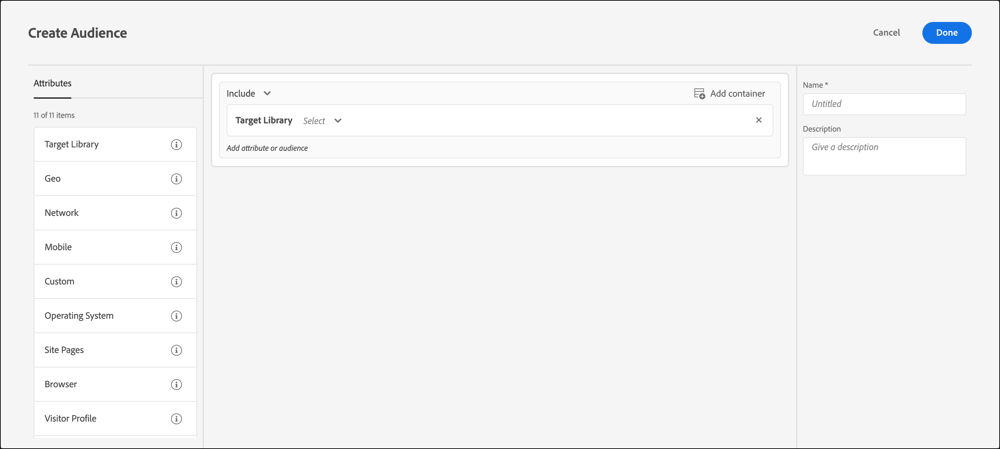

# 定位库

使用 [!DNL Adobe Target] 基于预建定位规则定位用户。

中的预建受众 [!UICONTROL Target库] 类别是旧版受众，存在于其他类别中。 有关更多信息和最佳实践，请参阅 [定位和受众常见问题解答](/help/main/c-target/c-troubleshooting-targets-and-audiences/troubleshooting-targets-and-audiences.md#concept_C4EE4B8F4840430CBD798D579A8F208D).

1. 在 [!DNL Target] 界面中，单击&#x200B;**[!UICONTROL 受众]** > **[!UICONTROL 创建受众]**。
1. 为受众命名并添加可选描述。
1. 拖放 **[!UICONTROL Target库]** 放入受众生成器窗格。

   

1. 单击&#x200B;**[!UICONTROL 选择]**，然后选择一个预先构建的定位规则。

   预建定位规则包括， [!UICONTROL Windows操作系统]， [!UICONTROL 平板电脑设备]， [!UICONTROL Safari浏览器]， [!UICONTROL 旧访客]， [!UICONTROL 反向链接来自Google]，等等。

   预定义受众»[!UICONTROL 平板电脑设备]”在用户代理包含以下字符串之一（其中一些是设备的型号）时已经符合条件。 您不必为这些设备创建自定义定位规则。

   Kindle、Silk、iPad、Sony Tablet、TF101、GT-P1000、GT-P1000R、GT-P1000M、SGH-T849、SHW-M180S、GT-I9000T、BNTV250 和 Tablet PC。

1. （可选）为受众设置其他规则。
1. 单击&#x200B;**[!UICONTROL 完成]**。

## 培训视频：创建受众

以下视频包含有关使用受众类别的信息。

* 创建受众
* 定义受众类别

>[!VIDEO](https://video.tv.adobe.com/v/17392)
