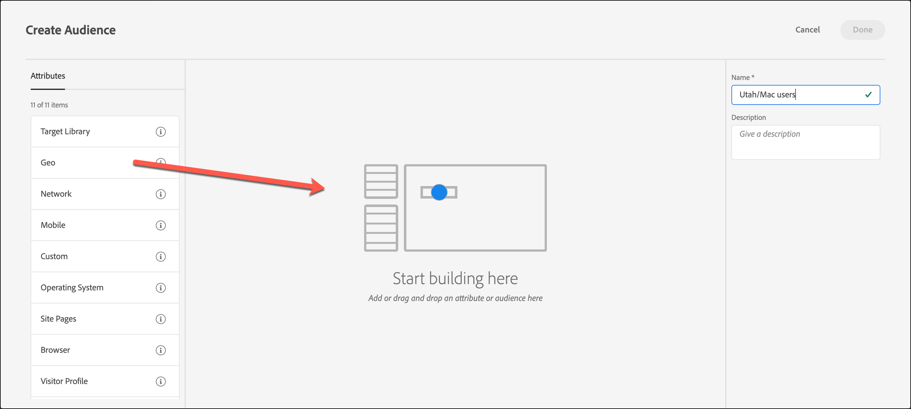

# 在[!DNL Target]中生成受众

创建自定义受众并将它们保存到[!DNL Adobe Target] [!UICONTROL Audiences]库以供您的活动使用。 您还可以复制现有受众，然后对其进行编辑以创建类似受众并合并多个受众。

## 受众概述

受众由确定在 [!DNL Target] 活动中包含或排除哪些访客的规则来定义。一个受众定义可以包含多个规则，而每个规则可以包含多个参数。复杂的受众定义使用布尔运算符 AND 和 OR 来连接多个规则和参数，从而允许您精确地控制将哪些网站访客计为活动参加者。

将规则或参数与AND结合时，任何可能的受众成员都必须满足&#x200B;*所有*&#x200B;定义的条件才能作为参加者包含在内。 例如，如果您定义了一个操作系统规则和一个浏览器规则，并使用 AND 连接这两个规则，则只能将同时使用了定义的操作系统“和”**&#x200B;定义的浏览器的访客包含在活动中。

如果使用 OR 连接规则或参数，则任何潜在的受众成员只需满足任一定义条件，即可将其作为参加者包含在内。例如，如果您定义了多个移动设备规则，并使用 OR 连接这些规则，则会将满足“任一”**&#x200B;定义标准的访客包含在活动中。

您可以将两种布尔运算符混合使用来创建复杂的规则；但是，同一规则级别的运算符必须一致。用户界面会自动应用正确的运算符。

例如，以下规则可定位在[!DNL Chrome]计算机上使用&#x200B;**&#x200B;或[!DNL Firefox] [!DNL Windows]的访客：

>[!NOTE]
>
>务必要避免创建会将所有潜在受众成员都排除在外的规则。例如，某个人不可能同时使用[!DNL Chrome] *和* [!DNL Firefox]来访问页面。

## 创建受众

1. 单击顶部菜单栏中的&#x200B;**[!UICONTROL Audiences]**。

   

1. 从[!UICONTROL Audiences]列表中，单击&#x200B;**[!UICONTROL Create Audience]**。

   或

   要复制现有受众，请从[!UICONTROL Audiences]列表中单击要复制的受众的&#x200B;**[!UICONTROL More Actions]**&#x200B;图标（），然后单击&#x200B;**[!UICONTROL Duplicate]**。 然后，您可以对受众进行编辑以创建一个类似的受众。

1. 键入唯一的描述性受众名称和可选描述。

   受众名称不能以下列字符开头：

   `=  +  -  !  @`

   受众名称不能包含以下任何字符序列：

   `;=  ;+  ;-  ;@  ,=  ,+  ,-  ,@  ["  "]  ['  ]'`

1. 将所需属性从左侧的&#x200B;**[!UICONTROL Attributes]**&#x200B;列表中拖放到受众生成器窗格。

   

   每种规则类型都有其自身的参数。请参阅[受众类别](/help/main/c-target/c-audiences/c-target-rules/target-rules.md#concept_E3A77E42F1644503A829B5107B20880D)，以详细了解如何配置每种类型的受众规则。

1. 定义规则参数。

   例如，以下受众使用[!DNL Macintosh]操作系统定位来自犹他州的访客。

   

1. （视情况而定）继续添加和定义所需属性。

   要创建另一个容器，请单击&#x200B;**[!UICONTROL Add container]**，或者只需将另一个属性拖入受众生成器窗格。 然后，您可以使用下拉列表调整运算符（AND或OR）。

1. 单击 **[!UICONTROL Done]**。

   新创建的受众需经过几秒钟的处理后才会显示在列表中。如果受众未立即显示在列表中，请尝试搜索该受众或刷新列表。

## 培训视频：创建受众

以下视频包含有关创建受众的信息。

* 创建受众
* 定义受众类别

>[!VIDEO](https://video.tv.adobe.com/v/17392)
