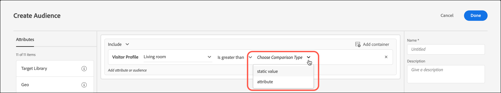

# 创建轮廓属性比较受众

在[!DNL Adobe Target]中定义受众以比较[受众库](/help/main/c-target/c-audiences/audiences.md)或[仅限该活动的受众](/help/main/c-target/creating-activity-only-audience.md)的两个配置文件属性。 使用诸如大于、小于或等于的运算符来定义受众，以动态比较两个不同轮廓属性的值。

>[!NOTE]
>
>此功能仅适用于[[!UICONTROL 访客配置文件]](/help/main/c-target/c-audiences/c-target-rules/visitor-profile.md#concept_E972690B9A4C4372A34229FA37EDA38E)类别。

## 概述 {#section_303CBC78194D49A2A004945D425441E1}

受众由确定在 [!DNL Target] 活动中包含或排除哪些访客的规则来定义。 一个受众定义可以包含多个规则，而每个规则可以包含多个参数。 如果包含的规则之一使用[!UICONTROL 访客配置文件]类别，则可以根据访客配置文件属性的特定值定义规则，或将该属性的值与另一个访客配置文件属性进行比较。

例如，假设您在一家家具公司工作，并将两个客户倾向得分上传到[!DNL Target]：

* 在接下来的 90 天内购买餐厅家具的可能性
* 在接下来的 90 天内购买客厅家具的可能性

您可以创建一个受众，将其定义为购买餐厅家具的倾向大于购买客厅家具的倾向。 然后，[!DNL Target]将动态比较特定访客的餐厅和起居室的倾向分数，以确定该访客是否符合该受众的条件。

有关更多信息，请参阅[将数据导入 Target 的方法](https://experienceleague.adobe.com/docs/target-dev/developer/implementation/methods/methods-to-get-data-into-target.html){target=_blank}。

## 创建轮廓属性比较受众 {#section_7A62FD47D5C74C3EBC3417ACDBB85013}

1. 单击&#x200B;**[!UICONTROL 受众]** > **[!UICONTROL 创建受众]**。
1. 命名受众并添加可选描述。
1. 将&#x200B;**[!UICONTROL 访客配置文件]**&#x200B;拖放到受众生成器窗格中。
1. 从&#x200B;**[!UICONTROL 访客配置文件]**&#x200B;下拉列表中选择一个属性：

   

1. 选择您的计算器：

   

1. 从&#x200B;**[!UICONTROL 选择比较类型]**&#x200B;下拉列表中选择&#x200B;**[!UICONTROL 属性]**。

   “静态值”比较类型允许您将访客配置文件属性与特定值进行比较。

   

   >[!NOTE]
   >
   >如果您使用其中一个默认访客配置文件类别（例如，“新访客”或“回访访客”），则只能选择静态值选项。 动态比较选项不适用于默认类别。 不能使用动态比较选项的其他示例包括“会话首页”、“不在其他测试中”、“不是会话首页”和“类别亲和度”。

1. 选择要与初始属性进行比较的其他属性。

   

1. 单击&#x200B;**[!UICONTROL 完成]**。

## 培训视频 {#section_3BB8DBF3418F4520B3E274B6F40AF8F3}

请观看以下视频，了解更多信息以及可使用此功能的情景：

>[!VIDEO](https://video.tv.adobe.com/v/23218/)
