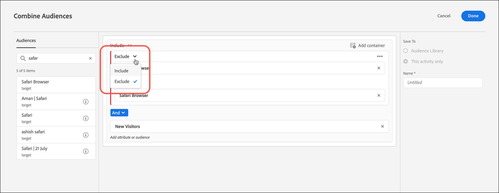

# 合并多个受众

动态合并多个受众（包括[!DNL Adobe Experience Cloud]、[!DNL Adobe Experience Platform]和[!DNL Target]受众）以创建临时受众。 您也可以创建排除规则，从某个规则中排除相应受众。

>[!NOTE]
>
>使用[!DNL Adobe Experience Platform]Adobe Experience Platform Web SDK[!DNL Target]的所有[客户都可以使用](https://experienceleague.adobe.com/docs/target-dev/developer/client-side/aep-web-sdk.html?lang=en){target=_blank}源。 [!DNL Adobe Experience Platform]中可用的受众可以按原样使用，也可以与现有受众结合使用，如本主题中所述。
>
>有关详细信息，请参阅[使用来自Adobe Experience Platform的受众](/help/main/c-target/c-audiences/audiences.md#aep)。

假设您有两个受众：“新访客”和“Chrome 用户”。在某个特定活动中，您可能想要合并这两个现有受众，以定位使用 Chrome 浏览器的新访客。您可以在活动创建期间或编辑现有活动时组合这两个受众，而不是创建第三个受众并将其存储在[!UICONTROL Audiences]库中。

再比如，您可以定位所有忠诚客户。 例如，您可以包含忠诚度状态的特定[!DNL Audience Manager]受众，并将其与一个由在当前会话中注册了忠诚度计划的用户组成的[!DNL Target]受众合并。 将这两个受众结合起来比创建第三个永久受众更容易。

您最多可以使用AND和OR运算符组合20个受众。

您可以在 [!DNL Target] UI 中的多个位置创建并使用组合受众。

## 创建活动时创建组合受众 {#section_2F1CE9434CC04174B4BA2BFC89B85D77}

在三步引导式工作流中，您可以在活动的[!UICONTROL Target]页面上创建临时组合受众。

1. 创建[活动](/help/main/c-activities/activities.md#concept_D317A95A1AB54674BA7AB65C7985BA03)时，在&#x200B;**[!UICONTROL Targeting]**&#x200B;页面上单击三个垂直省略号，然后单击&#x200B;**[!UICONTROL Replace Audience]**。

   

1. 在&#x200B;**[!UICONTROL Choose Audience]**&#x200B;页面上，选中要用作组合受众构建基块的所需受众旁边的复选框。

   使用[!UICONTROL Search Audiences]框缩小所需受众的搜索范围。

   

1. 单击右上角的&#x200B;**[!UICONTROL Combine Multiple Audiences]**。

   

1. （可选）根据需要编辑新创建的组合受众。

   通过[!UICONTROL Edit Audience]对话框，您可以将左侧的其他受众构建块拖放到新的组合受众中。 您还可以添加排除规则和排除受众。

   1. 使用拖放功能将现有部分中的受众添加为第2级构建基块。

      例如，假设您现在想要将 Safari 用户添加到上一示例的组合受众中。为此，可搜索“Safari 浏览器”受众，并将其拖到右侧的“Firefox 浏览器”框中，如以下示例所示：

      

      请注意，这两个基于浏览器类型的受众之间使用的运算符为“与”。选择[!UICONTROL And]下拉列表并将其更改为“或”，以便为使用Firefox或Safari的新访客创建新的组合受众。 务必要避免创建会将所有潜在受众成员都排除在外的规则。例如，某个人不可能同时使用 Firefox 和 Safari 访问页面。

      >[!NOTE]
      >
      >合并受众时，使用的运算符（“与”或“或”）必须保持相同。运算符不能混搭使用。

   1. 要将排除项添加到规则，请单击&#x200B;**[!UICONTROL Exclude]**。

      

      拖放受众。

      例如，要从新访客中排除美国访客，您可以将“市场：美国”受众拖到框中。

      由此形成的组合受众将包含使用 Safari 或 Firefox 访问您网站的所有新访客（旧金山访客除外）。

   1. 要从规则中排除受众，请单击&#x200B;**[!UICONTROL Exclusion]** > **[!UICONTROL Exclude this Audience.]**。

      例如，您可以创建一个组合受众，以包含使用 Firefox 以外的其他所有浏览器访问您网站的所有新访客。与创建一个明确包含各种浏览器（Safari、Chrome 和 Internet Explorer）用户但不包含 Firefox 用户的组合受众相比，排除使用 Firefox 的访客要更加简单快速。

1. 为组合受众提供一个描述性名称，然后单击&#x200B;**[!UICONTROL Done]**。

## 创建用于量度定位的组合受众 {#section_A42E795AFCBD4575809C5942039910F0}

您可以在活动的[!UICONTROL Goals & Settings]页面上创建一个临时组合受众，以用于量度定位。 例如，可以使用组合受众创建基于转化的定位：

1. 编辑或创建[活动](/help/main/c-activities/activities.md#concept_D317A95A1AB54674BA7AB65C7985BA03)时，在&#x200B;**[!UICONTROL Goals & Settings]**&#x200B;页面上，为成功量度选择&#x200B;**[!UICONTROL Conversion]**，然后选择&#x200B;**[!UICONTROL Viewed an Mbox]**&#x200B;作为操作。
1. 在&#x200B;**[!UICONTROL Search mbox]**&#x200B;字段中选择所需的mbox。

   

1. 单击齿轮图标，然后单击&#x200B;**[!UICONTROL Add Audience Targeting]**。
1. 单击&#x200B;**[!UICONTROL Add Audience/Targeting Condition]**&#x200B;链接以显示[!UICONTROL Choose Audience]对话框。

   

1. 执行“创建活动时创建组合受众”中的[步骤 2](/help/main/c-target/combining-multiple-audiences.md#section_2F1CE9434CC04174B4BA2BFC89B85D77)，以创建组合受众。

## 创建用于报表的组合受众 {#section_4682D342EFBB43C38E54B99B3A1E14CD}

您可以在活动的[!UICONTROL Goals & Settings]页面上创建一个临时组合受众，以在报告中使用。

1. 编辑或创建[活动](/help/main/c-activities/activities.md#concept_D317A95A1AB54674BA7AB65C7985BA03)时，在&#x200B;**[!UICONTROL Goals & Settings]**&#x200B;页面上，单击&#x200B;**[!UICONTROL Add Audience]**&#x200B;下的[!UICONTROL Audiences for Reporting]图标以显示[!UICONTROL Choose Audience]页面。

   

1. 执行“创建活动时创建组合受众”中的[步骤 2](/help/main/c-target/combining-multiple-audiences.md#section_2F1CE9434CC04174B4BA2BFC89B85D77)，以创建组合受众。

## 编辑活动时创建组合受众 {#section_364A12CE96E04B61B7C18113AA586C2C}

您可以在编辑现有活动时创建临时组合受众。

1. 在[!UICONTROL Activities]页面中，将鼠标悬停在所需活动上，然后单击&#x200B;**[!UICONTROL Edit]**&#x200B;图标。

   或

   单击所需活动以将其打开，然后单击&#x200B;**[!UICONTROL Edit Activity]**。

1. 单击&#x200B;**[!UICONTROL Configure]** > **[!UICONTROL Audiences]** > **[!UICONTROL Multiple Audiences]**。

   

1. 单击活动的当前受众旁边的更多选项图标（三个垂直省略号），然后单击&#x200B;**[!UICONTROL Change Audience]**。

   

1. 执行“创建活动时创建组合受众”中的[步骤 2](/help/main/c-target/combining-multiple-audiences.md#section_2F1CE9434CC04174B4BA2BFC89B85D77)，以创建组合受众。
