# 以前版本的发行说明{#release-notes-for-previous-releases}

以前 Target 版本的发行说明，包括 Target Standard/Premium 的发行说明、Target 平台以及 Target Javascript 库（at.js 和 mbox.js）。发行说明按发布年月按降序排列。

>[!NOTE]
>
>请参阅 [Target 发行说明（当前版本）](../r-release-notes/release-notes.md#reference_8FE40B43A5A34DDF8F26A53D55EE036A)，以了解有关当月 Target 发行版本（平台和 Target Standard/Premium）的信息。

## 发行说明 - 2019 {#releases-2019}

### Target Standard/Premium 19.9.1（2019 年 9 月 10 日） 

| 功能/增强 | 描述 |
| --- | --- |
|  Enterprise权限 | 在Target 2019年9月版本中，企业权限为客户提供了以下访问控制：<UL><li>You can choose the workspaces to which the integration can be applied.</li><li>您可以将角色应用于Adobe I/O集成：批准者、编辑者或观察者。</li></ul>有关分步说明和更多信息，请参阅授 [予Adobe I/O集成对工作区的访问权限并分配角色](/help/administrating-target/c-user-management/property-channel/configure-adobe-io-integration.md)。 |


### Target Mobile VEC SDK iOS 2.1.0 &amp; Android 1.1.1（2019年8月7日）

此版本的Mobile VEC SDK包含以下增强和修复：

（括号中的问题编号供 Adobe 内部使用。）

* 增加了对移动设备上的“预览可视活动”的支持。 (TGT-27875)
* 修复了由于使用而导致Apple Standard违规的 `UIImagePickerController` 问题。
* 从Android SDK中删除了GSON依赖性。 (TGT-31710)
* 删除了其他冗余Gradle依赖关系(TGT-35479)
* 修复了在创作时无法重置交付选件的问题。 (TGT-35270)

### Target Standard/Premium 19.7.1（2019 年 7 月 24 日）{#tgt-19-7-1}

此版本包括以下新增功能和增强功能：

（括号中的问题编号供 Adobe 内部使用。）

| 功能/增强 | 描述 |
| --- | --- |
| 移动设备应用程序可视化体验编辑器 | 移动设备应用程序 VEC 中将显示一个新的“修改”面板，该面板可显示您为点击跟踪设置的各个元素。(TGT-31741)<br> 请参 [阅在移动应用程序中设置单击跟踪](/help/c-target-mobile-app/c-mobile-visual-experience-composer/set-up-click-tracking-in-the-mobile-vec.md)。 |
| <br>A/B 测试和体验定位 (XT) 活动中的推荐 | 推荐选件（算法）状态将显示在包含推荐选件的 A/B 测试和 XT 活动的“概述”页面上。状态包括：“结果已准备就绪”、“结果未准备就绪”和“信息源故障”。(TGT-33649)<br>请参阅[“推荐”作为选件](/help/c-recommendations/recommendations-as-an-offer.md#status)。 |
| at.js 2.0 及更高版本通过 Experience Cloud ID (ECID) 库支持跨域跟踪 | 以前，at.js 2.*x* 不支持跨域跟踪。现在，在此版本中，使用 at.js 2.0 或更高版本的客户可以通过 ECID 库执行跨域跟踪。为使跨域跟踪正常运行，必须将 ECID 库与 at.js 2.0 或更高版本一起安装在页面上。[必须使用Experience Cloud ID库4.3.0+](https://docs.adobe.com/content/help/en/id-service/using/release-notes/release-notes.html) 。<br>请参 [阅at.js 2.x中的跨域跟踪支持](/help/c-implementing-target/c-implementing-target-for-client-side-web/upgrading-from-atjs-1x-to-atjs-20.md#cross-domain)。 |
| Target 通过 Experience Cloud ID (ECID) 库 4.3 支持 Apple 的 ITP 2.1 和 ITP 2.2 | 现在，Target 客户可以通过利用 Adobe 的 CNAME 认证计划来应对 Apple 的 ITP 2.1 和 ITP 2.2。<br>在此版本中，Target引入了与ECID库4.3的无缝集成，该库利用服务器端Cookie来减轻ITP 2.1和ITP 2.2的影响。强烈建议Target客户将 [ECID库4.3+与Target的JavaScript库一起部署](https://docs.adobe.com/content/help/en/id-service/using/release-notes/release-notes.html) ，以减轻任何未来ITP版本的影响。 ECID 库将持续增强，针对各浏览器推出的不断变化的 Cookie 策略提供完善的解决方案。<br>请参 [阅Apple Intelligent Tracking Prevention(ITP)2.x](/help/c-implementing-target/c-considerations-before-you-implement-target/c-privacy/apple-itp-2x.md)。 |

**增强功能、修复和更改**

* 修复了在添加重复值时无法清除Recommendations活动中的排除值的问题。 (TGT-34996)
* 您现在可以从定位页面中删除推荐活动中的设计（三部分指导式工作流的步骤2）。 请注意，要删除设计，必须选择多个设计。 (TGT-35118)
* Fixed an issue that prevented custom criteria cards for some customers to load properly in the Target UI or to be editable. (TGT-35170)

### at.js version 2.1.1 (July 24, 2019)

此版本的at.js是维护版本，包括以下增强和修复：

（括号中的问题编号供 Adobe 内部使用。）

* 修复了在可视体验书写器(VEC)的“目标和设置”页面上使用“单击跟踪”度量时，导致多个信标触发的问题。 (TNT-32812)
* Fixed an issue that caused  to not render offers more than once. `triggerView()`(TNT-32780)
* Fixed an issue with  to ensure that the request contains Marketing Cloud ID (MCID) information. `triggerView()`(TNT-32776)
* Fixed an issue that prevented the `triggerView()` notification to fire even if there are no saved views. (TNT-32614)
* Fixed an issue that caused an error due to the use of decodeURIcomponent that caused issues when the URL contains a malformed query string parameter. (TNT-32710)
* The beacon flag is now set to "true" in the context of delivery requests sent via the  API. `Navigator.sendBeacon()`(TNT-32683)
* Fixed an issue that prevented Recommendations offers from displaying on websites for a few customers. Customers could see the offer content in the delivery API call but the offer was not applied on the website. (TNT-32680)
* Fixed an issue that caused click-tracking across multiple experiences to not work as expected. (TNT-32644)
* Fixed an issue that prevented at.js from applying the second metric after the rendering of the first metric fails. (TNT-32628)
* Fixed an issue when passing  using the  function that caused the request payload to not be present in either the query parameters or in the request payload. `mboxThirdPartyId``targetPageParams`(TNT-32613)
* Fixed an issue that caused display and click notification responses to be blocked in Chromium-based browsers (including Google Chrome). (TNT-32290)

For information about this and previous versions of at.js, see [at.js version details](/help/c-implementing-target/c-implementing-target-for-client-side-web/target-atjs-versions.md).

### Target Standard/Premium 19.6.1（2019 年 6 月 26 日） {#tgt-19-6-1-historical}

此版本包括以下新增功能和增强功能：

（括号中的问题编号供 Adobe 内部使用。）

| 功能/增强 | 描述 |
| --- | --- |
| 可视化体验编辑器 (VEC) | **新 VEC 菜单选项**：单击 VEC 中的某个页面元素时，相应菜单会显示适用于该元素类型的选项。<ul><li>您现在可以使用[!UICONTROL “样式”&gt;“背景”]选项更改选定元素的背景图像和颜色。(TGT-15001)</li></ul>请参阅[可视化体验选项](/help/c-experiences/c-visual-experience-composer/viztarget-options.md#styles)中的“样式”**&#x200B;部分。<br>**点击跟踪改进**：我们改进了在 VEC 和单页应用程序 (SPA) VEC 中配置点击跟踪的过程。<ul><li>当选择要在点击跟踪中使用的元素时，所有可用元素的名称都会显示在右侧的“修改”面板中，从而允许快速、轻松地选择所需元素。</li><li>三步引导式活动工作流中的“[!UICONTROL 目标和设置]”页面上会显示一个数字，用于指示为点击跟踪选择的元素数量。您可以将鼠标悬停在此数字上，以查看所有选定元素的名称。(TGT-33878)</li></ul>请参阅[点击跟踪](/help/c-activities/r-success-metrics/click-tracking.md)。 |
| 单页应用程序可视化体验编辑器 (SPA VEC) | **引导式工作流**：新的引导式工作流可帮助您了解应如何配置页面交付规则设置，以便为单页应用程序成功执行和运行活动。(TGT-33718)<br> 请参阅[单页应用程序 (SPA) 可视化体验编辑器](/help/c-experiences/spa-visual-experience-composer.md#page-delivery-settings)。<br>**克隆修改**：您现在可以使用 SPA VEC 定义修改，然后克隆该修改，以供在单页应用程序内的其他视图中使用。(TGT-33882)<br>请参阅[单页应用程序 (SPA) 可视化体验编辑器](/help/c-experiences/spa-visual-experience-composer.md)。 |
| 移动设备可视化体验编辑器 | **多个应用程序版本**：您现在可以创建活动，以供移动设备应用程序的多个版本使用。如果这些版本很相似，则无需对应用程序 UI 做出重大更改，从而可以节省时间和精力。(TGT-34231)<br>请参阅[移动设备应用程序可视化体验编辑器](/help/c-target-mobile-app/c-mobile-visual-experience-composer/mobile-visual-experience-composer.md#using-the-mobile-vec)中的“管理多个应用程序版本”。 |
|  自动个性化 (AP) 和自动定位 | **将体验指定为控制**：在创建 AP 或自动定位活动时，您可以选择要用作控制的体验。通过此功能，您可以根据活动中配置的流量分配百分比，将整个控制流量路由到特定体验。然后，您可以根据该体验的控制流量评估个性化流量的性能报表。当前控制选项（随机提供的体验）将继续可用。（TGT-32801、TGT-26572 和 TGT-26571）<br>请参阅[选择用于自动个性化或自动定位活动的控制](/help/c-activities/t-automated-personalization/experience-as-control.md)。请注意，此功能当前存在一个[已知问题](/help/r-release-notes/known-issues-resolved-issues.md)。<br>**个性化分析报表**：当访客在特定位置看到特定内容时，对营销人员友好的属性命名可提供更多有意义的信息。（TGT-33421 和 TGT-34957）<br>请参阅[为 Target 个性化算法收集数据](/help/c-activities/t-automated-personalization/ap-data.md)。 |
|  推荐 | 在创建“最近查看的项目”逻辑时，您可以使用“推荐以前购买的项目”切换。(TGT-34030)<br>有关更多信息，请参阅“创建标准”中的[最近查看的项目](/help/c-recommendations/c-algorithms/create-new-algorithm.md#previously-purchased)。 |
| Google Chrome SameSite Cookie 策略 | Google 近日宣布从 Chrome 76（计划于 2019 年 7 月 30 日发布）开始，开发人员必须明确指定哪些 Cookie 可以在各个网站中运行以及哪些 Cookie 可以跟踪用户。<br>当整个行业都在努力为消费者创建更加安全的 Web 时，Target 也不遗余力地为客户提供个性化体验，同时满足甚至超越访客的隐私保护期望。<br>请参阅 [Google Chrome SameSite Cookie 策略](/help/c-implementing-target/c-considerations-before-you-implement-target/c-privacy/google-chrome-samesite-cookie-policies.md)。 |

### at.js 版本 2.1.0（2019 年 6 月 3 日） {#atjs-210}

我们很高兴地宣布，at.js 2.1.0 将推出以下令人振奋的功能：

| 功能/增强 | 描述 |
| --- | --- |
| 支持 Adobe 选择加入 | 通过 Adobe 选择加入，可轻松将 Adobe 解决方案与同意管理平台集成。<br>有关 Adobe 选择加入的更多信息，请参阅[隐私和《通用数据保护条例》(GDPR)](/help/c-implementing-target/c-considerations-before-you-implement-target/c-privacy/cmp-privacy-and-general-data-protection-regulation.md)。 |
| 符合行业标准 CSP | at.js 不再使用 eval() 执行 JavaScript。 |
| 客户端 Analytics 日志记录 | 无论是在客户端还是服务器端，均允许客户完全控制如何将分析数据发送到 Adobe Analytics。<br>有关更多信息，请参阅“实施之前”**&#x200B;中的[客户端 Analytics 日志记录](/help/c-integrating-target-with-mac/a4t/before-implement.md#client-side)。 |
| 发送通知 | 允许开发人员在通过代码而不是使用 `applyOffer()` 或 `applyOffers()` 呈现体验时发送通知。<br>有关更多信息，请参阅 [adobe.target.sendNotifications(options)](/help/c-implementing-target/c-implementing-target-for-client-side-web/adobe.target.sendnotifications-atjs-21.md)。 |
| 减少了文件大小 | at.js 的大小减少了约 24%。较小的文件大小可提高页面加载性能并缩短在页面上下载 at.js 的时间。 |
| at.js 文档更新 | 要获取由于 at.js 2.1.0 的发行而更新的所有文章的完整列表，请参阅[文档更改](/help/r-release-notes/doc-change.md)中时间为 2019 年 6 月 3 日的条目。 |

### [!DNL Target] Standard/Premium 19.5.1（2019 年 5 月 21 日）{#tgt-19-5-1-historical}

（括号中的问题编号供 [!DNL Adobe] 内部使用。）

#### 功能更新

| 功能/增强 | 描述 |
| --- | --- |
| 单页应用程序可视化体验编辑器 (SPA VEC) | SPA VEC 包含以下增强功能，可让您更快捷、更高效地完成工作：<ul><li>单击 SPA 中的某项操作会突出显示将应用此操作的网站上的元素。在“视图”下创建的每个 VEC 操作都有 4 个相应的图标：信息、编辑、移动和删除。借助此版本中的新增“移动”功能，您可以将这项操作移动到页面加载事件或修改面板中已经存在的任何其他视图中。(TGT-33746)</li><li>在 VEC 中加载页面之前，或者即使页面无法完全加载（例如，自定义代码不再可操作），您可以执行许多操。网站加载之前无法编辑的操作会在 Target UI 中禁用。（TGT-33851 和 TGT-34149）</li></ul>有关更多信息，请参阅[单页应用程序 (SPA) 可视化体验编辑器](/help/c-experiences/spa-visual-experience-composer.md)。 |

#### 增强功能、修复和更改

* 当您在 VEC 中取消载入页面后，系统会正确地显示出工具栏图标。如果某些特定的操作只有在完全载入页面后才能执行，那么相关的工具栏图标将会禁用。(TGT-33811)

### 移动设备应用程序可视化体验编辑器（2019 年 5 月 14 日）{#mobile-vec-may14-2}

| 功能/增强 | 描述 |
| --- | --- |
| 移动设备应用程序可视化体验编辑器 (VEC) | 使用移动设备应用程序 VEC，您能够以 DIY（自己动手）方式创建活动并对本机移动设备应用程序上的内容进行个性化，而无需持续依赖开发和应用程序发布周期。<br>有关详细信息，请参阅：<ul><li>[移动设备应用程序可视化体验编辑器](/help/c-target-mobile-app/c-mobile-visual-experience-composer/mobile-visual-experience-composer.md)</li><li>[Android - 设置移动设备应用程序](/help/c-target-mobile-app/c-mobile-visual-experience-composer/mobile-visual-experience-composer-android.md)</li><li>[iOS - 设置移动设备应用程序](/help/c-target-mobile-app/c-mobile-visual-experience-composer/mobile-visual-experience-composer-ios.md)</li><li>[在移动设备 VEC 中设置点击跟踪](/help/c-target-mobile-app/c-mobile-visual-experience-composer/set-up-click-tracking-in-the-mobile-vec.md)</li><li>[视频：移动设备应用程序可视化体验编辑器](/help/c-target-mobile-app/c-mobile-visual-experience-composer/mobile-visual-experience-composer.md#video)</li></ul> |

### [!DNL Target] Standard/Premium 19.4.2（2019 年 4 月 30 日）{#release-19-4-2}

此版本包括以下功能、更改和增强功能：

（括号中的问题编号供 [!DNL Adobe] 内部使用。）

#### 功能更新

| 功能/增强 | 描述 |
| --- | --- |
| [!UICONTROL 可视化体验编辑器] | [!UICONTROL 可视化体验编辑器] (VEC) 包含以下增强功能，可让您更快、更高效地完成工作：<ul><li>现在，设置点击跟踪时，可使用 DOM 路径功能。<br>有关更多信息，请参阅[点击跟踪](/help/c-activities/r-success-metrics/click-tracking.md#considerations)。</li><li>使用“样式”面板可查看或编辑所选元素现有样式的值。您还可以添加其他样式。<br>要访问“样式”面板，请单击 VEC 中的某个页面元素，然后单击[!UICONTROL 编辑] &gt; [!UICONTROL 样式]。<br>“样式”面板将显示在 VEC 的右侧。该面板包含一个样式列表，允许您编辑样式或将其添加到所选元素。如果您习惯使用层叠样式表 (CSS)，或者从开发人员那里接收代码，则可以使用实时 CSS 编辑器查看更改并添加样式。<br>有关更多信息，请参阅&#x200B;*可视化体验编辑器选项*&#x200B;中的[样式](/help/c-experiences/c-visual-experience-composer/viztarget-options.md#styles)。</li><li>富文本编辑器现在支持嵌套的 HTML5 元素。<br>HTML5 规范允许嵌套标记的新组合。富文本编辑器的早期版本不支持 HTML5 规范所允许的新嵌套标记。因此，在 VEC 中选择的任何嵌套元素均无法正确处理，从而导致不必要的 HTML 更改。(TGT-33618)<br>有关更多信息，请参阅&#x200B;*可视化体验编辑器选项*&#x200B;中的[编辑文本/HTML](/help/c-experiences/c-visual-experience-composer/viztarget-options.md#edit-text-html)。</li> |

#### 增强功能、修复和更改

* 我们改进了您在使用 VEC 删除资产时的工作流程。现在，已删除的资产将会从[!UICONTROL “选件”库]和 [!DNL Scene7]（如果适用）中移除。已删除的资产将不会继续出现在搜索结果中。(TGT-31981)
* 现在，即使资产文件夹中包含图像（非空文件夹），您也可以将其删除。(TGT-33265)

   以前，您无法从 Target 图像选件库中删除非空文件夹（[!UICONTROL 选件] &gt; [!UICONTROL 图像选件]）。尝试从 UI 中删除文件夹时，您会收到“文件夹不为空！”通知。借助此功能，我们将添加允许您执行文件夹删除的功能，以便删除包含任意数量的资产和子文件夹的整个文件夹。此功能在 Target UI 以及 Adobe Experience Cloud Assets UI 中均可用。

   * 可以删除“图像选件”库中的非空文件夹。如果该文件夹中的所有图像均未在任何活动中引用，则将删除整个文件夹及其内容。如果在任何活动中引用了该文件夹中的某些图像，则将删除所有未引用的图像，但会保留已引用的图像和包含这些图像的文件夹。
   * 位于“图像资产”选取器中的图像选件的渲染速度更快、效率更高。
   有关更多信息，请参阅[处理库中的内容](/help/c-experiences/c-manage-content/assets-working.md)。(TGT-32897)

* 我们改进了“资产”选取器中图像选件的呈现方式。现在可以更加快捷、高效地显示和选择图像选件。(TGT-32897)
* 我们改进了当您在 VEC 中取消载入页面时，对 URL 重定向的处理。(TGT-33815)
* 现在，从“收藏集”选取器中选择[!UICONTROL 建议]收藏项后，您必须单击[!UICONTROL 保存]按钮。这种工作流程与 [!DNL Target] 中的其他工作流程保持一致。(TGT-33205)
* 修复了一个问题，该问题会导致一小部分的分析报表返回 0% 转化率，而不是实际的转化率。(TNT-32125)

### [!DNL Target] Standard/Premium 19.4.1（2019 年 4 月 15 日）{#release-19-4-1}

这个版本属于维护版本，它包括以下变更：

（括号中的问题编号供 [!DNL Adobe] 内部使用。）

* 更新了 [!DNL Adobe Experience Cloud] UI，以体现品牌和产品变化。（TGT-33546、TGT-33272 和 TGT-33331）

#### [!DNL Target] Standard/Premium 19.3.1（2019 年 3 月 29 日）{#release-19-3-1}

此版本包括以下功能、更改和增强功能：

（括号中的问题编号供 [!DNL Adobe] 内部使用。）

| 功能/增强 | 描述 |
| --- | --- |
| 可视化体验编辑器 | 可视化体验编辑器 (VEC) 包含以下增强功能，可让您更快、更高效地完成工作：<ul><li>现在，您可以取消在 VEC 中加载网站，从而取消阻止活动编辑。此增强功能非常有用，例如，如果您要对活动稍作编辑、查看其设置或添加自定义代码，并且您不想等待网站加载，则可以使用此功能。(TGT-31288)<br>请参阅[在 VEC 中取消页面加载](/help/c-experiences/c-visual-experience-composer/visual-experience-composer.md#cancel-loading)。</li><li>在 VEC 中加载页面之前，或者即使页面无法完全加载（例如，自定义代码不再可操作），您可以执行许多操。网站加载之前无法编辑的操作会在 Target UI 中禁用。（TGT-31288、TGT-31611 和 TGT-32602）<br>请参阅[在页面加载时或页面加载失败后编辑页面](/help/c-experiences/c-visual-experience-composer/visual-experience-composer.md#loading)。</li><li>VEC 会显示 DOM 路径，这样您便可以在创建或编辑体验时轻松选择适当的元素。(TGT-13422)<br>请参阅[使用 DOM 路径浏览元素](/help/c-experiences/c-visual-experience-composer/viztarget-options.md#dom-path)。</li></ul> |

### at.js 版本 2.0.1（2019 年 3 月 19 日）{#atjs201}

这是一个维护版本，其中包含以下增强功能和修复：

（括号中的问题编号供 [!DNL Adobe] 内部使用。）

* 修复了 DOM 轮询代码中导致某些客户出现 JavaScript 异常的争用条件。(TNT-31869)
* 有关视图已渲染的通知已与点击跟踪事件处理程序分离。起初，如果无法附加属于已渲染视图的点击事件处理程序，则 Target 不会发送通知。现在，即使找不到点击元素，Target 也会发送视图通知。(TNT-31969)
* 修复了导致请求成功事件重定向标记始终设置为 true 的问题。(TNT-31907)
* 修复了导致即使元素缺失，VEC 重新排列操作也被记录为成功的问题。(TNT-31924)
* 修复了导致某些客户的通知不包含“企业权限”属性令牌的问题。(TNT-31999)

>[!NOTE]
>
>如果您需要 [!DNL Adobe] 选择加入对《通用数据保护条例》(GDPR) 提供支持，则您应当实施 at.js 1.7.1。at.js 2.*x* 目前不支持选择加入支持。

### at.js 版本 1.7.1（2019 年 3 月 19 日）{#atjs171}

这是一个维护版本，其中包含以下修复：

（括号中的问题编号供 [!DNL Adobe] 内部使用。）

* 修复了 DOM 轮询代码中导致某些客户出现 JavaScript 异常的争用条件。(TNT-31869)

### 平台更改（2019 年 2 月 19 日）{#atjs2}

| 功能/增强 | 描述 |
| --- | --- |
| at.js 版本 2.0.0<br>2019 年 2 月 19 日 | at.js 2.x 现已可用。<br>最新版本的 at.js 提供了丰富的功能集，使您的企业能够在下一代客户端技术上实现个性化。这个新版本着重升级了 at.js 以与单页应用程序 (SPA) 进行良性的交互。<br>以下是使用 at.js 2.x 的一些好处，这些好处在以前的版本中未提供：<ul><li>能够在页面加载时缓存所有选件，将多次服务器调用减少至一次服务器调用。</li><li>由于选件是通过缓存立即显示的，不存在传统服务器调用引入的任何时间延迟，因此极大地提升了最终用户在您网站上的体验。</li><li>通过简单的单行代码和一次性开发人员设置，您的营销人员能够通过可视化体验编辑器 (VEC) 在单页应用程序上创建和运行 A/B 和体验 (XT) 活动。</li></ul>at.js 2.x 引入了以下新函数：<ul><li>getOffers()</li><li>applyOffers()</li><li>triggerView()</li></ul>以下函数在引入 at.js 2.x 后被弃用：<ul><li>mboxCreate()</li><li>mboxDefine</li><li>registerExtension()</li></ul>有关更多信息，请参阅[从 at.js 1.x 升级到 at.js 2.x](/help/c-implementing-target/c-implementing-target-for-client-side-web/upgrading-from-atjs-1x-to-atjs-20.md) 和 [at.js 函数](/help/c-implementing-target/c-implementing-target-for-client-side-web/cmp-atjs-functions.md)。<br>**注意**：如果您需要 Adobe 选择加入对[《通用数据保护条例》](/help/c-implementing-target/c-considerations-before-you-implement-target/c-privacy/cmp-privacy-and-general-data-protection-regulation.md)(GDPR) 提供支持，则您当前必须使用 at.js 1.7.0。at.js 2.x 不支持选择加入支持。 |
| at.js 版本 1.7.0<br>2019 年 2 月 14 日 | at.js 1.7.0 现在可用。<br>此版本提供了 Adobe 选择加入支持。通过 Adobe 选择加入，可轻松将 Adobe 解决方案与同意管理平台集成。<br>有关 Adobe 选择加入的更多信息，请参阅[隐私和通用数据保护条例](/help/c-implementing-target/c-considerations-before-you-implement-target/c-privacy/cmp-privacy-and-general-data-protection-regulation.md) (GDPR)。<br>此版本还修复了 Target 可能使用来自重定向 URL 的参数覆盖重定向 URL 参数的问题。<br>**注意**：如果您需要 Adobe 选择加入对 GDPR 提供支持，则您当前必须使用 at.js 1.7.0。at.js 2.x 不支持选择加入支持。<br>有关所有版本的列表，请参阅 [at.js 版本详细信息](/help/c-implementing-target/c-implementing-target-for-client-side-web/target-atjs-versions.md)。 |

### [!DNL Target] Standard/Premium 19.2.1（2019 年 2 月 19 日）{#target-19-2-1}

此版本包括以下功能、更改和增强功能：

（括号中的问题编号供 [!DNL Adobe] 内部使用。）

| 功能/增强 | 描述 |
| --- | --- |
| 单页应用程序可视化体验编辑器 | 使用单页应用程序 (SPA) 的可视化体验编辑器 (VEC)，营销人员能够以 DIY（自己动手）方式创建测试并对 SPA 上的内容进行个性化，而无需持续依赖开发。VEC 可用于在大多数常用框架上创建活动，例如 React 和 Angular。(TGT-27916)<br>有关更多信息，请参阅[单页应用程序 (SPA) 可视化体验编辑器](/help/c-experiences/spa-visual-experience-composer.md)和[单页应用程序集成](/help/c-implementing-target/c-implementing-target-for-client-side-web/how-to-deployatjs/target-atjs-single-page-application.md)。<br>除了上述文章之外，还有许多与 SPA 和 at.js 相关的主题，这些主题介绍了此功能以及其实施方式。有关更多信息，请参阅[文档更改](/help/r-release-notes/doc-change.md)。 |
| 可视化体验编辑器 | 可视化体验编辑器 (VEC) 包含以下增强功能，可让您更快、更高效地完成工作：<ul><li>现在，您可以在插入 [AEM 体验片段](/help/c-experiences/c-manage-content/aem-experience-fragments.md)时使用 VEC 中的“此项前插入”和“此项后插入”选项。请参阅[可视化体验编辑器选项](/help/c-experiences/c-visual-experience-composer/viztarget-options.md)。(TGT-32385)</li><li>借助适用于 Google Chrome 的 [!DNL Adobe Target] VEC 助手浏览器扩展，您可以在 VEC 内可靠地加载网站，以快速创作和 QA Web 体验。请参阅[可视化体验编辑器助手扩展](/help/c-experiences/c-visual-experience-composer/r-troubleshoot-composer/vec-helper-browser-extension.md)。(TGT-32746)</li></ul> |
| <br>[!UICONTROL A/B 测试]和[!UICONTROL 体验定位]活动中的推荐 | 现在，您可以在 [!UICONTROL A/B 测试]（包括[!UICONTROL 自动分配]和[!UICONTROL 自动定位]）和[!UICONTROL 体验定位] (XT) 活动中包含推荐。此功能提供了几项全新的功能，例如：<ul><li>可在同一活动中测试和定位推荐和非推荐内容。</li><li>可轻松尝试在页面上放置推荐内容，包括为多个推荐排序。</li><li>可使用[!UICONTROL 自动分配]自动将流量推送到性能最佳的推荐体验。</li><li>可使用[!UICONTROL 自动定位]根据访客的各个配置文件动态地为他们分配量身定制的推荐体验。</li></ul>要开始使用此功能，请使用 VEC 创建 [!UICONTROL A/B 测试]或[!UICONTROL 体验定位]活动，然后执行[!UICONTROL 此项前插入]、[!UICONTROL 此项后插入]或[!UICONTROL 替换为]操作以向体验添加推荐。(RECS-6166)<br>有关更多信息，请参阅[推荐作为选件](/help/c-recommendations/recommendations-as-an-offer.md)。 |
| <br>Target API 中的企业权限支持 | 现在，[Adobe Target 管理员 API](http://developers.adobetarget.com/api/#admin-apis) 将充分利用 Target UI 中的相同企业权限功能。从 **2019 年 2 月 21 日**&#x200B;开始，系统管理员能够以编程方式访问报表数据，以及在任何工作区内创建和管理活动、选件和受众。以前，这些操作仅可在默认工作区中执行。未来版本中将支持自动个性化 (AP) 活动。<br>**注意：**&#x200B;此功能存在一个[已知问题](/help/r-release-notes/known-issues-resolved-issues.md#api)。 |

**增强功能、修复和更改**

* 现在，为了提高安全性，[!DNL Target] 在加载 VEC 时会阻止访问 Amazon Web Services (AWS) 元数据端点。(TGT-33129)

### 平台更改（2019 年 1 月）{#platform-19-1-previous}

| 功能/增强 | 描述 |
| --- | --- |
| 定位<br>2019 年 1 月 25 日 | 更改了定位如何将“等于”比较的函数与配置文件脚本或任何其他输入源（例如 mbox 参数、配置文件参数等）返回的非十进制和十进制值进行匹配。<br>有关更多信息，请参阅[目标和受众](/help/c-target/c-troubleshooting-targets-and-audiences/troubleshooting-targets-and-audiences.md)常见问题解答。 |
| 配置文件脚本<br>2019 年 1 月 17 日 | 出于性能原因，我们建议返回值不要再超过 256 个字符。<br>对于字符串返回值，如果返回值的大小超过 2,048 个字符，则系统将禁用该脚本。<br>对于数组返回值，如果数组的连接值的大小超过 2,048 个字符，则系统将禁用该脚本。<br>有关字符限制和会影响 Target 中活动和其他元素的其他限制（选件大小、受众、配置文件、值、参数等），请参阅[限制](../r-troubleshooting-target/target-limits.md)。 |
| at.js<br>2019 年 1 月 16 日 | at.js 1.6.4 是一个维护版本，该版本解决了以下问题：<ul><li>修复了 Microsoft Internet Explorer 11 中出现的导致应用重复选件的争用条件问题。(TNT-31374)</li><li>修复了当存在包含点击令牌和 html 选件的默认选件时影响点击跟踪的问题。(TNT-31493)</li><li>扩展了 mboxEdgeCluster Cookie 以包含每个 Target 请求。仅当启用了 mboxEdgeOverride 时才使用此功能。(TNT-31485)</li></ul> |

### [!DNL Target]Standard/Premium 19.1.1（2019 年 1 月 22 日）{#release-19-1-1-previous}

此版本包括以下功能、更改和增强功能：

（括号中的问题编号供 Adobe 内部使用。）

| 功能/增强 | 描述 |
| --- | --- |
| <br/>[!DNL Target] API 中的[!UICONTROL 企业权限]支持 | 现在，[Adobe Target 管理员 API](http://developers.adobetarget.com/api/#admin-apis) 将充分利用 Target UI 中的相同企业权限功能。从 **2019 年 2 月 21 日**&#x200B;开始，系统管理员将能够以编程方式访问报表数据，以及在任何工作区内创建和管理活动、选件和受众。以前，这些操作仅可在默认工作区中执行。未来版本中将支持自动个性化 (AP) 活动。 |
| <br/>[!UICONTROL 推荐]：按环境（主机组）筛选收藏集和排除项 | 您现在可以预览选定环境（主机组）的[!UICONTROL 推荐]收藏集和排除项内容。<br/>以前，当您查看收藏集或排除项时，显示的包含项目是默认主机组的结果（在[!UICONTROL 推荐 &gt; 设置 &gt; 默认主机组]中指定）。<br/>现在，在创建或更新收藏集或排除项时，您可以使用[!UICONTROL 环境]选择器选择要预览结果的环境。新的[!UICONTROL 环境]筛选器可以节省您所花的时间和精力，因为在创建或编辑收藏集和排除项之前，您不再需要导航到[!UICONTROL 设置]页面以选择适当的默认主机组。<br/>**注意：**&#x200B;更改选定的环境后，必须单击[!UICONTROL 搜索]以更新返回的结果。<br/>新的[!UICONTROL 环境]筛选器可从 [!DNL Target] UI 中的以下位置访问：<ul><li>[!UICONTROL 目录搜索]（[!UICONTROL 推荐 &gt; 目录搜索]）</li><li>[!UICONTROL 创建收藏集]对话框（[!UICONTROL 推荐 &gt; 收藏集 &gt; 新建]）</li><li>[!UICONTROL 更新收藏集]对话框（[!UICONTROL 推荐 &gt; 收藏集 &gt; 编辑]）</li><li>[!UICONTROL 创建排除项]对话框（[!UICONTROL 推荐 &gt; 排除项 &gt; 新建]）</li><li>[!UICONTROL 更新排除项]对话框（[!UICONTROL 推荐 &gt; 排除项 &gt; 编辑]）</li></ul><br>有关更多信息，请参阅以下主题：<uL><li>[收藏集](/help/c-recommendations/c-products/collections.md)</li><li>[排除项](/help/c-recommendations/c-products/exclusions.md)</li><li>[目录搜索](/help/c-recommendations/c-products/catalog-search.md)</li><li>[设置](/help/c-recommendations/plan-implement.md#concept_C1E1E2351413468692D6C21145EF0B84)</li><li>[推荐：按环境（主机组）筛选收藏集和排除项](/help/administrating-target/hosts.md)</li></ul>(TGT-20622)</ul> |

**增强功能、修复和更改**

* 修复了以下问题：在编辑受众时，如果用户通过在会话已过期的登录弹出对话框登录，则会导致“保存”按钮保持禁用状态。(TGT-32722)

## 发行说明 - 2018 {#reference_36ACC83E135A41F28104C44755C26D5B}

### 平台（2018 年 11 月 15 日）{#section_484A56774E004282B98FFFF851E4E670}

<table id="table_7320E43397D2471FA313A9D6FC21E55F"> 
 <thead> 
  <tr> 
   <th colname="col1" class="entry"> 功能/增强 </th> 
   <th colname="col2" class="entry"> 描述 </th> 
  </tr>
 </thead>
 <tbody> 
  <tr> 
   <td colname="col1"> <p>at.js 1.6.3 </p> </td> 
   <td colname="col2"> <p>at.js 版本 1.6.3 现已可用。 </p> <p> 
     <ul id="ul_2C7CB74B1AAF4B52B6EB382977F7DC28"> 
      <li id="li_07CF8EDB25E24A7AB9B7A0F3402BAEB1"> <p>如果选择器包含 ID 或以数字、双连字符或后跟数字的连字符（例如 ＃-123）开头的 CSS 类，则它们现在会对 CSS 进行转义。(TNT-31061) </p> </li> 
      <li id="li_6504E90D7C534A1BB9A2DE8510CE3B90"> <p>修复了 at.js 1.6.2 出现的问题：不同活动中应用于同一 CSS 选择器的可视化体验编辑器 (VEC) 选件不遵循活动优先级。(TNT-31052) </p> </li> 
      <li id="li_D347CA513F1240E4BF79D757287AB30C"> <p>修复了在对 promise 没有本地支持的环境中 promise 超时的问题。(TNT-30974) </p> </li> 
      <li id="li_17F41A84CCFF41D7993E35DE10F87066"> <p>现在可以通过内容渲染失败事件正确捕获和报告问题。以前，可能会报告 JavaScript 已成功运行，即使情况并非如此。(TNT-30599) </p> </li> 
     </ul> </p> <p>有关更多信息，请参阅 <a href="../c-implementing-target/c-implementing-target-for-client-side-web/target-atjs-versions.md#reference_DBB5EDB79EC44E558F9E08D4774A0F7A" format="dita" scope="local">at.js 版本详细信息</a>。 </p> </td> 
  </tr> 
 </tbody> 
</table>

### Target Standard/Premium 18.11.1（2018 年 11 月 12 日） {#section_6BBA8B1EE9D241C28E12856A375E97F6}

11 月 12 日发行的 [!DNL Target] Standard/Premium 版本包括后端增强功能、修复信息和更改信息。“[!UICONTROL 个性化分析]”报表将于 11 月 14 日可用。

<table id="table_EF529199D1C741F7BDBC9C41A37B7D26"> 
 <thead> 
  <tr> 
   <th colname="col1" class="entry"> 功能/增强 </th> 
   <th colname="col2" class="entry"> 描述 </th> 
  </tr>
 </thead>
 <tbody> 
  <tr> 
   <td colname="col1" class="premium"> <p>个性化分析报表 </p> <p> <p>注意：可用日期为 2018 年 11 月 14 日。 </p> </p> </td> 
   <td colname="col2"> <p>“<span class="wintitle">自动个性化 (AP)</span>”和“<span class="wintitle">自动定位 (AT)</span>”活动的用户可以使用两个专门的报表。 </p> <p> 
     <ul id="ul_C338AC34C57C49E1A8DFA471167EC40A"> 
      <li id="li_2329BFC8CC524EBBA99C2F8EDC745B90"> <p><b><span class="wintitle">自动化区段</span>：不同的访客对您的 AP/AT 活动中的选件/体验做出的响应会有所不同。</b>此报表可显示 Target 的个性化模型定义的不同自动化区段如何响应活动中的选件/体验。 </p> </li> 
      <li id="li_48556C9BAD48476DA00DD666F5265E2B"> <p><b><span class="wintitle">重要属性</span>：</b>在不同的活动中，不同的属性对模型如何决定进行个性化的重要性也大小不一。此报表可显示影响模型的排名靠前的属性及其相对重要性。 </p> </li> 
     </ul> </p> <p>请参阅<a href="../c-reports/c-personalization-insights-reports/personalization-insights-reports.md#concept_A897070E1EDC403EB84CFB7A6ECAD767" format="dita" scope="local">个性化分析报表</a>。 </p> </td> 
  </tr> 
 </tbody> 
</table>

### Target Standard/Premium 18.10.1（2018 年 10 月 24 日） {#section_FA37BF4E840B424E8BC4791D7234FE2A}

此版本包括以下功能和增强功能：

（括号中的问题编号供 Adobe 内部使用。）

<table id="table_B1911F55CCE1428881D258380A8254A9"> 
 <thead> 
  <tr> 
   <th colname="col1" class="entry"> 功能/增强 </th> 
   <th colname="col2" class="entry"> 描述 </th> 
  </tr> 
 </thead>
 <tbody> 
  <tr> 
   <td colname="col1"> <p>体验 </p> </td> 
   <td colname="col2"> <p>现在，您可以复制体验定位 (XT) 活动中的体验，以便可以对其进行细微更改，而无需重头开始重新创建体验。这项功能已经可用于 A/B 测试。(TGT-31504) </p> <p>请参阅<a href="https://docs.adobe.com/content/help/en/target/using/activities/experience-targeting/create-targeting/xt-add-experience.html" format="html" scope="external">创建体验</a>。 </p> </td> 
  </tr> 
  <tr> 
   <td colname="col1" class="premium"> <p>自动个性化 (AP) 活动中的选件 </p> </td> 
   <td colname="col2"> <p>在 2018 年 9 月版中，我们增加了一项增强功能，让您能够按报表组筛选选件。现在，您可以筛选“未分配选件”，以便将某个报表组分配给当前未分配给任何报表组的选件。(TGT-31882) </p> <p>请参阅<a href="https://docs.adobe.com/content/help/en/target/using/activities/automated-personalization/create-ap-activity.html" format="html" scope="external">创建自动个性化活动</a>。 </p> </td> 
  </tr> 
  <tr> 
   <td colname="col1"> <p>活动报表源 </p> </td> 
   <td colname="col2"> <p>在<span class="wintitle">设置</span> &gt; <span class="wintitle">首选项</span>中，您可以选择 <span class="keyword">Target</span> 或 <span class="keyword">Adobe Analytics</span> 作为活动的报表源。您也可以选择为每个活动分别选择报表源。 </p> <p>从这一版本开始，当您在<span class="wintitle">首选项</span>或根据活动选择报表源时，应注意一些重要的工作流注意事项。 </p> <p>请参阅<a href="https://docs.adobe.com/content/help/en/target/using/administer/preferences/target-account-preferences.html" format="html" scope="external">首选项</a>。 </p> </td> 
  </tr> 
 </tbody> 
</table>

**增强功能、修复和更改**

此 [!DNL Target] 版本包括以下增强功能、修复和更改：

* 改进了当 Target 活动引用的受众已在 Adobe Audience Manager (AAM) 中删除时受众的处理。(TGT-23338)

   * 如果在 AAM 中删除受众，则“[!UICONTROL 受众]”列表和受众选择器均会显示警告图标。UI 中的工具提示也会指示受众已在 AAM 中删除。
   * 如果您尝试将多个受众与已删除的受众合并，或者您想保存引用了已删除受众的活动，则会显示一条警告消息。
   请参阅[受众简介](https://docs.adobe.com/content/help/en/target/using/audiences/create-audiences/audiences.html)。

* 修复了在“[!UICONTROL 设置]”页面上选择 Adobe Analytics 作为报告源时，某些情况下用户无法创建活动的问题。即使用户没有选择报表包的选项，他们仍会看到“请选择一个报表包”的消息。(TGT-31968)

### 平台（2018 年 10 月 19 日）

<table id="table_7320E43397D2471FA313A9D6FC21E55F"> 
 <thead> 
  <tr> 
   <th colname="col1" class="entry"> 功能/增强 </th> 
   <th colname="col2" class="entry"> 描述 </th> 
  </tr> 
 </thead>
 <tbody> 
  <tr> 
   <td colname="col1"> <p>at.js 1.6.2 </p> </td> 
   <td colname="col2"> <p>这是一个维护版本，该版本解决了以下问题： </p> <p> 
     <ul id="ul_2C7CB74B1AAF4B52B6EB382977F7DC28"> 
      <li id="li_07CF8EDB25E24A7AB9B7A0F3402BAEB1"> <p>修复了某些客户网站上出现的会导致无限“异步”循环的问题。 </p> </li> 
     </ul> </p> <p> <p>重要信息：此外，at.js 版本 1.6.2 还包含 at.js 版本 1.6.1 和 1.6.0 中包含的所有增强功能和修复。这些版本不再可供下载。如果您使用的是 1.6.1 或 1.6.0，我们建议您升级到 1.6.2 版本。 </p> </p> <p>有关更多信息，请参阅 <a href="https://docs.adobe.com/content/help/en/target/using/implement-target/client-side/target-atjs-versions.html" format="html" scope="external">at.js 版本详细信息</a>。 </p> </td> 
  </tr> 
 </tbody> 
</table>

### Target Standard/Premium 18.9.1（2018 年 9 月 26 日） {#section_95CF405C95E44DBEA3CB308FDD5071CD}

<!-- 

target/r_release-notes-2018.xml

 -->

此版本包括以下功能和增强功能：

>[!NOTE]
>
>括号中的问题编号供 Adobe 内部使用。

<table id="table_7ABC8E7477194D4C8C9E82ECE60E3498"> 
 <thead> 
  <tr> 
   <th colname="col1" class="entry"> 功能 / 增强功能 </th> 
   <th colname="col2" class="entry"> 描述 </th> 
  </tr> 
 </thead>
 <tbody> 
  <tr> 
   <td colname="col1" class="premium"> <p>自动个性化 (AP) 活动中的选件 </p> </td> 
   <td colname="col2"> <p> 
     <ul id="ul_9C39ACD865CE4167BDBAA093EDFD3B68"> 
      <li id="li_19710BA5965E4F858B128E1E9FF89471"> <p>现在，您可以在排除组中使用来自相同位置的多个选件。对于大量排除项（大约 1,000 个），在创建自动个性化 (AP) 活动时，您还会发现“管理内容”对话框和预览页面的加载速度变得更快。（TGT-31329）请参阅<a href="../c-activities/t-automated-personalization/managing-exclusions.md#topic_30B4E4F89C914EB2B20B038C0299ED2E" format="dita" scope="local">管理排除项</a>。 </p> </li> 
      <li id="li_542C66E2998541BC87D0A96F4672C665"> <p>现在，您可以按照报表组筛选选件。（TGT-31643）请参阅<a href="../c-activities/t-automated-personalization/create-ap-activity.md#task_8AAF837796D74CF893CA2F88BA1491C9" format="dita" scope="local">创建自动个性化活动</a>。 </p> </li> 
     </ul> </p> </td> 
  </tr> 
  <tr> 
   <td colname="col1"> <p>可视化体验编辑器 (VEC) </p> </td> 
   <td colname="col2"> <p>我们在 (VEC) 中添加了一项<span class="wintitle">此项前插入</span>操作。此选项与以前已有的<span class="wintitle">此项后插入</span>选项相似。在页面上选择一个元素后，您可以单击<span class="wintitle">此项前插入</span>并选择想要插入图像、HTML，还是文本。插入元素显示在所选元素的前面。(TGT-30473) 请参阅<a href="../c-experiences/c-visual-experience-composer/viztarget-options.md#reference_3BD1BEEAFA584A749ED2D08F14732E81" format="dita" scope="local">可视化体验编辑器选项</a>。 </p> </td> 
  </tr> 
 </tbody> 
</table>

**增强功能、修复和更改**

此 [!DNL Target] 版本包括以下增强功能、修复和更改：

* 我们更新了“标准”卡片的外观与风格，让其更加直观和用户友好。(TGT-30469)
* UI 性能提升加快了页面加载速度。

### Target Standard/Premium 18.8.1（2018 年 8 月 21 日） {#section_66A0030993D54565BE30E56AC9CAC1DA}

此版本包括以下功能和增强功能：

>[!NOTE]
>
>括号中的问题编号供 Adobe 内部使用。

<table id="table_4785030753B24AA1A973E1DF790B83DD"> 
 <thead> 
  <tr> 
   <th colname="col1" class="entry"> 功能 / 增强功能 </th> 
   <th colname="col2" class="entry"> 描述 </th> 
  </tr> 
 </thead>
 <tbody> 
  <tr> 
   <td colname="col1" class="premium"> <p>个性化分析报表 </p> </td> 
   <td colname="col2"> <p>可访问自动个性化 (AP) 和自动定位 (AT) 活动的专用报表： </p> <p> 
     <ul id="ul_54652C5AE0984657BB9A0E46673CB2F1"> 
      <li id="li_0807959BA7D94114BE47A43D3454CAB4"> <p><b>自动化区段：</b>了解 Target 个性化模型定义的不同自动化区段如何响应您活动中的选件/体验。 </p> </li> 
      <li id="li_48210B1E4EB24288B96CDECAF1CEE34A"> <p><b>模型属性排名：</b>了解影响 Target 个性化模型的排名最前的属性以及每个属性的相对重要性。 </p> </li> 
     </ul> </p> <p> <p>注意：这项功能即将推出。敬请关注有关这项功能可供使用的确切日期的公告。 </p> </p> <p>请参阅<a href="../c-reports/c-personalization-insights-reports/personalization-insights-reports.md#concept_A897070E1EDC403EB84CFB7A6ECAD767" format="dita" scope="local">个性化分析报表</a>。 </p> </td> 
  </tr> 
  <tr> 
   <td colname="col1"> <p>可视化体验编辑器 (VEC) </p> </td> 
   <td colname="col2"> <p> 
     <ul id="ul_406B95728467496CA6CC5892F88B69FE"> 
      <li id="li_6D717868FB204A3A95832E709773B424"> <p>您可以将“修改”面板沿着 Target UI 的侧面垂直停放，也可以沿着底部水平停放。 </p> <p>请参阅<a href="../c-experiences/c-visual-experience-composer/c-vec-code-editor/vec-code-editor.md#concept_B3A6E9EE3A60406DB640E205EA1745B5" format="dita" scope="local">修改</a>。 </p> </li> 
      <li id="li_27750AFBCB3E4CB8B0B53592B2447E59"> <p>我们已将各种 VEC 操作进行分组，以便您可以更快捷、更高效的工作。(TGT-30472) </p> <p>请参阅<a href="../c-experiences/c-visual-experience-composer/viztarget-options.md#reference_3BD1BEEAFA584A749ED2D08F14732E81" format="dita" scope="local">可视化体验编辑器选项</a>。 </p> </li> 
      <li id="li_27FEBEE245E64ADF9ADF561C6CBBDE8F"> <p>由于扩大了编辑窗口，您可以更有效地编辑选件。(TGT-31052) </p> </li> 
     </ul> </p> </td> 
  </tr> 
  <tr> 
   <td colname="col1"> <p>提示和技巧 </p> </td> 
   <td colname="col2"> <p>通过了解各种功能的更多信息以充分利用 Adobe Target，并了解为什么要尝试这样做。“提示和技巧”功能显示在“活动”列表页面上，提供了指向视频、用例、博客、文档等其他资源的链接。成为 Target 高级用户！ </p> <p>请参阅<a href="../c-activities/activities.md#section_F77F30A246A14B538D9363B7F3639F97" format="dita" scope="local">提示和技巧</a>。 </p> </td> 
  </tr> 
  <tr> 
   <td colname="col1"> <p>Target 基础知识网络研讨会系列 </p> </td> 
   <td colname="col2"> <p>加入新的 Target 基础网络研讨会系列，这是社区为您提供的客户成功网络研讨会系列。 </p> <p> 下一场网络研讨会（报表和值社会化中的最佳实践）定于 2018 年 8 月 22 日早上 8 点到 9 点（太平洋夏令时）召开。 </p> <p>请参阅<a href="../cmp-resources-and-contact-information.md#concept_11902FAC95C64479AABE020557A7EEE4" format="dita" scope="local">Target 基础知识网络研讨会系列</a>。 </p> </td> 
  </tr> 
 </tbody> 
</table>

**增强功能、修复和更改**

此 [!DNL Target] 版本包括以下增强功能、修复和更改：

* 我们添加了一些改进功能，使 Target 比以前更加安全。（TGT-31090、TGT-31089、TGT-31143）

### Target Standard/Premium 18.7.1（2018 年 7 月 25 日） {#section_A4A9C20EB677455F84FF0BA389F645E5}

此版本包括以下功能和增强功能：

>[!NOTE]
>
>括号中的问题编号供 Adobe 内部使用。

<table id="table_7E3513EABA4948DC92EADCCE0234A9FF"> 
 <thead> 
  <tr> 
   <th colname="col1" class="entry"> 功能 / 增强功能 </th> 
   <th colname="col2" class="entry"> 描述 </th> 
  </tr> 
 </thead>
 <tbody> 
  <tr> 
   <td colname="col1"> <p>A/B 活动和体验定位 (XT) 活动 </p> </td> 
   <td colname="col2"> <p>直接从活动图中编辑和删除体验。现在，您可以跳转到可视化体验编辑器 (VEC) 以处理特定体验，也可以直接从活动图中删除体验。 </p> <p> 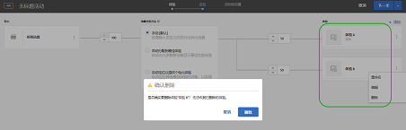 </p> <p>请参阅： </p> <p> 
     <ul id="ul_CB0C1146716F4C09BF924CF3DFA7DC1A"> 
      <li id="li_3767DD36F597481FB312CC577CD668F0"> <p>A/B 活动：<a href="../c-activities/t-test-ab/t-test-create-ab/ab-add-experience.md#task_454646F2895242D3B92DC395A0CE1A00" format="dita" scope="local">添加体验</a> </p> </li> 
      <li id="li_E2990CA178C6446BA7206643A3164FEF"> <p>XT 活动：<a href="../c-activities/t-experience-target/t-xt-create/xt-add-experience.md#task_454646F2895242D3B92DC395A0CE1A00" format="dita" scope="local">创建体验 </a> </p> </li> 
     </ul> </p> <p>(TGT-30229) </p> </td> 
  </tr> 
  <tr> 
   <td colname="col1"> <p>受众 </p> </td> 
   <td colname="col2"> <p>将一个配置文件属性与另一个配置文件属性（而不是一个静态数字）进行比较。 </p> <p>请参阅<a href="../c-target/c-audiences/creating-a-profile-attribute-comparison-audience.md#concept_4C2124B79A5B4556A6C1D10C0F5E40A0" format="dita" scope="local">创建配置文件属性比较受众</a>。 </p> <p> (TGT-28406) </p> </td> 
  </tr> 
  <tr> 
   <td colname="col1"> <p>自定义代码 </p> </td> 
   <td colname="col2"> <p>“自定义代码”现在位于“添加修改”面板中，而非拥有自身单独的选项卡。您还可以添加多个自定义代码，并为每个自定义代码提供可选名称。(TGT-28504) </p> <p>请参阅<a href="../c-experiences/c-visual-experience-composer/c-vec-code-editor/vec-code-editor.md#concept_B3A6E9EE3A60406DB640E205EA1745B5" format="dita" scope="local">修改</a>。 </p> </td> 
  </tr> 
  <tr> 
   <td colname="col1" class="premium"> <p>推荐 </p> </td> 
   <td colname="col2"> <p> 
     <ul id="ul_371C18DFC6D24E94B3D4FFFD83FC8D3A"> 
      <li id="li_9D11939014E7479AB7FD8910852A5386"> <p>在“标准”卡片中查看引用了所选标准的活动列表。该卡片列出了活跃和不活跃的活动。(TGT-27672) </p> </li> 
      <li id="li_B97BF9305EB04F6D8B1F6178B2E0CB34"> <p>在活动图中，“标准”卡片现在会显示已准备好显示结果的时间。(TGT-27673) </p> <p>请参阅<a href="../c-recommendations/c-algorithms/algorithms.md#concept_4BD01DC437F543C0A13621C93A302750" format="dita" scope="local">标准</a>。 </p> </li> 
     </ul> </p> </td> 
  </tr> 
  <tr> 
   <td colname="col1"> <p>体验模板 </p> </td> 
   <td colname="col2"> <p>Adobe Target 体验模板是具有可配置输入的预编码选件示例，可在 Target 中使用这些体验模板来执行一些常见的营销人员用例。这些体验模板将作为在 Adobe Target 中执行一些常见外部用例的起始点，通过可视化体验编辑器或基于表单的体验编辑器免费提供给开发人员和营销人员。要成功地与您的网页或平台架构相集成，可能需要进行自定义。 </p> <p>请参阅<a href="../c-experiences/c-visual-experience-composer/c-vec-code-editor/experience-templates.md#concept_109BBD7EABC04DD39E6B7B1687786652" format="dita" scope="local">体验模板</a>。 </p> </td> 
  </tr> 
  <tr> 
   <td colname="col1"> <p>Target 基础知识网络研讨会系列 </p> </td> 
   <td colname="col2"> <p>加入新的 <a href="../cmp-resources-and-contact-information.md#concept_11902FAC95C64479AABE020557A7EEE4" format="dita" scope="local">Target 基础网络研讨会系列</a>，这是社区为您提供的客户成功网络研讨会系列。 </p> </td> 
  </tr> 
 </tbody> 
</table>

**增强功能、修复和更改**

此 [!DNL Target] 版本包括以下增强功能、修复和更改：

* 增加了富文本编辑器模态的大小，以提高可用性。(TGT-24775)
* 对自动个性化 (AP) 和多变量测试 (MVT) 活动的“定位”步骤（三步引导式工作流的步骤 2）中的图表进行了重新设计，使其与用于 A/B 活动、体验定位 (XT) 活动和“推荐”活动的设计更加一致。(TGT-30712)
* 现在，多变量测试 (MVT) 位置贡献报表的量度值与其他量度的值更加一致，该量度值将四舍五入到两位小数。(TGT-30921)

### at.js 版本 1.5.0（2018 年 6 月 22 日）{#section_53C622F4978F4BC9ACD932D4B7194C12}

<table id="table_B332A93D4A6E4568BA3F7FA8EC0787F4"> 
 <thead> 
  <tr> 
   <th colname="col1" class="entry"> 功能/增强 </th> 
   <th colname="col2" class="entry"> 描述 </th> 
  </tr> 
 </thead>
 <tbody> 
  <tr> 
   <td colname="col1"> <p>at.js </p> </td> 
   <td colname="col2"> <p>at.js 版本 1.5.0 现已可用。 </p> <p> <p>注意：括号中的问题编号供 Adobe 内部使用。 </p> </p> <p> 
     <ul id="ul_41FE0EED2D8B4ADE84FC4CA0FA0CE8A0"> 
      <li id="li_2DC17381CB7949AFA35B054B9CA723FA"> <p><span class="codeph">at-request-succeeded</span> 事件的详细信息中包含重定向标记。此标记可用于确定是否会将页面重定向到其他 URL。如果您要了解该 URL，请订阅 <span class="codeph">at-content-rendering-redirect</span>。(TNT-29834) </p> </li> 
      <li id="li_2852878862724BB2BD475C8FC7BF20DA"> <p>修复了将 <span class="codeph">window.targetGlobalSettings.enabled</span> 设置为 false 时，导致其失败并引发运行时异常的问题。(TNT-29829) </p> </li> 
      <li id="li_96E5E409B36444F1B0E3E2606DC03996"> <p>修复了如果对触发全局 mbox 请求使用自定义代码并使用主体隐藏，则在可视化体验编辑器 (VEC) 中加载页面时导致页面失败的问题。(TNT-29795) </p> </li> 
      <li id="li_818AA4EDDAC04D8B9BB4BA708D6BEF99"> <p>添加了对 <span class="codeph">screenOrientation</span>、<span class="codeph">devicePixelRatio</span> 和 <span class="codeph">webGLRenderer</span> 的支持。这些新的 Target 请求参数用于 iPhone X 和其他新型设备检测。有关更多信息，请参阅<a href="../c-target/c-audiences/c-target-rules/mobile.md#concept_2A794199DC1A4D349FFFBC7DCF1FEB89" format="dita" scope="local">移动设备</a>。(TNT-29781) </p> </li> 
      <li id="li_87E3FB8B423C472AB1EE0DF2D7C64885"> <p>修复了并非总是发送 Adobe Audience Manager (AAM) 位置提示的问题。(TNT-29695) </p> </li> 
      <li id="li_E9E5A5035AC24F54ADEF5447E3F15D3B"> <p>对于支持 at.js 1.5.0 的浏览器，at.js 1.5.0 会切换到 MutationObserver 以进行选择器轮询。at.js 1.0.0 之前的版本使用 MutationObserver polyfill，而这被证明是有问题的。为避免出现 polyfill 问题，版本 1.5.0 使用以下伪代码来确定使用哪种计划机制： </p> <p> 
        <code>          if MutationObserver is supported scheduler = MutationObserver else if document is visible scheduler = requestAnimationFrame else scheduler = setTimeout 
        </code> </p> </li> 
     </ul> </p> </td> 
  </tr> 
 </tbody> 
</table>

### Target Standard/Premium 18.6.1（2018 年 6 月 20 日） {#section_B63C660815B245DA9922BE33E03734A1}

此版本包括以下功能和增强功能：

>[!NOTE]
>
>括号中的问题编号供 Adobe 内部使用。

<table id="table_5A60FFE5E86148F4BDC6A7031D03D6BA"> 
 <thead> 
  <tr> 
   <th colname="col1" class="entry"> 功能 / 增强功能 </th> 
   <th colname="col2" class="entry"> 描述 </th> 
  </tr> 
 </thead>
 <tbody> 
  <tr> 
   <td colname="col1"> <p>可视化体验编辑器 (VEC) </p> </td> 
   <td colname="col2"> <p>在单击“修改”面板中的某个操作时，VEC 会自动滚动网页，并突出显示相应的元素。您不再需要手动向下滚动以查找受修改影响的 HTML 元素。 </p> <p> 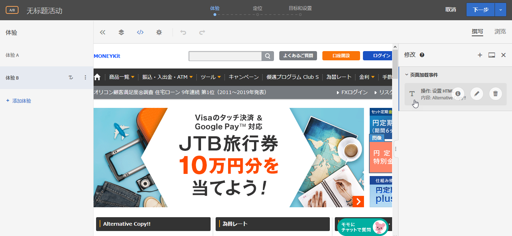 </p> <p>(TGT-30441) </p> </td> 
  </tr> 
  <tr> 
   <td colname="col1"> <p>支持的浏览器 </p> </td> 
   <td colname="col2"> <p>添加了 Microsoft Edge 作为 Target UI 和内容交付支持的浏览器。 </p> <p>有关更多信息，请参阅 . <a href="../c-implementing-target/c-considerations-before-you-implement-target/supported-browsers.md#reference_01B4BF99E7D545A7998773202A2F6100" format="dita" scope="local">支持的浏览器</a> (TGT-14102) </p> </td> 
  </tr> 
  <tr> 
   <td colname="col1" class="premium"> <p>推荐 </p> </td> 
   <td colname="col2"> <p>“最近查看的项目”标准现在会返回特定于给定<a href="../administrating-target/hosts.md#concept_516BB01EBFBD4449AB03940D31AEB66E" format="dita" scope="local">环境</a>的结果。如果两个网站属于不同的环境，并且访客在两个网站之间切换访问，则每个网站仅显示相应网站的最近查看的项目。如果两个网站位于同一环境，并且访客在两个网站之间切换访问，则访客将看到两个网站的最近查看的相同项目。 </p> <p>有关更多信息，请参阅<a href="../c-recommendations/c-algorithms/create-new-algorithm.md#task_2B0ED54AFBF64C56916B6E1F4DC0DC3B" format="dita" scope="local">使推荐基于推荐键</a>。(RECS-5865) </p> </td> 
  </tr> 
 </tbody> 
</table>

**增强功能、修复和更改**

此 [!DNL Target] 版本包括以下增强功能、修复和更改：

* 推荐 CSV 下载的“备用”行现在有一个前导 "*"（用双引号将星号引起来）而不是 *（仅单个星号）。
* 推荐 CSV 下载中的“最畅销/查看次数最多”行不再具有前导逗号。

### Target 平台更改（2018 年 6 月 19 日） {#section_0638BD69F3C640479A2A258AD78C0884}

此版本包括以下增强功能：

>[!NOTE]
>
>括号中的问题编号供 Adobe 内部使用。

* 更新了设备列表以包含最新的手机机型。添加了使用“设备营销名称”或“设备型号”向特定 iPhone 机型提供定位内容的功能。

   使用 Mobile SDK 的客户无需执行任何操作即可使用此功能。使用 at.js 的客户必须升级到 at.js 版本 1.5.0。

   有关更多信息，请参阅[移动设备](../c-target/c-audiences/c-target-rules/mobile.md#concept_2A794199DC1A4D349FFFBC7DCF1FEB89)。（TNT-26714 和 TNT-28288）

### Target 下载 API（2018 年 6 月 5 日） {#section_B8729DA10F18433C8D8E01B04F308ED2}

您可以使用推荐下载 API 来下载 .CSV 文件格式的推荐，以便在电子表格或文本编辑器中进行查看。为了提高安全性，从 **2018 年 6 月 5 日**&#x200B;开始，Target 将阻止 HTTP 请求，只允许 HTTPS 请求。

### Target Standard/Premium 18.5.1（2018 年 5 月 22 日） {#section_7C1427793C2A48DBAC39F8290717DC5B}

此版本包括以下功能和增强功能：

>[!NOTE]
>
>括号中的问题编号供 Adobe 内部使用。

<table id="table_1C51F61184684072BC69AD15BA68BEBB"> 
 <thead> 
  <tr> 
   <th colname="col1" class="entry"> 功能 </th> 
   <th colname="col2" class="entry"> 描述 </th> 
  </tr> 
 </thead>
 <tbody> 
  <tr> 
   <td colname="col1"> <p>报表 </p> </td> 
   <td colname="col2"> <p> 
     <ul id="ul_8D08FE4AC7D748EFB2BBFF87DBDC5CE5"> 
      <li id="li_B8929C19276D42168A28A3775CDEDFB3"> <p>根据需要配置单个活动的报表后，您最多可以保存该报表的 10 个不同预设（量度、受众、高级设置等）。所有 Target 用户都可以显示、编辑和删除各种预设，而不管是谁创建的这些预设。(TGT-21268) </p> </li> 
      <li id="li_7ADA62F2ACA049C9B4A8986B09A9F4AA"> <p>您可以根据需要配置单个活动的报表，然后将该配置保存为默认/收藏预设。当您以后查看该活动的报表时，便会显示此视图。(TGT-10082) </p> </li> 
      <li id="li_DC63C04F3A884BDDA55B5515E4643B7B"> <p>报表中的警报和消息可告知您是否已从先前配置的预设报表中删除了一个（或多个）受众、量度、主机组或体验。警报或消息将指示您选择其他受众、量度、主机组或体验以再次进行预设。(TGT-29424) </p> </li> 
     </ul> </p> <p>有关更多信息，请参阅<a href="../c-reports/c-report-settings/report-settings.md#concept_3A80D5A394EC4B639DC715E06085BDB0" format="dita" scope="local">报表设置</a>。 </p> </td> 
  </tr> 
  <tr> 
   <td colname="col1"> <p>配置文件脚本 </p> </td> 
   <td colname="col2"> <p> 
     <ul id="ul_F382C8E7708846A08676E1534BC92878"> 
      <li id="li_70E89504525C4119B588C230DCE772E8"> <p>您可以查看配置文件脚本信息弹出卡片，该卡片类似于选件信息卡片。通过这些配置文件脚本信息卡片，您可以查看引用了所选配置文件脚本的活动列表，以及其他有用的元数据。(TGT-28253) </p> <p>有关更多信息，请参阅<a href="../c-target/c-visitor-profile/profile-parameters.md#concept_8C07AEAB0A144FECA8B4FEB091AED4D2" format="dita" scope="local">配置文件脚本属性</a>中的“查看配置文件脚本信息卡片”部分。 </p> </li> 
     </ul> </p> </td> 
  </tr> 
  <tr> 
   <td colname="col1"> <p>受众 </p> </td> 
   <td colname="col2"> <p> 
     <ul id="ul_DFEB778393024E3EBBC482F31A5B39BC"> 
      <li id="li_4049E334A38F4F94842FF1E35F177FE9"> <p>创建自定义受众时，现在允许直接使用 mbox 参数，而不必强制指定 mbox 名称。mbox 名称现在是可选的。通过这项更改，您可以使用多个 mbox 中的参数或引用尚未记录到 Edge 的参数。或者，您也可以使用 mbox 名称筛选器对 mbox 参数进行筛选。 </p> <p>这一改进也已扩展到推荐标准、推荐促销活动和模板测试规则。 </p> </li> 
     </ul> </p> <p>有关更多信息，请参阅<a href="../c-target/c-audiences/c-target-rules/custom-parameters.md#concept_C4C6E00D7C5A4BE9B72D471DB2E3027B" format="dita" scope="local">自定义参数</a>。 </p> </td> 
  </tr> 
  <tr> 
   <td colname="col1" class="premium"> <p>推荐 </p> </td> 
   <td colname="col2"> <p> 
     <ul id="ul_7765B69E679D4C94B1E863E340DFDE15"> 
      <li id="li_F2AF7E1AFBD6461990EF1D83D1989582"> <p>在基于表单的体验编辑器中选择推荐标准时，现在有一个指向所选标准卡片的直接链接，以便您快速方便地对标准进行编辑。(TGT-28483) </p> <p>有关更多信息，请参阅<a href="../c-experiences/form-experience-composer.md#task_FAC842A6535045B68B4C1AD3E657E56E" format="dita" scope="local">基于表单的体验编辑器</a>。 </p> </li> 
      <li id="li_517F0A174587416B8621D6F710C1AC48"> <p>现在，创建推荐标准、推荐促销活动和模板测试规则时，允许直接使用 mbox 参数，而不必强制指定 mbox 名称。mbox 名称现在是可选的。通过这项更改，您可以使用多个 mbox 中的参数或引用尚未记录到 Edge 的参数。或者，您也可以使用 mbox 名称筛选器对 mbox 参数进行筛选。 </p> <p>这一改进也已扩展到自定义受众的创建。 </p> <p>有关更多信息，请参阅<a href="../c-recommendations/c-recommendations-faq/recommendations-faq.md#concept_EF272DE4AC6C47B19026BFBE816F5DB8" format="dita" scope="local">“推荐”常见问题解答</a>。 </p> </li> 
      <li id="li_AAB242830D1E47B78E58A980B717C736"> <p>更新了“推荐”设计卡片的 UI。 </p> </li> 
      <li id="li_1BE3178663E54F4CA8714FE3ACDBB97B"> <p>可在 <a href="https://www.adobe.io/apis/experiencecloud/target/docs/getting-started.html" format="html" scope="external">Adobe I/0 Adobe Target 网站</a> (https://www.adobe.io/apis/experiencecloud/target/docs/getting-started.html) 上找到 Target 推荐 API 文档。 </p> </li> 
     </ul> </p> </td> 
  </tr> 
 </tbody> 
</table>

**增强功能、修复和更改**

此 [!DNL Target] 版本包括以下增强功能、修复和更改：

* 更新了 Target 三步引导式工作流步骤 2 的 UI，该步骤用于创建或编辑 A/B 测试活动、体验定位 (XT) 活动或“推荐”活动。(TGT-18911)

### Target Standard/Premium 18.4.1（2018 年 4 月 25 日） {#section_445DBC5402BA456BAF2D24AEA33A91C9}

此版本包括以下功能和增强功能：

>[!NOTE]
>
>括号中的问题编号供 Adobe 内部使用。

<table id="table_6D99C48B72D24728BF623608053931D3"> 
 <thead> 
  <tr> 
   <th colname="col1" class="entry"> 功能 </th> 
   <th colname="col2" class="entry"> 描述 </th> 
  </tr> 
 </thead>
 <tbody> 
  <tr> 
   <td colname="col1"> <p>Adobe Experience Manager (AEM) 体验片段 </p> </td> 
   <td colname="col2"> <p>通过在 Target 活动中使用 AEM 中创建的体验片段，您可以将 AEM 中这一简单易用的功能与 Target 中强大的自动化智能 (AI) 和机器学习 (ML) 功能结合使用，从而测试和个性化大量体验。&amp;nbsp;&amp;nbsp; </p> <p>AEM 可将您的所有内容和资产汇集到一个中心位置，以帮助实施您的个性化策略。通过 AEM，您能够在一个位置轻松创建适用于桌面、平板电脑和移动设备的内容，而无需编写代码。您无需为每种设备分别创建页面，因为 AEM 可以使用您的内容自动调整每个体验。 </p> <p> Target 允许您根据一组基于规则且由 AI 驱动的机器学习方法（这些方法包含行为、上下文和离线变量），交付大量的个性化体验。通过 Target，您可以轻松地设置并运行 A/B 活动和多变量活动，从而确定最佳的选件、内容和体验。 </p> <p>现在，有些从事优化和个性化工作的专业人士正在使用 Target 促进其业务发展，对这类人士而言，体验片段代表了在将内容/体验创建器与管理器关联方面迈出了巨大的一步。 </p> <p>有关更多信息，请参阅 <a href="../c-experiences/c-manage-content/aem-experience-fragments.md#topic_1E1E4EA01F074349B2CF8785387B5FE8" format="dita" scope="local">AEM 体验片段</a>。 </p> </td> 
  </tr> 
  <tr> 
   <td colname="col1"> <p>报表 </p> </td> 
   <td colname="col2"> 
    <ul id="ul_EAB90C510EA04D6A8AEFF23A77DB2337"> 
     <li id="li_47DA6EB92CC84FFDBFDC9CC9386AF654"> <p>现在，您可以通过刷新报表来更新报表的表格视图和图表视图，而无需刷新整个页面、页面配置或其日期范围。(TGT-28125) </p> <p>有关更多信息，请参阅<a href="../c-reports/c-report-settings/report-settings.md#concept_3A80D5A394EC4B639DC715E06085BDB0" format="dita" scope="local">报表设置</a>。 </p> </li> 
     <li id="li_AB2DE7A45D914FD7AEB0832187AF3844"> <p>报表中的日历现在包含预定义的日期范围，例如最近 7 天、最近 15 天等。(TGT-29171) </p> <p>有关更多信息，请参阅<a href="../c-reports/c-report-settings/report-settings.md#concept_3A80D5A394EC4B639DC715E06085BDB0" format="dita" scope="local">报表设置</a>。 </p> </li> 
     <li id="li_46DF9037E0ED4935B3BCDB35E8BED065"> <p>修改了表格视图的列宽，以便在应用多个度量时无需水平滚动。(TGT-26575) </p> </li> 
    </ul> </td> 
  </tr> 
  <tr> 
   <td colname="col1"> <p>UI 本地化 </p> </td> 
   <td colname="col2"> <p>现在提供了以下语言版本的 Target UI： </p> <p> 
     <ul id="ul_DB6C771FCFDF43F498F8754920A70BCD"> 
      <li id="li_A65D07DF66844AC8BEEC1D413F214191"> <p>简体中文 </p> </li> 
      <li id="li_5986DD06AF5B4F76B3A02CFBF2DC3644"> <p>繁体中文 </p> </li> 
      <li id="li_341FDC1CEC2B4C4BBD45CB2A0A54F2A3"> <p>韩语 </p> </li> 
      <li id="li_A4C31539B98E42348D5F1A18C63EAB6C"> <p>意大利语 </p> </li> 
      <li id="li_97E3E0A916B64601BBF601AAED581174"> <p>葡萄牙语 </p> </li> 
     </ul> </p></td> 
  </tr> 
  <tr> 
   <td colname="col1"> <p>受众 </p> </td> 
   <td colname="col2"> <p>创建基于 mbox 参数的自定义受众时，<span class="codeph">mboxParameter</span> 将不再提示您输入 <span class="codeph">mboxName</span>。mbox 名称现在是可选的。通过这项更改，您可以使用多个 mbox 中的参数或引用尚未记录到 Edge 的参数。(TGT-25807) </p> <p> <p>注意：此功能在 Target UI 中可见，但当前处于禁用状态。此功能不久将会启用（日期待通知）。 </p> </p> 
  </td> 
  </tr> 
 </tbody> 
</table>

**增强功能、修复和更改**

此 [!DNL Target] 版本包括以下增强功能、修复和更改：

* 传输层安全性 (TLS) 是当前使用的部署最广泛的安全协议，可用于 Web 浏览器和其他需要通过网络安全交换数据的应用程序。Adobe 设有安全合规性标准，该标准要求结束旧协议的生命周期，并且强制使用 TLS 1.2，以便使用最新且最安全的版本。从 Target 18.4.1 版本（2018 年 4 月 25 日）开始，Adobe Target 将采取措施，以在 2018 年 9 月 12 日之前完全移到 TLS 1.2 加密版本，并逐步停止对 TLS 1.0 加密版本的支持。您应务必了解具体细节，并且针对更改做出规划以实现顺利迁移。有关更多信息，请参阅 [TLS（传输层安全性）加密更改](../c-implementing-target/c-considerations-before-you-implement-target/tls-transport-layer-security-encryption.md#concept_CC1001E9D3AE4BABAF90B8311B0A6451)。
* 改进了推荐标准卡片的 UI，以提高可用性。(TGT-27829)

### at.js（2018 年 4 月 3 日）{#section_932DF1004F4648668FE4984BFAF2EC49}

此版本包括以下功能和增强功能：

<table id="table_76576D9D931B4DA99900F2C03175938E"> 
 <thead> 
  <tr> 
   <th colname="col1" class="entry"> 功能 </th> 
   <th colname="col2" class="entry"> 描述 </th> 
  </tr> 
 </thead>
 <tbody> 
  <tr> 
   <td colname="col1"> <p>at.js </p> </td> 
   <td colname="col2"> <p>at.js 版本 1.3.0 现已可用。有关更多信息，请参阅<a href="../c-implementing-target/c-implementing-target-for-client-side-web/how-to-deployatjs/implementing-target-without-a-tag-manager.md#concept_1E1F958F9CCC4E35AD97581EFAF659E2" format="dita" scope="local">下载 at.js</a> 和 <a href="../c-implementing-target/c-implementing-target-for-client-side-web/target-atjs-versions.md#reference_DBB5EDB79EC44E558F9E08D4774A0F7A" format="dita" scope="local">at.js 版本详细信息</a>。 </p> <p> 
     <ul id="ul_349BEB37B6C94FF0801F121042037803"> 
      <li id="li_4C2F82F4DD394ED5A0BFF978B15FEDDF"> <p>以下新事件可用于帮助跟踪、调试和自定义与 at.js 的交互： </p> <p> 
        <ul id="ul_EFF7E2FCEA0D42298779DDE13B54503F"> 
         <li id="li_6A2B06A522004EDE96D9A552571A7C30"> <p>LIBRARY_LOADED </p> </li> 
         <li id="li_61AA203A21DF4B7EAE075374A09C8FF0"> <p>REQUEST_START </p> </li> 
         <li id="li_DAF9CC1E86834C62B93419429B43A2CB"> <p>CONTENT_RENDERING_START </p> </li> 
         <li id="li_A52DC337115248A1BE5AF5B358BE5A9A"> <p>CONTENT_RENDERING_NO_OFFERS </p> </li> 
         <li id="li_7D71E48016B1446995493EBBF7D32447"> <p>CONTENT_RENDERING_REDIRECT </p> </li> 
        </ul> </p> <p>有关更多信息，请参阅<a href="../c-implementing-target/c-implementing-target-for-client-side-web/cmp-atjs-functions.md#reference_A828E4BA535F4E7692A075F3D70CF6CD" format="dita" scope="local">at.js 自定义事件</a>。 </p> </li> 
      <li id="li_E2704294F8BA47FFAABE7572F67FB5C0"> <p>您可以使用来自数据提供程序的其他参数来增强 at.js 请求。应将数据提供程序添加到 <span class="codeph">dataProviders</span> 键下方的 <span class="codeph">window.targetGlobalSettings</span>。 </p> <p>有关更多信息，请参阅 <a href="../c-implementing-target/c-implementing-target-for-client-side-web/cmp-atjs-functions.md#concept_8DACBC47ABDE4279BB102B42609FE506" format="dita" scope="local">targetGlobalSettings()</a> 中的“数据提供程序”。 </p> </li> 
      <li id="li_02EAFE6DA0D44CF88980184FD14226A5"> <p>at.js 请求现在使用 GET，但当 URL 大小超过 2048 个字符时，它会转为使用 POST。新增了一个名为 <span class="codeph">urlSizeLimit</span> 的属性，如有必要，您可以在此属性中提高大小限制。通过这项更改，Target 可以使 at.js 与使用相同技术的 AppMeasurement 保持一致。 </p> </li> 
      <li id="li_43363A4F3A764394AA88D2595F93D8C0"> <p>现在，Target 强制要求在 <span class="codeph">adobe.target.applyOffer(options)</span> 函数中使用 <span class="codeph">mbox</span> 键。以往，这些键值是要求使用的，但现在，Target 强制使用该键值以确保 Target 正确验证并且客户正确地使用该函数。 </p> <p>有关更多信息，请参阅 <a href="../c-implementing-target/c-implementing-target-for-client-side-web/cmp-atjs-functions.md#reference_BBE83F513B5B4E03BBC3F50D90864245" format="dita" scope="local">adobe.target.applyOffer(options)</a>。 </p> </li> 
      <li id="li_7336D8D48A894291A378E0BB212B7F9B"> <p>at.js 改进了事件和点击跟踪功能。at.js 会使用 <span class="codeph">navigator.sendBeacon()</span> 发送事件跟踪数据，如果 <span class="codeph">navigator.sendBeacon()</span> 不受支持，则将回退到同步 XHR。此回退行为主要影响 Internet Explorer 10 和 11 以及 Safari 的某些版本。Safari 将在 iOS 11.3 版本中添加对 <span class="codeph">navigator.sendBeacon()</span> 的支持。 </p> </li> 
      <li id="li_28D7324137B14C75BF6F1EA0B2487C9B"> <p>现在，即使页面在后台选项卡中打开，at.js 也能渲染选件。有些 Target 客户遇到 <span class="codeph">requestAnimationFrame()</span> 因浏览器对后台选项卡的限制行为而被禁用的问题。 </p> </li> 
      <li id="li_3278979E1C6C41DEA7E8025AEB337985"> <p>此版本执行了许多性能方面的改进，包括缩短了检查 Chrome CPU 配置文件时的调用堆栈。 </p> </li> 
      <li id="li_AAA9C0DCC3354DFA8907968C8E6427F6"> <p>at.js 1.3.0 不再支持在 Microsoft Internet Explorer 9 上交付内容。有关支持的浏览器列表，请参阅<a href="../c-implementing-target/c-considerations-before-you-implement-target/supported-browsers.md#reference_01B4BF99E7D545A7998773202A2F6100" format="dita" scope="local">支持的浏览器</a>。 今后，所有请求都将通过支持 CORS 的 <span class="codeph">XMLHttpRequest</span> 来执行，而不使用 JSONP 请求。这项更改显著提高了安全性。 </p> </li> 
     </ul> </p> </td> 
  </tr> 
 </tbody> 
</table>

### Target Standard/Premium 18.3.1（2018 年 3 月 20 日） {#section_880706BE15544A03A2C951F267F4AEC5}

此版本包括以下功能和增强功能：

>[!NOTE]
>
>括号中的问题编号供 Adobe 内部使用。

<table id="table_AE38682151A948AEA21E35A353F18D76"> 
 <thead> 
  <tr> 
   <th colname="col1" class="entry"> 功能 </th> 
   <th colname="col2" class="entry"> 描述 </th> 
  </tr> 
 </thead>
 <tbody> 
  <tr> 
   <td colname="col1" class="premium"> <p>“按实体划分的热门程度”属性 </p> </td> 
   <td colname="col2"> <p><b>新增：2018 年 3 月 22 日</b> </p> <p>现在，在现有流程中选择自定义属性作为键后，您可以选择“按实体划分的热门程度”属性。 </p> <p>选择所需的键（在这种情况下为自定义配置文件属性）后，对于“推荐逻辑”，您可以选择以下两个新选项： </p> <p> 
     <ul id="ul_7A6F2398ADE846EF8A7A3110C2736BF7"> 
      <li id="li_66BFF016564749B298B88F6B9638B64E"> <p>查看次数最多 </p> </li> 
      <li id="li_937FE5C40ED8471391B282D1ACE8C133"> <p>最畅销商品 </p> </li> 
     </ul> </p> <p>有关更多信息，请参阅<a href="../c-recommendations/c-algorithms/create-new-algorithm.md#task_2B0ED54AFBF64C56916B6E1F4DC0DC3B" format="dita" scope="local">使推荐基于推荐键</a>。 </p> </td> 
  </tr> 
  <tr> 
   <td colname="col1"> <p>受众 </p> </td> 
   <td colname="col2"> <p>现在，在查看某个受众的定义弹出卡片（例如，从受众库中查看）时，您可以看到引用了该受众的其他活动（如果适用）。这样，您就可以避免在编辑受众时对活动造成意外影响。 </p> <p>以前，当您尝试删除已由活动引用的受众时，系统会显示警告消息，告知您无法删除该受众，因为最多有 10 个活动引用了该受众。 </p> <p>有关更多信息，请参阅<a href="../c-target/c-audiences/audiences.md#concept_65BE870D290E412D8BBF557EEA67C271" format="dita" scope="local">关于受众</a>。 </p> </td> 
  </tr> 
  <tr> 
   <td colname="col1"> <p>报表 </p> </td> 
   <td colname="col2"> <p>改善了报表中的提升度及提升度范围信息，使其更加全面和实用，其中包括说明如何计算提升度范围的工具提示。(TGT-28729) </p> <p>有关更多信息，请参阅<a href="../c-reports/c-report-settings/average-lift-bounds-and-confidence-interval.md#topic_AFFDC672A8A34D028B100EF6BE5D8129" format="dita" scope="local">平均提升度、提升度范围和置信区间</a>。 </p> </td> 
  </tr> 
  <tr> 
   <td colname="col1" class="premium"> <p>自动个性化 (AP) 活动和自动定位活动 </p> </td> 
   <td colname="col2"> <p>在 UI 和帮助中提供了更多指导信息，以帮助您在自动个性化 (AP) 活动和自动定位活动中更有效地分配流量百分比。 </p> <p>有关更多信息，请参阅<a href="../c-activities/auto-target-to-optimize.md#section_AB3656F71D2D4C67A55A24B38092958F" format="dita" scope="local">确定流量分配</a>和<a href="../c-activities/t-automated-personalization/create-ap-activity.md#task_8AAF837796D74CF893CA2F88BA1491C9" format="dita" scope="local">创建自动个性化活动</a>。 </p> </td> 
  </tr> 
  <tr> 
   <td colname="col1" class="premium"> <p>推荐：自定义标准的包含规则、收藏集和排除项 </p> </td> 
   <td colname="col2"> <p>现在，您可以基于自己的自定义标准输出进行实时筛选。例如，您可以将推荐项目限制为访客最喜欢的类别或品牌。这样，您便能够将离线计算与实时筛选结合使用。 </p> <p>通过在自定义标准中添加包含规则，您可以将原本为静态的推荐转变为基于访客兴趣的动态推荐。 </p> <p> 
     <ul id="ul_BDD55AB34F4A43C691D2399C16AA3D6C"> 
      <li id="li_133C33E0D02E4861A4C855BD8A492E69"> <p>与推荐中的其他标准一样，自定义标准现在也可配置。 </p> </li> 
      <li id="li_AC201F0917BF465C985E8947635F762E"> <p>您可以使用收藏集、排除项和包含项（包括针对价格和库存的特殊规则），其使用方法与任何其他标准相同。以前已支持收藏集和排除项。此版本添加了包含项。 </p> </li> 
     </ul> </p> <p>有关更多信息，请参阅<a href="../c-recommendations/c-algorithms/algorithms.md#concept_4BD01DC437F543C0A13621C93A302750" format="dita" scope="local">标准</a>。 </p> <p>(TGT-28488) </p> </td> 
  </tr> 
  <tr> 
   <td colname="col1" class="premium"> <p>推荐：“最近查看的项目”标准的包含规则、收藏集和排除项 </p> </td> 
   <td colname="col2"> <p>现在，可以筛选最近查看的项目，以便仅显示具有特定属性的项目。例如，一家开展多种业务的跨国公司可能会让访客在多个数字财产中查看项目。在这种情况下，您可以限制最近查看的项目，以便仅显示之前查看的相应财产中的项目。执行此操作可防止最近查看的项目在其他数字财产网站上显示。 </p> <p> 
     <ul id="ul_A2D260F01CA047EEA72EF56BD0EE88FA"> 
      <li id="li_DB107DD357B741CCB2B7A4FDAD16F9D6"> <p>与推荐中的其他标准一样，“最近查看的项目”标准现在也可配置。 </p> </li> 
      <li id="li_85452C03F0924D4C8D854509F1293021"> <p>您可以使用收藏集、排除项和包含项（包括针对价格和库存的特殊规则），其使用方法与任何其他标准相同。以前已支持收藏集和排除项。此版本添加了包含项。 </p> </li> 
     </ul> </p> <p>有关更多信息，请参阅<a href="../c-recommendations/c-algorithms/algorithms.md#concept_4BD01DC437F543C0A13621C93A302750" format="dita" scope="local">标准</a>。 </p> <p>(TGT-22843) </p> </td> 
  </tr> 
  <tr> 
   <td colname="col1"> <p>适用于 Adobe Launch 的 Target 扩展 </p> </td> 
   <td colname="col2"> <p>Launch 是 Adobe 推出的下一代标签管理功能。Launch 为客户提供了一种简单的方式来部署和管理所有用来加强相关客户体验的分析、营销和广告标签。 </p> <p>利用 Target 扩展，您可以快速方便地在环境中实施 Target。 </p> <p>有关更多信息，请参阅<a href="../c-implementing-target/c-implementing-target-for-client-side-web/how-to-deployatjs/cmp-implementing-target-using-adobe-launch.md#topic_5234DDAEB0834333BD6BA1B05892FC25" format="dita" scope="local">使用 Adobe Launch 实施 Target</a>。 </p> </td> 
  </tr> 
 </tbody> 
</table>

**增强功能、修复和更改**

此 [!DNL Target] 版本包括以下增强功能、修复和更改：

* 创建或编辑 A/B 活动和体验定位 (XT) 活动时，Target 会保留有关最后一次打开的体验、页面或体验版本（通过多受众功能）的信息，并在下次打开 Target UI 时打开相应的页面。(TGT-28225)
* 为实现合规性，修复了一些安全隐患。

### Target Standard/Premium 18.2.1（2018 年 2 月 15 日） {#section_837CBBB7A89D45D99855A8C5F5E7BFFB}

此版本包括以下功能和增强功能：

<table id="table_1C7A462AE8D4492FA5555F060031F665"> 
 <thead> 
  <tr> 
   <th colname="col1" class="entry"> 功能 </th> 
   <th colname="col2" class="entry"> 描述 </th> 
  </tr> 
 </thead>
 <tbody> 
  <tr> 
   <td colname="col1"> <p>Adobe Marketing Cloud 进行了品牌重塑，现在更名为 Adobe Experience Cloud。 </p> </td> 
   <td colname="col2"> <p>Experience Cloud 是 Adobe 推出的一整套集成化数字营销解决方案和服务。它还具备直观的界面，使您能够快速访问自己的云解决方案和核心服务。 </p> <p>品牌重塑和 UI 更改：Adobe Marketing Cloud 进行了品牌重塑，现在更名为 Adobe Experience Cloud。此外，您还将看到 Target 界面和解决方案切换器中进行的 UI 更改。 </p> <p>有关这些更改的更多信息，请参阅<a href="https://docs.adobe.com/content/help/en/core-services/interface/about-core-services/solutions-core-services.html" format="html" scope="external">关于 Experience Cloud 中的新增云名称</a>。 </p> </td> 
  </tr> 
 </tbody> 
</table>

**增强功能、修复和更改**

此 [!DNL Target] 版本包括一些后端增强功能、修复和更改。

### Target 平台（2018 年 1 月 18 日）{#section_F6A0DC31636D403F92BDB9DCE7A3F6ED}

此版本包括以下功能和增强功能：

<table id="table_0F5BF9370E214302BDFE0AC2D66EC773"> 
 <thead> 
  <tr> 
   <th colname="col1" class="entry"> 功能 </th> 
   <th colname="col2" class="entry"> 描述 </th> 
  </tr> 
 </thead>
 <tbody> 
  <tr> 
   <td colname="col1"> <p>at.js </p> </td> 
   <td colname="col2"> <p>at.js 1.2.3 添加了对 JSON 选件的支持。JSON 选件仅在使用基于表单的体验编辑器创建的活动中受支持。目前只能通过直接 API 调用来使用 JSON 选件。请参阅<a href="../c-experiences/c-manage-content/create-json-offer.md#concept_63C7BEE1F0DB4A7596D997219B7C136D" format="dita" scope="local">创建 JSON 选件</a>。 </p> </td> 
  </tr> 
  <tr> 
   <td colname="col1"> <p>其他更改 </p> </td> 
   <td colname="col2"> <p>现在，排除规则、目录、算法包含规则以及运行时筛选均不区分大小写。 </p> </td> 
  </tr> 
 </tbody> 
</table>

### Target Standard/Premium 18.1.1（2018 年 1 月 23 日） {#section_3A2216543B064D6F82EC03E1F8AEC74D}

此版本包括以下功能和增强功能：

>[!NOTE]
>
>括号中的问题编号供 Adobe 内部使用。

<table id="table_872FE2BE61CC4A5CA369D9A6C730686E"> 
 <thead> 
  <tr> 
   <th colname="col1" class="entry"> 功能 </th> 
   <th colname="col2" class="entry"> 描述 </th> 
  </tr> 
 </thead>
 <tbody> 
  <tr> 
   <td colname="col1"> <p>受众 </p> </td> 
   <td colname="col2"> <p> 
     <ul id="ul_42D7C86043C94A7BBA5ED405B2902E3A"> 
      <li id="li_50F2A7D05AB244E18D263A476BD906B3"> <p>现在，您可以在不设置开始日期或结束日期的情况下创建“期限”受众。这样，在活动级别控制开始日期和结束日期时，您可以在多个活动中使用相同的受众（无需复制受众）。请参阅<a href="../c-target/c-audiences/c-target-rules/time-frame.md#concept_0FE1E8DACD104F8B870B0BADE3197F0A" format="dita" scope="local">期限</a>。(TGT-25975) </p> </li> 
      <li id="li_6F08D63BC4F040859D51C47C3521C5E1"> <p>在“选择受众”&gt;“仅限该活动的受众”页面上，将鼠标悬停在相应受众上方，可对仅限该活动的受众使用“复制并编辑”功能。以前，此功能仅适用于库受众。请参阅<a href="../c-target/creating-activity-only-audience.md#concept_A6BADCF530ED4AE1852E677FEBE68483" format="dita" scope="local">创建仅限该活动的受众</a>。(TGT-27410) </p> </li> 
      <li id="li_A8CF45E6DC37401AA273F7D6CF617524"> <p>各个活动中的仅限该活动的受众可以使用相同的名称。以前，若出现重复的名称，则会添加时间戳，例如会将名为“Target on Weekday”的重复受众另存为“Target on Weekday-1456732099201”。 </p> <p>库受众仍要求使用唯一的名称。(TGT-17967) </p> </li> 
     </ul> </p> </td> 
  </tr> 
  <tr> 
   <td colname="col1"> <p>报表 </p> </td> 
   <td colname="col2"> <p> 
     <ul id="ul_C595EEF916494342AD99FF0FDF999927"> 
      <li id="li_8C74478D3480406591DC876F69C19329"> <p>现在，您可以查看连续变量的置信区间。(TGT-22085) </p> </li> 
      <li id="li_21B31F91685C46CAA47688FDE5735312"> <p>现在，Target 会在报表中显示具有统计学显著意义的提升度范围。（TGT-27301、TGT-27794 和 TGT-26387） </p> </li> 
     </ul> </p> <p>请参阅<a href="../c-reports/c-report-settings/report-settings.md#concept_4BB6A7FDAB6F4806A632F9CD989B8BFA" format="dita" scope="local">报表设置</a>。 </p> </td> 
  </tr> 
  <tr> 
   <td colname="col1"> <p>选件 </p> </td> 
   <td colname="col2"> <p> 
     <ul id="ul_BD0C5B260E7E4F139FBC1FBA286C0B81"> 
      <li id="li_FCDBABE6C5034A3596F5BBF024245FB9"> <p>现在，Target 支持在选件库中创建 JSON 选件，以供在基于表单的体验编辑器中使用。请参阅<a href="../c-experiences/c-manage-content/create-json-offer.md#concept_63C7BEE1F0DB4A7596D997219B7C136D" format="dita" scope="local">创建 JSON 选件</a>。(TGT-27064) </p> </li> 
      <li id="li_5500AE7DCF4146E88E4619382CE8E836"> <p>现在，您可以在每个选件的定义弹出卡片中查看引用了代码选件的活动。此功能不适用于图像选件。请参阅<a href="../c-experiences/c-manage-content/manage-content.md#concept_17874A6FCBB743AA84C5988E8571CCF3" format="dita" scope="local">选件</a>。(TGT-26277) </p> </li> 
     </ul> </p> </td> 
  </tr> 
  <tr> 
   <td colname="col1" class="premium"> <p>推荐 </p> </td> 
   <td colname="col2"> <p> 
     <ul id="ul_63613AD2D744442AA12CD23F4DAC75B4"> 
      <li id="li_4DD5CF06D93A4083BCB34A4FFA293C89"> <p>现在，UI 会显示为推荐上传自定义算法数据的状态。请参阅<a href="../c-recommendations/c-algorithms/recommendations-csv.md#task_1BBA49883E794670A09F0ABE1B3F4288" format="dita" scope="local">上传自定义标准</a>。 (TGT-23891) </p> </li> 
      <li id="li_14FCFDD0A0E84B47AF1488DB4DDF197B">现在，创建算法包含规则时，可以使用“值存在”和“值不存在”运算符。请参阅<a href="../c-recommendations/c-algorithms/use-dynamic-and-static-inclusion-rules.md#concept_4CB5C0FA705D4E449BD0B37B3D987F9F" format="dita" scope="local">使用动态和静态包含规则</a>。(TGT-24110) </li> 
     </ul> </p> </td> 
  </tr> 
  <tr> 
   <td colname="col1"> <p>Adobe Target Insider 时事通讯 </p> </td> 
   <td colname="col2"> <p>Adobe Target Insider 是针对 Adobe Target 社区成员发布的每月时事通讯。可让您了解产品更新和未来计划、个性化和优化提示与技巧、客户成功案例、即将举行的活动、信息丰富的白皮书及热门博客文章，等等。请阅读此<a href="https://theblog.adobe.com/stay-optimized-adobe-target-insider-newsletter/" format="https" scope="external">公告函</a>以了解更多信息。 </p> <p> <a href="https://www.adobe.com/subscription/adobe_target_newsletter.html" format="html" scope="external">订阅时事通讯</a>可帮助您提供卓越的客户体验，从而助力企业取得成功。 </p> </td> 
  </tr> 
 </tbody> 
</table>

**增强功能、修复和更改**

此 [!DNL Target] 版本包括以下面向客户的增强功能、修复和更改：

* 现在，创建活动时，您可以在三步引导式工作流的步骤 2 中重新排列体验时滚动页面。(TGT-27652)
* 您可以在活动列表中右键单击某个活动，以便在新的选项卡中打开该活动。例如，在 Firefox 中，右键单击所需的活动，然后选择“在新选项卡中打开链接”。(TGT-27409)
* 改进了“设计”页面（“推荐”&gt;“设计”）的性能。提高了显示和搜索设计的速度。(TGT-21792)
* at.js 现在是要下载的默认实施选项。(TGT-24676)
* 现在，URL 验证允许在 URL 中使用双连字符。以前，无法将具有双连字符的 URL 加载到可视化体验编辑器 (VEC)。(TGT-28176)
* 修复了受支持语言的多个 UI 本地化缺陷。

## 2017 年版 {#reference_59C7622A111C4147804A8AAC6D27BB8D}

### Target 平台（2017 年 11 月 8 日）{#section_536B3C0F32ED441C8D82704B94F6AF7E}

此版本包括以下功能和增强功能：

<table id="table_793CDDF1BD9E48BDBABBF6CD979BE186"> 
 <thead> 
  <tr> 
   <th colname="col1" class="entry"> 功能 </th> 
   <th colname="col2" class="entry"> 描述 </th> 
  </tr> 
 </thead>
 <tbody> 
  <tr> 
   <td colname="col1"> <p>at.js </p> </td> 
   <td colname="col2"> <p>at.js 版本 1.2.2 现已可用。有关更多信息，请参阅<a href="../c-implementing-target/c-implementing-target-for-client-side-web/how-to-deployatjs/implementing-target-without-a-tag-manager.md#concept_1E1F958F9CCC4E35AD97581EFAF659E2" format="dita" scope="local">下载 at.js</a>。 </p> <p> 
     <ul id="ul_3C4C9385A0F3489AA2137A2C88AE93CF"> 
      <li id="li_E658799D930547E6901ACFBF7C541F1F"> <p>修复了将 Target 库加载到使用 QUIRKS 模式的页面时返回 JavaScript 错误的问题。(TNT-28312) </p> </li> 
      <li id="li_050620115ED84CBDA736D94E9AAC6550"> <p>修复了导致 Target 点击跟踪中断 Analytics 数据收集调用的问题。(TNT-28261) </p> </li> 
      <li id="li_97BC1B7295364ACDAD3FB07005ED592F"> <p>修复了 <span class="codeph">targetPageParams()</span> 返回空字符串时，导致 <span class="codeph">getOffer()</span> 参数失败的问题。(TNT-28359) </p> </li> 
      <li id="li_B542D4A4E37141BA8BE79D416E1B58DB"> <p>修复了使用“仅限 x”生成会话 ID 时出现的问题。(TNT-28361) </p> </li> 
     </ul> </p> <p>已将 at.js 的默认超时从 15 秒更改为 5 秒。 </p> <p>如果您的当前设置为 15 秒，则该设置将更新为新的默认设置，即 5 秒。如果您之前已将该超时设置更改为 15 秒以外的其他值，则您的设置不会受到影响。 </p> </td> 
  </tr> 
  <tr> 
   <td colname="col1"> <p>mbox.js </p> </td> 
   <td colname="col2"> <p>已将 mbox.js 的默认超时从 15 秒更改为 5 秒。 </p> <p>如果您的当前设置为 15 秒，则该设置将更新为新的默认设置，即 5 秒。如果您之前已将该超时设置更改为 15 秒以外的其他值，则您的设置不会受到影响。 </p> </td> 
  </tr> 
 </tbody> 
</table>

### Target Standard/Premium 17.11.1（2017 年 11 月 8 日） {#section_324A9B1DA0B14F5999FEE41F15B13A44}

此版本包括以下功能和增强功能（括号中的问题编号供 Adobe 内部使用）：

<table id="table_6ADDF3552AD04666B76F2D3F457BB042"> 
 <thead> 
  <tr> 
   <th colname="col1" class="entry"> 功能 </th> 
   <th colname="col2" class="entry"> 描述 </th> 
  </tr> 
 </thead>
 <tbody> 
  <tr> 
   <td colname="col1"> <p>选件 </p> </td> 
   <td colname="col2"> <p> 如果用户具有“编辑者”权限，该用户将无法编辑引用了实时活动或计划活动的选件。 </p> <p> <p>注意：对于使用<a href="https://docs.adobe.com/content/help/en/target/using/administer/manage-users/enterprise/property-channel.html" format="html" scope="external">企业用户权限</a>的 Target Premium 客户，如果用户选择“所有工作区”选项，Target 会在各工作区中使用该用户的最高权限。如果最高权限为“编辑者”，则 Target 会限制编辑（如上所述）。 </p>。 </p> <p>此类限制适用于所有选件，而不只是在 Target 中创建的选件。(TGT-27276) </p> </td> 
  </tr> 
  <tr> 
   <td colname="col1"> <p>响应令牌 </p> </td> 
   <td colname="col2"> <p>添加了以下内置参数： </p> <p> 
     <ul id="ul_17AD5B9788514E9DB14ED435A4224BFE"> 
      <li id="li_334F10A5B7934215B4D37278901BAF96"> <p>profile.tntId </p> </li> 
      <li id="li_AA9B4611035344549CC933FFC499289F"> <p>profile.marketingCloudVisitorId </p> </li> 
      <li id="li_DD751027371D4293BF9DB872278BD1B3"> <p>profile.thirdPartyId </p> </li> 
      <li id="li_B6D983A1B68D49AAA40CB401437676F1"> <p>profile.categoryAffinity </p> </li> 
      <li id="li_F5E86BFD14CA4C198F36F3F9987750F9"> <p>profile.categoryAffinities </p> </li> 
     </ul> </p> <p>有关更多信息，请参阅<a href="../administrating-target/response-tokens.md#concept_2B21B222F6A344D68CA5929817E836C4" format="dita" scope="local">响应令牌</a>。 </p> </td> 
  </tr> 
 </tbody> 
</table>

### Target Standard/Premium 17.10.1（2017 年 10 月 25 日） {#section_EF74751744024C209A02F45322642D37}

此版本包括以下功能和增强功能（括号中的问题编号供 Adobe 内部使用）：

<table id="table_307DF0CD143048BC9E419444C556B8FB"> 
 <thead> 
  <tr> 
   <th colname="col1" class="entry"> 功能 </th> 
   <th colname="col2" class="entry"> 描述 </th> 
  </tr> 
 </thead>
 <tbody> 
  <tr> 
   <td colname="col1"> <p>受众 </p> </td> 
   <td colname="col2"> <p> 
     <ul id="ul_6E91AEC68A6E45D8B2907C77E752FEC6"> 
      <li id="li_A5778B528358433DB31D700D8F9BCB79"> <p>创建活动时，您可以在三步引导式工作流中创建仅限该活动的受众。此受众可在同一活动中的其他位置使用，但不会存储在受众库中以供在其他活动中使用。(TGT-25474) </p> <p> 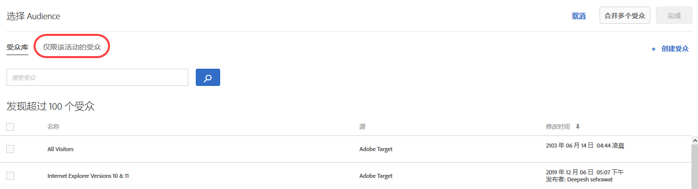 </p> <p>有关更多信息，请参阅<a href="../c-target/creating-activity-only-audience.md#concept_A6BADCF530ED4AE1852E677FEBE68483" format="dita" scope="local">创建仅限该活动的受众</a>。 </p> </li> 
      <li id="li_691812682A5B42C0941324F2BC7D5740"> <p>对于所有活动，您都可以选择一个成功量度，用于确定用户是否符合受众条件。过去，当用户参与活动时，Target 即认定用户符合受众条件，而现在，您可以通过选择成功量度来选择何时评估受众。(TGT-15805) </p> <p>  </p> </li> 
     </ul> </p> <p>有关更多信息，请参阅<a href="../c-target/apply-reporting-audience-success-metric.md#concept_5F11149ACCA84FE79C7B9F766B6B0595" format="dita" scope="local">将报表受众应用到成功量度</a>。 </p> </td> 
  </tr> 
  <tr> 
   <td colname="col1" class="premium"> <p>自动定位 </p> </td> 
   <td colname="col2"> <p> 
     <ul id="ul_6F89BD36373E47C4B3A6F8584D431D82"> 
      <li id="li_5F7B590AF8F24066ADD270E9F75CB12F"> <p>自动定位活动现在支持区段级别的报表。(TGT-22777) </p> <p>有关更多信息，请参阅<a href="../c-activities/auto-target-to-optimize.md#concept_67779E5B7F67427A97D7EA2A6FB919B3" format="dita" scope="local">自动定位以提供个性化体验</a>。 </p> </li> 
      <li id="li_35042E7D6BB04265B42F08A23A774E92"> <p>您可以更改自动定位活动的控制百分比。(TGT-26467) </p> <p> 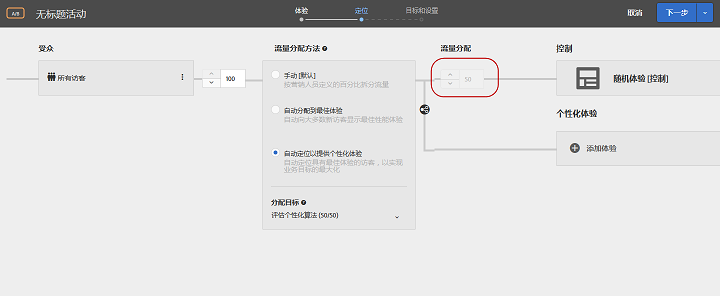 </p> <p>有关更多信息，请参阅<a href="../c-activities/auto-target-to-optimize.md#concept_67779E5B7F67427A97D7EA2A6FB919B3" format="dita" scope="local">自动定位以提供个性化体验</a>。 </p> </li> 
     </ul> </p> </td> 
  </tr> 
  <tr> 
   <td colname="col1"> <p>选件 </p> </td> 
   <td colname="col2"> <p> 
     <ul id="ul_667DDEDDC5284C8393F8BCA5CD9EF12A"> 
      <li id="li_E00DB93297EC4100B46E42D867757DAA"> <p>现在，您可以在选件库中的弹出卡片上查看选件定义详细信息，而无需打开选件。(TGT-26377) </p> <p> 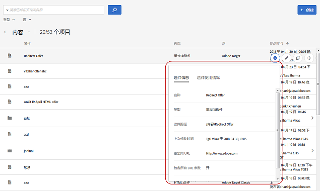 </p> <p>有关更多信息，请参阅<a href="../c-experiences/c-manage-content/manage-content.md#concept_17874A6FCBB743AA84C5988E8571CCF3" format="dita" scope="local">选件</a>。 </p> </li> 
      <li id="li_F71AC4FDAC0E4BEE81D39490E82686C0"> <p>创建活动时，您可以在选件选择器中复制和编辑选件及文件夹。(TGT-26936) </p> <p> 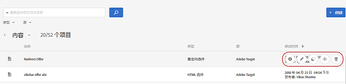 </p> <p>有关更多信息，请参阅<a href="../c-experiences/c-manage-content/manage-content.md#concept_17874A6FCBB743AA84C5988E8571CCF3" format="dita" scope="local">选件</a>。 </p> </li> 
     </ul> </p> </td> 
  </tr> 
  <tr> 
   <td colname="col1"> <p>基于表单的体验编辑器 </p> </td> 
   <td colname="col2"> <p>在基于表单的体验编辑器中，已将“细化”替换为完整受众功能。现有活动的细化规则已迁移到仅限该活动的受众。(TGT-13646) </p> <p>有关更多信息，请参阅<a href="../c-experiences/form-experience-composer.md#task_FAC842A6535045B68B4C1AD3E657E56E" format="dita" scope="local">基于表单的体验编辑器</a>。 </p> </td> 
  </tr> 
  <tr> 
   <td colname="col1"> <p>响应令牌 </p> </td> 
   <td colname="col2"> <p>现在，您可以直接从 Target 中创建响应令牌，而无需等待 Target 为您创建响应令牌或在其中导入响应令牌。以前，在响应令牌 UI 中，您只能看到通过 API 创建的令牌。对该功能的更改还有助于避免响应令牌重复。(TGT-26534) </p> <p>有关更多信息，请参阅<a href="../administrating-target/response-tokens.md#concept_2B21B222F6A344D68CA5929817E836C4" format="dita" scope="local">响应令牌</a>。 </p> </td> 
  </tr> 
 </tbody> 
</table>

**增强功能、修复和更改**

此 [!DNL Target] 版本包括以下面向客户的增强功能、修复和更改：

* 您可以从受众库中删除导入的受众（从 Target Classic、Experience Cloud 等导入）。如果您尝试删除用于活跃活动的受众，Target 会向您发出警告。(TGT-25171)
* 在受众库中，现在会将从 Target Classic 导入的受众标记为 Adobe Target Classic。过去，UI 不会区分 Target Standard/Premium 和 Target Classic。(TGT-27093)
* 现在，收藏集适用于所有标准（包括最近查看的项目）。(TGT-26646)
* 您可以在受众库和选件库中按工作区进行筛选（适用于具有企业用户权限的 Target Premium 用户）。(TGT-26813)
* 改进了报表 UI，以便更好地在表格和筛选器下拉列表的位置中进行滚动。（TGT-23713 和 TGT-26819）

### Target 平台更改（2017 年 13 月 10 日）{#section_6C298C5C3D01415CB4B658EB2166096C}

<table id="table_8457FAE3508F454F9DFDEF093FBD7E40"> 
 <thead> 
  <tr> 
   <th colname="col1" class="entry"> 更改 </th> 
   <th colname="col2" class="entry"> 详细信息 </th> 
  </tr> 
 </thead>
 <tbody> 
  <tr> 
   <td colname="col1"> <p> <span class="filepath"> at.js </span> </p> </td> 
   <td colname="col2"> <p><b>2017 年 10 月 13 日</b> </p> <p> <span class="filepath">at.js</span> 版本 1.2.1 现已可用。有关更多信息，请参阅 <a href="../c-implementing-target/c-implementing-target-for-client-side-web/target-atjs-versions.md#reference_DBB5EDB79EC44E558F9E08D4774A0F7A" format="dita" scope="local">at.js 版本详细信息</a>。 </p> <p> 
     <ul id="ul_14D6BB3B51974789BBFC036A45B7A56B"> 
      <li id="li_AE9826C8FC4A4DF4BE61BB72C2946C93"> <p>修复了对具有 target="_blank" 的链接的点击跟踪阻止 Target 在新的选项卡中打开该链接的问题。 </p> </li> 
     </ul> </p> </td> 
  </tr> 
 </tbody> 
</table>

### Target Standard/Premium 17.9.1（2017 年 9 月 25 日和 2017 年 10 月 12 日） {#section_ECC5DD8B6ED443788B46F53E25FC896E}

此版本包括以下功能和增强功能（括号中的问题编号供 Adobe 内部使用）：

<table id="table_0A8817F64F434875A485FD671C6988AB"> 
 <thead> 
  <tr> 
   <th colname="col1" class="entry"> 功能 </th> 
   <th colname="col2" class="entry"> 描述 </th> 
  </tr> 
 </thead>
 <tbody> 
  <tr> 
   <td colname="col1"> <p> 移动设备体验预览 </p> </td> 
   <td colname="col2"> <p><b>更新日期：2017 年 10 月 12 日</b> </p> <p> 现在，您可以从 UI 中选择多个移动设备应用程序活动，并在设备上预览这些活动。使用此功能，您可以注册多个体验进行预览和 QA，而无需依赖特殊的测试版本和模拟器。 </p> <p>此功能要求您下载并安装相应的 Adobe Mobile SDK 4.14（或更高）版本。 </p> <p>有关更多信息，请参阅 <a href="../c-target-mobile-app/target-mobile-preview.md#concept_5FBF12C2FDFC42429FE4F5CFBD78E19D" format="dita" scope="local">Target 移动设备预览</a>。 </p> </td> 
  </tr> 
  <tr> 
   <td colname="col1"> <p>移动设备批量和预取交付 </p> </td> 
   <td colname="col2"> <p><b>更新日期：2017 年 10 月 12 日</b> </p> <p> 可以在单个调用中预取多个 mbox 的内容，并将其缓存在设备本地，而无需担心最终用户将如何、何时以及是否会看到这些内容。 </p> <p>此功能要求您下载并安装相应的 Adobe Mobile SDK 4.14（或更高）版本。 </p> <p>有关更多信息，请参阅<a href="../c-target-mobile-app/prefetch-offer-content.md#concept_A355D9D55E1C429AA31FA4055A1DDFAF" format="dita" scope="local">预取选件内容</a>。 </p> </td> 
  </tr> 
  <tr> 
   <td colname="col1"> <p>活动 </p> </td> 
   <td colname="col2"> <p>在活动创建工作流中提供了以下增强功能： </p> <p> 
     <ul id="ul_2D251AC11FC54E86AE84DEFFB6FDF43C"> 
      <li id="li_AB8F12B3CF654120BD16EAE570517741"> <p>编辑活动时，您可以对当前显示的步骤进行所需修改，单击拆分按钮上的下拉列表，选择“<span class="wintitle">下一步</span>”以前进到下一步，然后单击“<span class="wintitle">保存并关闭</span>”以保存所做的更改并显示活动“<span class="wintitle">概述</span>”页面，或单击“<span class="wintitle">保存</span>”以保存所做的更改并保留在该步骤。 </p> <p> 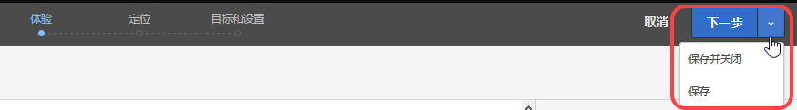 </p> <p>有关更多信息，请参阅<a href="../c-activities/edit-activity.md#concept_BB064C0D4A194BD1A1AE7CCA1E6BB8F0" format="dita" scope="local">编辑活动或另存为草稿</a>。 </p> </li> 
      <li id="li_4C71E2570ECF4BBAB08443D89230CE82"> <p>编辑活动时，您可以打开所需的工作流步骤，进行相应更改（例如更改体验百分比、受众等），然后保存或关闭活动，而不必按照三步引导式工作流进行操作。 </p> <p>  </p> <p>有关更多信息，请参阅<a href="../c-activities/edit-activity.md#concept_BB064C0D4A194BD1A1AE7CCA1E6BB8F0" format="dita" scope="local">编辑活动或另存为草稿</a>。 </p> </li> 
      <li id="li_43C15B13E4F7475E9376A98222AA0253"> <p>创建新活动且尚未对其保存时，或编辑之前保存为草稿形式的活动时，拆分按钮中会显示“<span class="wintitle">保存草稿</span>”选项。 </p> <p> 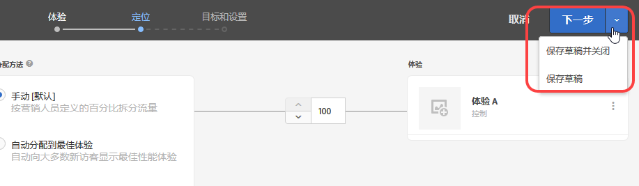 </p> <p>有关更多信息，请参阅<a href="../c-activities/edit-activity.md#concept_BB064C0D4A194BD1A1AE7CCA1E6BB8F0" format="dita" scope="local">编辑活动或另存为草稿</a>。 </p> </li> 
      <li id="li_36EF9AD13B2D40ADB99343C9F758D5FD"> <p>现在，您可以在三步引导式工作流的步骤 2 中通过将鼠标悬停在“<span class="wintitle">选择受众</span>”对话框中的所需受众上方，同时选择定位来编辑或复制受众。 </p> <p>  </p> </li> 
     </ul> </p> <p>有关更多信息，请参阅<a href="../c-activities/t-test-ab/t-test-create-ab/ab-audience.md#concept_A268236C1224451DB7844BF67F41A087" format="dita" scope="local">选择受众</a>。 </p> </td> 
  </tr> 
  <tr> 
   <td colname="col1"> <p>报表 </p> </td> 
   <td colname="col2"> <p>为报表提供了以下新功能和增强功能： </p> <p> 
     <ul id="ul_2D1AF91D1B4E478FBFFA0B83EE30075E"> 
      <li id="li_98E67A4DA8BF4CFF90C279FAC12F4C54"> <p>您可以为报表中的图形选择计数方法。请注意，自动定位活动和自动个性化 (AP) 活动不支持此功能。 </p> <p>有关更多信息，请参阅<a href="../c-reports/c-report-settings/report-settings.md#concept_4BB6A7FDAB6F4806A632F9CD989B8BFA" format="dita" scope="local">报表设置</a>。 </p> </li> 
      <li id="li_5803CE90DB764C9E983702CB6C1AFEE3"> <p>您可以在自动定位 A/B 活动的单个报表中查看多个量度。(TGT-23464) </p> <p>有关更多信息，请参阅<a href="../c-reports/c-report-settings/view-multiple-metrics.md#concept_9E3C3F6F3EC1412FAF252975AC0720B7" format="dita" scope="local">在报表中查看多个量度</a>。 </p> </li> 
     </ul> </p> </td> 
  </tr> 
  <tr> 
   <td colname="col1"> <p>受众 </p> </td> 
   <td colname="col2"> <p>现在，您可以查看从 Target Classic 导入或通过 API 创建的受众的定义。(TGT-22630) </p> <p>  </p> <p>有关更多信息，请参阅<a href="../c-target/c-audiences/audiences.md#concept_65BE870D290E412D8BBF557EEA67C271" format="dita" scope="local">关于受众</a>中的“查看受众定义”。 </p> </td> 
  </tr> 
  <tr> 
   <td colname="col1"> <p>代码编辑器 </p> </td> 
   <td colname="col2"> <p>现在，与可视化体验编辑器 (VEC) 在自定义代码中使用的代码编辑器一样，基于表单的体验编辑器和 HTML 选件编辑器也使用与之相同的代码编辑器。(TGT-25808) </p> <p>通过这项增强功能，在基于表单的体验编辑器中使用代码编辑器以及创建 HTML 选件时，您可以使用以下功能： </p> <p> 
     <ul id="ul_CBB17806FBF34774A8160A61204ED014"> 
      <li id="li_22665F583F1742E280D5BC7EC4203007"> <p>行号现在可见，更加方便使用。 </p> </li> 
      <li id="li_B0D863CDAD2E46A4B133BB86886EB527"> <p>语法高亮显示有助于避免 HTML 选件出现语法错误。 </p> </li> 
     </ul> </p> <p>有关更多信息，请参阅<a href="../c-experiences/c-visual-experience-composer/c-vec-code-editor/vec-code-editor.md#concept_B3A6E9EE3A60406DB640E205EA1745B5" format="dita" scope="local">代码编辑器</a>。 </p> </td> 
  </tr> 
  <tr> 
   <td colname="col1"> <p>地域定位 </p> </td> 
   <td colname="col2"> <p>现在，您可以在地域定位中使用纬度和经度。(TGT-12129) </p> <p>有关更多信息，请参阅<a href="../c-target/c-audiences/c-target-rules/geo.md#concept_5B4D99DE685348FB877929EE0F942670" format="dita" scope="local">地域</a>。 </p> </td> 
  </tr> 
  <tr> 
   <td colname="col1"> <p>Node.JS SDK </p> </td> 
   <td colname="col2"> <p>您可以从 <a href="https://www.npmjs.com/package/@adobe/target-node-client" format="https" scope="external">npm @adobe/target-node-client</a> 安装 node.js SDK，以便轻松地对 node.js 应用程序实施和运行服务器端测试。node.js SDK 中已启用访客 ID 服务，以便连接您的所有 Adobe 数据，并且您还可以选择使用 Adobe Analytics 作为报表源 (A4T)。 </p> </td> 
  </tr> 
 </tbody> 
</table>

**增强功能、修复和更改**

此 [!DNL Target] 版本包括以下面向客户的增强功能、修复和更改（括号中的问题编号供 Adobe 内部使用）：

* 现在，拥有“审批者”权限的用户可以生成并启用配置文件 API 身份验证令牌。(TGT-24074)

   有关更多信息，请参阅[配置文件 API 设置](../c-implementing-target/c-considerations-before-you-implement-target/c-methods-to-get-data-into-target/profile-api-settings.md#concept_5C4ABA5FA64E4D6CAE9C5902572F2794)。

* 在可视化体验编辑器中创建活动时，如果用户重新加载页面，则活动 URL 以及关联的属性会保留在 UI 中。如果活动使用的是混合内容（安全内容和不安全内容混合在一起）或存在权限问题，则可能需要重新加载页面。(TGT-28230)
* 改进了活动使用混合内容（安全内容和不安全内容混合在一起）时显示的消息。消息中提供的信息可帮助用户执行所需的必要步骤，以打开 HTTP 网站或具有混合调用（HTTPS 和 HTTP）的网站。(TGT-26271)

有关更多信息，请参阅[在您的浏览器中启用混合内容](../c-experiences/c-visual-experience-composer/r-troubleshoot-composer/mixed-content.md#concept_46D022D50280468C9EF6D5DF6EFC911C)。

* 改进了用户在配置“设置”、“受众”和“推荐”页面上的选项时发生 Target 会话超时情况的工作流。用户单击“保存”时，会显示会话过期消息，但重新登录后，会出现一个对话框，告知用户已成功登录，而 UI 会停留在 Target 中的同一页面上，且不会丢失任何数据。(TGT-25557)

### Target 平台更改（2017 年 9 月 27 日） {#section_AC32516DFBA64AD2AC9A74171D452778}

<table id="table_701D8D53D1DF4F28ADAC6EC221B0208A"> 
 <thead> 
  <tr> 
   <th colname="col1" class="entry"> 更改 </th> 
   <th colname="col2" class="entry"> 详细信息 </th> 
  </tr> 
 </thead>
 <tbody> 
  <tr> 
   <td colname="col1"> <p> <span class="filepath"> at.js </span> </p> </td> 
   <td colname="col2"> <p><b>2017 年 9 月 27 日</b> </p> <p> <span class="filepath">at.js</span> 版本 1.2.0 现已作为维护版本提供，其中包含大多数错误修复。有关更多信息，请参阅 <a href="../c-implementing-target/c-implementing-target-for-client-side-web/target-atjs-versions.md#reference_DBB5EDB79EC44E558F9E08D4774A0F7A" format="dita" scope="local">at.js 版本详细信息</a>。 </p> <p> 
     <ul id="ul_D11024549C3643C7A756988087498D24"> 
      <li id="li_E1B3994125B64F6AB20B29FE8BCD8459"> <p>修复了阻止对点击跟踪特殊案例执行默认操作的问题。(TNT-28089) </p> </li> 
      <li id="li_53806C902AA04B31B59AA87A1E707348"> <p>修复了对具有 <span class="codeph">target="_blank"</span> 的链接的点击跟踪阻止 Target 在新的选项卡中打开该链接的问题。(TNT-28072) </p> </li> 
      <li id="li_94F5794330D14C71BA07B3F17D0705FD"> <p> IP 地址可用作 Cookie 域。(TNT-28002) </p> </li> 
      <li id="li_7D2A11B17672419583F9632CDA00D28F"> <p>修复了导致使用全局 mbox 或其他区域 mbox 的重定向选件闪烁的问题。(TNT-27978) </p> </li> 
      <li id="li_BA27A749A7A242478080F3D8E04148FC"> <p> 修复了在 VEC 中的“浏览”和“撰写”之间切换时，体验定位活动设置失败的问题。(TNT-27942) </p> </li> 
      <li id="li_FA11ABA5B9CD435080426805C5359A51"> <p> 修复了对点击跟踪元素的闪烁样式类处理不当的问题。(TNT-27896) </p> </li> 
      <li id="li_E2DFBAE52FCA4996BA083868CBFCCD10"> <p>修复了导致全局 mbox 参数与所有 mbox 参数混合在一起的问题。(TNT-27846) </p> </li> 
      <li id="li_B3153BBD66AA4D51AE81EF6C903CF78D"> <p>进行了相应更改，以确保 <span class="filepath">at.js</span> 正确处理 Handlebars、Mustache 及其他客户端模板库。(TNT-27831) </p> </li> 
      <li id="li_B859939C1B5A4DF78CF8ADF236B88306"> <p>进行了相应更改，以确保正确初始化 <span class="codeph">sdidParamExpiry</span>，并将其传递到访客 API。这是添加到 <span class="codeph">at.js 1.1.0</span> 中的回归参数。之前的 <span class="filepath">at.js</span> 版本不会受到影响。此更改仅影响使用重定向选件和 A4T 的客户端。(TNT-27791) </p> </li> 
      <li id="li_24A748DFB7824AE6AC7331B7EA940BFF"> <p>进行了相应更改，以确保不论使用何种类型的属性，均会执行 <span class="codeph">SCRIPT</span>。(TNT-27865) </p> </li> 
     </ul> </p> </td> 
  </tr> 
  <tr> 
   <td colname="col1"> <p>体验定位 (XT) </p> </td> 
   <td colname="col2"> <p><b>2017 年 9 月 21 日</b> </p> <p>在 9 月 21 日发行的版本中，Target 将更改在体验定位 (XT) 活动（Target Classic 中的登陆页面促销活动）中将用户置于体验的方式。对于 Target Standard/Premium 和 Target Classic 中的所有新活动和现有活动，用户必须在每次展示时符合体验定位规则，才能继续看到体验内容，并被计入报表中。以前，如果用户不再符合任何体验的参加条件，用户将继续能够看到他们之前符合参加条件的最后一个体验的内容，并被计入该体验的报表中。 </p> <p>这是此版本推出的一项更改，所有现有活动以及在此版本发行之后创建的任何新活动都将自动进行此更改。如果需要使用以前的方法（9 月 21 日之前），则可以使用配置文件脚本创建受众，这样，用户只需满足条件一次，以后便会一直符合该受众条件。之后，可以在活动的各个体验中使用这些受众。 </p> </td> 
  </tr> 
 </tbody> 
</table>

### Target Standard/Premium 17.8.1（2017 年 8 月 22 日） {#section_71A554D072F04B18B359C1626529E5D8}

<table id="table_AAC16F89060D4CC09762A370B86C0885"> 
 <thead> 
  <tr> 
   <th colname="col1" class="entry"> 功能 </th> 
   <th colname="col2" class="entry"> 描述 </th> 
  </tr> 
 </thead>
 <tbody> 
  <tr> 
   <td colname="col1" class="premium"> <p>Target Premium 的企业用户权限 </p> </td> 
   <td colname="col2"> <p>在 Target 中创建单独的工作区，然后为用户分配对各个数字属性的不同角色和权限。 </p> <p>有关更多信息，请参阅<a href="../administrating-target/c-user-management/property-channel/property-channel.md#concept_E396B16FA2024ADBA27BC056138F9838" format="dita" scope="local">企业用户权限</a>。 </p> <p>请参阅<a href="../r-release-notes/known-issues-resolved-issues.md#concept_625C3A16B7F24D4B82EFF130F0945541" format="dita" scope="local">已知问题和已解决的问题</a>，以了解有关此推出版本的更多信息。 </p> </td> 
  </tr> 
  <tr> 
   <td colname="col1"> <p>QA 模式 </p> </td> 
   <td colname="col2"> <p>通过永不变更的预览链接、可选的受众定位以及从实时活动数据中分段的 QA 报表，执行简单的活动 QA。 </p> <p>有关更多信息，请参阅<a href="../c-activities/c-activity-qa/activity-qa.md#concept_9329EF33DE7D41CA9815C8115DBC4E40" format="dita" scope="local">活动 QA</a>。 </p> </td> 
  </tr> 
 </tbody> 
</table>

**增强功能、修复和更改**

此 [!DNL Target] 版本包括以下面向客户的增强功能、修复和更改（括号中的问题编号供 Adobe 内部使用）：

* 我们在 Target UI 中添加了更多使您无需打开受众，即可在弹出卡片中查看受众定义详细信息的位置。请注意，此功能仅适用于在 [!DNL Target Standard/Premium. (TGT-25772)] 中创建的受众。
* 现在，您可以在活动创建/概述中查看临时受众的定义。(TGT-25570)
* 以下变量现在可用作 [Velocity](../c-recommendations/c-design-overview/customizing-a-template.md#concept_94F1554C3F2E4CDB9A2C3D78F10EDA59) 数组：`entiites` 和 `entityN.categoriesList`。

### Target 平台更改（2017 年 8 月 3 日）{#section_FA5BF6808EA74F3A9E8E941530879208}

<table id="table_1B43199F1AE64E69AE65313B23741444"> 
 <thead> 
  <tr> 
   <th colname="col1" class="entry"> 更改 </th> 
   <th colname="col2" class="entry"> 详细信息 </th> 
  </tr> 
 </thead>
 <tbody> 
  <tr> 
   <td colname="col1"> <p> <span class="filepath"> at.js </span> </p> </td> 
   <td colname="col2"> <p><b>2017 年 8 月 3 日</b> </p> <p> <span class="filepath">at.js</span> 版本 1.1 现已可用。有关更多信息，请参阅<a href="../c-implementing-target/c-implementing-target-for-client-side-web/how-to-deployatjs/implementing-target-without-a-tag-manager.md#concept_1E1F958F9CCC4E35AD97581EFAF659E2" format="dita" scope="local">下载 at.js</a>。 </p> <p><span class="filepath">at.js</span> 版本 1.1 中包含以下增强功能和修复： </p> <p> 
     <ul id="ul_B7408267413347888938E2E7D48ABDBD"> 
      <li id="li_4DDF6DCFE6014C6795B6A9C9DFB54C21"> <p>添加了响应令牌处理功能。有关更多信息，请参阅<a href="../administrating-target/response-tokens.md#concept_2B21B222F6A344D68CA5929817E836C4" format="dita" scope="local">响应令牌</a>。 </p> </li> 
      <li id="li_741CD22B7D074FBA90180B2E36FACE0D"> <p>解决了相应问题，以便 <span class="codeph">document.currentScript polyfill</span> 不会妨碍 Angular 1.X。 </p> </li> 
      <li id="li_EF1B3D3DCC7F4D2490D2BFE660EC661C"> <p>进行了相应更改，以确保点击跟踪不会妨碍可见性属性。点击跟踪元素使用 <span class="codeph">at-element-click-tracking</span> CSS 类进行标记，而不使用 <span class="codeph">at-element-marker</span>。 </p> </li> 
     </ul> </p> </td> 
  </tr> 
  <tr> 
   <td colname="col1"> <p> <span class="filepath"> mbox.js </span> </p> </td> 
   <td colname="col2"> <p><b>2017 年 7 月 18 日</b> </p> <p> <span class="filepath">mbox.js</span> 版本 63 现已可用。有关更多信息，请参阅<a href="../c-implementing-target/c-implementing-target-for-client-side-web/t-mbox-download/target-download-config-mbox.md#task_4EAE26BB84FD4E1D858F411AEDF4B420" format="dita" scope="local">下载 mbox.js</a>。 </p> <p><span class="filepath">mbox.js</span> 版本 63 中包含以下增强功能和修复： </p> <p> 
     <ul id="ul_F876FABA804A459D84387102DC38B7DC"> 
      <li id="li_E840AFDFAD394F5E9CDF52FABCA27EF7">修复了使用 <span class="codeph">mboxDefine()</span> 和 <span class="codeph">mboxUpdate()</span> 生成 SDID 时出现的问题。此问题仅影响在页面上具有访客 API 的客户端。 </li> 
     </ul> </p> </td> 
  </tr> 
 </tbody> 
</table>

### Target Standard/Premium 17.7.3（2017 年 8 月 3 日） {#section_D90CB766679442C7A0642E5D79657674}

<table id="table_C81EA97B251547169BC9681E5DDB4B8F"> 
 <thead> 
  <tr> 
   <th colname="col1" class="entry"> 功能 </th> 
   <th colname="col2" class="entry"> 描述 </th> 
  </tr> 
 </thead>
 <tbody> 
  <tr> 
   <td colname="col1"> <p>响应令牌 </p> </td> 
   <td colname="col2"> <p>响应令牌允许您在用于交付活动（即显示 mbox）的 Target 响应中自动输出符合条件的变量（如配置文件属性）。响应令牌可用于调试目的，或用于与第三方提供程序（如 Clicktale）进行集成。 </p> <p>响应令牌类似于 <span class="keyword">Adobe Target Classic</span> 服务器插件，可在这两种解决方案之间实现功能对等性。 </p> <p> <p>注意：响应令牌在 <span class="filepath">at.js</span> 1.1 或更高版本中可用。<span class="codeph">mbox.js</span> 不支持响应令牌。 </p> </p> <p>有关更多信息，请参阅<a href="../administrating-target/response-tokens.md#concept_2B21B222F6A344D68CA5929817E836C4" format="dita" scope="local">响应令牌</a>。 </p> </td> 
  </tr> 
 </tbody> 
</table>

### Target Standard/Premium 17.7.2（2017 年 7 月 27 日） {#section_6980EC04D3CF4A00919953B9B10BC472}

<table id="table_DB51BD66756F4EBD875ED008B2C7C5D0"> 
 <thead> 
  <tr> 
   <th colname="col1" class="entry"> 功能 </th> 
   <th colname="col2" class="entry"> 描述 </th> 
  </tr> 
 </thead>
 <tbody> 
  <tr> 
   <td colname="col1" class="premium"> <p>自动定位 </p> </td> 
   <td colname="col2"> <p>现在，所有 Target Premium 客户均可使用自动定位功能。 </p> <p>自动定位可使用先进的机器学习技术从营销人员定义的多个高性能体验中进行识别，并根据每位访客的个人客户配置文件和具有相似配置文件的先前访客的行为，向每位访客提供量身定制的体验，以便个性化内容并促进转化。 </p> <p>在使用三步引导式工作流创建 A/B 活动时，您可以选择使用“<span class="wintitle">自动定位以提供个性化体验</span>”选项来分配流量： </p> <p> 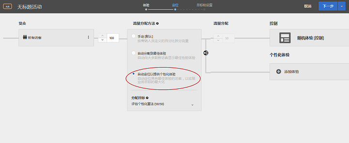 </p> <p>有关更多信息，请参阅<a href="../c-activities/auto-target-to-optimize.md#concept_67779E5B7F67427A97D7EA2A6FB919B3" format="dita" scope="local">自动定位以提供个性化体验</a>。 </p> </td> 
  </tr> 
 </tbody> 
</table>

### Target Standard/Premium 17.7.1（2017 年 7 月 20 日） {#section_BB75DE30174F4ADD963451909FB81D74}

<table id="table_BCE36E0D56804E7B8861858DCF2F380E"> 
 <thead> 
  <tr> 
   <th colname="col1" class="entry"> 功能 </th> 
   <th colname="col2" class="entry"> 描述 </th> 
  </tr> 
 </thead>
 <tbody> 
  <tr> 
   <td colname="col1"> <p>受众 </p> </td> 
   <td colname="col2"> <p>现在，在 Target UI 中的多个位置，您无需打开受众，即可在弹出卡片中查看受众定义详细信息。请注意，此功能仅适用于在 <span class="keyword">Target Standard/Premium</span> 中创建的受众。 </p> <p>  </p> </td> 
  </tr> 
  <tr> 
   <td colname="col1"> <p>成功量度 </p> </td> 
   <td colname="col2"> <p>以前，Target 允许存在对单个量度的依赖关系，且必须先达到该量度，然后才能递增其计数。现在，您可以提供对多个量度的依赖关系，并且还可以灵活选择是否应实现指定的量度才能递增计数。 </p> <p>在以下情况下，不支持使用多量度依赖关系功能： </p> <p> 
     <ul id="ul_EC856F910B704D648065EA7DA13EE5B0"> 
      <li id="li_1A82414FE50B414CAA1A0A88E80BCC1B"> <p>“推荐”活动。其他所有活动类型均支持此功能。 </p> </li> 
      <li id="li_2D6CF42264D445FCB6C400ED321DE952"> <p>使用 Analytics 作为报表源 (A4T)。 </p> </li> 
      <li id="li_E3A983A70BB04AE8B25A7CEC1F5FE1D9"> <p>量度类型为“已查看页面”。 </p> </li> 
      <li id="li_9AAF6BB275F7489BA691676E308172D5"> <p>可视化体验编辑器 (VEC) 活动的量度类型为“已单击元素”。 </p> </li> 
     </ul> </p> <p>有关更多信息，请参阅以下主题： </p> <p> 
     <ul id="ul_4B0EFFDD257C42579E19569DCBE15BE3"> 
      <li id="li_2402575F27F547968BD536C460BF81B5"> <p>A/B：<a href="../c-activities/t-test-ab/t-test-create-ab/ab-goals-and-settings.md#reference_B25389FD6F3A4989801E740364B089CC" format="dita" scope="local">目标和设置 </a> </p> </li> 
      <li id="li_FB5E7CBC0154406C989F5A5C6CAA0C8F"> <p>自动个性化 (AP)：<a href="../c-activities/t-automated-personalization/create-ap-activity.md#task_8AAF837796D74CF893CA2F88BA1491C9" format="dita" scope="local">创建自动个性化活动 </a> </p> </li> 
      <li id="li_57C36A7945A24A52BCBD62CA0F15B668"> <p>体验定位 (XT)：<a href="../c-activities/t-experience-target/t-xt-create/xt-goals-and-settings.md#reference_B25389FD6F3A4989801E740364B089CC" format="dita" scope="local">目标和设置 </a> </p> </li> 
      <li id="li_06674A3152A547268A1AE5EE818EF1A5"> <p>多变量测试 (MVT)：<a href="../c-activities/c-multivariate-testing/t-create-multivariate-test/goals-and-settings.md#reference_B25389FD6F3A4989801E740364B089CC" format="dita" scope="local">目标和设置 </a> </p> </li> 
     </ul> </p> </td> 
  </tr> 
  <tr> 
   <td colname="col1"> <p>报表（自动分配 A/B 测试） </p> </td> 
   <td colname="col2"> <p>现在，为自动分配 A/B 活动提供了查看多个量度的功能。 </p> <p>有关更多信息，请参阅<a href="../c-reports/c-report-settings/view-multiple-metrics.md#concept_9E3C3F6F3EC1412FAF252975AC0720B7" format="dita" scope="local">在报表中查看多个量度</a>。 </p> </td> 
  </tr> 
  <tr> 
   <td colname="col1"> <p>受众 </p> </td> 
   <td colname="col2"> <p>现在，“受众”网站页面类型和比较运算符与 Target Classic 中的类型和比较运算符相一致。 </p> <p>现在，您可以使用自己的“用户定义的查询参数”或“用户定义的标头”来创建网站页面受众。 </p> <p>有关更多信息，请参阅<a href="../c-target/c-audiences/c-target-rules/site-pages.md#concept_6425D5304568490899E8340CC94798A9" format="dita" scope="local">网站页面</a>。 </p> </td> 
  </tr> 
  <tr> 
   <td colname="col1"> <p>活动 </p> </td> 
   <td colname="col2"> <p>现在，“活动”列表允许您按“自动分配”和“自动定位”活动类型进行筛选。 </p> <p>有关更多信息，请参阅<a href="../c-activities/activities.md#concept_D317A95A1AB54674BA7AB65C7985BA03" format="dita" scope="local">活动</a>。 </p> </td> 
  </tr> 
  <tr> 
   <td colname="col1" class="premium"> <p>推荐标准和促销活动 </p> </td> 
   <td colname="col2"> <p>现在，按“实体属性匹配”、“配置文件属性匹配”和“参数匹配”进行筛选时，您可以处理空值。 </p> <p>有关更多信息，请参阅<a href="../c-recommendations/c-algorithms/use-dynamic-and-static-inclusion-rules.md#concept_4CB5C0FA705D4E449BD0B37B3D987F9F" format="dita" scope="local">使用动态和静态包含规则</a>。 </p> </td> 
  </tr> 
 </tbody> 
</table>

此 [!DNL Target] 版本包括以下面向客户的增强功能和修复（括号中的问题编号供 Adobe 内部使用）：

* 改进了用户在创建或编辑活动或选件时发生 [!DNL Target] 会话超时情况的工作流。用户单击“[!UICONTROL 保存]”时，会显示会话过期消息，但重新登录后，会出现一个对话框，告知用户已成功登录，而 UI 会停留在 [!DNL Target] 中的同一页面上，且不会丢失任何数据。

   如果用户在 [!DNL Target] 页面上执行间歇性操作时遇到会话超时情况，则系统会指引用户重新登录，之后会将用户定向到在 [!DNL Target] UI 中处理的最后一个页面。

* 修复了当用户离开当前浏览内容（更改体验、切换页面、切换受众或单击“下一步”等等）且忘记保存更改时，导致自定义代码更改丢失的问题。现在，系统会提示用户保存更改。(TGT-23766)
* 将活动存档后，会显示“已将此活动存档”，而不是“正在更新此活动”。(KB-1517)
* 已将 Target UI 中以下位置的下拉选择器替换为自动完成功能，以便提高速度和改善性能：(TGT-22939)

   * 活动页面 &gt; *活动* &gt; 步骤 3 &gt; 报表包选择器
   * 受众 &gt; 创建受众 &gt; 访客配置文件
   * 推荐 &gt; 信息源创建 &gt; 时间源类型 &gt; Analytics &gt; 报表包选择器

* 改进了网站将“X-Frame-options”设置为 SAMEORIGIN，且网站无法在可视化体验编辑器 (VEC) 中加载时显示的错误消息。消息会提示用户在“设置”&gt;“首选项”中切换到增强型体验编辑器。(TGT-17356)
* 现在，Target Standard/Premium 中的报表会以您的帐户所在的时区来显示，而不是以 Target 服务器所在的时区（美国东部标准时间）来显示。(TGT-24868)
* 如果在 [!DNL Target] 中创建的活动从 [!DNL Target] 外部进行了更新（例如，通过 Adobe I/O），则下列活动属性将会导入到 [!DNL Target] 当中：

   `thirdpartyId`

   `startDate`

   `endDate`

   `status`

   `priority`

   `marketingCloudMetadata(remoteModifiedBy)`

   此导入作业将在活动页面打开时运行，最长会有 10 分钟延迟。(KB-1526)

### Target 平台更改（2017 年 7 月 18 日） {#section_08A2B80060FE4833B1BDD12D1AF5E3D6}

<table id="table_17607030DA7948819F73FA9F2B22AB5B"> 
 <thead> 
  <tr> 
   <th colname="col1" class="entry"> 更改 </th> 
   <th colname="col2" class="entry"> 详细信息 </th> 
  </tr> 
 </thead>
 <tbody> 
  <tr> 
   <td colname="col1"> <p> <span class="filepath"> mbox.js </span> </p> </td> 
   <td colname="col2"> <p><b>2017 年 7 月 18 日</b> </p> <p> <span class="filepath">mbox.js</span> 版本 63 现已可用。有关更多信息，请参阅<a href="../c-implementing-target/c-implementing-target-for-client-side-web/t-mbox-download/target-download-config-mbox.md#task_4EAE26BB84FD4E1D858F411AEDF4B420" format="dita" scope="local">下载 mbox.js</a>。 </p> <p><span class="filepath">mbox.js</span> 版本 63 中包含以下增强功能和修复： </p> <p> 
     <ul id="ul_6C88DB6332A94858B278F7F846E2F8EB"> 
      <li id="li_597D15CAD9DA44008FEC01E6BB3CB9A7">修复了使用 <span class="codeph">mboxDefine()</span> 和 <span class="codeph">mboxUpdate()</span> 生成 SDID 时出现的问题。此问题仅影响在页面上具有访客 API 的客户端。 </li> 
     </ul> </p> </td> 
  </tr> 
  <tr> 
   <td colname="col1"> <p> <span class="filepath"> at.js </span> </p> </td> 
   <td colname="col2"> <p><b>2017 年 7 月 7 日</b> </p> <p> <span class="filepath">at.js</span> 版本 1.0 现已可用。有关更多信息，请参阅<a href="../c-implementing-target/c-implementing-target-for-client-side-web/how-to-deployatjs/implementing-target-without-a-tag-manager.md#concept_1E1F958F9CCC4E35AD97581EFAF659E2" format="dita" scope="local">下载 at.js</a>。 </p> <p><span class="filepath">at.js</span> 版本 1.0 中包含以下增强功能和修复： </p> <p> 
     <ul id="ul_4407D3923CE34CD8AD7120A2580A34DF"> 
      <li id="li_34C8D0572A0340DF99294DD33E352D2C"> <p>支持异步加载 at.js，以提高页面加载速度。 </p> </li> 
      <li id="li_BC944624B3104418854140484E682D69"> <p>支持在异步加载 at.js 时预先隐藏页面内容。 </p> </li> 
      <li id="li_F9D0AD095A2A425CB78772DDE8FCCF97"> <p>改进了在禁用内容交付时显示的错误消息。 </p> </li> 
      <li id="li_4B32468665A34FC0AF66C1CD15DE7AFC"> <p>改进了交付多个活动时的性能。 </p> </li> 
      <li id="li_48EAD25A4077411E954CCCDB95058924"> <p>支持 YUI 压缩工具。 </p> </li> 
      <li id="li_3598B4223C0A478D956A7EC618BFBCD6"> <p>在活动交付期间报告自定义事件的错误。 </p> </li> 
      <li id="li_28A5DDF1A9D64D66BF8BD0E89E5BD69B"> <p>修复了 Microsoft Internet Explorer 11 中的性能问题。 </p> </li> 
      <li id="li_BB1C11A76FB14341AB7699F2C7753377"> <p>修复了在某些网站上发生错误的 <span class="codeph">getOffer()</span> 函数。 </p> </li> 
      <li id="li_4C7F3DE9A0A346C38E9EDCE21C83843D"> <p>以异步方式加载 Target 库。 </p> </li> 
     </ul> </p> </td> 
  </tr> 
 </tbody> 
</table>

### Target Standard/Premium 17.6.2（2017 年 6 月 22 日） {#section_F0372B07B56E454CB048CE79FF56E9CD}

<table id="table_8C4DB1B83B874E4C85CE9FF352E7B857"> 
 <thead> 
  <tr> 
   <th colname="col1" class="entry"> 功能 </th> 
   <th colname="col2" class="entry"> 描述 </th> 
  </tr> 
 </thead>
 <tbody> 
  <tr> 
   <td colname="col1" class="premium"> <p>自动个性化 (AP) 活动 </p> </td> 
   <td colname="col2"> <p> 
     <ul id="ul_F5BB1074DD4140C798CB55D68DEEF824"> 
      <li id="li_9596AABA14C64DEEB2E70E8ADED8AA74">自动个性化活动可使用基于表单的编辑器来创建。 </li> 
      <li id="li_315F5FF590404670A677FEA6E4E0DF5D">为自动个性化新增了置信度数值。 </li> 
     </ul> </p> </td> 
  </tr> 
  <tr> 
   <td colname="col1" class="premium"> <p>推荐：标准和促销活动 </p> </td> 
   <td colname="col2"> <p> 现在，您可以根据配置文件属性匹配和参数匹配来创建动态标准和促销活动。 </p> <p> 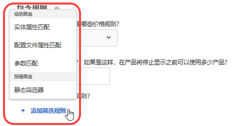 </p> <p> <p>注意：如果您熟悉 Target 17.6.1 版本（2017 年 6 月）之前的包含规则配置方式，那么您可能会注意到一些选项和运算符已经发生了变化。为了更加一致和直观，现在，只有那些适用于选定选项的运算符才会显示，而且部分运算符进行了重命名（“匹配”现在为“等于”）。此版本之前创建的所有已有排除规则均会迁移到新的结构中。您不需要重新调整结构。 </p> </p> </td> 
  </tr> 
  <tr> 
   <td colname="col1"> <p>VEC 代码编辑器改进 </p> </td> 
   <td colname="col2"> <p> 现在，如果页面格式发生更改，且无法应用相应操作，则会在每个失败的操作旁边显示一条警告消息。以前，只会显示一条通用错误消息，通知用户页面结构已发生更改。现在，代码编辑器会高亮显示每个失败的操作。 </p> </td> 
  </tr> 
 </tbody> 
</table>

此 [!DNL Target] 版本包括以下面向客户的增强功能和修复：

* 改进了主机组和推荐实体搜索页面的性能。
* 整个 Target 中的错误消息更具描述性，特别是与同步失败有关的错误消息。
* 修复了导致出现以下情况的问题：在创建排除组后应用自动去除重复项功能时，UI 中活动图的计数有时会不正确。
* 修复了在对具有排除组的现有活动进行编辑后，UI 中可能无法正确反映手动包含项的问题。

### Target Standard/Premium 17.6.1（2017 年 6 月 8 日） {#section_1D05FE23CE3744DDB5D28E933341F575}

<table id="table_47117524922A472AA977C652B581B356"> 
 <thead> 
  <tr> 
   <th colname="col1" class="entry"> 功能 </th> 
   <th colname="col2" class="entry"> 描述 </th> 
  </tr> 
 </thead>
 <tbody> 
  <tr> 
   <td colname="col1"> <p>体验定位 (XT) 活动 </p> </td> 
   <td colname="col2"> <p>使用拖放功能，您可以在创建或编辑 XT 活动时，按所需顺序来排列受众和体验。将按从上到下的顺序评估访客的体验。 </p> <p> 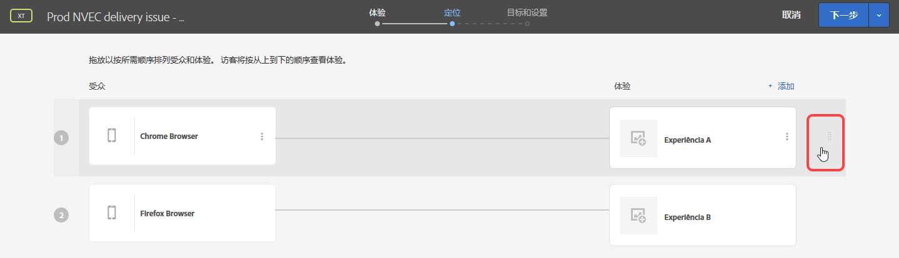 </p> <p>有关更多信息，请参阅<a href="../c-activities/t-experience-target/t-xt-create/xt-add-experience.md#task_454646F2895242D3B92DC395A0CE1A00" format="dita" scope="local">创建体验</a>。 </p> </td> 
  </tr> 
  <tr> 
   <td colname="col1"> <p>报表：A/B、XT 和推荐 </p> </td> 
   <td colname="col2"> <p>A/B、XT 和“推荐”活动的报表包含可视化图表，可直观地向您显示置信区间和提升度，以便您能够更准确地确定入选者。您可以将鼠标悬停在可视化图表上，以查看实际的数字。此功能不可用于使用 Analytics 作为报表源 (A4T) 的活动。 </p> <p>  </p> <p>有关更多信息，请参阅<a href="../c-reports/c-report-settings/report-settings.md#concept_4BB6A7FDAB6F4806A632F9CD989B8BFA" format="dita" scope="local">报表设置</a>。 </p> </td> 
  </tr> 
  <tr> 
   <td colname="col1" class="premium"> <p>自动个性化 (AP) 活动 </p> </td> 
   <td colname="col2"> <p>您可以在 AP 活动中创建排除组，以确保自动排除具有指定选件的体验。 </p> </td> 
  </tr> 
  <tr> 
   <td colname="col1" class="premium"> <p>推荐：标准和促销活动 </p> </td> 
   <td colname="col2"> <p><b>（计划于 2017 年 6 月 22 日发布）</b>现在，您可以根据配置文件属性匹配和参数匹配来创建动态标准和促销活动。 </p> <p>  </p> <p>有关更多信息，请参阅<a href="../c-recommendations/c-algorithms/use-dynamic-and-static-inclusion-rules.md#concept_4CB5C0FA705D4E449BD0B37B3D987F9F" format="dita" scope="local">使用动态和静态包含规则</a>。 </p> <p> <p>注意：如果您熟悉 Target 17.6.1 版本（2017 年 6 月）之前的包含规则配置方式，那么您可能会注意到一些选项和运算符已经发生了变化。为了更加一致和直观，现在，只有那些适用于选定选项的运算符才会显示，而且部分运算符进行了重命名（“匹配”现在为“等于”）。此版本之前创建的所有已有排除规则均会迁移到新的结构中。您不需要重新调整结构。 </p> </p> </td> 
  </tr> 
  <tr> 
   <td colname="col1"> <p>命名活动 </p> </td> 
   <td colname="col2"> <p>现在，系统会在保存活动之前提示您对活动命名。如果没有名称，您将无法保存活动。 </p> </td> 
  </tr> 
  <tr> 
   <td colname="col1"> <p>Target 论坛的新位置 </p> </td> 
   <td colname="col2"> <p> 已将 Target 论坛移至新的 <a href="https://forums.adobe.com/community/experience-cloud/marketing-cloud/target" format="https" scope="external">Adobe 社区平台</a>。 </p> </td> 
  </tr> 
 </tbody> 
</table>

此 [!DNL Target] 版本包括以下面向客户的增强功能和修复（括号中的问题编号供 Adobe 内部使用）：

* 修复了 [!DNL mbox.js] 的 XSS 安全性问题。此修复属于服务器端修复，不需要更新 [!DNL mbox.js]。

### Target Standard/Premium 17.4.1（2017 年 4 月 27 日） {#section_24E6889AF1E0405497F6F77A407A9A46}

此版本包括以下功能和增强功能：

<table id="table_9554D0094421417C88548BDC97B710F5"> 
 <thead> 
  <tr> 
   <th colname="col1" class="entry"> 功能 </th> 
   <th colname="col2" class="entry"> 详细信息 </th> 
  </tr> 
 </thead>
 <tbody> 
  <tr> 
   <td colname="col1"> 报表 </td> 
   <td colname="col2"> <p><b>查看多个目标/量度：</b>现在，您可以在 A/B 活动和体验定位 (XT) 活动中查看多个量度，但<a href="../c-activities/automated-traffic-allocation/automated-traffic-allocation.md#concept_A1407678796B4C569E94CBA8A9F7F5D4" format="dita" scope="local">自动分配</a>和<a href="../c-activities/auto-target-to-optimize.md#concept_67779E5B7F67427A97D7EA2A6FB919B3" format="dita" scope="local">自动定位</a> A/B 活动除外。 </p> <p>有关更多信息，请参阅<a href="../c-reports/c-report-settings/view-multiple-metrics.md#concept_9E3C3F6F3EC1412FAF252975AC0720B7" format="dita" scope="local">在报表中查看多个量度</a>。 </p> </td> 
  </tr> 
 </tbody> 
</table>

此 [!DNL Target] 版本重点关注后端修复，其中包括以下面向客户的增强功能和修复（括号中的问题编号供 Adobe 内部使用）：

* 修复了导致活动“高级设置”中的“递增计数、释放用户并允许再次进入”设置无法正常工作的问题。(TNT-26556)
* 修复了在 Experience Cloud 用户界面中使用 NULL 更新“客户属性”数据后，导致无法从 Target 中删除该数据的问题。(TNT-26462)

### Target 平台更改（2017 年 4 月 13 日） {#section_B59C26405EB7482AA80820D6D39B9C44}

<table id="table_6167ECB7B44F40DCADF299F46F1F795C"> 
 <thead> 
  <tr> 
   <th colname="col1" class="entry"> 更改 </th> 
   <th colname="col2" class="entry"> 详细信息 </th> 
  </tr> 
 </thead>
 <tbody> 
  <tr> 
   <td colname="col1"> <p> <span class="filepath"> at.js </span> </p> </td> 
   <td colname="col2"> <p> <span class="filepath">at.js</span> 版本 0.9.6 现已可用。有关更多信息，请参阅<a href="../c-implementing-target/c-implementing-target-for-client-side-web/how-to-deployatjs/implementing-target-without-a-tag-manager.md#concept_1E1F958F9CCC4E35AD97581EFAF659E2" format="dita" scope="local">下载 at.js</a>。 </p> <p><span class="filepath">at.js</span> 版本 0.9.6 中包含以下增强功能和修复： </p> <p> 
     <ul id="ul_108DF85393614C69988E299485D338FD"> 
      <li id="li_4117C900982240B5AFFCFE1B2716A443"> <p>对 A4T 的重定向选件支持。下载并安装 <span class="filepath">at.js</span> 版本 0.9.6 后，您可以在将 <span class="keyword">Adobe Analytics</span> 用作 <span class="keyword">Target</span> 报表源（即使用 A4T）的活动中使用重定向选件。除了 <span class="filepath">at.js</span> 版本 0.9.6 之外，您的实施还必须满足其他最低要求，才能使用重定向选件和 A4T。有关更多信息以及其他应了解的重要信息，请参阅<a href="../c-integrating-target-with-mac/a4t/r-a4t-faq/a4t-faq-redirect-offers.md#concept_21BF213F10E1414A9DCD4A98AF207905" format="dita" scope="local">重定向选件 - A4T 常见问题解答</a>。 </p> </li> 
      <li id="li_DA5321D72E81496DB7C49D589E1A59C4"> <p>在 <span class="filepath">at.js</span> 0.9.6 发布之前，如果页面上存在访客 API，且 <span class="codeph">visitorApiTimeout</span> 设置过于短促，则 Target 可能会出现以下情况：在 <span class="keyword">Target</span> 请求中未发送任何 MCID 数据。使用 A4T 时，这可能会导致诸如 <span class="keyword">Analytics</span> 中的点击无法整合的问题。 </p> <p><span class="filepath">at.js</span> 0.9.6 已更改此行为，即使将 <span class="codeph">visitorApiTimeout</span> 设置为 1 毫秒，Target 仍会尝试收集 SDID、跟踪服务器和客户 ID 数据，并在 Target 请求中发送这些数据。 </p> </li> 
      <li id="li_B11CE11D9A594CB1ABB85BD0D93C4A15"> <p>添加了 <span class="codeph">selectorsPollingTimeout</span> 设置。有关更多信息，请参阅 <a href="../c-implementing-target/c-implementing-target-for-client-side-web/cmp-atjs-functions.md#concept_8DACBC47ABDE4279BB102B42609FE506" format="dita" scope="local">targetGlobalSettings()</a>。 </p> </li> 
      <li id="li_D6F862099A374FE394F4DA3520A1BBF0"> <p>更改了来自 <span class="codeph">getOffer()</span> 的响应格式。有关更多信息，请参阅 <a href="../c-implementing-target/c-implementing-target-for-client-side-web/cmp-atjs-functions.md#reference_C81525D1598A4A1199740DCAB81A7FDF" format="dita" scope="local">adobe.target.getOffer(options)</a>。 </p> </li> 
      <li id="li_80166567ED8945ECB37FEEE2C5F06ACE"> <p>为不支持的 <span class="codeph">&lt;!DOCTYPE&gt;</span> 声明添加了控制台日志记录。 </p> </li> 
      <li id="li_02904EBAE8D3400092B762F0B28B0C86"> <p>修复了将多个默认选件交付到单个 mbox 时，无法正确应用 <span class="keyword">Target Classic</span> 插件的问题。(TGT-22664)</p> </li> 
      <li id="li_7016022D9DDE4529B77984F195825AB7"> <p>改进了双字符顶级域 (TLD) 的 Cookie 设置，以确保为这些域（例如，<span class="filepath">test.no</span>、<span class="filepath">autodrives.ca</span> 等）正确设置 mbox Cookie。 </p> </li> 
      <li id="li_3B1F618DEC744056B5BB172C4DBB359A"> <p><span class="codeph">at.js</span> 版本 0.9.6 中更改了对保存 Cookie 时应使用的顶级域进行提取的算法。由于进行了这项更改，Cookie 不能保存到使用 IP 的地址中。在大多数情况下，IP 地址都用于测试目的，但作为变通方法，您可以使用 DNS 条目或调整本地框中的主机文件。 </p> </li> 
      <li id="li_A52181499E63402DB4E16E33E36A9400"> <p>修复了当属性是字符串值而不是整数时的移动和重新排列操作处理方式。 </p> </li> 
     </ul> </p> <p>有关此版本 <span class="filepath">at.js</span> 以及之前版本的信息，请参阅 <a href="../c-implementing-target/c-implementing-target-for-client-side-web/target-atjs-versions.md#reference_DBB5EDB79EC44E558F9E08D4774A0F7A" format="dita" scope="local">at.js 版本详细信息</a>。 </p> </td> 
  </tr> 
 </tbody> 
</table>

### Target Standard/Premium 17.3.1（2017 年 3 月 30 日 - 更新日期：2017 年 4 月 13 日） {#section_5C13660A8AA34F35A9CBEFEEC88738D0}

此版本包括以下功能和增强功能：

<table id="table_4BA8DA701BC64427957355E144570EFE"> 
 <thead> 
  <tr> 
   <th colname="col1" class="entry"> 功能 </th> 
   <th colname="col2" class="entry"> 描述 </th> 
  </tr> 
 </thead>
 <tbody> 
  <tr> 
   <td colname="col1"> <p>Analytics for Target (A4T) </p> <p>重定向选件 </p> </td> 
   <td colname="col2"> <p><b>更新日期：2017 年 4 月 13 日。</b> </p> <p>现在，您可以在将 <span class="keyword">Analytics</span> 用作报表源的活动中使用重定向选件。 </p> <p>具有重定向选件的页面和访客被重定向到的页面都必须包含这些库。这项更改的其中一部分内容是：如果您的网站上实施了访客 ID 服务，则无论您是否将 Analytics 用作活动的报表源，都会将新的 URL 参数自动添加到您的重定向 URL 中。 </p> <p>有关更多信息，请参阅<a href="../c-integrating-target-with-mac/a4t/r-a4t-faq/a4t-faq-redirect-offers.md#concept_21BF213F10E1414A9DCD4A98AF207905" format="dita" scope="local">重定向选件 - A4T 常见问题解答</a>。 </p> </td> 
  </tr> 
  <tr> 
   <td colname="col1"> <p>受众 </p> </td> 
   <td colname="col2"> <p>为受众定位提供了以下增强功能： </p> <p> 
     <ul id="ul_C920198404654C97A33190A29ACA6990"> 
      <li id="li_DB52EF909C9640649981940460CDF2B5"> <p><b>将星期与日期分开：</b>您可以设置“<span class="wintitle">将星期与日期分开</span>”选项，以便为受众定位创建循环模式。 </p> <p>有关更多信息，请参阅<a href="../c-target/c-audiences/c-target-rules/time-frame.md#concept_0FE1E8DACD104F8B870B0BADE3197F0A" format="dita" scope="local">期限</a>。 </p> </li> 
      <li id="li_2541A6EF2D604CE098012A16909C237E"> <p><b>组合受众中的排除项：</b>现在，您可以添加排除规则，从而在合并多个受众时排除受众。 </p> <p>有关更多信息，请参阅<a href="../c-target/combining-multiple-audiences.md#concept_A7386F1EA4394BD2AB72399C225981E5" format="dita" scope="local">合并多个受众</a>。 </p> </li> 
     </ul> </p> </td> 
  </tr> 
  <tr> 
   <td colname="col1" class="premium"> <p>推荐 </p> </td> 
   <td colname="col2"> <p><b>动态促销活动：</b>Target Recommendations 现在支持促销活动的动态匹配。 </p> <p>有关更多信息，请参阅<a href="../c-recommendations/c-algorithms/use-dynamic-and-static-inclusion-rules.md#concept_4CB5C0FA705D4E449BD0B37B3D987F9F" format="dita" scope="local">使用动态和静态包含规则</a>。 </p> </td> 
  </tr> 
 </tbody> 
</table>

>[!NOTE]
>
>由于会出现异常行为，已删除 Target 17.3.1 版本（2017 年 3 月 30 日版）中包含的在报表中查看多个量度的功能。即将发行的版本中将再次提供此功能。

此 [!DNL Target] 版本包含以下增强功能和修复：

* 更新了 [!DNL Target] 用户界面，以支持在将 [!UICONTROL Analytics for Target] (A4T) 用作报表源的活动中使用重定向选件。此功能需要 [!DNL at.js] 0.9.6，该版本不久将会推出。
* 更新了 [!DNL Target] 用户界面中的以下几处位置：

   * 在报表和活动中，有些选项（“[!UICONTROL 编辑]”、“[!UICONTROL 共享到信息源]”、“[!UICONTROL 查看体验 URL]”等）现在可以通过单击[!UICONTROL 更多选项]图标 (

      ) 来访问。
   * 现在，在[!UICONTROL 选件]库中，选件以列表而非卡片形式显示。此外，还在整个[!UICONTROL 选件]库 UI 中进行了其他一些微小的 UI 更改。

* 显著改进了[!UICONTROL 活动]列表和[!UICONTROL 受众]列表的性能。此外，还大大缩短了返回搜索结果的加载时间。
* 在[!UICONTROL 自动个性化]报表的[!UICONTROL 选件级别报表]中，“查看次数”现在为“访问次数”。
* [!DNL Target] 现在支持为[!UICONTROL 自动个性化]活动切换环境（主机组）。
* [!UICONTROL 自动个性化]活动现在支持主机组。

### Target Standard/Premium 17.2.1（2017 年 2 月 21 日） {#section_FC6412353DE64E848FFD5E8EFF72C7C7}

>[!NOTE]
>
>现在，带有 FP-11577 的 [!DNL Adobe Experience Manager] 6.2（或更高版本）支持通过其 [!DNL at.js]Adobe Target 云服务[!UICONTROL 集成来实施 ]。有关更多信息，请参阅 Adobe Experience Manager 6.2 ** 文档中的[功能包](https://docs.adobe.com/docs/en/aem/6-2/release-notes/feature-packs.html)和[与 Adobe Target 集成](https://docs.adobe.com/docs/en/aem/6-2/administer/integration/marketing-cloud/target.html)。

此 [!DNL Target] 版本重点关注易用性和性能改进，其中包括以下增强功能和修复（括号中的问题编号供 Adobe 内部使用）：

* 在“帮助”菜单（可从 [!DNL Target] 用户界面的右上角访问）中添加了额外的项目。新增选项包括：“博客”和“视频”。“Adobe Experience Cloud 状态”选项现在名为“Adobe Target Standard/Premium 状态”。(TGT-22629)
* 删除某个受众时，[!DNL Target] 会显示引用该受众的活动列表。用户可单击列表中的每个活动，以显示其“[!UICONTROL 概述]”页面。(TGT-17997)
* 改进了 `user.activeCampaigns`，使其返回用户参与的所有营销活动/活动的 ID，即使用户未在当前会话中与营销活动/活动进行交互。(TNT-26237)
* 现在，在将所有活动名称加载到列表中之前，“[!UICONTROL 活动]”页面上的“[!UICONTROL 创建活动]”按钮处于活跃状态。这项改进使用户可以更快地创建新活动，特别是当帐户配置了很多活动时。(TGT-21470)
* 对增强型体验编辑器 (EEC) 进行了增强，缩短了通过代理访问运行 HTTPS 的网站时的网站加载时间。Target 不再通过代理获取静态资源。(TGT-21793)
* 改进了“[!UICONTROL 目标和设置]”页面的性能，特别是缩短了为活动定义了多个量度时的加载时间。(TGT-21654)
* 在所有使用 [!UICONTROL Analytics for Target] (A4T) 报表的活动的“[!UICONTROL 目标和设置]”页面上添加了一个工具提示，用于告知用户如果活动页面加载了 at.js（版本 0.9.1 或更高版本）或者 mbox.js（版本 61 或更高版本），则不需要使用跟踪服务器。(TGT-22607)
* 现在，量度名称可在“[!UICONTROL 目标和设置]”页面上显示，这样用户就无需展开每个量度来查看完整的量度名称。这项改进可提高用户编辑量度的速度和效率。(TGT-21276)
* 现在，您可以将 [!DNL Recommendations] 包含规则应用到自定义标准（已通过 CSV 上传），操作方法与应用到任何其他标准一样。(TGT-21896)
* 改进了“[!UICONTROL 选件]”页面的用户界面和易用性，特别是在创建或管理文件夹以及创建选件时的易用性。（TGT-22509 和 TGT-22187）
* 改善了在[!UICONTROL 可视化体验编辑器] (VEC) 中选择要隐藏的项目时的用户体验。(TGT-22224)
* 改善了使用[!UICONTROL 基于表单的体验编辑器]创建活动时的用户体验。选择 mbox 位置时，在单击“[!UICONTROL 下一个]”之后，验证边框会保持高亮显示状态。(TGT-22221)
* 增强了下载的报表，使其将活跃选件和已删除的选件区分开。(TGT-22449)
* 修复了无法在 Experience Cloud Assets 核心服务用户界面的无限可滚动资产列表中显示较旧资产的问题。(TGT-19733)
* 修复了下载的 CSV 报表不遵守极端订单设置的问题。(TGT-21871)
* 修复了下载的“[!UICONTROL 订单详细信息]”CSV 报表中未正确标记极端订单的问题。(TGT-22500)
* 修复了导致出现以下情况的问题：即使“[!UICONTROL 营销活动审计]”报表显示正确的订单日期，下载的“营销活动审计”CSV 报表中也显示不正确的订单时间。(TNT-26469)
* 修复了导致“[!UICONTROL 禁用 JavaScript]”选项在多页面活动中无法正常使用的问题。(TGT-15130)
* 如果您使用基于表单的体验编辑器来编辑 mbox 而不是自动创建全局 mbox (`target-global-mbox`)，然后选择一个参与度量度作为成功量度，则该量度只会在具有活动中所用 mbox 的页面上递增。例如，如果您的 mbox 为 `homepage_mbox`，则“[!UICONTROL 每次访问页数]”量度便是该访问期间对 `homepage_mbox` 进行点击的次数。

   如果这并不是您想要的效果，可以将其他位置添加到活动中，并将全局 mbox 分配到该位置并为其提供默认内容。此解决方法可将全局 mbox 连接到该活动，并允许 Target 计算报表量度。

### Target 平台更改（2017 年 1 月 18 日） {#section_EA41802B2B24426FBA88D25E17DBE360}

<table id="table_3A2CD47252894F119B0E60BF6A9285B0"> 
 <thead> 
  <tr> 
   <th colname="col1" class="entry"> 更改 </th> 
   <th colname="col2" class="entry"> 详细信息 </th> 
  </tr> 
 </thead>
 <tbody> 
  <tr> 
   <td colname="col1"> <p> <span class="codeph"> at.js</span> 版本 0.9.4 </p> </td> 
   <td colname="col2"> <p>2017 年 1 月 18 日 </p> <p> <span class="codeph">at.js</span> 版本 0.9.4 包含以下更改： </p> <p> 
     <ul id="ul_8F149C28E2D946B9888B4D2F45167C3C"> 
      <li id="li_93E866BBFE374E93BCDB65BCFAC33B62"> <p> 现在，mbox 名称可以包含特殊字符（包括与号 (&amp;)），以符合使用 <span class="codeph">mbox.js</span> 的 mbox 名称的命名要求。(TNT-26144) </p> <p>有关更多信息，请参阅 <a href="../c-implementing-target/c-implementing-target-for-client-side-web/how-to-deployatjs/implementing-target-without-a-tag-manager.md#concept_2FA0456607D04F82B0539C5BF5309812" format="dita" scope="local">at.js 配置</a>。 </p> </li> 
      <li id="li_99309046030B4D93B59113C01A8789DA"> <p>添加了 <span class="codeph">secureOnly</span> 设置，以指示 <span class="codeph">at.js</span> 是应仅使用 HTTPS，还是可以根据页面协议在 HTTP 和 HTTPS 之间进行切换。这是一项高级设置，其默认值为 False，可以通过 <span class="codeph">targetGlobalSettings</span> 来覆盖此设置。(TNT-26183) </p> <p>有关更多信息，请参阅 <a href="../c-implementing-target/c-implementing-target-for-client-side-web/cmp-atjs-functions.md#concept_8DACBC47ABDE4279BB102B42609FE506" format="dita" scope="local">targetGlobalSettings()</a>。 </p> </li> 
      <li id="li_D84D578C43A24D4896795999F841CEB8"> <p><span class="codeph">at.js</span> 版本 0.9.3 及更低版本中提供了“<span class="wintitle">旧版浏览器支持</span>”选项。此选项在 <span class="codeph">at.js</span> 版本 0.9.4 中已删除。 </p> <p>有关更多信息，请参阅 <a href="../c-implementing-target/c-implementing-target-for-client-side-web/how-to-deployatjs/implementing-target-without-a-tag-manager.md#concept_2FA0456607D04F82B0539C5BF5309812" format="dita" scope="local">at.js 配置</a>。 </p> </li> 
     </ul> </p> <p>要详细了解 <span class="codeph">at.js</span> 各个版本中的更改，请参阅 <a href="https://docs.adobe.com/content/help/en/target/using/implement-target/client-side/target-atjs-versions.html" format="html" scope="external">at.js 版本详细信息</a>。 </p> </td> 
  </tr> 
  <tr> 
   <td colname="col1"> <p> <span class="codeph"> mbox.js</span> 版本 62 </p> </td> 
   <td colname="col2"> <p>2017 年 1 月 18 日 </p> <p> <span class="codeph">mbox.js</span> 版本 62 包含以下增强功能和修复： </p> <p> 
     <ul id="ul_1D4351AEB0D74FE4B09196113A4672C1"> 
      <li id="li_653D9C605A0B447AB1FFEE5D22D3AD05"> <p>修复了在 Google Chrome 浏览器中查看重定向活动时出现的闪烁问题。(TNT-24928) </p> </li> 
      <li id="li_2196D7CD9B144C0A96AE8B8D13976C69"> <p>添加了 <span class="codeph">secureOnly</span> 设置，以指示 <span class="codeph">mbox.js</span> 是应仅使用 HTTPS，还是可以根据页面协议在 HTTP 和 HTTPS 之间进行切换。这是一项高级设置，其默认值为 False。(TNT-26183) </p> <p>有关更多信息，请参阅<a href="../c-implementing-target/c-implementing-target-for-client-side-web/t-mbox-download/advanced-mboxjs-settings.md#reference_A9C8DAC6DF7743EDBCF1D71F8F20843C" format="dita" scope="local">配置 mbox.js</a>。 </p> </li> 
     </ul> </p> <p>要详细了解 <span class="codeph">mbox.js</span> 各个版本中的更改，请参阅 <a href="https://docs.adobe.com/content/help/en/target/using/implement-target/client-side/mbox-implement/mboxjs-change-log.html" format="html" scope="external">mbox.js 版本详细信息</a>。 </p> </td> 
  </tr> 
 </tbody> 
</table>

### Target Standard/Premium 17.1.1（2017 年 1 月 19 日） {#section_88AFA2F54CF24DF7822CFEBB07DFABE2}

此版本包括以下功能和增强功能：

<table id="table_4F7D4A71F5DF4E8782C7DBEEEF24AD04"> 
 <thead> 
  <tr> 
   <th colname="col1" class="entry"> 功能 </th> 
   <th colname="col2" class="entry"> 描述 </th> 
  </tr> 
 </thead>
 <tbody> 
  <tr> 
   <td colname="col1"> <p>内容/选件 </p> </td> 
   <td colname="col2"> <p>现在，为选件提供了以下增强功能： </p> <p> 
     <ul id="ul_7D8E81443E0F48B6A0C1D1DF6F27D292"> 
      <li id="li_EA529EF4EBC2416E9D3B9E7251E7AAAB"> <p>已将“内容”页面更名为“选件”。此外，页面右侧现在有两个选项卡，用于将代码选件和图像选件分隔开。 </p> <p>如果您之前将代码和图像放置在同一个文件夹中，则在此版本中，Target 会将代码和图像拆分到两个重复的文件夹中。 </p> </li> 
      <li id="li_9574FA6BDCFB4BAB938273BF7F4B21C8"> <p>现在，在 Target Standard/Premium 用户界面中，可以看到通过 Target Classic、Adobe Experience Manager (AEM)、Adobe Mobile Services (AMS) 和 API 创建的选件。在 Target Standard/Premium 中，还可以编辑在 Target Classic 中创建的选件。(TGT-15738) </p> <p> 在 Target Standard/Premium（2015 年 1 月版及更高版本）中，将会显示过去两年使用这些方法更新的选件。 </p> </li> 
      <li id="li_CAD67C9EBB564525ABD2269D918275F8"> <p>现在，您可以按源和类型筛选选件。 </p> </li> 
     </ul> </p> <p>有关更多信息，请参阅<a href="../c-experiences/c-manage-content/manage-content.md#concept_17874A6FCBB743AA84C5988E8571CCF3" format="dita" scope="local">选件</a>。 </p> <p>为地理位置定位提供了以下增强功能： </p> <p> 
     <ul id="ul_DD8B50F980B8447A8C37EA96530D8949"> 
      <li id="li_348E04AB29B14E6F83E3A7E7BF7D75B8"> <p>现在，您可以在选件、插件及其他位置中直接将 <span class="codeph">profile.geolocation</span> 值用作令牌。(TNT-25967) </p> </li> 
     </ul> </p> <p>有关更多信息，请参阅<a href="../c-target/c-audiences/c-target-rules/geo.md#concept_5B4D99DE685348FB877929EE0F942670" format="dita" scope="local">地域</a>。 </p> </td> 
  </tr> 
  <tr> 
   <td colname="col1"> <p>报表 </p> <p> <p>注意：这些增强功能不适用于 Analytics for Target (A4T) 报表。 </p> </p> </td> 
   <td colname="col2"> <p>现在，为 Target 报表提供了以下报表增强功能。 </p> <p> 
     <ul id="ul_ACFCA821B120419EA252EF5031309D52"> 
      <li id="li_0B634602BB044AEDB26DAF78189AB833"> <p>重新设计了报表用户界面。 </p> </li> 
      <li id="li_309435D10AE84E8795C4CCC1F36747F7"> <p>现在，Target 报表有一个选项，用于重置报表数据以删除旧数据。(TGT-5933) </p> </li> 
      <li id="li_9D30BFCC4CD6461B9DDCD5797A5E2B3A"> <p>报表的计数方法选项包括“访客数”（默认）、“访问次数”和“活动展示次数”。(TGT-10002) </p> </li> 
     </ul> </p> <p>有关更多信息，请参阅<a href="../c-reports/c-report-settings/report-settings.md#concept_4BB6A7FDAB6F4806A632F9CD989B8BFA" format="dita" scope="local">报表设置</a>和<a href="../c-reports/conversion-rate.md#concept_EC19BC897D66411BABAF2FA27BCE89AA" format="dita" scope="local">计数方法</a>。 </p> <p>现在，为可下载的 CSV 报表提供了以下报表增强功能： </p> <p> 
     <ul id="ul_18B0636A41B94F9F903ABFE3E13285DA"> 
      <li id="li_2422075AA0A34F868809C5D580FC5D4B"> <p>现在，选件级别的 CSV 报表包含每个选件的更多详细信息。(TGT-18995) </p> </li> 
      <li id="li_659D126E846348D4BE4544962F41539F"> <p>现在，下载的选件级别的 CSV 文件始终包含<span class="wintitle">自动个性化</span>报表的控制区段和目标区段中的数据。(TGT-22000) </p> </li> 
     </ul> </p> <p>现在，为自动个性化 (AP) 报表提供了以下报表增强功能。 </p> <p> 
     <ul id="ul_5743684487CD4905BA998C298FD423D7"> 
      <li id="li_EB48BA21E00C4878B4408D24DD23BA9C"> <p>缩短了自动个性化活动的报表加载时间。 </p> </li> 
      <li id="li_B8ECCE250A674B83A66705AD5C45B9C3"> <p>现在，自动个性化 (AP) 摘要报表中会显示连续变量（“收入”和“参与度”量度类型）的置信区间。 </p> </li> 
     </ul> </p> </td> 
  </tr> 
  <tr> 
   <td colname="col1"> <p>活动 </p> </td> 
   <td colname="col2"> <p>现在，为 Target 活动提供了以下报表增强功能： </p> <p> 
     <ul id="ul_436556860E6C4AEEB35411A02E78A199"> 
      <li id="li_5CC3B995D0AF4B658B3D6C3F6895AA41"> <p>现在，在 <span class="keyword">Adobe Mobile Services</span> 中创建的活动可在 <span class="keyword">Target Standard/Premium</span> 用户界面中显示。(TGT-10806) </p> <p>有关更多信息，请参阅<a href="../c-activities/activities.md#concept_D317A95A1AB54674BA7AB65C7985BA03" format="dita" scope="local">活动</a>。 </p> </li> 
      <li id="li_684F9FC5CF414F4A892E6495352B5939"> <p>在创建多变量测试时，您可以从测试中排除 10% 以上的体验，但前提是您确认了随后必须使用离线报表进行分析的警告。(TGT-21719) </p> <p>有关更多信息，请参阅<a href="../c-activities/c-multivariate-testing/t-create-multivariate-test/preview-experiences.md#task_21A700587E88453A9FC2210C0DE53A28" format="dita" scope="local">预览多变量测试的体验</a>。 </p> </li> 
      <li id="li_B2FC7414C76848B39AD6EA20EE483F06"> <p>现在，营销活动 ID 在每个活动的“概述”页面上均可见。这有助于执行 API 操作和故障诊断操作。(TGT-20928) </p> </li> 
      <li id="li_5A9880AFE5FB46168D92255AA088B854"> <p>改进了“冲突”和“更改日志”页面的设计。 </p> </li> 
      <li id="li_1489EA6C30C94B2AB394189E5FAFF6F6"> <p>自动个性化 (AP) 活动中匿名选件名称的最大允许长度从 30 个字符增加到了 250 个字符。 </p> </li> 
     </ul> </p> </td> 
  </tr> 
  <tr> 
   <td colname="col1"> <p>受众 </p> </td> 
   <td colname="col2"> <p>现在，为受众提供了以下增强功能： </p> <p> 
     <ul id="ul_F1D1F97266134D4ABE627CF2DCE2C6D4"> 
      <li id="li_99A611FCC1254D229D79B8FD075B952A"> <p> 现在，在创建以移动设备为目标的受众时，“<span class="wintitle">设备营销名称</span>”是下拉列表中的一个内置选项。 </p> <p>这项更改使您可以轻松选取设备机型名称，而无需搜索相应的设备型号。例如，Galaxy S7 的设备营销名称为“Samsung Galaxy S7 Edge”，而设备型号为“SM-G9350”。(TGT-18393) </p> <p>有关更多信息，请参阅<a href="../c-target/c-audiences/c-target-rules/mobile.md#concept_2A794199DC1A4D349FFFBC7DCF1FEB89" format="dita" scope="local">移动设备</a>。 </p> </li> 
     </ul> </p> </td> 
  </tr> 
  <tr> 
   <td colname="col1" class="premium"> <p>推荐 </p> </td> 
   <td colname="col2"> <p>为推荐提供了以下增强功能： </p> <p> 
     <ul id="ul_9D3644890C0C472D8B485DE9A52898B3"> 
      <li id="li_1E5662348F6E4ABDB2B74FE3326F2FD3"> <p>现在，“备用算法”结果行包含在“查看次数最多”和“购买量最大”的 CSV 下载文件中。备用推荐以“*,”开头 </p> </li> 
      <li id="li_91DFD809378D4C20918F8F875747CE07"> <p>其他状态使您可以了解推荐信息源的进度。 </p> <p>有关更多信息，请参阅<a href="../c-recommendations/c-products/feeds.md#concept_1228B31E3D0B483B9DD42C5E2AE436E3" format="dita" scope="local">信息源</a>。 </p> </li> 
     </ul> </p> </td> 
  </tr> 
  <tr> 
   <td colname="col1"> <p>增强型可视化体验编辑器 (VEC) </p> </td> 
   <td colname="col2"> <p>更新了用于增强型可视化体验编辑器 (VEC) 的 IP 地址。 </p> <p>如果您要将用于 VEC 的 IP 地址列入白名单，请添加新的 IP 地址。 </p> <p>有关更多信息，请参阅<a href="../c-experiences/c-visual-experience-composer/r-troubleshoot-composer/troubleshoot-composer.md#reference_77743144F10143A3A89D56E116D296E4" format="dita" scope="local">可视化体验编辑器故障诊断</a>。 </p> </td> 
  </tr> 
 </tbody> 
</table>

## 2016 年版 {#reference_607661929B504CCFAB3791B13C0DCDBE}

### Target Standard/Premium 16.10.2（2016 年 11 月 8 日） {#section_2FDEFB3D56CC4BD7BC04DBEECFF6E942}

**修复**

此版本包括以下修复：

* 修复了 [!DNL Recommendations] 中无法为任何非默认环境（主机组）创建信息源的问题。
* 做出了一些改进，以减少活动同步错误。
* 您无法再使用 [!DNL Analytics for Target] (A4T) 创建活动的重定向选件。

### Target Standard/Premium 16.10.1（2016 年 10 月 25 日） {#section_F76F7329FCAC452FB88F8BE0BA727044}

此版本包括以下功能和增强功能：

<table id="table_F8C01B2A9F07443490DB3025AC3AAC2A"> 
 <thead> 
  <tr> 
   <th colname="col1" class="entry"> 功能 </th> 
   <th colname="col2" class="entry"> 描述 </th> 
  </tr> 
 </thead>
 <tbody> 
  <tr> 
   <td colname="col1"> 自动分配：入选者标记 </td> 
   <td colname="col2"> <p>现在，可以更容易地确定自动分配 A/B 活动中的入选者。 </p> <p>许多营销人员会在结果指示明确的入选者之前，过早地错误宣布入选体验。 </p> <p>使用<span class="wintitle">自动流量分配</span>功能时，<span class="keyword">Target</span> 会在活动页面的顶部显示一个标记，在活动达到最低转化次数，且具有足够的置信度之前，该标记会一直指示“还没有入选者”。在宣布明确的入选者后，<span class="keyword">Target</span> 会显示“入选者: 体验 X。” </p> <p>有关更多信息，请参阅<a href="../c-activities/automated-traffic-allocation/automated-traffic-allocation.md#concept_A1407678796B4C569E94CBA8A9F7F5D4" format="dita" scope="local">自动流量分配</a>和<a href="../c-activities/automated-traffic-allocation/determine-winner.md#concept_5741A89ED7224E1285A3BC34B2CCD0F9" format="dita" scope="local">确定入选者</a>。 </p> <p> <p>注意：今后，Analytics for Target (A4T) 将不再支持自动分配 A/B 活动。在此版本中，任何已启用 A4T 且处于活跃状态的自动分配 A/B 活动都将切换为“<span class="wintitle">手动</span>”模式（同等流量分配）。 </p> </p> </td> 
  </tr> 
  <tr> 
   <td colname="col1"> 根据运营商定位移动设备 </td> 
   <td colname="col2"> <p>创建受众，以根据移动设备运营商（Verizon、Sprint、AT&amp;T、T-Mobile 等）定位移动设备。“<span class="wintitle">移动设备运营商</span>”选项位于“<span class="wintitle">地域</span>”设置下方。 </p> <p>有关更多信息，请参阅<a href="../c-target/c-audiences/c-target-rules/geo.md#concept_5B4D99DE685348FB877929EE0F942670" format="dita" scope="local">地域</a>。 </p> </td> 
  </tr> 
  <tr> 
   <td colname="col1"> 从 Target UI 生成 mboxTrace 身份验证令牌 </td> 
   <td colname="col2"> <p>通过创建临时身份验证令牌，启用高级 <span class="keyword">Target</span> 调试工具。 </p> <p>在“<span class="uicontrol">实施详细信息</span>”页面（<span class="wintitle">设置</span> &gt; <span class="uicontrol">实施</span>）上单击<span class="uicontrol">生成身份验证令牌</span>。然后，您可以将生成的参数添加到网页 URL，以用于故障诊断。 </p> <p>有关更多信息，请参阅<a href="../c-activities/c-troubleshooting-activities/content-trouble.md#concept_D2548B486C984B1E97ED7A72075B8EEA" format="dita" scope="local">内容交付故障诊断</a>。 </p> </td> 
  </tr> 
  <tr> 
   <td colname="col1" class="premium"> 推荐：标准集排序 </td> 
   <td colname="col2"> <p>在单个体验中使用由最多 5 个预先创建的标准组成的标准集，从而更好地控制呈现给访客的推荐。 </p> <p>有关更多信息，请参阅<a href="../c-recommendations/c-algorithms/create-criteria-sequence.md#task_8A9CB465F28D44899F69F38AD27352FE" format="dita" scope="local">创建标准序列</a>。 </p> </td> 
  </tr> 
  <tr> 
   <td colname="col1" class="premium"> 推荐：插入外部促销活动 </td> 
   <td colname="col2"> <p>可添加促销项目并控制它们在 “推荐”设计中的放置位置。 </p> <p>有关更多信息，请参阅<a href="../c-recommendations/t-create-recs-activity/adding-promotions.md#task_CC5BD28C364742218C1ACAF0D45E0E14" format="dita" scope="local">添加促销活动</a>。 </p> </td> 
  </tr> 
  <tr> 
   <td colname="col1" class="firstlook"> <p><b>抢先版</b> </p> A/B 活动中的自动定位 </td> 
   <td colname="col2"> <p> <p>注意：在此版本中，为一些客户启用了“抢先版”功能，以便进行测试和获取反馈。 </p> </p> <p>自动定位 A/B 测试中的体验，以便为特定访客提供适当的体验。 </p> <p>有关更多信息，请参阅<a href="../c-activities/auto-target-to-optimize.md#concept_67779E5B7F67427A97D7EA2A6FB919B3" format="dita" scope="local">自动定位以提供个性化体验</a>。 </p> </td> 
  </tr> 
 </tbody> 
</table>

### Target 平台更改（2016 年 10 月 10 日）{#section_0761AED70C3E44EA9D8546107B162CC1}

<table id="table_E3E52A4362724D05A8472DB5F51A2429"> 
 <thead> 
  <tr> 
   <th colname="col1" class="entry"> 更改 </th> 
   <th colname="col2" class="entry"> 详细信息 </th> 
  </tr> 
 </thead>
 <tbody> 
  <tr> 
   <td colname="col1"> <p> <span class="codeph"> at.js</span> 版本 0.9.3 </p> </td> 
   <td colname="col2"> <p>2016 年 10 月 10 日 </p> <p> <span class="codeph">at.js</span> 版本 0.9.3 现已可用。 </p> <p> 
     <ul id="ul_E4D300700390433E9EF8D5C9D3AA7669"> 
      <li id="li_E916EB3A77ED4CFF90CF6B4D30F188B1"> <p>确保在 <span class="codeph">at.js</span> 设置中禁用旧版浏览器时，在 Microsoft Internet Explorer 11 中触发 mbox 调用。 </p> </li> 
      <li id="li_1130509832CE429DB6DE636404CC54E1"> <p>确保在动态远程选件失败时（例如，如果 URL 不正确并返回 404 错误），渲染默认内容。 </p> </li> 
      <li id="li_21B5225D894B43CB863A775C937F66F4"> <p>确保在 DOM 中找不到 VEC 点击跟踪选择器时，快速显示各元素。 </p> </li> 
     </ul> </p> <p>有关更多信息，请参阅 <a href="../c-implementing-target/c-implementing-target-for-client-side-web/target-atjs-versions.md#reference_DBB5EDB79EC44E558F9E08D4774A0F7A" format="dita" scope="local">at.js 版本详细信息</a>。 </p> </td> 
  </tr> 
 </tbody> 
</table>

### Target Standard/Premium 16.9.1（2016 年 9 月 22 日） {#section_3CD20678B6254DE1A9BD41FDD2255DDD}

此版本包括以下功能和增强功能：

<table id="table_FED049F97C054CA895E0AEA3F2B180BF"> 
 <thead> 
  <tr> 
   <th colname="col1" class="entry"> 功能 </th> 
   <th colname="col2" class="entry"> 描述 </th> 
  </tr> 
 </thead>
 <tbody> 
  <tr> 
   <td colname="col1"> 合并受众 </td> 
   <td colname="col2"> <p>在活动创建工作流中随手合并多个受众（包括 <span class="keyword">Adobe Experience Cloud</span> 受众和 <span class="keyword">Target</span> 受众）。 </p> <p>例如，为定位所有忠诚客户，您可以先包含一个状态为忠诚的特定 <span class="keyword">Audience Manager</span> 区段，然后再将其与一个由在当前会话中注册了忠诚度计划的用户组成的 <span class="keyword">Target</span> 区段合并，而无需再另外创建一个永久性受众。 </p> <p>有关更多信息，请参阅<a href="../c-target/combining-multiple-audiences.md#concept_A7386F1EA4394BD2AB72399C225981E5" format="dita" scope="local">合并多个受众</a>。 </p> </td> 
  </tr> 
  <tr> 
   <td colname="col1"> 定位特定时间段内的访客 </td> 
   <td colname="col2"> <p>添加开始日期和结束日期以定位受众。 </p> <p>例如，使用上面提及的新合并的临时受众，您可以定位黑色星期五之前的三天内特定内容的低消费人群，以及黑色星期五之后其他内容的低消费人群。 </p> <p>有关更多信息，请参阅<a href="../c-target/c-audiences/c-target-rules/time-frame.md#concept_0FE1E8DACD104F8B870B0BADE3197F0A" format="dita" scope="local">期限</a>。 </p> </td> 
  </tr> 
  <tr> 
   <td colname="col1"> 保存智能收藏集 </td> 
   <td colname="col2"> <p>现在，“<span class="wintitle">内容</span>”页面上的搜索功能包括已保存的文件夹（称为智能收藏集），以便在执行类似搜索时节省时间。 </p> <p>有关更多信息，请参阅<a href="../c-experiences/c-manage-content/filter-and-search-content.md#concept_3B59B8F025BF4CEA82ECC5199D365276" format="dita" scope="local">搜索内容和创建智能收藏集</a>。 </p> </td> 
  </tr> 
  <tr> 
   <td colname="col1"> 基于表单的体验编辑器 </td> 
   <td colname="col2"> <p>添加指向图像的链接。该链接可以是点进链接、目标链接或登陆链接。 </p> <p>有关更多信息，请参阅<a href="../c-experiences/form-experience-composer.md#task_FAC842A6535045B68B4C1AD3E657E56E" format="dita" scope="local">基于表单的体验编辑器</a>。 </p> </td> 
  </tr> 
 </tbody> 
</table>

**增强功能**

此版本包括以下增强功能：

| 增强功能 | 描述 |
|---|---|
| 可视化体验编辑器 (VEC) | 改进了错误消息。 |

**已知问题**

* 当前，不支持在可视化体验编辑器中将“[!UICONTROL 使用 JavaScript 渲染]”选项与自定义代码一起使用。

### Target 平台更改（2016 年 9 月） {#section_1955146045A247D393DB824669A2A916}

<table id="table_8FDAEED5D84C4C718AB863BD6C383F20"> 
 <thead> 
  <tr> 
   <th colname="col1" class="entry"> 更改 </th> 
   <th colname="col2" class="entry"> 详细信息 </th> 
  </tr> 
 </thead>
 <tbody> 
  <tr> 
   <td colname="col1"> <p> <span class="codeph"> at.js</span> 版本 0.9.2 </p> </td> 
   <td colname="col2"> <p>2016 年 9 月 21 日 </p> <p> <span class="codeph">at.js</span> 版本 0.9.2 现已可用。 </p> <p> 
     <ul id="ul_0778A9049C9D48A7B6CB4B79A95F0F4C"> 
      <li id="li_689FF306179F4EC3B391DEE3C53F4B1D"> <p>添加了 <span class="codeph">optoutEnabled</span> 设置，用于启用或禁用“设备图表”的选择退出功能。如果将此设置设为 <span class="codeph">true</span>，且访客已选择退出跟踪，则访客的浏览器不会发起任何 mbox 调用。“设备图表”当前处于测试阶段。默认情况下，此设置将设为 <span class="codeph">false</span>，但是如果您正在使用“设备图表”，则必须将此设置设为 <span class="codeph">true</span>。<span class="codeph">mbox.js</span> 版本 61 中包含类似选项。 </p> </li> 
      <li id="li_663462C0680049F89CA8FE1853F31807"> <p>为通知机制添加了 <span class="codeph">CustomEvent</span> 支持。以前，无法通过标准的 DOM API（例如 <span class="codeph">document.addEventListener()</span>）来使用 <span class="codeph">at.js</span> 事件通知机制。现在，您可以使用 <span class="codeph">document.addEventListener()</span> 订阅 <span class="codeph">at.js</span> 事件，例如请求事件和内容渲染事件。 </p> </li> 
      <li id="li_3FB2914F8D2F4AFFAA9B4622E8CA1EFF"> <p>修复了与可视化体验编辑器 (VEC) 中创建的选件有关的问题。在此版本之前，Target 会隐藏选择器，并且只有在所有选择器都匹配时才会取消隐藏。在 <span class="codeph">at.js</span> 0.9.2 中，当有选择器匹配时，Target 会立即取消隐藏匹配的选择器。 </p> </li> 
     </ul> </p> <p>有关更多信息，请参阅 <a href="../c-implementing-target/c-implementing-target-for-client-side-web/target-atjs-versions.md#reference_DBB5EDB79EC44E558F9E08D4774A0F7A" format="dita" scope="local">at.js 版本详细信息</a>。 </p> </td> 
  </tr> 
 </tbody> 
</table>

### Target Standard/Premium 16.9.1（2016 年 9 月 22 日） {#section_60ADF842E4A0424E8D2A81FB8B813A7A}

此版本包括以下功能和增强功能：

<table id="table_896218AECE4C4EC691B76E79CC7DC356"> 
 <thead> 
  <tr> 
   <th colname="col1" class="entry"> 功能 </th> 
   <th colname="col2" class="entry"> 描述 </th> 
  </tr> 
 </thead>
 <tbody> 
  <tr> 
   <td colname="col1"> 合并受众 </td> 
   <td colname="col2"> <p>在活动创建工作流中随手合并多个受众（包括 <span class="keyword">Adobe Experience Cloud</span> 受众和 <span class="keyword">Target</span> 受众）。 </p> <p>例如，为定位所有忠诚客户，您可以先包含一个状态为忠诚的特定 <span class="keyword">Audience Manager</span> 区段，然后再将其与一个由在当前会话中注册了忠诚度计划的用户组成的 <span class="keyword">Target</span> 区段合并，而无需再另外创建一个永久性受众。 </p> <p>有关更多信息，请参阅<a href="../c-target/combining-multiple-audiences.md#concept_A7386F1EA4394BD2AB72399C225981E5" format="dita" scope="local">合并多个受众</a>。 </p> </td> 
  </tr> 
  <tr> 
   <td colname="col1"> 定位特定时间段内的访客 </td> 
   <td colname="col2"> <p>添加开始日期和结束日期以定位受众。 </p> <p>例如，使用上面提及的新合并的临时受众，您可以定位黑色星期五之前的三天内特定内容的低消费人群，以及黑色星期五之后其他内容的低消费人群。 </p> <p>有关更多信息，请参阅<a href="../c-target/c-audiences/c-target-rules/time-frame.md#concept_0FE1E8DACD104F8B870B0BADE3197F0A" format="dita" scope="local">期限</a>。 </p> </td> 
  </tr> 
  <tr> 
   <td colname="col1"> 保存智能收藏集 </td> 
   <td colname="col2"> <p>现在，“<span class="wintitle">内容</span>”页面上的搜索功能包括已保存的文件夹（称为智能收藏集），以便在执行类似搜索时节省时间。 </p> <p>有关更多信息，请参阅<a href="../c-experiences/c-manage-content/filter-and-search-content.md#concept_3B59B8F025BF4CEA82ECC5199D365276" format="dita" scope="local">搜索内容和创建智能收藏集</a>。 </p> </td> 
  </tr> 
  <tr> 
   <td colname="col1"> 基于表单的体验编辑器 </td> 
   <td colname="col2"> <p>添加指向图像的链接。该链接可以是点进链接、目标链接或登陆链接。 </p> <p>有关更多信息，请参阅<a href="../c-experiences/form-experience-composer.md#task_FAC842A6535045B68B4C1AD3E657E56E" format="dita" scope="local">基于表单的体验编辑器</a>。 </p> </td> 
  </tr> 
 </tbody> 
</table>

**增强功能**

此版本包括以下增强功能：

| 增强功能 | 描述 |
|---|---|
| 可视化体验编辑器 (VEC) | 改进了错误消息。 |

**已知问题**

* 当前，不支持在可视化体验编辑器中将“[!UICONTROL 使用 JavaScript 渲染]”选项与自定义代码一起使用。

### Target 平台更改（2016 年 8 月） {#section_8D8BA8C628E747338C84564EC34CE0FD}

<table id="table_0035B0D7ECD444C68B1B6CB0F150C55E"> 
 <thead> 
  <tr> 
   <th colname="col1" class="entry"> 更改 </th> 
   <th colname="col2" class="entry"> 详细信息 </th> 
  </tr> 
 </thead>
 <tbody> 
  <tr> 
   <td colname="col1"> <p> <span class="filepath"> mbox.js</span> 版本 61 </p> </td> 
   <td colname="col2"> <p>2016 年 8 月 23 日 </p> <p> 8 月版本中的 <span class="filepath">mbox.js</span> 版本 61 包括以下更改： </p> <p> 
     <ul id="ul_DC4E5AB3B48A4D2D9B08B6CDA5DFE8FB"> 
      <li id="li_B52F3AE60D324C2A8FAD03C1495F26D7"> <p> 现在，在 <span class="filepath">Target Standard/Premium</span> 和 <span class="keyword">Target Classic</span> 用户界面中，默认会下载 <span class="keyword">mbox.js</span> 版本 61。 </p> </li> 
      <li id="li_41C2D2E552BF4F8E8A4375AF368F7728"> <p>添加了 <span class="codeph">optoutEnabled</span> 设置，用于支持将来的 Adobe Experience Cloud 选择退出功能。默认值为 false。如果启用此属性，则会像版本 60 一样，对 <span class="filepath">/ajax</span> 端点异步执行所有请求。 </p> </li> 
     </ul> </p> <p>有关 <span class="filepath">mbox.js</span> 版本 61 中所有更改的更多信息，请参阅 <a href="../c-implementing-target/c-implementing-target-for-client-side-web/t-mbox-download/mboxjs-change-log.md#reference_DBB5EDB79EC44E558F9E08D4774A0F7A" format="dita" scope="local">mbox.js 版本详细信息</a>。 </p> </td> 
  </tr> 
 </tbody> 
</table>

### Adobe Target Standard/Premium 16.8.1（2016 年 8 月 23 日） {#section_A8854D4EDF014AEBB81F49EB104D4A20}

Adobe Target Standard/Premium 16.8.1（2016 年 8 月 23 日）版本包括以下功能和增强功能：

<table id="table_AE048CB9EA1C4C7BBC2E9D90D26F7395"> 
 <thead> 
  <tr> 
   <th colname="col1" class="entry"> 功能 </th> 
   <th colname="col2" class="entry"> 描述 </th> 
  </tr> 
 </thead>
 <tbody> 
  <tr> 
   <td colname="col1"> <p>主机和环境（主机组）管理 </p> </td> 
   <td colname="col2"> <p>可组织您的网站和预生产环境，以便轻松管理和分隔报表。 </p> <p>为方便管理，可将多个主机捆绑在一起并将其放置到环境中。预设环境包括生产、测试和开发。您也可以添加新环境。 </p> <p>此功能实现了与 <span class="keyword">Target Classic</span> 的功能对等性。 </p> <p>有关更多信息，请参阅<a href="../administrating-target/hosts.md#concept_516BB01EBFBD4449AB03940D31AEB66E" format="dita" scope="local">主机</a>。 </p> </td> 
  </tr> 
  <tr> 
   <td colname="col1"> <p>类别亲和度 </p> </td> 
   <td colname="col2"> <p>类别亲和度功能会自动捕捉用户访问的类别，并计算该用户对此类别的喜爱程度，从而可以对该用户进行定位和细分。这有助于确保内容会被定位到最有可能对该信息做出回应的访客。 </p> <p>此功能实现了与 <span class="keyword">Target Classic</span> 的功能对等性。 </p> <p>有关详细信息，请参阅<a href="../c-target/c-visitor-profile/category-affinity.md#concept_75EC1E1123014448B8B92AD16B2D72CC" format="dita" scope="local">类别亲和度</a>。 </p> </td> 
  </tr> 
  <tr> 
   <td colname="col1"> <p>在活动级别启用/禁用增强型体验编辑器 </p> </td> 
   <td colname="col2"> <p>在帐户级别（适用于帐户中创建的所有活动）或单个活动级别启用/禁用<span class="wintitle">增强型体验编辑器</span>。 </p> <p>以前，只能在帐户级别启用/禁用增强型体验编辑器。 </p> <p>有关更多信息，请参阅<a href="../c-experiences/experiences.md#concept_A2E10F6AFB3D4AEAB6951EE14688848D" format="dita" scope="local">体验</a>。 </p> </td> 
  </tr> 
  <tr> 
   <td colname="col1"> <p class="premium">自动个性化：选件性能报表 </p> </td> 
   <td colname="col2"> <p>下载包含所有自动个性化活动成功量度的选件性能报表。 </p> </td> 
  </tr> 
 </tbody> 
</table>

**增强功能**

此版本包括以下增强功能：

<table id="table_E2E4BE72BD79413A821C6A6D1A3AB0F8"> 
 <thead> 
  <tr> 
   <th colname="col1" class="entry"> 增强功能 </th> 
   <th colname="col2" class="entry"> 描述 </th> 
  </tr> 
 </thead>
 <tbody> 
  <tr> 
   <td colname="col1"> <p>代码编辑器 UI 重新设计 </p> </td> 
   <td colname="col2"> <p>代码编辑器 UI 在经过更新后，变得更直观，也更简单易用。 </p> <p>有关更多信息，请参阅<a href="../c-experiences/c-visual-experience-composer/c-vec-code-editor/vec-code-editor.md#concept_B3A6E9EE3A60406DB640E205EA1745B5" format="dita" scope="local">代码编辑器</a>。 </p> </td> 
  </tr> 
 </tbody> 
</table>

下面是已经报告的已知问题：

* [!UICONTROL 类别亲和度]功能的某些 UI 文本仅以英语显示。[!DNL Target] 9 月版中将提供其他语言的文本。

### Target 平台更改（2016 年 7 月）{#section_09C18773707B4059852A41C764F817E4}

<table id="table_33B60910EAE24BAFA778F280F72FB683"> 
 <thead> 
  <tr> 
   <th colname="col1" class="entry"> 更改 </th> 
   <th colname="col2" class="entry"> 详细信息 </th> 
  </tr> 
 </thead>
 <tbody> 
  <tr> 
   <td colname="col1"> <p> <span class="filepath"> at.js</span> 版本 0.9.1 </p> </td> 
   <td colname="col2"> <p>2016 年 7 月 14 日 </p> <p> <span class="filepath">at.js</span> 版本 0.9.1 现已可用。 </p> <p>有关更多信息，请参阅 <a href="../c-implementing-target/c-implementing-target-for-client-side-web/target-atjs-versions.md#reference_DBB5EDB79EC44E558F9E08D4774A0F7A" format="dita" scope="local">at.js 版本详细信息</a>。 </p> </td> 
  </tr> 
  <tr> 
   <td colname="col1"> <p> <span class="filepath"> mbox.js</span> 版本 61 </p> </td> 
   <td colname="col2"> <p>2016 年 7 月 28 日 </p> <p> <span class="codeph">mbox.js</span> 版本 61 现已可供下载。当前不会默认下载版本 61。 </p> <p>有关更多信息，请参阅 <a href="../c-implementing-target/c-implementing-target-for-client-side-web/t-mbox-download/mboxjs-change-log.md#reference_DBB5EDB79EC44E558F9E08D4774A0F7A" format="dita" scope="local">mbox.js 版本详细信息</a>。 </p> </td> 
  </tr> 
 </tbody> 
</table>

### Adobe Target Standard/Premium 16.7.1（2016 年 7 月 21 日） {#section_DB583EF9A30247A488EE319583911F22}

Adobe Target Standard/Premium 16.7.1（2016 年 7 月 21 日）版本包括以下功能和增强功能：

<table id="table_EBA34BD2F5C745DD9EC5231AD79F6C00"> 
 <thead> 
  <tr> 
   <th colname="col1" class="entry"> 功能 </th> 
   <th colname="col2" class="entry"> 描述 </th> 
  </tr> 
 </thead>
 <tbody> 
  <tr> 
   <td colname="col1"> 活动的优先级设置 </td> 
   <td colname="col2"> <p>现在，您可以设置活动优先级（从 0 到 999），这样一来，如果将具有相同受众的多个活动分配到同一个位置，便可以更精确地控制显示的活动。 </p> <p>必须在“<span class="wintitle">设置</span>”&gt;“<span class="wintitle">首选项</span>”中启用此选项。 </p> <p>细粒度优先级选项适用于 A/B 测试活动、自动个性化活动、体验定位活动以及多变量测试活动。 </p> <p>有关更多信息，请参阅以下主题： </p> <p> 
     <ul id="ul_FD92CD06CF25480887AC171274262E18"> 
      <li id="li_D321FAED82944D2685DA69EB310D80BE"><b>A/B 测试：</b><a href="../c-activities/t-test-ab/t-test-create-ab/ab-goals-and-settings.md#reference_B25389FD6F3A4989801E740364B089CC" format="dita" scope="local">目标和设置</a> </li> 
      <li id="li_12ECDFD71DB94E22A85AB13B487E8503"><b>自动个性化：</b><a href="../c-activities/t-automated-personalization/automated-personalization.md#task_8AAF837796D74CF893CA2F88BA1491C9" format="dita" scope="local">自动个性化</a> </li> 
      <li id="li_84B893C214994246AB36E28E84C51460"><b>体验定位：</b><a href="../c-activities/t-experience-target/t-xt-create/xt-goals-and-settings.md#reference_B25389FD6F3A4989801E740364B089CC" format="dita" scope="local">目标和设置</a> </li> 
      <li id="li_26533B659C0E49D6A6D3B3FEBE9CA930"><b>多变量测试：</b><a href="../c-activities/c-multivariate-testing/t-create-multivariate-test/goals-and-settings.md#reference_B25389FD6F3A4989801E740364B089CC" format="dita" scope="local">目标和设置</a> </li> 
      <li id="li_FBACF2B73B2E491BBB85618153AC4568"><b>活动：</b><a href="../c-activities/activity-settings.md#task_C6B2FF8374724933BE79A83549B9CD02" format="dita" scope="local">活动设置</a> </li> 
     </ul> </p> </td> 
  </tr> 
  <tr> 
   <td colname="col1" class="premium"> 推荐的多值属性 </td> 
   <td colname="col2"> <p>现在，所有自定义<span class="keyword">推荐</span>属性均可包含多个实体值。 </p> <p>有关详细信息，请参阅<a href="../c-recommendations/c-products/custom-entity-attributes.md#concept_E5CF39BCAC8140309A73828706288322" format="dita" scope="local">自定义实体属性</a>。 </p> </td> 
  </tr> 
  <tr> 
   <td colname="col1"> 动态/远程选件支持 </td> 
   <td colname="col2"> <p><span class="keyword">Target Standard/Premium</span> 中任何基于表单的活动均可包含动态内容。动态内容存储在 <span class="keyword">Target</span> 外部。 </p> <p>有关更多信息，请参阅<a href="../c-experiences/c-manage-content/about-remote-offers.md#concept_657016A0E6174C22B89036E9C8A0170F" format="dita" scope="local">创建远程选件</a>。 </p> </td> 
  </tr> 
  <tr> 
   <td colname="col1"> 复制受众和配置文件脚本 </td> 
   <td colname="col2"> <p>现在，您可以复制现有受众，然后对其进行编辑，以创建与其类似的受众。 </p> <p>有关更多信息，请参阅<a href="../c-target/c-audiences/create-audience.md#task_E18BD77A9A8F4ED0AC50569F94556558" format="dita" scope="local">创建受众</a>。 </p> <p>您还可以复制现有的配置文件脚本。 </p> <p>有关更多信息，请参阅<a href="../c-target/c-visitor-profile/profile-parameters.md#concept_8C07AEAB0A144FECA8B4FEB091AED4D2" format="dita" scope="local">配置文件脚本属性</a>中的“查看配置文件脚本信息卡片”部分。 </p> </td> 
  </tr> 
  <tr> 
   <td colname="col1"> 使用类确定元素选择器 </td> 
   <td colname="col2"> <p>现在，在自动个性化活动和多变量测试活动中，元素选择器可以基于类或 ID。在以前的版本中，此选项仅可用于 A/B 测试活动。 </p> <p>有关更多信息，请参阅<a href="../c-experiences/c-visual-experience-composer/vec-selectors.md#concept_4EB7663E255F439B8D24079D23479337" format="dita" scope="local">可视化体验编辑器中使用的元素选择器</a>。 </p> </td> 
  </tr> 
  <tr> 
   <td colname="col1" class="premium"> 推荐：内容相似度 </td> 
   <td colname="col2"> <p> 使用内容相似度规则，可根据项目或媒体属性进行推荐。 </p> </td> 
  </tr> 
 </tbody> 
</table>

<table id="table_699755B33F8F48ECABB6FC7E78289A79"> 
 <thead> 
  <tr> 
   <th colname="col1" class="entry"> 增强功能 </th> 
   <th colname="col2" class="entry"> 描述 </th> 
  </tr> 
 </thead>
 <tbody> 
  <tr> 
   <td colname="col1"> <p>报表改进 </p> </td> 
   <td colname="col2"> <p>现在，下载的成功量度报表会显示量度和区段名称，而不显示 ID。 </p> </td> 
  </tr> 
  <tr> 
   <td colname="col1" class="premium"> 为自动个性化活动中的每个请求评估 mbox 进入条件 </td> 
   <td colname="col2"> <p>在自动个性化活动中，将评估每个请求的进入标准（URL 定位、模板规则、受众目标），以实现更准确的选件交付。 </p> <p>有关更多信息，请参阅<a href="../c-activities/t-automated-personalization/automated-personalization.md#task_8AAF837796D74CF893CA2F88BA1491C9" format="dita" scope="local">自动个性化</a>。 </p> </td> 
  </tr> 
 </tbody> 
</table>

### Adobe Target Standard/Premium 16.6.1（2016 年 6 月 16 日） {#section_C1E9F43111BF4160AF31482CD53E00BD}

6 月份不计划发行面向客户的版本。

**修复**

此版本包括以下修复：

* 修复了一些客户在可视化体验编辑器中尝试编辑页面时看到白屏的问题。

**已知问题**

下面是已经报告的已知问题：

* 在涉及多个页面的活动中为某一个页面选择“禁用 JavaScript”选项后，JavaScript 在所有页面上都处于禁用状态，即使未在其他页面上选择“禁用 JavaScript”选项也是如此。
* 包含重定向的体验存在体验预览 URL 问题。此问题的解决方法是，在体验编辑器中单击&#x200B;**[!UICONTROL 配置]**，选择&#x200B;**[!UICONTROL 多个受众]**，然后添加&#x200B;**[!UICONTROL 所有访客]**&#x200B;作为唯一受众。接下来保存您的活动。这样可使预览正常工作，而不会更改活动交付。此问题将在 Adobe Target 的 7 月版中得到修复。

* 相应文档中介绍了“重定向 URL”复选框的预期行为。但是，由于存在错误，该复选框未在默认情况下显示为选中状态。此缺陷将很快得到修复。

   要在包含重定向选件的现有活动中选中此选项，请使用以下解决方法：

   1. 打开“重定向到 URL”弹出窗口。
   1. 将 URL 更改为虚拟 URL，然后进行保存。
   1. 再将该虚拟 URL 更改为营销活动的预期重定向 URL。
   1. 选中“包括当前查询参数”选项，然后进行保存。
   如果您在创建新的重定向选件时选中此选项，则查询参数应会包含在重定向中。

   对于之前的活动，如果在活动的体验编辑器中选中此选项，则意味着重定向中会包含查询参数。如果未选中此选项，则重定向中将不会包含当前的查询参数。

### Adobe Target Standard/Premium 16.5.1（2016 年 5 月 19 日）{#section_406CE09317994F55A26C2FDB77C77FEA}

Adobe Target Standard/Premium 16.5.1（2016 年 5 月 19 日）版本包括以下功能和增强功能：

<table id="table_DDC5356FD6B8443EAA6EB81C03ADF73A"> 
 <thead> 
  <tr> 
   <th colname="col1" class="entry"> 功能 </th> 
   <th colname="col2" class="entry"> 描述 </th> 
  </tr> 
 </thead>
 <tbody> 
  <tr> 
   <td colname="col1"> 体验版本 </td> 
   <td colname="col2"> <p>现在，可以在 A/B 活动的体验中设置以不同受众为目标的多个版本。 </p> <p>请参阅<a href="../c-activities/t-test-ab/t-test-create-ab/target-experience-to-multiple-audiences.md#task_0138112E283A4A5B9F8AB9AAF2FBC2FF" format="dita" scope="local">将体验定位到多个受众</a>。 </p> </td> 
  </tr> 
  <tr> 
   <td colname="col1"> QA/预览 URL </td> 
   <td colname="col2"> <p>现在，可以在基于表单的体验编辑器中使用预览 URL。 </p> <p>请参阅<a href="../c-activities/t-automated-personalization/experience-preview.md#task_586C6655A6FD4AF08F5678FC3F481EFC" format="dita" scope="local">查看体验 URL</a>。 </p> </td> 
  </tr> 
  <tr> 
   <td colname="col1" class="premium"> 推荐自定义算法 </td> 
   <td colname="col2"> <p>现在可以使用 CSV 文件上传自定义算法映射，而无需再使用基于 XML 的 API。 </p> <p>请参阅<a href="../c-recommendations/c-algorithms/recommendations-csv.md#task_1BBA49883E794670A09F0ABE1B3F4288" format="dita" scope="local">上传自定义标准</a>。 </p> </td> 
  </tr> 
  <tr> 
   <td colname="col1"> Analytics for Target：Analytics 跟踪服务器 </td> 
   <td colname="col2"> <p>在创建或编辑使用 Analytics for Target (A4T) 的活动时，要确保进行正确的报表跟踪，您必须指定跟踪服务器。现有活动将继续使用当前设置运行。 </p> <p>请参阅<a href="../c-integrating-target-with-mac/a4t/analytics-tracking-server.md#task_72077BA7E93C4A65A715A18F32228823" format="dita" scope="local">使用 Analytics 跟踪服务器</a>。 </p> </td> 
  </tr> 
  <tr> 
   <td colname="col1"> 新的指导性视频 </td> 
   <td colname="col2"> <p>已向帮助中添加了以下指导性视频： </p> <p> 
     <ul id="ul_47BAE946E764404497B7D81EE4C5D076"> 
      <li id="li_E16E50F94D3748E2985FB78F75140626">使用 DTM 将参数传递到全局 mbox </li> 
      <li id="li_A8CCDE3EFF25430580E6C372000CF964">使用 DTM 部署 Target </li> 
      <li id="li_8897F7B5930B448D87274CEDFCC75AE4">设置多变量测试 </li> 
      <li id="li_2573DF52CE974ED0AF9EA433C97BC4C0">创建 A/B 活动 </li> 
      <li id="li_52F28040D54D43E787B763E6AA998614">了解活动类型 </li> 
      <li id="li_577C8DDEB4CE429CA3C14BE5655F6E11">配置活动设置 </li> 
      <li id="li_2F7FCA657FD04E02ADD6E6964A8EA1F0">对活动进行定位 </li> 
      <li id="li_A08B8AFF48764D1B9EA706977F72AA66">创建受众 </li> 
      <li id="li_493CDC3BEA5F4EA0821B971579177E03">使用受众 </li> 
      <li id="li_19045C86E1524649B56F82416934EF13">使用内容库 </li> 
      <li id="li_8E89F3691A6F4400A2DFDFE5186DFA83">使用配置文件脚本 </li> 
      <li id="li_2EBB2B61BFA24F5FB858C0551AB20F70">设置帐户首选项 </li> 
      <li id="li_E1886818C7BF4F36B07EC293F1A45911">了解可视化体验编辑器模式 </li> 
      <li id="li_F74D2BA5ACD04595B658955A489602E5">配置和实施 mbox.js </li> 
      <li id="li_A87B876298344B2987BDC5FFD5580EC0">创建和管理 Target 用户 </li> 
      <li id="li_F90E1083444E4DBAA8C406AC293C0FD6">设置成功量度 </li> 
     </ul> </p> </td> 
  </tr> 
  <tr> 
   <td colname="col1"> 用户界面改进 </td> 
   <td colname="col2"> <p>改进了可视化体验编辑器和推荐搜索用户界面。 </p> </td> 
  </tr> 
  <tr> 
   <td colname="col1" class="premium"> 推荐 CSV 下载 </td> 
   <td colname="col2"> <p>现在，CSV 下载适用于所有环境，包括不具有实体推荐的环境（例如：<code># environment: 1724</code>）。 </p> </td> 
  </tr> 
 </tbody> 
</table>

**增强功能**

改进了 A4T 配置流程。

**已知问题**

下面是已经报告的已知问题：

* 在涉及多个页面的活动中为某一个页面选择“禁用 JavaScript”选项后，JavaScript 在所有页面上都处于禁用状态，即使未在其他页面上选择“禁用 JavaScript”选项也是如此。
* 包含重定向的体验存在体验预览 URL 问题。此问题的解决方法是，在体验编辑器中单击&#x200B;**[!UICONTROL 配置]**，选择&#x200B;**[!UICONTROL 多个受众]**，然后添加&#x200B;**[!UICONTROL 所有访客]**&#x200B;作为唯一受众。接下来保存您的活动。这样可使预览正常工作，而不会更改活动交付。此问题将在 Adobe Target 的 7 月版中得到修复。

### 新的 Target 实施库，at.js 0.8.0（2016 年 5 月 5 日） {#section_6A44C277E82D409AB6DCD0901F43794A}

at.js 是适用于 Target 的新实施库，专为典型的 Web 实施和单页应用程序设计。

at.js 取代了 Adobe Target 实施的 mbox.js。

>[!NOTE]
>
>尽管 at.js 取代了 mbox.js，但是 mbox.js 将继续受支持。对于大多数人而言，at.js 将能够比 mbox.js 提供更大的优势。这让您有时间测试 at.js 并更改您页面上的实施。

at.js 的优势包括能够提升 Web 实施的页面加载时间、提高安全性，以及为单页应用程序提供更好的实施选项等。

at.js 包含 target.js 中所包含的组件，因此不再有 target.js 调用。

实施 at.js 时，请注意以下事项：

* 可视化体验编辑器重定向无法工作。
* 不支持 Internet Explorer 8 以前的版本。
* 异步实施意味着 Test&amp;Target 到 SiteCatalyst 插件等旧版集成可能无法工作。
* 不支持引用 mbox.js 对象和方法的 Target 插件。
* 对 Target 的所有调用均是通过 XMLHTTPRequest 进行，内容则是通过 JSON 返回。

### Target 平台更改 {#section_8295A808A4CE405C9DA2893E7935238E}

* 现在默认会下载 [Mbox.js 版本 60](../c-implementing-target/c-implementing-target-for-client-side-web/t-mbox-download/mboxjs-change-log.md#section_3BDAB885FA13444A8D35940A4BFF5825)。
* 不再对 Mbox.js 版本 50 之前的版本进行主动测试。如果您的实施尚未更新，请确保对所有 Target 内容发送服务和报告收集执行额外的质量保证过程。
* Flash 营销活动和其他与 Flash 相关的项目都已从 Target 中删除。
* Target 界面不再支持 Internet Explorer 10。
* 我们预计，即将发布的版本将不再支持在 Internet Explorer 8、9 和 10 中发送内容。

   由于 Microsoft 已结束对上述浏览器提供主动支持，因此未来发布的版本将不再针对这些浏览器进行主动测试。Target 将继续向这些浏览器发送内容，但是您应该测试内容发送和数据收集服务，以便进行报告。

### Adobe Target Standard/Premium 16.4.1 修复（2016 年 5 月 5 日） {#section_70552F61E83140C7B4D2A245198B630E}

* 现在，可以从 Target 界面下载 at.js 版本 0.8.0。
* Target API 已更改。`applyOffer` 现在需要 `mbox param [0]`。

   ```
   adobe.target.applyOffer({ 
       "mbox": "target-global-mbox", 
    "params": {"test": "true"}, 
       "selector": ".banner-text", 
       "offer": offer 
   });
   ```

### Adobe Target Standard/Premium 16.4.1（2016 年 4 月 21 日） {#section_C968860FAB81485BA12BD588F4ECA401}

此版本包括以下功能和增强功能：

<table id="table_162CC5A0DB324B38A8A4252A18976686"> 
 <thead> 
  <tr> 
   <th colname="col1" class="entry"> 功能 </th> 
   <th colname="col2" class="entry"> 描述 </th> 
  </tr> 
 </thead>
 <tbody> 
  <tr> 
   <td colname="col1"> 用户界面改进 </td> 
   <td colname="col2"> <p>此版本对用户界面进行了重大更改。最显著的更改包括： </p> <p> 
     <ul id="ul_28F382C60ADE43F5A3A4BD0CD5A5CE52"> 
      <li id="li_C47240826E5844D6843314F453F042FC">导航从左侧移到了顶部 </li> 
      <li id="li_3BB03504E98C40CC85583DCD9A4CEA06">改进了对话框 </li> 
      <li id="li_AE71506DF1E748A788C40E1F09951732">改进了活动创建流程 </li> 
     </ul> </p> <p>此外，还更改了选择 Experience Cloud 解决方案（包括 Target）的方式。要访问 Experience Cloud 解决方案和服务，请单击菜单图标： </p> <p>  </p> <p>有关在登录 Experience Cloud 后访问 Target 并将 Target 设为默认页面的更多信息，请参阅<a href="../c-intro/target-access-from-mac.md#task_5467C72DAFCB4BB583762CAAFC00A5CF" format="dita" scope="local">从 Adobe Experience Cloud 访问 Target </a>。 </p> <p>有关用户界面改进的更多信息，请参阅 <a href="https://docs.adobe.com/content/help/en/core-services/interface/release-notes/marketing-cloud-interface.html" format="https" scope="external">Adobe Experience Cloud 2016 年春季版的新增功能</a>。 </p> </td> 
  </tr> 
  <tr> 
   <td colname="col1" class="premium"> 可以为备用推荐禁用包含规则 </td> 
   <td colname="col2"> <p>启用备用推荐后，您可以选择不将包含规则应用于备用推荐。. </p>  </td> 
  </tr> 
  <tr> 
   <td colname="col1" class="premium"> 推荐：通过 <span class="codeph">mboxTrace</span> 实现文本区域中的新调试功能  </td> 
   <td colname="col2"> <p>将 <span class="codeph">&amp;mboxTrace</span> 添加至 URL，可将该页面上的推荐替换为调试详细信息，包括与提供的推荐、标准、设计、排除、包含、提供的备用推荐等相关的信息。 </p> </td> 
  </tr> 
  <tr> 
   <td colname="col1" class="premium"> 推荐 API：为自定义标准上传 CSV </td> 
   <td colname="col2"> <p>您可以通过 API 为自定义标准上传 CSV。 </p> <p>在即将发布的版本中，将在 Target Premium 用户界面中添加此功能。 </p>  </td> 
  </tr> 
  <tr> 
   <td colname="col1" class="premium"> 推荐 API：新设计 API </td> 
   <td colname="col2"> <p>新设计 API 使您能够通过 API 管理您的“推荐”设计。 </p>  </td> 
  </tr> 
  <tr> 
   <td colname="col1" class="premium"> AP：从属型成功量度 </td> 
   <td colname="col2"> “自动个性化”现在支持以下功能：将成功量度限制为仅当以前达到过其他成功量度时才计入成功量度。 <p>有关更多信息，请参阅<a href="../c-activities/r-success-metrics/success-metrics.md#reference_D011575C85DA48E989A244593D9B9924" format="dita" scope="local">成功量度</a>。 </p> </td> 
  </tr> 
  <tr> 
   <td colname="col1" class="premium"> AP：报表摘要视图下载 </td> 
   <td colname="col2"> 现在，下载选项允许用户下载按所有可用成功量度划分的摘要视图（例如，比较控件和自动化流量）。 </td> 
  </tr> 
  <tr> 
   <td colname="col1"> 客户属性可以用作选件中的令牌 </td> 
   <td colname="col2"> <p>以前，可以在配置文件脚本中引用客户属性，格式如下：<span class="codeph"> crs.get('&lt; <span class="varname"> 数据源名称 </span>&gt;。&lt; <span class="varname"> 属性名称 </span>&gt;') </span>。 </p> <p>现在，属性可用作配置文件脚本中的令牌，以及直接用作选件中的令牌，而无需首先设置配置文件脚本。令牌应使用以下格式：<span class="codeph">$crs. <span class="varname"> datasourceName </span>. <span class="varname"> attributeName </span> </span>。 </p> <p>请参阅 <a href="../c-target/c-visitor-profile/variables-profiles-parameters-methods.md#section_62B4821EB6564FF4A14159A837AD4EDB" format="dita" scope="local">CRS 令牌</a>。 </p> </td> 
  </tr> 
  <tr> 
   <td colname="col1"> 自定义代码增强功能 </td> 
   <td colname="col2"> 现在，自定义代码可以在 <span class="codeph">&lt;head&gt;</span> 标记中执行 JavaScript 代码。不再需要等待 DOM 中存在 <span class="codeph">&lt;body&gt;</span> 标记即可执行代码。以前，选择器只是 <span class="codeph">&lt;body&gt;</span> 标记中的第一个元素。 </td> 
  </tr> 
  <tr> 
   <td colname="col1"> 新的指导性视频 </td> 
   <td colname="col2"> 已向帮助中添加了指导性视频。目前，您可以查看有关<a href="../c-experiences/experiences.md#concept_A2E10F6AFB3D4AEAB6951EE14688848D" format="dita" scope="local">可视化体验编辑器和基于表单的体验编辑器</a>的视频。未来的几周将添加更多视频。 </td> 
  </tr> 
 </tbody> 
</table>

**修复**

此版本包括以下修复：

* 修复了 Chrome 版本 48 引入的导致可视化体验编辑器无法在 Chrome 中正常使用的问题。要从此修复中获益，请更新至 Chrome 版本 50。

**已知问题**

下面是已经报告的已知问题：

* 在涉及多个页面的活动中为某一个页面选择“禁用 JavaScript”选项后，JavaScript 在所有页面上都处于禁用状态，即使未在其他页面上选择“禁用 JavaScript”选项也是如此。

### Adobe Target Standard/Premium 16.3.1（2016 年 3 月 15 日） {#section_A5A9B03A5CCD4213AD656BE722B5FF67}

此版本包括以下功能和增强功能：

<table id="table_F2A89DF1EAB443B4B4C7E0BC6118384B"> 
 <thead> 
  <tr> 
   <th colname="col1" class="entry"> 功能 </th> 
   <th colname="col2" class="entry"> 描述 </th> 
  </tr> 
 </thead>
 <tbody> 
  <tr> 
   <td colname="col1"> <p>抢先版： </p> <p>新的 Target 实施库，at.js </p> </td> 
   <td colname="col2"> <p> <p>注意：此“抢先版”功能可以通过 API 下载获取。在即将发布的版本中，可以通过 Target 界面获取。同时，您可以下载 at.js 库、在您的环境中对其测试，并将其部署在 Target 生产实施中。 </p> </p> <p> at.js 是适用于 Target 的新实施库，专为典型的 Web 实施和单页应用程序设计。 </p> <p> at.js 取代了 Adobe Target 实施的 mbox.js。 </p> <p> <p>注意：尽管 at.js 取代了 mbox.js，但是 mbox.js 将继续受支持，不过对于大多数人而言，at.js 将能够比 mbox.js 提供更大的优势。这让您有时间测试 at.js 并更改您页面上的实施。 </p> </p> <p>at.js 的优势包括能够提升 Web 实施的页面加载时间、提高安全性，以及为单页应用程序提供更好的实施选项等。 </p> <p>at.js 包含 target.js 中所包含的组件，因此不再有 target.js 调用。 </p> <p>实施 at.js 时，请注意以下事项： </p> <p> 
     <ul id="ul_8C50C669AA7B4464A5FDECFCFD8662ED"> 
      <li id="li_6065B208480D46178055B40A2654E0C6">可视化体验编辑器重定向无法工作。 </li> 
      <li id="li_A2FABD3C21994511A45DED84283E526E">不支持 Internet Explorer 8 以前的版本。 </li> 
      <li id="li_04499B391F784B89B09A1D6329B1C790">异步实施意味着 Test&amp;Target 到 SiteCatalyst 插件等旧版集成可能无法工作。 </li> 
      <li id="li_D3C00EF206154038A54F53CA40B34DC3"> 不支持引用 mbox.js 对象和方法的 Target 插件。 </li> 
     </ul> </p> <p>请参阅 <a href="../c-implementing-target/c-implementing-target-for-client-side-web/t-mbox-download/c-target-atjs-implementation/target-atjs-implementation.md#concept_8AC8D169E02944B1A547A0CAD97EAC17" format="dita" scope="local">at.js 实施</a>以获取相关文档。 </p> </td> 
  </tr> 
  <tr> 
   <td colname="col1"> 从属型成功量度 </td> 
   <td colname="col2"> <p>此功能为每个成功量度提供了一个选项，即仅当某人以前达到过其他成功量度时，才将其记为达到了该成功量度。 </p> <p> 例如，测试可能会更改主页上的主图。营销人员可能仅希望计算单击了主图的访客转化率。为此，营销人员可以设置一个“已单击主页主图”的成功量度，然后再设置一个购买量度。接着，营销人员可以在“购买”量度中添加规则，以确保访客首先达到了“已单击主页主图”成功量度。 </p> <p> <p>注意：如果成功量度中设置了受众位置定位，则该量度不支持此功能。 </p> </p> <p> 只有 AB、XT 和 MVT 活动支持从属型成功量度。自动个性化和推荐以后将支持此量度。 </p> <p>有关更多信息，请参阅<a href="../c-activities/r-success-metrics/success-metrics.md#reference_D011575C85DA48E989A244593D9B9924" format="dita" scope="local">成功量度</a>。 </p> </td> 
  </tr> 
  <tr> 
   <td colname="col1"> 改进了自动分配的可用性 </td> 
   <td colname="col2"> <p>“自动分配”活动的模型准备就绪后，不允许从用户界面执行以下操作： </p> <p> 
     <ul id="ul_52B790B2B0D746769A3471E09CE1A122"> 
      <li id="li_B9F0FFF019CE4CB697F5D0B60061DC27">将“流量分配”模式切换为“手动” </li> 
      <li id="li_C271B0BE4C5C4B06BB21703239E7B061">将报告源从“Adobe Target”更改为“Analytics”，反之亦然 </li> 
      <li id="li_E023DDA7ED9142B58D54F42904ADC994">更改目标量度类型 </li> 
      <li id="li_619F4765CEEC48E0A45E1821C282A082">更改“高级设置”面板中的选项 </li> 
     </ul> </p> <p>请参阅<a href="../c-activities/automated-traffic-allocation/automated-traffic-allocation.md#concept_A1407678796B4C569E94CBA8A9F7F5D4" format="dita" scope="local">自动流量分配</a>以获取有关自动分配的文档。 </p> </td> 
  </tr> 
 </tbody> 
</table>

**已知问题**

下面是已经报告的已知问题：

* 在涉及多个页面的活动中为某一个页面选择“禁用 JavaScript”选项后，JavaScript 在所有页面上都处于禁用状态，即使未在其他页面上选择“禁用 JavaScript”选项也是如此。
* 在 Internet Explorer 10 中，或许会出现一些界面问题，其中包括屏幕闪烁和反应速度迟缓。
* Chrome 版本 48 更新引入了导致可视化体验编辑器无法在 Chrome 中正常使用的问题。Google 正在寻找解决方案。有关信息，请参阅 [https://code.google.com/p/chromium/issues/detail?id=582603](https://code.google.com/p/chromium/issues/detail?id=582603)。要避开此问题，请执行以下操作：

   * 使用 Firefox 或 Internet Explorer。
   * 启用增强型体验编辑器，可在&#x200B;**[!UICONTROL 设置]** &gt; **[!UICONTROL 首选项]**&#x200B;选项卡中配置该工具。

### Adobe Target Standard/Premium 16.2.1（2016 年 2 月 18 日） {#section_47E5CEE2EED24CB3B71D7457673F3200}

此版本包括以下功能和增强功能：

| 功能 | 描述 |
|---|---|
| 根据百分比进行活动准入资格定位。 | 现在，您可以将 [A/B](../c-activities/t-test-ab/t-test-create-ab/test-create-ab.md#task_68C8079BF9FF4625A3BD6680D554BB72) 和[多变量](../c-activities/c-multivariate-testing/t-create-multivariate-test/create-multivariate-test.md#task_BF870FA60A8245AB8F0B775BE32EA710)活动的准入资格限制为访客或受众成员的百分比。例如，您可以将准入资格限制为 50% 的访客或 45% 的“加州”受众。 |
| 自动分配中支持“收入”、“订单”和“参与度” | 现在，您可以在选定自动分配的情况下，选择“收入”(RPV)、“订单”和“参与度”量度作为 A/B 活动的目标。以前仅支持转化量度。请参阅[自动流量分配](../c-activities/automated-traffic-allocation/automated-traffic-allocation.md#concept_A1407678796B4C569E94CBA8A9F7F5D4)。 |
| 按来源筛选 | 现在，您可以按活动创建的来源筛选“活动”列表。选项包括 Adobe Target 和 Adobe Experience Manager。请参阅[活动](../c-activities/activities.md#concept_D317A95A1AB54674BA7AB65C7985BA03)。 |
| “自动个性化”绩效增强功能 | 重新设计了“自动个性化”，以便提高使用大量选件/位置组合时的绩效。 |

**已知问题**

下面是已经报告的已知问题：

* 在涉及多个页面的活动中为某一个页面选择“禁用 JavaScript”选项后，JavaScript 在所有页面上都处于禁用状态，即使未在其他页面上选择“禁用 JavaScript”选项也是如此。
* 在 Internet Explorer 10 中，或许会出现一些界面问题，其中包括屏幕闪烁和反应速度迟缓。
* Chrome 版本 48 更新引入了导致可视化体验编辑器无法在 Chrome 中正常使用的问题。Google 正在寻找解决方案。有关信息，请参阅 [https://code.google.com/p/chromium/issues/detail?id=582603](https://code.google.com/p/chromium/issues/detail?id=582603)。要避开此问题，请执行以下操作：

   * 使用 Firefox 或 Internet Explorer。
   * 启用增强型体验编辑器，可在&#x200B;**[!UICONTROL 设置]** &gt; **[!UICONTROL 首选项]**&#x200B;选项卡中配置该工具。

### Adobe Target Standard/Premium 16.1.1（2016 年 1 月 28 日） {#section_8BF7705B452C449F961AEFC568A0778C}

此版本包括以下功能和增强功能：

<table id="table_8525ECC9B6D0435ABEF8C27F747B7A0C"> 
 <thead> 
  <tr> 
   <th colname="col1" class="entry"> 功能 </th> 
   <th colname="col2" class="entry"> 描述 </th> 
  </tr> 
 </thead>
 <tbody> 
  <tr> 
   <td colname="col1"> 改进了用户界面。 </td> 
   <td colname="col2"> <p>“活动”列表和“受众”列表的界面设计都得以改进，增加了搜索/排序功能。在即将发布的版本中，还会包括其他的用户界面更改。 </p> <p>请参阅<a href="../c-activities/activities.md#concept_D317A95A1AB54674BA7AB65C7985BA03" format="dita" scope="local">活动</a>。 </p> </td> 
  </tr> 
  <tr> 
   <td colname="col1"> “超级”受众 </td> 
   <td colname="col2"> <p>配置受众时使用嵌套的 AND/OR 逻辑。 </p> <p>请参阅<a href="../c-target/c-audiences/create-audience.md#task_E18BD77A9A8F4ED0AC50569F94556558" format="dita" scope="local">创建受众</a>。 </p> </td> 
  </tr> 
  <tr> 
   <td colname="col1"> 在报表中选择主机群组 </td> 
   <td colname="col2"> <p>可以在报表中使用主机群组。 </p> <p> <p>注意：此选项不适用于“自动个性化”。 </p> </p> </td> 
  </tr> 
  <tr> 
   <td colname="col1"> 支持 Internet Explorer 11 </td> 
   <td colname="col2"> <p>Target 界面现在支持 Internet Explorer 11。 </p> <p>请参阅<a href="../c-implementing-target/c-considerations-before-you-implement-target/supported-browsers.md#reference_01B4BF99E7D545A7998773202A2F6100" format="dita" scope="local">支持的浏览器</a>。 </p> </td> 
  </tr> 
  <tr> 
   <td colname="col1"> 在 Target 报表中查看连续变量的“置信区间”(CI) </td> 
   <td colname="col2"> <p>针对收入量度类型（RPV、AOV、销售额、订单量）和参与量度显示相应的“置信区间范围”。 </p> <p>例如，如果 RPV = 200.00 且 CI 范围 = 50.00，那么应该显示为 RPV: 200.00 +/- 50.00 </p> <p>此更改适用于 A/B、体验定位和多变量测试。 </p> <p>请参阅<a href="../c-reports/conversion-rate.md#concept_0D0002A1EBDF420E9C50E2A46F36629B" format="dita" scope="local">置信水平别和置信区间</a>。 </p> </td> 
  </tr> 
  <tr> 
   <td colname="col1"> Visual Experience Composer URL 规则增强 </td> 
   <td colname="col2"> <p>以前，Visual Experience Composer 中的 URL 模板规则使用页面 URL 构成 OR 条件。现在，您在指定多个 URL 时可以选择 AND 或 OR。OR 是默认条件。 </p> </td> 
  </tr> 
  <tr> 
   <td colname="col1"> <p class="premium">推荐: </p> <p>全局 mbox 传输编码发生变化 </p> </td> 
   <td colname="col2"> <p>创建设计时，现在默认将 HTML 设计包裹在 <span class="codeph">&lt;div&gt;</span> 元素内。 </p> <p>有关创建设计的信息，请参阅<a href="../c-recommendations/c-design-overview/create-design.md#task_CC5BD28C364742218C1ACAF0D45E0E14" format="dita" scope="local">创建设计</a>。 </p> </td> 
  </tr> 
  <tr> 
   <td colname="col1"> <p>生命周期值 (LTV) 机器学习强化技术 </p> </td> 
   <td colname="col2"> <p>此新算法关注多个会话中的长期转化，而非只注重促进此会话中的转化。这项技术适用于有很多回头客的网站，因为这项技术能够优化与访客的整个交互带来的整体收入。 </p> <p>请参阅<a href="../c-activities/t-automated-personalization/automated-personalization.md#task_8AAF837796D74CF893CA2F88BA1491C9" format="dita" scope="local">自动个性化</a>。 </p> </td> 
  </tr> 
  <tr> 
   <td colname="col1"> <p>增强功能：允许定位话题标签 (#) 片段 </p> </td> 
   <td colname="col2"> <p>您现在可以对井号 (#) 后的 URL 部分进行定位。 </p> <p>请参阅<a href="../c-experiences/c-visual-experience-composer/temtest.md#task_2539D51A18044F82B0D9895636546781" format="dita" scope="local">在相似页面上包含相同体验</a>以及其他相关主题。 </p> </td> 
  </tr> 
  <tr> 
   <td colname="col1"> <p> 下载成功量度报表 </p> </td> 
   <td colname="col2"> <p> 下载列出所有成功量度的单个 csv 文件，而非只包含最终活动目标的报表。 </p> <p>请参阅<a href="../c-reports/reports.md#concept_B5077F5503AA4C98901AA99EDCE6CDE6" format="dita" scope="local">报表</a>。 </p> </td> 
  </tr> 
 </tbody> 
</table>

**修复**

此版本包括以下修复：

* 修复了导致所有基于 AEM 的活动都被当作体验定位 (XT) 活动的问题。AEM 现在针对 A/B 和 XT 活动使用正确的活动类型。
* 删除了使用非转化量度作为新“自动分配”活动中目标的选项。即将发布的版本将解除这一限制。
* 修复了无法从 Target Standard 删除在 Target Classic 创建的配置文件脚本的问题。
* 修复了在基于表单的工作流中使用非 HTML 的“推荐”模板时，将此模板包装在 `<div>` 元素之中的问题。
* 修复了导致涉及大量活动的冲突计算超时的问题。
* 修复了导致 CSV 下载过程中显示“摘要”报表而非“成功量度”报表的问题。
* 删除了编辑元素时偶尔出现的“唯一 ID”弹出消息。

**已知问题**

下面是已经报告的已知问题：

* 在涉及多个页面的活动中为某一个页面启用“禁用 JavaScript”选项后，JavaScript 在所有页面上仍保持启用状态，但是功能依然被禁用。
* 在 Internet Explorer 10 中，或许会出现一些界面问题，其中包括屏幕闪烁和反应速度迟缓。
* Chrome 版本 48 更新引入了导致可视化体验编辑器无法在 Chrome 中正常使用的问题。Google 正在寻找解决方案。有关信息，请参阅 [https://code.google.com/p/chromium/issues/detail?id=582603](https://code.google.com/p/chromium/issues/detail?id=582603)。要避开此问题，请执行以下操作：

   * 使用 Firefox 或 Internet Explorer。
   * 启用增强型体验编辑器，可在&#x200B;**[!UICONTROL 设置]** &gt; **[!UICONTROL 首选项]**&#x200B;选项卡中配置该工具。

## 2015 年版 {#reference_8E940F500A374F9FBCD68CDE9E7E1A00}

### Adobe Target Standard/Premium 15.10.1（2015 年 11 月 2 日） {#section_B5135D75FA0D42A1A3C2711CA3A1B812}

<!-- 

target/r_release-notes-2015.xml

 -->

此版本包括以下功能和增强功能：

<table id="table_EE13D9B959DA4FB0AD6BC03FBF78AEF6"> 
 <thead> 
  <tr> 
   <th colname="col1" class="entry"> 功能 </th> 
   <th colname="col2" class="entry"> 描述 </th> 
  </tr> 
 </thead>
 <tbody> 
  <tr> 
   <td colname="col1"> <p>A/B 测试中的自动分配 </p> </td> 
   <td colname="col2"> <p> 现在，您可以选择自动分配流量，以便更快地促进营销活动的整体提升并发掘成功体验。此算法可提高整体营销活动的性能，同时保持 A/B 测试的完整性。 </p> <p>此算法依赖测量的绩效（例如，转化率）和置信区间来生成每小时更改多达两次的流量分配。 </p> <p>主要优点 </p> <p> 
     <ul id="ul_A41C74C0C7C844F3A923CD6EA5D5D952"> 
      <li id="li_86D3C6A4993F4DC0907BF42986E6CCD1">通过确保访客留在相同的体验中来维持 A/B 测试的完整性，就像他们在手动 A/B 测试中所做的一样 </li> 
      <li id="li_B849EB2709F84831A1B7A4F312EAFA7E">与手动 A/B 测试相比，能够更快地找到统计上显著的成功活动 </li> 
      <li id="li_3F258C6DEB7245E2924115C5628BC3C6">与手动 A/B 测试相比，能够实现更高的平均营销活动提升 </li> 
      <li id="li_C9E82388B93E4A298000984B69CBAEDE">允许您随时切换至手动测试 </li> 
     </ul> </p> <p>请参阅<a href="../c-activities/automated-traffic-allocation/automated-traffic-allocation.md#concept_A1407678796B4C569E94CBA8A9F7F5D4" format="dita" scope="local">自动流量分配</a>。 </p> </td> 
  </tr> 
  <tr> 
   <td colname="col1"> <p>客户属性 </p> </td> 
   <td colname="col2"> <p> 使用 Experience Cloud 核心服务上传第一方数据（称为“客户属性”），并选择要共享到 Target 的属性。3 月份为 Analytics 启用了此功能，现在此功能直接与 Target 相集成。 </p> <p> 例如，您可能会使用 CRM 或电子商务/POS 系统中的客户数据，其中包括会员资格状态（金会员、银会员，等）、购买历史记录、最喜爱的目标、当地商店等。现在，您可以将该数据上传到 Experience Cloud。用户在您的网站上进行身份验证后，Target 便可以将该数据与用户的 Web 行为进行匹配。 </p> <p>请参阅<a href="https://docs.adobe.com/content/help/en/core-services/interface/customer-attributes/attributes.html" format="https" scope="external">客户属性</a>。 </p> </td> 
  </tr> 
  <tr> 
   <td colname="col1"> <p>当选择 Analytics 作为 Target 的报告源时，可以使用多个公司。 </p> </td> 
   <td colname="col2"> <p>当选择 Analytics 作为 Target 的报告源时，您可以选择一个 Analytics 报表包来接收 Target 活动数据。要执行此操作，请先选择您的帐户绑定的任意 Analytics 公司，然后为活动选择合适的报表包。只有配置为连接至 Adobe Target 的报表包才可供选择。如果您看不到预期的报表包，请先注销 Adobe Experience Cloud，然后再重新登录以重试。如果报表包仍然没有出现在列表中，请联系客户关怀团队。 </p> </td> 
  </tr> 
  <tr> 
   <td colname="col1"> <p>新增用于创建受众的内置选项 </p> </td> 
   <td colname="col2"> <p>以下是新增的内置受众选项： </p> <p> 
     <ul id="ul_16E7B53E324B4FB79E1B1E97A1CE65AC"> 
      <li id="li_60B55A81119E48FE83639B9740A2FD21">根据用户在浏览器中使用的语言来定位访客。这比基于地理位置的语言定位更加精准。 </li> 
      <li id="li_84CAAE7E02CA48FA9C7C00C0415046B6">根据浏览器版本来定位访客，而非只根据所用的浏览器。 </li> 
      <li id="li_AAF8170CAF4C45BB965D1A9A4E9204D5">您现在可以定位多个浏览器而不仅仅是一个浏览器。 </li> 
     </ul> </p> <p>请参阅<a href="../c-target/c-audiences/c-target-rules/browser.md#concept_221D8EEF53CC45AEACEB17CF336A3658" format="dita" scope="local">浏览器选项</a>。 </p> </td> 
  </tr> 
  <tr> 
   <td colname="col1" class="premium"> <p class="Premium">推荐 </p> <p class="Premium">排除过去购买的项目 </p> </td> 
   <td colname="col2"> <p>现在，Target 可以自动从访客的推荐中排除以前购买的项目。可以为任何标准禁用此选项。 </p> <p>现在，所有现成可用的标准都启用了此选项，包括此版本发行之前所运行的活动中使用的那些标准。如果您不希望排除过去购买的项目，您应该编辑这些活动。 </p> <p>请参阅<a href="../c-recommendations/c-algorithms/create-new-algorithm.md#task_28DB20F968B1451481D8E51BAF947079" format="dita" scope="local">包含规则</a>。 </p> </td> 
  </tr> 
  <tr> 
   <td colname="col1" class="premium"> <p class="Premium">推荐 </p> <p> 属性加权 </p> </td> 
   <td colname="col2"> <p> “推荐”排名规则已根据标准进行更改。这项更改会影响现有的推荐。 </p> <p> 使用属性加权可“微调”算法。营销人员能够根据有关内容目录的重要描述或元数据来改变算法。对这些促销项目应用更高加权，以便其能够更频繁地显示在推荐中。非促销商品不会完全排除，但它们的显示次数会更少。可以将多个加权应用于同一算法，并且可以在分离流量基础上在推荐中测试加权。 </p> <p>这些新加权已被自动应用到所有活动。 </p></td> 
  </tr> 
  <tr> 
   <td colname="col1" class="premium"> <p class="Premium">推荐 </p> <p>设置源处理的时间 </p> </td> 
   <td colname="col2"> <p>指定您希望更新源的时间。 </p> <p>请参阅<a href="../c-recommendations/c-products/feeds.md#task_C6CD9EA905744C2CA0BB8259BB74C867" format="dita" scope="local">创建信息源</a>。 </p> </td> 
  </tr> 
  <tr> 
   <td colname="col1" class="premium"> <p class="Premium">推荐 </p> <p>使用源列表将源设置为从不运行 </p> </td> 
   <td colname="col2"> <p>如果您不希望更新某个源，请从源列表中将该源设置为从不运行。 </p> <p>请参阅<a href="../c-recommendations/c-products/feeds.md#task_C6CD9EA905744C2CA0BB8259BB74C867" format="dita" scope="local">创建信息源</a>。 </p> </td> 
  </tr> 
  <tr> 
   <td colname="col1" class="premium"> <p class="Premium">推荐 </p> <p>根据内容相似度设置新的标准类型 </p> </td> 
   <td colname="col2"> <p>一种基于项目的标准可用于以下项目： </p> <p> 
     <ul id="ul_86BDF2DE0FCE4665A2985D0C56E50A53"> 
      <li id="li_D83669F9019B431891E072C973B317D7">拥有相似属性的当前项目 </li> 
      <li id="li_4E45848423F2450999C699C64E0EE9E2">拥有相似属性的上次购买项目 </li> 
      <li id="li_901D4AAF7BE244FCB9277DC7EDD91E32">与指定的 entity.id 相匹配且使用属性相似的项目的自定义属性 </li> 
      <li id="li_49D52B0182F346E982C11A0C2DA50B4F">拥有相似属性的上次查看项目 </li> 
      <li id="li_2DBAF32476AC435EB57D08D96CB55683">拥有相似属性的查看次数最多的项目 </li> 
     </ul> </p> <p>请参阅<a href="../c-recommendations/c-algorithms/create-new-algorithm.md#task_28DB20F968B1451481D8E51BAF947079" format="dita" scope="local">包含规则</a>。 </p> </td> 
  </tr> 
  <tr> 
   <td colname="col1"> 新的活动列表筛选器 </td> 
   <td colname="col2"> <p>新增了若干筛选器，以帮助您在“活动”列表中显示您最有兴趣查看的活动。 </p> <p>请参阅<a href="../c-activities/activities.md#concept_D317A95A1AB54674BA7AB65C7985BA03" format="dita" scope="local">活动</a>。 </p> </td> 
  </tr> 
  <tr> 
   <td colname="col1" class="premium"> <p class="Premium">推荐 </p> <p>增强功能：与行业相关的标准配置 </p> </td> 
   <td colname="col2"> <p>删除了设置过程中不相关的选项。以前，一些垂直行业（例如，传媒行业）的某些设置选项并非总是相关的。 </p> </td> 
  </tr> 
  <tr> 
   <td colname="col1" class="premium"> <p class="Premium">推荐 </p> <p>新的现成可用的标准 </p> </td> 
   <td colname="col2"> <p> 
     <ul id="ul_47E67312A04E414EB797F9AE2A1F7599"> 
      <li id="li_5EDF9006145B4498B2EAD95D642057C5">更多与此类似的视频 </li> 
      <li id="li_6A8DAACE7CD741D0BB766EBCB52BCD88">更多与此类似的文章 </li> 
      <li id="li_1B44AB35B045416B8D8B72C428750822">更多与此类似的内容 </li> 
      <li id="li_FEC84CCF3DF3444DAB39F4764DE897B0">更多与此类似的幻灯片 </li> 
      <li id="li_5E874ACB5B004CACBDB4F8FF217BC593">更多与此类似的产品 </li> 
     </ul> </p> <p>请参阅<a href="../c-recommendations/c-algorithms/algorithms.md#concept_4BD01DC437F543C0A13621C93A302750" format="dita" scope="local">标准</a>。 </p> </td> 
  </tr> 
  <tr> 
   <td colname="col1"> 增强功能：改进了使用 Analytics 作为报表源时显示的报表详细信息。 </td> 
   <td colname="col2"> <p>现在，使用 A4T 时，Analytics 报表中默认显示的详细信息与 Target 报表中显示的详细信息一致。 </p> </td> 
  </tr> 
 </tbody> 
</table>

**修复**

此版本包括以下修复：

* 修复了全局体验编辑器中的问题，该问题会阻止拖动边角调整自定义视区大小。

**已知问题**

下面是已经报告的已知问题：

* 在涉及多个页面的活动中为某一个页面启用“禁用 JavaScript”选项后，JavaScript 在所有页面上仍保持启用状态，但是功能依然被禁用。

### Adobe Target Standard/Premium 15.9.1（2015 年 9 月 30 日） {#section_A54204291A99476688E8C0BD8255F93C}

此版本包括以下功能和增强功能：

<table id="table_907A952F54084C2A9C61F10E2B7A7BFF"> 
 <thead> 
  <tr> 
   <th colname="col1" class="entry"> 功能 </th> 
   <th colname="col2" class="entry"> 描述 </th> 
  </tr> 
 </thead>
 <tbody> 
  <tr> 
   <td colname="col1"> 移动 Web Experience Composer </td> 
   <td colname="col2"> <p> 模拟您的网站在各种移动设备和不同大小的屏幕上的外观。响应式网站断点只需设置一次，即可应用于所有活动，从而确保您的优化活动在您的访客使用的所有设备上都呈现精美外观。 </p> <p>请参阅<a href="../c-experiences/c-visual-experience-composer/mobile-viewports.md#concept_8E45527C4ABC41D59AA3553BEDC76FA5" format="dita" scope="local">用于响应式体验的移动设备视区</a>。 </p> </td> 
  </tr> 
  <tr> 
   <td colname="col1"> 基于表单的活动创建中的位置定位 </td> 
   <td colname="col2"> <p> 将定位应用到您的 mbox 位置，以限制用于显示活动的位置。 </p> <p>请参阅<a href="../c-experiences/form-experience-composer.md#task_FAC842A6535045B68B4C1AD3E657E56E" format="dita" scope="local">基于表单的体验编辑器</a>。 </p> </td> 
  </tr> 
  <tr> 
   <td colname="col1"> 在可视化体验编辑器中为 MVT 活动和“自动个性化”活动选择背景颜色 </td> 
   <td colname="col2"> <p>编辑“自动个性化”活动和“多变量测试”活动时，您可以使用拾色器设置背景颜色。 </p> <p>此功能以前仅适用于 A/B 活动和体验定位活动。 </p> <p>请参阅<a href="../c-experiences/c-visual-experience-composer/viztarget-options.md#reference_3BD1BEEAFA584A749ED2D08F14732E81" format="dita" scope="local">可视化体验编辑器选项</a>。 </p> </td> 
  </tr> 
  <tr> 
   <td colname="col1"> 在可视化体验编辑器中为 MVT 活动和“自动个性化”活动进行富文本编辑和 HTML 编辑 </td> 
   <td colname="col2"> <p> 编辑“自动个性化”活动和“多变量测试”活动时，在类似于文字处理器的窗口中设置文本和 HTML 格式。 </p> <p> 此功能以前仅适用于 A/B 活动和体验定位活动。 </p> <p>这些操作通过添加 HTML 标记或应用样式来提供富文本编辑功能。可以在其源视图中查看富文本编辑器对任何操作所做的这些修改。用户可以在富文本编辑器中按 HTML 按钮以查看源视图。使用富文本编辑器添加的样式可能会对客户网站的样式产生影响。在此情况下，用户可以转到源视图并编辑修改，以使其与网站的样式保持一致。 </p> <p>请参阅<a href="../c-experiences/c-visual-experience-composer/viztarget-options.md#reference_3BD1BEEAFA584A749ED2D08F14732E81" format="dita" scope="local">可视化体验编辑器选项</a>。 </p> </td> 
  </tr> 
  <tr> 
   <td colname="col1" class="premium"> <p class="Premium">推荐 </p> <p class="Premium">基于表单的推荐 </p> </td> 
   <td colname="col2"> <p> 为非网站位置（包括电子邮件、控制台、信息亭等）创建“推荐”活动。 </p> <p>请参阅<a href="../c-experiences/form-experience-composer.md#task_FAC842A6535045B68B4C1AD3E657E56E" format="dita" scope="local">基于表单的体验编辑器</a>。 </p> </td> 
  </tr> 
  <tr> 
   <td colname="col1" class="premium"> <p class="Premium">推荐 </p> <p> 显示有关设计中关键项目的信息 </p> </td> 
   <td colname="col2"> <p>显示 Recommendations 设计中的关键项目。 </p></td> 
  </tr> 
  <tr> 
   <td colname="col1" class="premium"> <p class="Premium">自动个性化 </p> <p>基于转化的报表 </p> </td> 
   <td colname="col2"> <p> 如果优化目标是转化量度，则“选件详细信息”报表现在会显示最高预测变量对提升度和增量转化的影响。此报表以前只基于收入，因此这项功能可确保没有收入数据的活动仍然能够生成相关且可行的分析。 </p> <p>请参阅<a href="../c-reports/reports-ap.md#concept_C02BAFC922114A44846998FD956E345A" format="dita" scope="local">自动个性化报表</a>。 </p> </td> 
  </tr> 
  <tr> 
   <td colname="col1"> Adobe Campaign 与 Target Standard 的电子邮件集成 </td> 
   <td colname="col2"> <p> 以前，必须在 Target Classic 中使用 Adobe Campaign 设置具有针对性的电子邮件营销活动。在 Target Standard 中发布了两项新功能（基于表单的活动创建和重定向选件），现在可以使用 Target Standard 通过 Adobe Campaign 设置目标电子邮件营销活动。</p></td> 
  </tr> 
  <tr> 
   <td colname="col1"> 基于表单的活动创建中的重定向选件 </td> 
   <td colname="col2"> <p> Target Standard 基于表单的活动创建流程中新增了对 Target Classic 的重定向选件功能的支持。 </p> <p>请参阅<a href="../c-experiences/form-experience-composer.md#task_FAC842A6535045B68B4C1AD3E657E56E" format="dita" scope="local">基于表单的体验编辑器</a>。 </p> </td> 
  </tr> 
  <tr> 
   <td colname="col1"> 增强功能：活动中的体验 URL 不再使用现场 Cookie </td> 
   <td colname="col2"> <p> 各个活动的预览体验 URL 现在更加可靠。可轻松复制 URL 并共享给其他团队成员，即使他们不使用 Adobe Target 也可以这样做。 </p> <p> <p>注意：更新后的体验 URL 仅适用于在 2015 年 7 月 30 日之后创建的活动。旧版活动继续使用基于 Cookie 的预览功能。 </p> </p> </td> 
  </tr> 
  <tr> 
   <td colname="col1"> <p> 对作为 Target 报告源的 Analytics 增强了报告功能 </p> </td> 
   <td colname="col2"> <p> 单击可直接从活动报表页面查看完整的 Analytics 报表。 </p></td> 
  </tr> 
  <tr> 
   <td colname="col1"> 改进了活动列表性能 </td> 
   <td colname="col2"> <p>显著改进了列表中活动的加载时间。搜索和筛选更加快捷，当列表中有大量活动时，效果尤为明显。 </p> </td> 
  </tr> 
 </tbody> 
</table>

**修复**

此版本包括以下修复：

* 修复了为用于 Target 的 Analytics 启用报表包后，导致 Target 报表包无法显示在 Target 报表包选择器中的问题。
* 修复了导致无法按 URL 搜索活动的问题。

**已知问题**

下面是已经报告的已知问题：

* 在涉及多个页面的活动中为某一个页面启用“禁用 JavaScript”选项后，JavaScript 在所有页面上仍保持启用状态，但是功能依然被禁用。

### Adobe Target Standard/Premium 15.8.1（2015 年 8 月 20 日） {#section_1C26CB72316A404DB655EBE655F5B8C1}

此版本旨在提供与 Target Classic 对等的功能。现在，Target Classic 中最常用的功能在 Target Standard 中也可用。

此版本包括以下功能和增强功能：

<table id="table_DF5B434D639345B4ACE2467B8966A908"> 
 <thead> 
  <tr> 
   <th colname="col1" class="entry"> 功能 </th> 
   <th colname="col2" class="entry"> 描述 </th> 
  </tr> 
 </thead>
 <tbody> 
  <tr> 
   <td colname="col1"> 创建和编辑配置文件脚本 </td> 
   <td colname="col2"> <p>配置文件脚本会针对每个 mbox 请求运行配置文件属性“捕捉器”。当收到 mbox 请求时，Target 会运行所有相关的配置文件脚本、确定应该运行哪个活动，并显示适合该活动和该体验的内容，然后跟踪活动的成功情况。这样，您可以跟踪有关访问的信息，例如访客的位置、时间、该访客访问网站的次数以及他们之前是否购买过商品等。然后，这些信息将添加到访客的配置文件中，以便您可以更好地跟踪访客在您网站上的活动。 </p> <p>请参阅<a href="../c-target/c-visitor-profile/profile-parameters.md#concept_01A30B4762D64CD5946B3AA38DC8A201" format="dita" scope="local">配置文件属性</a>。<!--(Copy help from Classic)-->
 </p> </td> 
  </tr> 
  <tr> 
   <td colname="col1"> 二进制量度的置信区间 </td> 
   <td colname="col2"> <p>与控件相比，使用基于 Target 的数据的更新报表会显示提升的置信区间。 </p> <p>请参阅<a href="../c-reports/conversion-rate.md#concept_0D0002A1EBDF420E9C50E2A46F36629B" format="dita" scope="local">置信水平别和置信区间</a>。 </p> </td> 
  </tr> 
  <tr> 
   <td colname="col1"> 下载导出活动报表数据 </td> 
   <td colname="col2"> <p>为便于快速导入 Excel 或其他数据分析程序，需要以 .csv 格式下载数据。此功能可用于 A/B 活动、体验定位活动和多变量活动。 </p> <p>请参阅<a href="../c-reports/reports.md#section_3099BC87DCAE46A2B075E1FF5B6552A6" format="dita" scope="local">下载报表</a>。 </p> </td> 
  </tr> 
  <tr> 
   <td colname="col1"> 可视化体验编辑器中的富文本和 HTML 编辑 </td> 
   <td colname="col2"> <p>在可视化体验编辑器中为 A/B 活动和体验定位活动编辑文本和 HTML 时，可以使用文本格式设置选项。您可以选择字体、选择字体样式、更改文本对齐方式以及使用其他标准文本格式设置选项。修改 HTML 时，您可以在 HTML 的代码视图和富编辑视图之间切换。 </p> <p>请参阅<a href="../c-experiences/c-visual-experience-composer/viztarget-options.md#reference_3BD1BEEAFA584A749ED2D08F14732E81" format="dita" scope="local">可视化体验编辑器选项</a>。 </p> </td> 
  </tr> 
  <tr> 
   <td colname="col1"> 可视化体验编辑器中的背景颜色选择 </td> 
   <td colname="col2"> <p>在可视化体验编辑器中编辑 A/B 活动和体验定位活动时，您可以使用拾色器设置背景颜色。如果已设置背景图像，则此选项不可用。 </p> <p>请参阅<a href="../c-experiences/c-visual-experience-composer/viztarget-options.md#reference_3BD1BEEAFA584A749ED2D08F14732E81" format="dita" scope="local">可视化体验编辑器选项</a>。 </p> </td> 
  </tr> 
  <tr> 
   <td colname="col1"> 存档活动 </td> 
   <td colname="col2"> <p>将活动发送到存档。您可以批准一个已存档的活动从而再次激活它。默认情况下，存档中的活动不会显示在“活动”列表中。 </p> <p>请参阅<a href="../c-activities/activities.md#concept_D317A95A1AB54674BA7AB65C7985BA03" format="dita" scope="local">活动</a>。 </p> </td> 
  </tr> 
  <tr> 
   <td colname="col1" class="premium"> <p>自动个性化 </p> <p>选件级定位 </p> </td> 
   <td colname="col2"> <p>允许营销人员将定位规则应用到“自动个性化”中的选件。这可以让指定的用户组无法看到特定的选件。 </p> <p>请参阅 <a href="../c-activities/t-automated-personalization/ap-target-offers.md#task_F207ED7A41B84FD39BB6FCBFABF4B23E" format="dita" scope="local">Target AP 选件</a>。 </p> </td> 
  </tr> 
  <tr> 
   <td colname="col1" class="premium"> <p>Recommendations Premium </p> <p>显示使用设计的活动数量 </p> </td> 
   <td colname="col2"> <p>设计库会显示各个设计分别被多少实时活动和非激活活动所使用。 </p></td> 
  </tr> 
  <tr> 
   <td colname="col1" class="premium"> <p>Recommendations Premium </p> <p>自定义动态标题显示在设计中 </p> </td> 
   <td colname="col2"> <p>选择使用特定设计时所显示的标题。此标题并不一定要与在页面上显示给访客的标题一致。 </p></td> 
  </tr> 
  <tr> 
   <td colname="col1" class="premium"> <p>Recommendations Premium </p> <p>API 令牌 </p> </td> 
   <td colname="col2"> <p>您可以从 Recommendations Premium 设置客户端 API 令牌。 </p></td> 
  </tr> 
  <tr> 
   <td colname="col1"> 增强功能：常用的 URL </td> 
   <td colname="col2"> 为活动或活动中的新页面输入 URL 时，会有一个菜单显示最近使用和最常使用的 URL。 </td> 
  </tr> 
  <tr> 
   <td colname="col1"> 新移动设备定位选项 </td> 
   <td colname="col2"> <p>现在，您无需配置文件脚本即可定位多个移动设备。 </p> <p>请参阅 <a href="../c-target/c-audiences/c-target-rules/mobile.md#concept_2A794199DC1A4D349FFFBC7DCF1FEB89" format="dita" scope="local">Mobile</a>。 </p> </td> 
  </tr> 
 </tbody> 
</table>

### Adobe Target Standard/Premium 15.7.1（2015 年 7 月 30 日） {#section_9C888BFD04A94DD58616D3F67D209CCC}

此版本包括以下功能和增强功能：

<table id="table_46FF5AF77D824ADC941B1E472234F05C"> 
 <thead> 
  <tr> 
   <th colname="col1" class="entry"> 功能 </th> 
   <th colname="col2" class="entry"> 描述 </th> 
  </tr> 
 </thead>
 <tbody> 
  <tr> 
   <td colname="col1"> 活动更改日志 </td> 
   <td colname="col2"> <p>更改日志会列出对活动所做的更改。除了操作和用户之外，还会列出所做每个更改的时间戳。 </p> <p>请参阅<a href="../c-activities/change-log.md#task_D6F224E8CE8346699187D21CD9A2B4AB" format="dita" scope="local">活动更改日志</a>。 </p> </td> 
  </tr> 
  <tr> 
   <td colname="col1"> 多页面活动 </td> 
   <td colname="col2"> <p>多页面活动可使您跨多个页面创建一个故事，并且每个页面都有一个特定的设计。 </p> <p>例如，您可能需要测试一个购买量超过一定数量后免运费的选件。您可能希望该选件显示在登陆页面、类别页面和某些产品页面上，但是对于每种类型的页面，您还希望以不同的大小、在不同的位置显示。您可以在主页上显示一个明显的选件，然后在其他相关页面上通过一些较小的选件来加强该选件。 </p> <p>您还可以使用多页面活动来为桌面和非响应式移动设备网站定义不同的布局。 </p> <p>请参阅<a href="../c-experiences/c-visual-experience-composer/multipage-activity.md#concept_277E096063E14813AC5D8EDFA1D2ED48" format="dita" scope="local">多页面活动</a>。 </p> </td> 
  </tr> 
  <tr> 
   <td colname="col1"> 基于表单的活动创建 </td> 
   <td colname="col2"> <p>不使用可视化体验编辑器创建活动，而是通过表单选择位置和选件来创建活动。为此，Target Standard 活动可以通过电子邮件、移动设备应用程序、自助服务终端和其他不能与可视化体验编辑器一起使用的工具进行传递。 </p> <p>请参阅<a href="../c-experiences/form-experience-composer.md#task_FAC842A6535045B68B4C1AD3E657E56E" format="dita" scope="local">基于表单的体验编辑器</a>。 </p> </td> 
  </tr> 
  <tr> 
   <td colname="col1"> <p>新的 mbox.js </p> </td> 
   <td colname="col2"> <p> mbox.js 版本 58 可确保在调用 Target 之前，Experience Cloud 访客 ID 服务已准备就绪。这能够确保通过配置文件和受众核心服务共享的受众数据适用于同一次点击。但是，Target 等待服务返回的过程中，页面上可能会出现闪烁的情况，因此在升级之前需完成全面的质量保证工作。此 mbox.js 版本只能通过 API 获取。 </p></td> 
  </tr> 
  <tr> 
   <td colname="col1"> 可配置的成功量度 </td> 
   <td colname="col2"> <p> 细粒度选项允许您确定如何计数成功量度。这些选项包括按照每次展示或每位访客来计算量度，并选择是将用户保留在活动中，还是将其删除。这相当于 Target Classic 中为成功量度提供的“高级选项”。 </p> <p>请参阅<a href="../c-activities/r-success-metrics/success-metrics.md#reference_D011575C85DA48E989A244593D9B9924" format="dita" scope="local">成功量度</a>。 </p> </td> 
  </tr> 
  <tr> 
   <td colname="col1"> 增强功能：删除了体验定位中的体验限制。 </td> 
   <td colname="col2"> 先前对体验定位中的十个体验的限制已被删除。 </td> 
  </tr> 
  <tr> 
   <td colname="col1"> Mbox.js 管理和编辑选项 </td> 
   <td colname="col2"> <p>现在，您可以在 Target Standard 中对 mbox.js 执行所有配置和编辑操作。您无需再在 Target Classic 中进行修改。 </p> <p>请参阅<a href="https://marketing-beta.adobe.com/resources/help/target/ov/r_advanced_mboxjs_settings.html" format="https" scope="external">高级 mbox.js 设置</a>。 </p> </td> 
  </tr> 
  <tr> 
   <td colname="col1"> 为 3rdPartyId 数据进行实时配置文件同步 </td> 
   <td colname="col2"> 现在，当网站访客在会话中期登录并获取 3rdPartyId 时，所有与 3rdPartyId 绑定的之前加载的配置文件属性均可立即使用。请参阅<a href="../c-target/c-audiences/c-target-rules/visitor-profile.md#concept_E972690B9A4C4372A34229FA37EDA38E" format="dita" scope="local">访客资料</a>。 </td> 
  </tr> 
  <tr> 
   <td colname="col1" class="premium"> Recommendations Premium：Facet 名称搜索 </td> 
   <td colname="col2"> 您现在可以搜索 Facet 名称。 </td> 
  </tr> 
  <tr> 
   <td colname="col1" class="premium"> 自动个性化：达到目标后的量度跟踪 </td> 
   <td colname="col2"> <p> 以前，当访客达到建模目标时，Target 会重新启动体验。现在，达到建模目标后可以将用户保留在活动中以进行跟踪。 </p> <p> 例如，通常会使用自动个性化活动来提高点击率，并将其设置为建模目标。然而，重要的是要了解增加的点击率是如何导致最终转化的，因此通过最终转化进行跟踪必不可少。 </p> 请参阅<a href="../c-activities/t-automated-personalization/automated-personalization.md#task_8AAF837796D74CF893CA2F88BA1491C9" format="dita" scope="local">自动个性化</a>。 </td> 
  </tr> 
 </tbody> 
</table>

**修复**

此版本包括以下修复：

* 现在，XT 活动支持将 Analytics 作为 Target 的报表源。
* 修复了一个问题，该问题会导致 Analytics 中显示的控制体验在活动开始后发生更改。
* 修复了在新配置的用户下载 mbox.js 时，会对启用 target.js 造成影响的问题。
* 修复了在创建受众/客户群的过程中，URL 中 # 后面的值会被视为路径一部分的问题。

**已知问题**

下面是已经报告的已知问题：

* 在涉及多个页面的活动中为某一个页面启用“禁用 JavaScript”选项后，JavaScript 在所有页面上仍保持启用状态，但是功能依然被禁用。

### Adobe Target Standard/Premium 15.6.1（2015 年 6 月 25 日） {#section_43FEA310830E4E8E853FAB56B12B1301}

此版本包括以下功能和增强功能：

<table id="table_C0B37E1730014ADA8C36310093F5C43A"> 
 <thead> 
  <tr> 
   <th colname="col1" class="entry"> 功能 </th> 
   <th colname="col2" class="entry"> 描述 </th> 
  </tr> 
 </thead>
 <tbody> 
  <tr> 
   <td colname="col1"> <p>可视化体验编辑器兼容性改进 </p> </td> 
   <td colname="col2"> <p> 一项新的帐户范围设置，有助于 Target 轻松生成正确的 CSS 选择器。例如，可以指定 Target 应使用类还是 ID。这改进了与 AEM 的兼容性。可以为每个活动覆盖此设置。 </p> </td> 
  </tr> 
  <tr> 
   <td colname="col1"> <p>体验定位支持将 Analytics 作为报表源 </p> </td> 
   <td colname="col2"> <p>现在，您可以将 Analytics 用作体验定位活动的报表源。 </p></td> 
  </tr> 
  <tr> 
   <td colname="col1" class="premium"> <p>自动个性化：模型状态的直观指示 </p> </td> 
   <td colname="col2"> <p> 如果预测模型通过了所需质量标准的检验并被认为有效，则可以认为它已准备就绪并可用于计算个性化得分来进行选件决策。当模型准备就绪且 Target 能够开始传递个性化内容时，时钟图标将会更改为复选标记。由于只有在模型准备就绪后才能预测提升，因此直观指示可帮助您设定正确的预期。使用可视化体验编辑器中的流量估算器可以了解模型何时准备就绪。 </p></td> 
  </tr> 
  <tr> 
   <td colname="col1" class="premium"> <p>Premium Recommendations：在可视化体验编辑器中浏览和导航 </p> </td> 
   <td colname="col2"> <p> 允许您在一个页面上打开可视化体验编辑器，然后按照链接和表单提交的方式来访问网站上的其他页面，例如购物车。进入要测试的页面后，将可视化体验编辑器设置回“编辑”模式，并创建您的体验。例如，您可以在“发货”页面上更改消息，然后针对默认值进行测试。 </p> </td> 
  </tr> 
  <tr> 
   <td colname="col1" class="premium"> <p>Premium Recommendations：Facet 目录搜索 </p> </td> 
   <td colname="col2"> <p> 提供更有效的目录搜索方式。还可以更轻松地将搜索结果范围缩小到非常具体的产品集。 </p> </td> 
  </tr> 
  <tr> 
   <td colname="col1"> <p> 在“Target Standard 活动”列表中显示外部促销活动。 </p> </td> 
   <td colname="col2"> <p> 现在，您可以在“Target Standard 活动”列表中看到 Target Classic 促销活动。如果您想要筛选出 Target Classic 促销活动并且只查看 Target Standard 活动，可以使用“源”搜索筛选器选项。例如，如果只想查看 Adobe Target Standard 活动，可选择源筛选器，并键入“Adobe Target”作为源。未来版本将会增加查看在 Recommendations Classic 或 Adobe Mobile Services 中所创建活动的功能。 </p> <p>您可以使用 Target 用户界面激活和停用在其他解决方案中创建的活动。对于所有其他更改，您需要在源解决方案中编辑活动。 </p> <p> 对于在其他解决方案中创建的活动，“概述”页面上不显示受众信息。请在创建活动时使用的解决方案中查看受众信息。 </p> <p>请参阅<a href="../c-activities/activities.md#concept_D317A95A1AB54674BA7AB65C7985BA03" format="dita" scope="local">活动</a>。 </p> </td> 
  </tr> 
 </tbody> 
</table>

**修复**

此版本包括以下修复：

* 添加了一条消息，指示可在 Target Classic 中查看无法查看的活动。
* 修复了导致重定向 URL 速度缓慢的问题。
* 修复了如果删除活动中的其他成功量度，则会破坏点击跟踪成功量度的问题。
* 修复了上传到“推荐”设计的图像无法在可视化体验编辑器中正确显示的问题。
* 修复了自动个性化活动中流量估算器的问题，该问题会导致使用组合数而不是跨位置的选件总数。
* 修复了 mbox 参数不会始终显示在创建受众屏幕上的问题。
* 修复了阻止“推荐”设计缩略图更新的问题。

### Adobe Target Standard/Premium 15.5.1_Hotfix（2015 年 5 月 28 日） {#section_D751F55A3812417FAA72BD6872AE3C2A}

此修补程序版本修复了以下问题：

* 修复了无法显示“预计收入提升”复选框的问题。
* 修复了导致无法向某些用户正常显示“创建活动”按钮的问题。
* 修复了在编辑 A/B 和体验定位活动时，导致“活动名称”文本框在可视化体验编辑器中消失的问题。

### Adobe Target Standard/Premium 15.5.1（2015 年 5 月 21 日）{#section_FF0F959908784AF0906EFB9E8324F207}

此版本包括以下功能和增强功能：

<table id="table_3985F758176F4884A94AFDFB78B24209"> 
 <thead> 
  <tr> 
   <th colname="col1" class="entry"> 功能 </th> 
   <th colname="col2" class="entry"> 描述 </th> 
  </tr> 
 </thead>
 <tbody> 
  <tr> 
   <td colname="col1"> <p>可视化体验编辑器中的自定义代码输入和编辑 </p> </td> 
   <td colname="col2"> <p>允许您使用可视化体验编辑器中的代码编辑器查看、编辑和添加新操作。 </p> <p>请参阅<a href="../c-experiences/c-visual-experience-composer/c-vec-code-editor/vec-code-editor.md#concept_B3A6E9EE3A60406DB640E205EA1745B5" format="dita" scope="local">代码编辑器</a>以了解更多信息。 </p> </td> 
  </tr> 
  <tr> 
   <td colname="col1"> <p>将 JavaScript 和 CSS 添加到页面顶部 </p> </td> 
   <td colname="col2"> <p> 将 JavaScript 代码添加到页面 <span class="codeph">&lt;body&gt;</span> 标记的正下方，无需在页面上选择元素。 </p> <p>请参阅<a href="../c-experiences/c-visual-experience-composer/c-vec-code-editor/vec-code-editor.md#concept_B3A6E9EE3A60406DB640E205EA1745B5" format="dita" scope="local">代码编辑器</a>以了解更多信息。 </p> </td> 
  </tr> 
  <tr> 
   <td colname="col1"> <p>新的创建受众选项 </p> </td> 
   <td colname="col2"> <p>现在，您可以通过以下方式进行定位（创建受众时位于“地域”部分）： </p> <p> 
     <ul id="ul_FE1E3605FB8042E9B5E80C0DB0C6C2AD"> 
      <li id="li_6D112A4DB2344B4E9F1B84E943A43DD8">ISP </li> 
      <li id="li_5C95F3F55D194D81905F8138FB546288">网络域 </li> 
      <li id="li_63E3606516BC4FFC8C91E49297542464">连接速度（选项包括：宽带、拨号、移动设备、t1、t3、卫星） </li> 
     </ul> </p> <p>请参阅<a href="../c-target/c-audiences/audiences.md#concept_65BE870D290E412D8BBF557EEA67C271" format="dita" scope="local">受众</a>。 </p> </td> 
  </tr> 
  <tr> 
   <td colname="col1" class="premium"> <p>Recommendations Premium 新增功能 </p> </td> 
   <td colname="col2"> <p> 
     <ul id="ul_6DC206CB52E34498BC762FCCF77807AA"> 
      <li id="li_B26568D642974F17B4B2D6E42CFDC5B9"> <p>新增了“预览”模式，可以查看使用了 JavaScript 的设计 </p></li> 
      <li id="li_B8D1ADE874D244F198CBD3387ED3E310"> <p>目录搜索现在支持免费搜索英语 </p> </li> 
      <li id="li_EB8D595EA8A84B37A3262F76543E1B05"> <p>提供了一项帐户级别的支持，可以输入静态的基本 URL 以将其附加到所有相对 <span class="codeph">entity.thumbnailUrl</span> 值的前面 </p></td> 
  </tr> 
  <tr> 
   <td colname="col1" class="premium"> <p class="Premium"> Recommendations Premium 增强功能 </p> </td> 
   <td colname="col2"> <p> 
     <ul id="ul_1CF5F2D0CDE84DDC9C445B5CD878EEAA"> 
      <li id="li_EB225752776449C6B21C2B2514B508C5"> <p>改进了 VEC 中的设计预览 </p> </li> 
      <li id="li_2CD8267EF166421DBB6EFBF704625848"> <p>改进了“开箱即用”设计的布局 </p> </li> 
      <li id="li_D737754C200844638B536A3BE02E9C5F"> 收藏集显示在定位图中</li> 
     </ul> </p> </td> 
  </tr> 
  <tr> 
   <td colname="col1" class="premium"> <p class="Premium"> Recommendations Premium 中现在支持 Recommendations Classic 功能 </p> </td> 
   <td colname="col2"> <p> 
     <ul id="ul_E0D6A9C12B514DE3B3EA753BB4D56662"> 
      <li id="li_2A728C8938834162A0C0C1C926AC5DD9"> 局部模板渲染 <p>请参阅<a href="../c-recommendations/c-algorithms/create-new-algorithm.md#concept_BC16005C7A1E4F1A87E33D16221F4A96" format="dita" scope="local">内容设置</a>。 </p> </li> 
      <li id="li_B1DFC829D19B4570AB5A7F937C7EF2CC"> 为每个标准指定备用规则 </li> 
      <li id="li_F8C9690CEC974E37B72A85C2FACFAA6D"> 支持为产品信息源使用 FTPS</li> 
      <li id="li_3C0FA493C87345E4BE994936DF0D0162"> 自定义算法现在可自动显示为标准</li> 
      <li id="li_5B074C9FB3CB46EBA6EB4D8B1098480E"> 每小时自动为没有信息源的客户重新编制产品目录索引 </li> 
     </ul> </p> </td> 
  </tr> 
  <tr> 
   <td colname="col1" class="premium"> <p>自动个性化：添加了 QA 链接 </p> </td> 
   <td colname="col2"> <p> 您现在可以预览交付时的体验外观。在您的网站上查看和分享 AP 体验的链接，以便获取体验在 Target 可视化体验编辑器之外的“真实预览”。 </p> <p>请参阅<a href="../c-activities/t-automated-personalization/automated-personalization.md#task_8AAF837796D74CF893CA2F88BA1491C9" format="dita" scope="local">自动个性化</a>。 </p> </td> 
  </tr> 
  <tr> 
   <td colname="col1"> <p>基于 Analytics 的 MVT：从性能报表中预览体验 </p> </td> 
   <td colname="col2"> <p>将 Analytics 用作多变量测试的报表源时，您可以从“性能”报表中预览 MVT 活动。 </p> </td> 
  </tr> 
  <tr> 
   <td colname="col1"> <p> A/B 测试和体验定位：三步式活动创建流程 </p> </td> 
   <td colname="col2"> <p> 通过三个步骤而不是四个步骤来<a href="../c-activities/t-test-ab/t-test-create-ab/test-create-ab.md#task_68C8079BF9FF4625A3BD6680D554BB72" format="dita" scope="local">创建 A/B</a> 和<a href="../c-activities/t-experience-target/t-xt-create/xt-create.md#task_D6B3429AC31549E1A70EDF04B3DDC765" format="dita" scope="local">体验定位</a>活动。此更改使创建这些活动的过程与创建其他活动类型的工作流（例如自动个性化和多变量测试）更相似。 </p> </td> 
  </tr> 
  <tr> 
   <td colname="col1"> <p>Analytics 作为报表源适用于大多数活动类型。 </p> </td> 
   <td colname="col2"> <p> 不再存在包含 Analytics 活动类型的 A/B。现在，“目标和设置”页面上提供了使用 Analytics 作为报表源的选项，可用于除自动个性化和体验定位之外的所有活动类型。因此，不再存在名为“使用 Analytics 数据的 A/B 测试”的独立活动类型。 </p> </td> 
  </tr> 
  <tr> 
   <td colname="col1"> <p> 在“Target Standard 活动”列表中显示外部促销活动。 </p> </td> 
   <td colname="col2"> <p> 现在，您可以在“Target Standard 活动”列表中看到 Target Classic 促销活动。如果您想要筛选出 Target Classic 促销活动并且只查看 Target Standard 活动，可以使用“源”搜索筛选器选项。例如，如果只想查看 Adobe Target Standard 活动，可选择源筛选器，并键入“Adobe Target”作为源。未来版本将会增加查看在 Recommendations Classic 或 Adobe Mobile Services 中所创建活动的功能。 </p> <p>请参阅<a href="../c-activities/activities.md#concept_D317A95A1AB54674BA7AB65C7985BA03" format="dita" scope="local">活动</a>。 </p> </td> 
  </tr> 
  <tr> 
   <td colname="col1"> <p> 导出订单审计报表 </p> </td> 
   <td colname="col2"> <p> 能够导出/下载已添加到 Target 报表的订单审计报表。 </p> </td> 
  </tr> 
  <tr> 
   <td colname="col1"> <p>测试版：A4T 提升度和置信度 </p> </td> 
   <td colname="col2"> <p> 提升度和置信度现在可用于 Analytics 标准量度和自定义事件。 </p> </td> 
  </tr> 
 </tbody> 
</table>

**修复**

此版本包括以下修复：

* 修复了创建受众过程中更改运算符会导致属性值被删除的问题。
* 进行了改进，以便可以在可视化体验编辑器中选择自定义编码的区域 mbox。
* 修复了“推荐”中具有双字节字符的属性（对于多语言情况）会绕过包含筛选规则的问题。
* 现在，所有活动类型的活动名称最多可包含 200 个字符。

### Adobe Target Standard/Premium 15.3.1（2015 年 3 月 26 日）{#section_591371851693496C820175753F588E73}

此版本包括以下功能和增强功能：

<table id="table_5A2F2058ACFB455E9F69484CA0C8D3DE"> 
 <thead> 
  <tr> 
   <th colname="col1" class="entry"> 功能 </th> 
   <th colname="col2" class="entry"> 描述 </th> 
  </tr> 
 </thead>
 <tbody> 
  <tr> 
   <td colname="col1"> <p>可视化体验编辑器改进 </p> </td> 
   <td colname="col2"> <p>现在可以选择仅在悬停时显示的内容（例如弹出菜单和迷你推车），以在可视化体验编辑器中进行编辑。 </p> <p>请参阅<a href="../c-experiences/experiences.md#concept_A2E10F6AFB3D4AEAB6951EE14688848D" format="dita" scope="local">体验</a>。 </p> </td> 
  </tr> 
  <tr> 
   <td colname="col1"> <p class="premium">自动个性化：流量估算器 </p> </td> 
   <td colname="col2"> <p>流量估算器以前只能在多变量测试活动类型中使用，现在也可用于自动个性化活动。 </p> <p>请参阅<a href="../c-activities/t-automated-personalization/ap-traffic-estimator.md#task_71AA6922AFD447EA8C5E610A78ABA714" format="dita" scope="local">估算成功所需流量</a>。 </p> </td> 
  </tr> 
  <tr> 
   <td colname="col1"> <p class="premium">自动个性化：可视预览 </p> </td> 
   <td colname="col2"> <p>以可视化的方式预览可视化体验编辑器中的每个内容组合。 </p> <p>请参阅<a href="../c-activities/t-automated-personalization/ap-preview-experiences.md#task_21A700587E88453A9FC2210C0DE53A28" format="dita" scope="local">预览自动个性化测试体验</a>。 </p> </td> 
  </tr> 
  <tr> 
   <td colname="col1"> <p class="premium">推荐：改进了内容查看 </p> </td> 
   <td colname="col2"> <p>现在，您可以在查看或编辑收藏集时查看符合收藏集或排除项的所有项目。 </p></td> 
  </tr> 
  <tr> 
   <td colname="col1"> <p class="premium">推荐：改进了搜索结果 </p> </td> 
   <td colname="col2"> <p>会显示满足每个搜索字符串的项目总数。 </p>  </td> 
  </tr> 
  <tr> 
   <td colname="col1"> <p>在 Adobe Analytics 中上传客户属性 </p> </td> 
   <td colname="col2"> <p>在客户关系管理 (CRM) 数据库中获取企业客户数据的 Analytics 用户可以将这些数据上传到 Experience Cloud 中。 </p> <p>将数据上传到 Experience Cloud 之后，您可以在 Analytics 中创建一个受众区段，在其中包含区段定义中的客户属性，然后与 Target 共享该受众。 </p> <p> <p>注意：Target 目前尚无法直接使用原始客户属性。 </p> </p></td> 
  </tr> 
 </tbody> 
</table>

**修复**

此版本包括以下修复：

* 对于基于活动的 Analytics for Target，无法执行计算的 Analytics 量度现在会隐藏“提升度”和“置信度”列。
* 修复了无法在增强型体验编辑器中识别 `charset` 元标记的短格式的问题

**已知问题**

* 当 Analytics 用作 Target 的报表源时，不会报告 Target Standard/Premium 中用于多变量测试的基于 Target 的转化事件。预计此问题会很快解决。
* mbox.js 版本 56 移动了“额外的 JavaScript”部分，因此在执行全局 mbox 之前，会先执行它。

   v56 及以上版本中的所有设置都具有命名空间。如果有函数在“额外的 JavaScript”中声明，则必须为它们添加前缀 window。请参阅 [mbox.js 更改日志](https://docs.adobe.com/content/help/en/target/using/implement-target/client-side/mbox-implement/mboxjs-change-log.html)。

### Adobe Target 15.2.1（2015 年 2 月 19 日）{#section_9AA19B060D814E08A673FB752E21D0C3}

此版本包括以下功能和增强功能：

<table id="table_1558E5A5BAB64CC281C193F5A49E2ECE"> 
 <thead> 
  <tr> 
   <th colname="col1" class="entry"> 功能 </th> 
   <th colname="col2" class="entry"> 描述 </th> 
  </tr> 
 </thead>
 <tbody> 
  <tr> 
   <td colname="col1"> <p class="premium">新增活动类型：推荐 </p> </td> 
   <td colname="col2"> <p>“推荐”活动可根据以往用户活动自动显示客户可能感兴趣的产品或内容。“推荐”有助于将客户导向到他们可能还不知道的相关项目。 </p> <p>“推荐”作为 Target Premium 解决方案的一部分提供。在没有 Target Premium 许可证的情况下，不会包含在 Target Standard 中。 </p> </td> 
  </tr> 
  <tr> 
   <td colname="col1"> mbox.js v56 </td> 
   <td colname="col2"> <p> 
     <ul id="ul_4D4AEAC314964ECFA6C3A2669233060F"> 
      <li id="li_F71CE15AD70E4A6E9216521E8AE2B102"> 对 Premium Recommendations 进行了更改，以支持将参数传递到全局 mbox。 </li> 
      <li id="li_11F777D04DE04B848F681997C6458C8B"> 向 target.js 加载调用增加了 5 秒超时限制。在极少数情况下会出现文件不加载的现象，发生这种情况时，页面将呈现并且不显示任何 Target Standard 活动。 </li> 
     </ul> </p> </td> 
  </tr> 
 </tbody> 
</table>

**修复**

此版本包括以下修复：

* 修复了重新访问页面时导致重定向选件无法工作的错误。

### Adobe Target 15.1.1（2015 年 1 月 22 日）{#section_059F9B41804B4FA58D05C4485EDF926D}

此版本包括以下功能和增强功能：

<table id="table_5D4C3C5695BA4A88BC65E2721CFB073A"> 
 <thead> 
  <tr> 
   <th colname="col1" class="entry"> 功能 </th> 
   <th colname="col2" class="entry"> 描述 </th> 
  </tr> 
 </thead>
 <tbody> 
  <tr> 
   <td colname="col1"> 新增活动类型：多变量测试 </td> 
   <td colname="col2"> <p> 全因子多变量测试会比较内容区域中所有可能的选件组合，以帮助您确定最佳的内容组合。多变量测试还会显示哪些区域中的内容最有助于活动成功。多变量测试普遍的用途为，在使用 A/B 测试决定最佳页面布局后，优化整个页面。通过多变量测试，您可以优化页面上的各个资源（例如主要图像、头条新闻或宣传内容）。 </p> <p>有关指导视频，请参阅 <a href="https://my.adobeconnect.com/p2k6u8iiu6l/" format="https" scope="external">https://my.adobeconnect.com/p2k6u8iiu6l/</a>。 </p> </td> 
  </tr> 
  <tr> 
   <td colname="col1"> 浏览可视化体验编辑器中的页面和页面内元素 </td> 
   <td colname="col2"> <p> 允许您在一个页面上打开可视化体验编辑器，然后按照链接和表单提交的方式来访问网站上的其他页面，例如购物车。进入要测试的页面后，将可视化体验编辑器设置回“编辑”模式，并创建您的体验。例如，您可以在“发货”页面上更改消息，然后针对默认值进行测试。 </p> <p> “浏览”模式还允许您与页面进行交互以获得正确的状态，例如浏览图像轮播、打开迷你推车或关闭弹出窗口。页面处于您想要的状态后，转到“编辑”模式，然后创建测试。 </p> <p> 目前适用于 A/B 测试、体验定位和使用 Analytics 的 A/B 测试。 </p> <p>请参阅<a href="../c-experiences/experiences.md#concept_A2E10F6AFB3D4AEAB6951EE14688848D" format="dita" scope="local">体验</a>以了解更多信息。 </p> </td> 
  </tr> 
  <tr> 
   <td colname="col1"> 移动设备定位 </td> 
   <td colname="col2"> 您可以在创建受众时选择移动设备选项。 <p>请参阅<a href="../c-target/c-audiences/audiences.md#concept_65BE870D290E412D8BBF557EEA67C271" format="dita" scope="local">受众</a>以了解更多信息。 </p> </td> 
  </tr> 
  <tr> 
   <td colname="col1"> 点击跟踪（自动个性化） </td> 
   <td colname="col2"> <p>您现在可以跟踪自动个性化中的点击次数。 </p> </td> 
  </tr> 
  <tr> 
   <td colname="col1"> mboxTrace 调试工具 </td> 
   <td colname="col2"> <p> 检查与您的 Target 页面实施和活动/体验发送状态相关的详细信息，以改进故障诊断。 </p> <p>请参阅<a href="../c-activities/c-troubleshooting-activities/content-trouble.md#concept_D2548B486C984B1E97ED7A72075B8EEA" format="dita" scope="local">内容交付故障诊断</a>以了解更多信息。 </p> </td> 
  </tr> 
 </tbody> 
</table>

**修复**

此版本包括以下修复：

* 修复了 IE10 中滚动无法正常工作的问题。

## 2014 年版 {#reference_A841709C803C4ECEB236F62E6513EB0F}

### Adobe Target 14.10.2（2014 年 11 月 6 日）{#section_E7036B45DF974FB7B81E67261357A01B}

<!-- 

target/r_release-notes-2014.xml

 -->

本次要版本重点关注了服务器的稳定性。作为修补程序的一部分，该版本不涉及任何新增功能。

### Adobe Target 14.10.1（2014 年 10 月 30 日）{#section_D557CB331A004155B91CFE5B197076F3}

此版本包括以下功能和增强功能：

| 功能 | 描述 |
|---|---|
| 重定向选件 | 将体验重定向到其他 URL，以便您能够对多个页面进行相互测试。请参阅[创建重定向选件](../c-experiences/c-visual-experience-composer/redirect-offer.md#task_9578678D42784F5EB9638F8AC8C911FA)。 |
| 对成功量度应用定位 | 选择已保存的受众以将其应用到成功量度。使用此功能，您可以限制计作特定成功事件的操作。例如，可以限制在订单超过 0 美元时才进行转化，或者仅当用户在进入活动的同一会话中查看了特定页面时才计作成功。 |
| 自动个性化：选择 RPV/AOV 量度并针对这些量度进行报告 | 现在，您可以在自动个性化体验创建流程中选择 RPV 和 AOV 量度。有关创建 n 自动个性化活动的更多信息，请参阅[自动个性化](../c-activities/t-automated-personalization/automated-personalization.md#task_8AAF837796D74CF893CA2F88BA1491C9)。 |
| 改进了权限控制 | 只有拥有足够权限的用户才能编辑受众。 |

此版本包括以下增强功能：

* “概述”页面显示了活动目标。
* 在 HTML 编辑框中输入 JavaScript 时会显示警告。

### Adobe Target 14.9.1（2014 年 9 月 19 日）{#section_681F27FBFDFF46FE8A1A8E24A50A26F4}

此版本包括以下功能和增强功能：

| 功能/增强功能 | 描述 |
|---|---|
| 允许插入和编辑 JavaScript | 增加了在用户从操作菜单选择“**[!UICONTROL 编辑 HTML]”时在体验编辑器中编辑和插入 JavaScript 的功能。** |
| 受众自动导入 | 用户打开受众列表时在后台自动导入受众，导入的受众时间超过 10 分钟。 |
| 可以和 [!DNL Target Classic] 同步的 HTML 选件的大小增加。 | 从之前的 64KB 限制提高到 256KB。 |

此版本包括以下修复：

* 修复了视频选件在 Firefox 上未正确交付的问题。
* 修复了阻止“编辑链接”上的 undo（还原）在 Visual Experience Composer 中显示为 undone（已还原）的问题。
* 修复了在“自动个性化”体验编辑器中导致更改的视频选件未显示为已更改的问题。
* 修复了导致活动的“冲突”页面在 Google Chrome 中显示为空白页面的问题。

### Adobe Target 14.8.1（2014 年 8 月 21 日）{#section_02D0DFA7A8D145B2B3FEFF83591243E1}

此版本包括以下新增功能和增强功能：

| 功能/增强功能 | 描述 |
|---|---|
| 通过提高字符限制，增强了 HTML 选件与 [!DNL Target Classic] 同步的功能 | 提高了在“内容”下面创建 HTML 选件的字符限制，以遵守 HTML 选件与 [!DNL Target Classic] 同步的 256 KB 限制。 |
| 改善了在“体验编辑器”中创建错误时的用户体验。 | 当页面上的 DOM 结构更改破坏了选择器时，“体验编辑器”会显示一则消息。 |

**修复**

* 修复了在活动之间导航时未生成报表图表的问题。
* 修复了在用户单击“**[!UICONTROL 目标和设置]”页面上的**[!UICONTROL 选择链接]时，未将选定的链接标记为已选定的问题。

* 修复了新活动在“[!UICONTROL 概述]”页面中被激活后，无法在“[!UICONTROL 活动列表]”中显示的错误。

* 修复了用户无法选择点击跟踪的链接的问题。
* 修复了在选件级报表中显示重复选件的问题。
* 修复了无法插入 mbox 元素的问题。
* 修复了链接点击转化无法正常工作的错误。
* 修复了使 `target="_blank" functions.` 失效的点击跟踪转化错误
* 修复了点击跟踪导航至页面之外的问题。

### Adobe Target 14.6.1（2014 年 6 月 25 日）{#section_A520F01EEE0A4C2CBB3F2A37E6DD6F83}

此版本包括以下新增功能：

>[!NOTE]
>
>此版本中的某些功能仅作为 [!DNL Target Premium] 解决方案的一部分提供。

<table id="table_A2A978B157D54E17BD7366ADC04C8FC9"> 
 <thead> 
  <tr> 
   <th colname="col1" class="entry"> 功能 </th> 
   <th colname="col2" class="entry"> 描述 </th> 
  </tr> 
 </thead>
 <tbody> 
  <tr> 
   <td colname="col1"> <span class="keyword"> 自动个性化 (Target Premium) </span> </td> 
   <td colname="col2"> <p> “<span class="keyword">自动个性化</span>”提供高级机器学习机制帮助提供个性化体验并提高数字体验的转化率。 </p> <p> <p>注意：<span class="keyword"></span>“自动个性化”作为 Target Premium 解决方案的一部分提供。<span class="keyword"></span>在没有 <span class="keyword">Target Premium</span> 许可证的情况下，不会包含在 <span class="keyword">Target Standard</span> 中。如果您拥有 <span class="keyword">Target Standard</span> 或 <span class="keyword">Target Premium</span> 许可证，则可在 Adobe Experience Cloud 中使用 <span class="keyword">Target</span> 卡片。 </p> </p> <p>在您的站点中实施一个文件，便可以指向并点击任何内容，然后以直观的方式为该区域创建和选择其他内容选项。然后，建模系统会根据系统拥有的关于访客的所有行为数据，自动确定将哪一块内容交付给每个人。这项功能为每个用户提供个性化的体验。营销人员不需要先运行测试，再分析结果，然后交付获胜方案，即可以从优化中实现提升。 </p> <p> “<span class="keyword">自动个性化</span>”提供： </p> 
    <ul id="ul_9EF654B10FFA46169EE2E033683BA82E"> 
     <li id="li_8D201BF8F37B4B2489D039A0340E065E">两个机器学习算法： 
      <ul id="ul_E1DF69071C9047EEA692B5EF01176E4B"> 
       <li id="li_1F4ED87AB6D044C1BE04D0360F42D56F"> <span class="keyword"> 随机森林 </span> </li> 
       <li id="li_BE6388BA88684501B741713CECF5AE91"> <span class="keyword"> 残差模式 </span> </li> 
      </ul> </li> 
     <li id="li_36E18493A95B4C96BFA3133CDFD8826A">采用所见即所得内容编辑进行单行代码实施 </li> 
     <li id="li_79B1878FA64A40E88A973C57C39FC5FF">活动的主要目标当前使用转化量度。收入和参与度作为其他量度提供。 </li> 
     <li id="li_FE94A79767EF4534BD02B2AFD7E27E1B">与“<span class="keyword">主营销配置文件</span>”连接，无缝收集高级访客行为数据 </li> 
    </ul> <p>请参阅<a href="../c-activities/t-automated-personalization/automated-personalization.md#task_8AAF837796D74CF893CA2F88BA1491C9" format="dita" scope="local">自动个性化</a>。 </p> </td> 
  </tr> 
  <tr> 
   <td colname="col1"> 一个页面上有多个活动 </td> 
   <td colname="col2"> <p>多个 Target Standard 活动中的内容可通过一次 <span class="keyword">Target</span> 服务器调用在一个页面中交付。 </p> <p> <p>注意：这不会影响 Target Classic 优先级评估。 </p> </p><p>有关在多个活动定位到页面上的同一个位置时，Target 如何确定要显示的体验的信息，请参阅<a href="../c-activities/priority.md#concept_1780C11FEA57440499F0047DD6900E0F" format="dita" scope="local">优先级</a>。 </p> </td> 
  </tr> 
 </tbody> 
</table>

**修复**

* 修复了一些已经删除的共享受众仍在“[!UICONTROL 受众]”列表中显示的问题。
* 修复了“[!UICONTROL 保存]”对话框意外在 Internet Explorer 10 中显示的错误。
* 修复了在保存营销活动时出现的一个同步错误。
* 修复了体验的受众不在报表中显示的问题。
* 修复了 [!DNL Target] 和 [!DNL Analytics] 中的量度列表不匹配的问题。

* 修复了允许用户指定全局 mbox 作为一个 mbox，用于 [!DNL Target Standard] 交付 HTML 内容的问题。以这种方式使用全局 mbox 会对内容交付带来不利影响，并且会影响 [!DNL Target Classic] 在一个请求中向单个页面交付多个营销活动的能力。

* 修复了导致已删除的项目继续显示的问题。

### Adobe Target Standard 14.5（2014 年 5 月 28 日） {#section_530EAB9376414D4989CA0740361DDCC2}

此版本包含以下错误修复：

* 修复了预览体验无法正常工作的问题。

### Adobe Target Standard 1.7（2014 年 4 月 28 日） {#section_2C2B9B6299ED4F48A3B983AB015F381A}

[Target Standard 1.7 版网络研讨会](https://my.adobeconnect.com/p1oabaz3cxi/)

此版本包括以下新增功能：

<table id="table_11CD9EE0C9534FF19C9154784C4BFCF0"> 
 <thead> 
  <tr> 
   <th colname="col1" class="entry"> 功能 </th> 
   <th colname="col2" class="entry"> 描述 </th> 
  </tr> 
 </thead>
 <tbody> 
  <tr> 
   <td colname="col1"> 适用于 Adobe Target 的 Adobe Analytics 增强的报告功能 </td> 
   <td colname="col2"> 在<a href="../c-activities/t-test-ab/t-test-create-ab/create-a4t.md#task_FE48F7B077C44A5BA015B087428412EF" format="dita" scope="local">测试设置过程</a>中，Adobe Analytics 客户可以选择将 Analytics 作为默认的报表源。这样一来，为了筛选您的结果，您就不再需要选择所有的成功量度或受众。在报告中，您可以选择 Analytics 中定义的任何成功量度或受众区段，并采用可追溯的方式将其应用到您的报表中，以此来扩展筛选并深入分析您的优化结果。 <p> <p>注意：若要申请访问此项功能，请访问 <a href="https://www.adobe.com/go/audiences" format="http" scope="external">https://www.adobe.com/go/audiences_cn</a>。 </p> </p> </td> 
  </tr> 
  <tr> 
   <td colname="col1"> 主营销配置文件实时受众 </td> 
   <td colname="col2"> 利用主营销配置文件，将访客 ID 和数据统一到单个可操作的配置文件中，以便跨解决方案使用。在 Adobe Analytics 的客户群创建流程期间出现的一个复选框，可允许该客户群在 Adobe Target 的自定义受众库中处于可用状态。在 Analytics 或 Audience Manager 中创建的区段可用于在 Target 中定位访客。 <p> <p>注意：若要申请访问此项功能，请访问 <a href="https://www.adobe.com/go/audiences" format="http" scope="external">https://www.adobe.com/go/audiences_cn</a>。 </p> </p> </td> 
  </tr> 
  <tr> 
   <td colname="col1"> 依据活动类型而定位的体验 </td> 
   <td colname="col2"> <a href="../c-activities/t-experience-target/experience-target.md#task_A53DF336CB9F4D7BB87EF2106099EFC4" format="dita" scope="local">在一个活动中将不同的体验定位到不同的受众</a>。 <p> <p>注意：这提供了与 Target Advanced 中的“登陆页面”营销活动类似的功能。 </p> </p> </td> 
  </tr> 
  <tr> 
   <td colname="col1"> 多页面测试 </td> 
   <td colname="col2"> <p> <a href="../c-experiences/c-visual-experience-composer/temtest.md#task_2539D51A18044F82B0D9895636546781" format="dita" scope="local">选择在一组网页中运行测试或定位活动</a>。您现在可以向每个产品页面提交测试，或者在网站的每个页面上修改您的全局导航。使用简单的规则生成器来指定一组页面应当是什么。 </p> </td> 
  </tr> 
 </tbody> 
</table>

**错误修复**

此版本包含以下错误修复：

* 修复了阻止 Edge 压缩 `target.js` 的问题。
* 修复了报表中阻止为 A/B 活动显示“活动”行中的转化计数的问题。
* 修复了在删除数据体验后不再显示报表的问题。
* 创建了一个变通方案以自动避开 Chrome 版本 34 的缺陷，该缺陷会导致包含混合内容的页面无法显示。现在可以使用所有版本的 Chrome。

**已知问题**

此版本包括以下已知问题。此问题将在下一次更新中提供修复。

* 点击跟踪不适用于已使用可视化体验编辑器重新排列的元素。在此错误得以修复之前，请避免对重新排列的元素设置点击跟踪。
* 如果在 Target Advanced 中禁用地理位置的同时于 Target Standard 中创建地理受众，会发生同步错误。
* 无法交换在 CSS 中引用的图像。
* 如果交换某个图像，然后调整其大小，则 Experience Editor 中的体验将无法正常显示。

### Adobe Target Standard 1.6（2014 年 3 月 17 日） {#section_DB1319CDD8944F6FB749E525EB551017}

此版本包括以下新增功能：

| 功能 | 描述 |
|---|---|
| 提供本地化版本 | Target Standard 已提供法语、德语、日语和西班牙语的本地化版本。 |
| 简化实施 | Target Standard 已进行改进，可以更轻松地供现有 Target Advanced 用户实施。新实施使用现有的全局 mbox 来运行 Adobe Standard 活动。 |

**错误修复**

此版本包含以下错误修复：

* 修复了“删除项目”和“编辑 HTML”在某些情况下无法工作的问题。

**已知问题**

此版本包括以下已知问题。此问题将在下一次更新中提供修复。

* 入选方仅基于目标工作，而不会基于所选量度而更改。
* 点击跟踪不适用于已使用可视化体验编辑器重新排列的元素。在此错误得以修复之前，请避免对重新排列的元素设置点击跟踪。
* 如果在 Target Advanced 中禁用地理位置的同时于 Target Standard 中创建地理受众，会发生同步错误。
* 无法交换在 CSS 中引用的图像。
* 新的 viztarget mbox 类型不适用于当前的 Target Advanced/Adobe Analytics 集成版本 4。
* 在报表中，如果将区域设置设为美元以外的其他值，则图表上显示的数字格式和货币会与表格不匹配。
* 受众搜索框不支持非 ASCII 字符。
* 对于使用西班牙语和日语版本的用户，在设置开始日期和结束日期后保存活动会导致出现错误。建议您在未设置开始日期和结束日期的情况下进行保存，然后在需要时从“活动概述”或“活动列表”页面激活和停止活动。

### Adobe Target Standard 1.5（2014 年 2 月 25 日） {#section_5E9E3DDBCB82494AA62A21AC9282063F}

此版本包括以下新增功能：

<table id="table_67115780726F48859DC8E46E34567DC3"> 
 <thead> 
  <tr> 
   <th colname="col1" class="entry"> 功能 </th> 
   <th colname="col2" class="entry"> 描述 </th> 
  </tr> 
 </thead>
 <tbody> 
  <tr> 
   <td colname="col1"> 活动冲突 </td> 
   <td colname="col2"> <p> Target Standard 现提供活动冲突列表。当多个活动被设置为将内容发布到同一页面时，就会发生活动冲突。如果发生活动冲突，您可能无法在页面上看到预期内容，因为您进入的是另一个活动。 </p> <p> 同一 URL 上的所有活动均会列出，而不考虑每个活动中的任何受众定位。 </p> <p> 如果您的活动包含冲突，“活动概述”页面上会显示“<span class="wintitle">冲突</span>”选项卡。打开该选项卡可查看有冲突的活动列表。单击列表中的某个活动即可查看该活动的概述页面。 </p> <p>请参阅<a href="../c-experiences/c-visual-experience-composer/activity-collisions.md#concept_0BC6B929592744DFA7DA01FF4F91052E" format="dita" scope="local">活动冲突</a>。 </p> </td> 
  </tr> 
  <tr> 
   <td colname="col1"> 新的目标选项：配置文件、用户 </td> 
   <td colname="col2"> 您现在能够以配置文件和用户参数为目标。请参阅<a href="../c-target/c-audiences/audiences.md#concept_65BE870D290E412D8BBF557EEA67C271" format="dita" scope="local">受众</a>。 </td> 
  </tr> 
  <tr> 
   <td colname="col1"> 插入元素 </td> 
   <td colname="col2"> <p>除了修改现有内容之外，您现在还可以向页面中添加任何类型的元素。可添加文本、代码、列表等，以创建完全不同的体验来进行测试。 </p> <p>请参阅<a href="../c-experiences/c-visual-experience-composer/viztarget-options.md#reference_3BD1BEEAFA584A749ED2D08F14732E81" format="dita" scope="local">可视化体验编辑器选项</a>。 </p> </td> 
  </tr> 
 </tbody> 
</table>

此版本包括以下已知问题。此问题将在下一次更新中提供修复。

* 入选方仅基于目标工作，而不会基于所选量度而更改。
* 点击跟踪不适用于已使用可视化体验编辑器重新排列的元素。在此错误得以修复之前，请避免对重新排列的元素设置点击跟踪。
* 如果在 Target Advanced 中禁用地理位置的同时于 Target Standard 中创建地理受众，会发生同步错误。
* 无法交换在 CSS 中引用的图像。

### Adobe Target Standard 1.4（2014 年 1 月 20 日） {#section_CD27AEE32B4F40BDAB422711B96739A5}

此版本包括以下新增功能和增强功能：

<table id="table_9E303FF0CD954795A29369A6D4166DB5"> 
 <thead> 
  <tr> 
   <th colname="col1" class="entry"> 功能 </th> 
   <th colname="col2" class="entry"> 描述 </th> 
  </tr> 
 </thead>
 <tbody> 
  <tr> 
   <td colname="col1"> 估计收入提升 </td> 
   <td colname="col2"> <p>Target 可以估计在所有用户都查看成功体验时将获得的收入提升。 </p> <p>该估计可计算通过成功体验获得的提升量，以及整个测试期间的访客总数，并且还可显示在每个访客查看成功体验时，以及趋势在测试期间照常延续时可能获得的提升。 </p> <p> 估计的准确性取决于多种因素，包括在当前趋势照常延续时估算的数字。这些值是在过去性能的基础上估计的，不应该用于提供金融指导。将来的结果可能会有所不同。 </p> <p>请参阅<a href="../administrating-target/r-target-account-preferences/estimating-lift-in-revenue.md#concept_32F875D8F91349CE86AF391F65BEAEEE" format="dita" scope="local">预计收入提升</a>。 </p> </td> 
  </tr> 
  <tr> 
   <td colname="col1"> 撤消/重做 </td> 
   <td colname="col2"> <p>您可以在编辑会话期间撤消对活动所做的更改。您还可以重做已撤消的更改。 </p> <p>请参阅<a href="../c-experiences/c-visual-experience-composer/viztarget-options.md#reference_3BD1BEEAFA584A749ED2D08F14732E81" format="dita" scope="local">可视化体验编辑器选项</a>。 </p> </td> 
  </tr> 
  <tr> 
   <td colname="col1"> 移动元素 </td> 
   <td colname="col2"> <p>您可以移动页面上的元素。与重新排列元素不同，“移动”选项不会移动其他元素来为正在移动的元素腾出空间。可使用箭头键来微调移动。 </p> <p>请参阅<a href="../c-experiences/c-visual-experience-composer/viztarget-options.md#reference_3BD1BEEAFA584A749ED2D08F14732E81" format="dita" scope="local">可视化体验编辑器选项</a>。 </p> </td> 
  </tr> 
  <tr> 
   <td colname="col1"> 调整元素大小 </td> 
   <td colname="col2"> <p>您可以调整页面上元素的大小。当您选择调整大小时，在元素的一角会显示一个控柄，可通过它来拖动该角以进行大小调整。 </p> <p>请参阅<a href="../c-experiences/c-visual-experience-composer/viztarget-options.md#reference_3BD1BEEAFA584A749ED2D08F14732E81" format="dita" scope="local">可视化体验编辑器选项</a>。 </p> </td> 
  </tr> 
  <tr> 
   <td colname="col1"> 在设置受众时设定目标位置 </td> 
   <td colname="col2"> <p>在创建受众时，您可以选择一个位置 (mbox) 并指定该位置的参数。 </p> <p>请参阅<a href="../c-target/c-audiences/create-audience.md#task_1D507519D3AD4390B507F188BD294DC1" format="dita" scope="local">创建新受众</a>。 </p> </td> 
  </tr> 
  <tr> 
   <td colname="col1"> 预览链接（增强功能） </td> 
   <td colname="col2"> <p>预览链接可按预期工作。 </p> </td> 
  </tr> 
 </tbody> 
</table>

此版本包括以下修复：

* 修复了导致预览链接无法按预期显示的问题。

此版本包括以下已知问题。这些问题将在下一次更新中得到修复。

* 如果在 Target Standard 中启用了“预计提升”，并且 Target Advanced 设置为与用户浏览器不同的时区，则预计收入值可能长达一整天不会显示在“活动”列表或“报表”状态栏中。由于报表视图使用日期而非时间，因此数据会显示在报表视图中，但不会显示预计提升的数据。
* 点击跟踪不适用于已使用可视化体验编辑器重新排列的元素。在此错误得以修复之前，请避免对重新排列的元素设置点击跟踪。
* 如果在 Target Advanced 中禁用地理位置的同时于 Target Standard 中创建地理受众，会发生同步错误。
* 无法交换在 CSS 中引用的图像。

## 2013 年版

### Adobe Target Standard 1.3（2013 年 11 月 19 日）{#section_D633ACA56FA941648219EB3748D814EC}

此版本包括以下新增功能和增强功能：

| 功能 | 描述 |
|---|---|
| 地域定向 | 定向于国家/地区、州、市、邮政编码或 DMA。 |
| 使用可视化体验编辑器重新排列元素。 | 您可以使用可视化体验编辑器重新排列父元素内的子元素。 |
| 直接在您的网站上预览体验。 | 保存活动后，即使未激活活动，您也可以直接在自己的网站上进行预览。这样，您便可以查看活动的显示方式，而无需通过 iFrame 为其提供服务。您可以复制每个测试体验的链接，以便在浏览器中查看这些体验，或者也可以将这些链接发送给您的团队成员以供他们查看。查看这些页面的人员将不会被计入报表中。 |

此版本包括以下修复：

* 修复了如果重置体验 URL 则无法从活动中删除点击跟踪量度的问题。
* 修复了体验编辑器中存在的问题，在浏览体验期间，该问题会导致默认体验在新内容显示之前快速闪烁。

此版本包括以下已知问题。这些问题将在下一次更新中得到修复。

* 如果在 Target Advanced 中禁用地理位置的同时于 Target Standard 中创建地理受众，会发生同步错误。
* 无法交换在 CSS 中引用的图像。
* 点击跟踪不适用于已使用可视化体验编辑器重新排列的元素。在此错误得以修复之前，请避免对重新排列的元素设置点击跟踪。
* 用户无法为封装在 mbox 中的内容选择&#x200B;**[!UICONTROL 删除]操作。**

### Adobe Target Standard 1.2（2013 年 10 月 31 日）{#section_420B5E910D7341AA8DB059C8E1071D53}

此版本有四个已知问题。这些问题将在下一次更新中得到修复。

* 在某些群集中，如果活动在 mbox 外部使用可重用的选件，则对该选件执行的编辑操作可能不会反映在客户的网站中。
* 在不受 mbox 控制的页面区域中交换图像，可能导致 404 错误。
* 创建新受众或编辑和保存现有受众时，在刷新屏幕或搜索受众之前，该受众不会显示在“受众”列表中。
* 从 Target Standard 中删除 HTML 选件时，该选件不会从 Target Advanced 中删除。

此版本包括以下修复和增强功能：

* 修复了导致某些活动和体验无法与 Target Advanced 正确同步的多个问题。
* 修复了 [!DNL target.js] 将其他脚本移出页面的 `<head>` 部分的问题。

* 修复了在复制活动时导致复制部分引用资产的问题。
* 修复了导致更新的图像选件内容无法在 Scene7 和 Target Advanced 中更新的问题。
* 修复了应用搜索筛选器时会清除“报表的受众”中的选定受众的问题。
* 增强了图表以使其在测试激活不到两天时，默认显示每小时结果。
* 修复了导致复制非同步活动失败的问题。
* 在位置的下拉菜单中添加了键盘输入功能。
* 修复了从 Target Standard 下载的 [!DNL mbox.js] 文件被命名为 [!DNL mboxEditor.at.js] 的问题。

* 改进了删除活动中使用的选件时显示的错误消息。

### Adobe Target Standard 1.1（2013 年 10 月 18 日）{#section_79FA6A61D2284D41A34F00014A342F07}

此版本包括以下功能：

| 功能 | 描述 |
|---|---|
| 从 Target Standard 下载 [!DNL mbox.js] | 现在可以直接从 Target Standard 界面的&#x200B;**[!UICONTROL 设置]** &gt; **[!UICONTROL 实施]**&#x200B;中下载 [!DNL mbox.js] 文件。以前该文件必须从 Target Advanced 中下载，或者由您的帐户代表或顾问提供。 |

此版本包括以下修复和增强功能：

* 修复了在向部分活动添加有效体验以后第一次尝试同步时，导致活动同步失败的问题。
* 修复了在删除和添加体验以后，导致概要报表发生 500 错误的问题。
* 修复了当一个访客查看了多个体验时，导致访客数据不准确的问题。
* 现在，活动开始时间和结束时间可在 Standard 和 Advanced 之间正确同步。
* 改进了混合内容的显示。
* 修复了 HTML 代码中的 JavaScript 覆盖 JSON 对象的浏览器定义时，会导致可视化体验编辑器出现故障的问题。
* 修复了根据状态排序时，显示的活动数量不正确的问题。
* 修复了“目标”字段中的空格不能正确验证的问题。
* 修复了在调换图像时，导致 Advanced 中的一个选件被创建多次的问题。
* 修复了导致搜索不能在内容选取器中的图像上工作的问题。
* 修复了按“名称”或“状态”排序时会反转活动列表排序的缺陷。
* 修复了当活动不再使用匿名选件时，该选件不能删除的问题。
* 修复了在编辑活动时导致共享卡片上显示错误体验名称的缺陷。
* 修复了更新的图像选件无法在 Scene7 和 Target Advanced 中正确更新内容的缺陷。
* 修复了复制图像资产时会同时复制 Scene7 相关属性的问题，而后者本不该复制。
