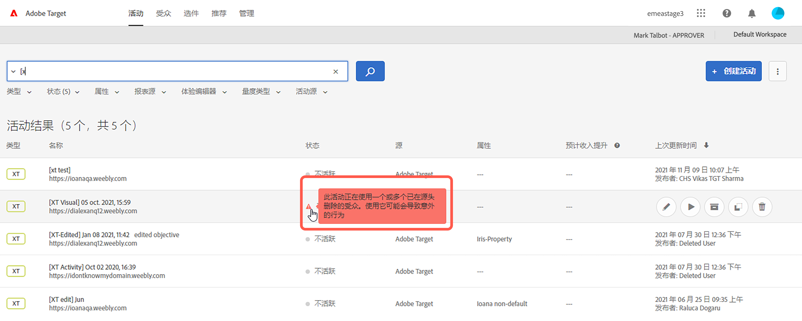
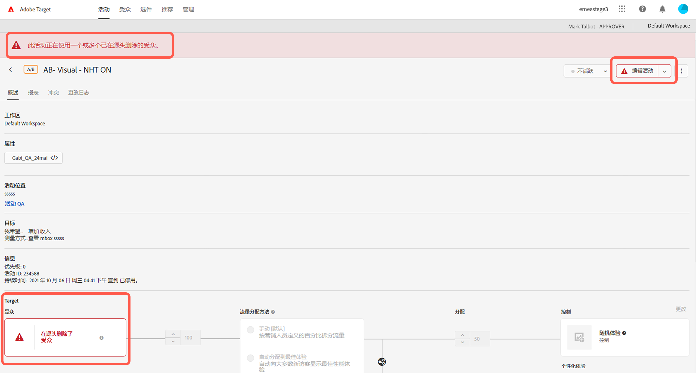

# Target 发行说明（当前版本）

这些发行说明提供关于每个 [!DNL Adobe Target Standard] 和 [!DNL Target Premium] 版本的功能、增强和修复的信息。此外，在适用的情况下，还包括 Target API、SDK、[!DNL Adobe Experience Platform Web SDK]、at.js 的发行说明以及其他平台变更。

>[!IMPORTANT]
>
>**mbox.js 生命周期结束**：从 2021 年 3 月 31 日起，[!DNL Adobe Target] 将不再支持 mbox.js 库。2021 年 3 月 31 日之后，所有从 mbox.js 进行的调用都将失败，并影响您通过提供默认内容而运行 [!DNL Target] 活动的页面。
>
>请迁移到新 [!DNL Adobe Experience Platform Web SDK] 或 at.js JavaScript 库的最新版本，以避免您的网站出现任何潜在问题。有关更多信息，请参阅[概述：为客户端 Web 实现 Target](/help/c-implementing-target/c-implementing-target-for-client-side-web/implement-target-for-client-side-web.md)。

（括号中的问题编号供 [!DNL Adobe] 内部使用。）

## [!DNL Target Standard/Premium] 21.10.3（2021年10月19日）

此维护版本包含以下增强、修复和更改：

* 修复了阻止客户打开 [!UICONTROL A4T] 面板 [!DNL Analysis Workspace] 单击 [!UICONTROL 在Analytics中查看] 按钮 [!DNL Target] 活动报表。 (TGT-42099、TGT-42100)
* 修复了导致 [!UICONTROL 编辑设计] 按钮，在编辑时不显示 [!UICONTROL A/B测试] 和 [!UICONTROL 体验定位] (XT)活动 [!UICONTROL 基于表单的体验编辑器]. (TGT-41980)
* 修复了阻止 [!UICONTROL 兼容] 复选框，以在创建新 [!UICONTROL Recommendations] 活动。 (TGT-42053)
* 修复了在无法选择 [!DNL Analytics] 作为报表源(A4T)，因为 [!DNL Analytics] 权限。 (TGT-41954)
* 实施了多项辅助功能修复，以改进 [!DNL Target] UI。

## [!DNL Target Standard/Premium] 21.10.2（2021年10月13日）

在使用 [!DNL Target] [!UICONTROL 受众] 和 [!DNL Adobe Experience Platform Web SDK]:

* 在 [!DNL Target] 用于指示受众已在源位置删除，不再可在中使用的UI [!DNL Target] 活动。

   下图显示了图标、浏览器和消息显示的一些位置：

   * [!UICONTROL 活动] 列表页面

      

   * 活动 [!UICONTROL 概述] 页面：

      

   * [!UICONTROL 体验] 活动创建工作流的步骤：

      ![在上的源消息上删除的受众 [!UICONTROL 体验] 页面](assets/deleted-at-source-experiences.png)

   * [!UICONTROL 定位] 活动创建工作流的步骤：

      ![在上的源消息上删除的受众 [!UICONTROL 定位] 页面](assets/deleted-at-source-targeting.png)

   * [!UICONTROL 目标和设置] 活动创建工作流的步骤：

      ![受众在 [!UICONTROL 目标和设置] 页面](assets/deleted-at-source-goals-settings.png)

   * 受众细化([!UICONTROL 替换受众] 在 [!UICONTROL 定位] 活动创建工作流的步骤):

* 如果您尝试使用“合并受众”功能，但源中删除了其中一个受众， [!UICONTROL 保存] 已禁用。

## [!DNL Target Standard/Premium]21.10.1（2021 年 10 月 6 日）

此版本包含以下新功能：

| 功能 | 详细信息 |
| --- | --- |
| [!UICONTROL 受众 UI 刷新] | 作为 [!DNL Adobe Target] 团队持续努力，以改进 [!DNL Target] 用户，此版本将刷新 [!UICONTROL 受众] 和 [!UICONTROL 配置文件脚本] 页面 [!DNL Target] UI。 此更新可统一和标准化以前不一致的设计模式，同时添加新的增强功能，例如：<ul><li>能够同时选择和删除多个受众</li><li>已刷新 [受众生成器设计](/help/c-target/c-audiences/create-audience.md)</li><li>在 [!UICONTROL 受众] 库规则生成器</li><li>新的“受众源”过滤器，允许更快地发现受众</li><li>会话永久搜索和过滤选项</li></ul>有关更多信息，请参阅[受众](/help/c-target/target.md)。 **注意**:新 [!UICONTROL 受众] 除当前位于 [!DNL Target] 测试版计划。 此UI刷新将于2021年10月19日星期二为部分客户以及10月21日星期四为所有其余客户重新启用。 |
| [!UICONTROL 配置文件脚本] UI刷新 | 的 [!UICONTROL 配置文件脚本] 此外，还更新了库，其中包括更新的界面以及多项生产效率更新：<ul><li>能够同时选择和删除多个配置文件脚本</li><li>配置文件脚本的新代码编辑器</li><li>代码编辑器中的语法突出显示和错误检查</li><li>通过键盘快捷键自动完成令牌（mbox或配置文件）参数</li></ul>有关更多信息，请参阅 [访客配置文件](/help/c-target/c-visitor-profile/visitor-profile.md). |
|  Recommendations标准创建和编辑 | 的 [!UICONTROL Recommendations标准] 通过简化创建和编辑工作流，可简化选择正确的推荐算法和设置以实现您的目标。 有关更多信息，请参阅 [创建标准](/help/c-recommendations/c-algorithms/create-new-algorithm.md). |
|  Recommendations回顾窗口和算法刷新率改进 | 您现在可以运行“查看次数最多”和“最畅销商品”算法，并在六小时的回顾时间范围内捕获最新趋势内容。 选择六小时回顾窗口后，每3到6小时更新一次推荐结果。 有关更多信息，请参阅 [数据源](/help/c-recommendations/c-algorithms/create-new-algorithm.md#data-source) in *创建标准*. |

## 其他发行说明和版本详细信息

| 资源 | 详细信息 |
|--- |--- |
| [发行说明：Adobe Target Platform Experience Web SDK](https://experienceleague.adobe.com/docs/experience-platform/edge/release-notes.html?lang=zh_Hans) | 有关 Platform Web SDK 各个版本中的更改的详细信息。 |
| [at.js 版本详细信息](/help/c-implementing-target/c-implementing-target-for-client-side-web/target-atjs-versions.md) | 有关 [!DNL Adobe Target] at.js JavaScript 库每个版本中的更改的详细信息。 |

## 文档更改、以往的发行说明和 Experience Cloud 发行说明

除了针对每个发行的说明外，以下资源还提供更多其他信息：

| 资源 | 详细信息 |
|--- |--- |
| 文档更改 | 查看这些发行说明中未包括的关于本指南的更新的详细信息。 有关更多信息，请参阅[文档更改](/help/r-release-notes/doc-change.md#reference_366123CF00994BACBBF9BBDF2C4D840C)。 |
| 以前版本的发行说明 | 查看与以前版本的 Target Standard 和 Target Premium 中的新增功能和增强功能相关的信息。 有关更多信息，请参阅[以前版本的发行说明](/help/r-release-notes/release-notes-for-previous-releases.md)。 |
| Adobe Experience Cloud 发行说明 | 查看 Adobe Experience Cloud 解决方案的最新发行说明。 有关更多信息，请参阅 [Experience Cloud 发行说明](https://experienceleague.adobe.com/docs/release-notes/experience-cloud/current.html?lang=zh-Hans)。 |

## 预发行信息 {#section_5D588F0415A2435B851A4D0113ACA3A0}

您可以通过以下资源了解下一个 Target 版本即将包含的功能。

| 资源 | 详细信息 |
|--- |--- |
| Adobe 优先产品更新 | 若要提前了解有关 Target 和其他 Adobe Experience Cloud 解决方案即将推出的产品增强功能的通知，请注册“Adobe 产品更新早知道”： https://www.adobe.com/cn/subscription/priority-product-update.html |
| 即将推出的发行说明 | 有关当月 Target 发行版本的信息（包括预发行信息），请参阅 [Target 发行说明 - 预发行](/help/r-release-notes/target-release-notes.md)页面。 |
