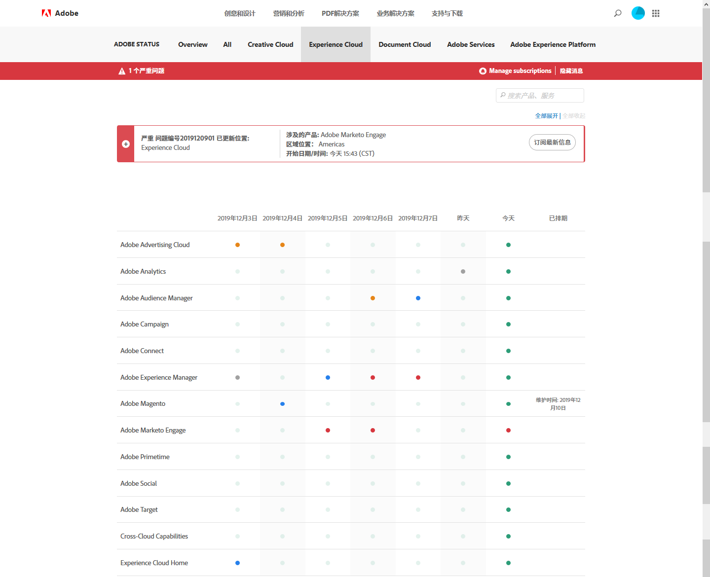

# 系统状态更新和主动通知

使用 [!UICONTROL Adobe 系统状态]页面和主动通知，可及时了解 [!DNL Adobe] 产品和 [!DNL Adobe Experience Cloud] 解决方案的状态。主动通知会提醒您出现停机事件和维护事件。

## 系统状态更新

使用 [!UICONTROL Adobe 系统状态]页面可查看 [!DNL Target] 和其他 [!DNL Adobe] 产品及 [!DNL Adobe Experience Cloud] 解决方案的当前状态。此页面可帮助您确定您遇到的问题是否因系统更新或日常维护所致。

转到以下 URL 可访问“[!UICONTROL 系统状态]”页面：

[https://status.adobe.com](https://status.adobe.com)

要查看 [!DNL Experience Cloud] 解决方案（包括 [!DNL Target]）的状态，请单击 [!UICONTROL Experience Cloud] 选项卡。

页面顶部包含有关正在进行的维护事件的信息，以及一个用于订阅各个解决方案更新的链接。

在上图中，[!DNL Adobe Analytics]、[!DNL Adobe Target] 和 [!DNL Adobe Campaign] 正在进行维护更新。所有其他产品和解决方案均运行正常。如果在使用 [!DNL Target] 时遇到问题，查看此页面始终都是最好的做法。

每月发行 [!DNL Target] 版本时始终会显示产品内通知，但是有时可能会有一些次要更新，这些更新将列在此页面上。

页面底部包含过去七天的日历，其中显示了每个解决方案每天的状态信息。将鼠标悬停在状态指示器上可获取更多信息：

## 主动通知

主动通知是发送给注册客户的电子邮件警报，用于提醒以下针对客户配置文件中包含的服务打开的事件，包括 [!DNL Target]：

* 解决方案级警报（不隔离解决方案中的特定服务）
* 严重级别 1 和严重级别 2 的 CSO（停机事件）
* CMR（维护事件）

>[!NOTE]
>
>您必须先注册才能收到此警报。联系您的 [!DNL Adobe] 客户成功经理 (CSM) 或 [!DNL Adobe] 客户经理 (AE) 以启动注册流程。

下图是主动通知电子邮件警报的示例：

