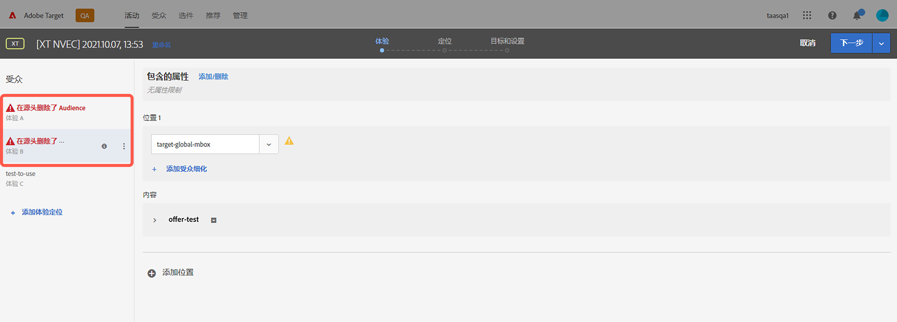
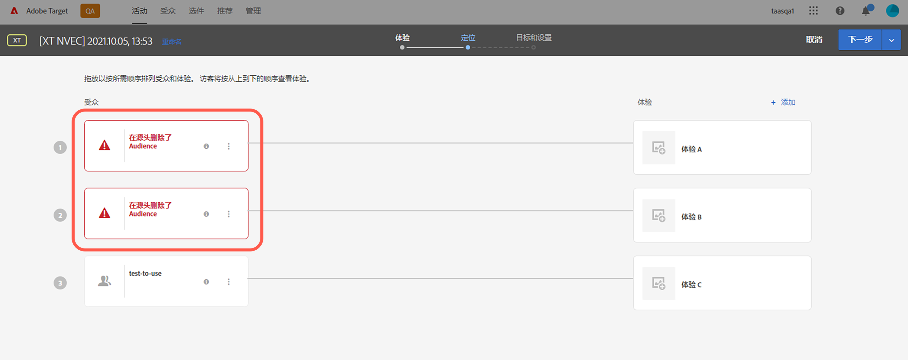

# Target 发行说明（预发行版本）

本文包含预发行版本信息。发布日期、功能及其他信息如有更改，恕不另行通知。

**上次更新时间：2021 年 10 月 11 日**

要查看有关当前版本的信息，请参阅 [Target 发行说明](release-notes.md)。根据发布时机的不同，这些页面上的信息可能相同。括号中的问题编号供 [!DNL Adobe] 内部使用。

>[!IMPORTANT]
>
>**mbox.js 生命周期结束**：从 2021 年 3 月 31 日起，[!DNL Adobe Target] 将不再支持 mbox.js 库。2021 年 3 月 31 日之后，所有从 mbox.js 进行的调用都会失败，并影响您通过提供默认内容而运行 [!DNL Target] 活动的页面。
>
>请迁移到新 [!DNL Adobe Experience Platform Web SDK] 或 at.js JavaScript 库的最新版本，以避免您的网站出现任何潜在问题。有关更多信息，请参阅[概述：为客户端 Web 实现 Target](/help/c-implementing-target/c-implementing-target-for-client-side-web/implement-target-for-client-side-web.md)。

## [!DNL Target Standard/Premium] 21.10.2（2021年10月13日）

在将[!DNL Target] [!UICONTROL Audiences]与[!DNL Adobe Experience Platform Web SDK]一起使用时，添加了以下增强功能：

* 在[!DNL Target] UI的不同位置添加了警告图标、浏览器和消息，以指示受众已在源位置删除，不再可用于[!DNL Target]活动。

   下图显示了图标、浏览器和消息显示的一些位置：

   *  活动列表页面

      

   * 活动[!UICONTROL 概述]页面：

      

   *  活动创建工作流的体验步骤：

      

   *  活动创建工作流的定位步骤：

      

   * [!UICONTROL 活动创] 建工作流的目标和设置步骤：

      ![在“目标和设置”页面上的源消息 [!UICONTROL 中删除的] 受众](assets/deleted-at-source-goals-settings.png)

   * 受众细化（活动创建工作流的[!UICONTROL 定位]步骤中的“替换受众]”）：[!UICONTROL 

* 如果您尝试使用“合并受众”功能，并且源中删除了其中一个受众，则[!UICONTROL 保存]会被禁用。

## 预发行信息 {#section_7B9D4AAFC6A74388B9D7DEF0658D8B63}

若要提前了解有关 Target 和其他 Adobe Experience Cloud 解决方案即将推出的产品增强功能的通知，请注册“Adobe 产品更新早知道”：

[https://www.adobe.com/cn/subscription/priority-product-update.html](https://www.adobe.com/cn/subscription/priority-product-update.html)
